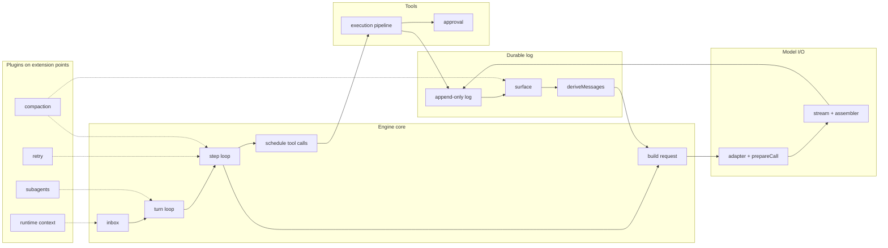

# Chapter 2 · Just enough architecture

**What you'll learn:** where the engine sits in the system, the ~10% of the plugin framework you need to read the rest of the book, and a map of every mechanism the book covers.

**Prerequisites:** [Chapter 1](01-the-core-idea.md).

---

## One application, one profile

There is exactly one application entry: `apps/server`. Its `src/index.ts:16` hardcodes the string `'web'` as the profile it boots — the profile name is a source literal, not an argument. Passing `--profile` is rejected outright:

```ts
if (argv.some(arg => arg === '--profile' || arg.startsWith('--profile='))) {
  program.error('error: this application serves the Web GUI only; --profile is not supported')
}
```
— `apps/server/src/args.ts:33-35`

So there is one shape of running system to understand, which is a considerable simplification. Everything in this book describes that system.

**New term — profile.** Not a file. A profile is an *empty* root config plus a stack of patch layers applied over it. At boot, `prepareProfile()` writes the literal string `[]` to the profile's `cordis.yml` (`apps/server/src/profile-boot.ts:80-84`), and the ~90 plugin rows that make up the running system are injected as patches on top. No checked-in file anywhere in the repo lists the web profile's composition. Chapter 34 covers this in full; for now, just know that the plugin list is assembled at startup rather than read from one place.

## Everything is a plugin

**New term — Cordis.** The dependency-injection and plugin framework this harness is built on, vendored into `vendor/cordis/`. You need four of its concepts.

**Context** — the object every plugin receives, conventionally `ctx`. Reading an unknown property off it is a *service lookup*: `ctx.tools` walks up the fiber chain looking for whoever registered `tools`, and throws if nobody did (`vendor/cordis/src/reflect.ts:152-166`). Contexts nest, and a child sees everything its ancestors registered.

**Service** — a class that registers itself under a name. Construction *is* registration: `Service`'s constructor calls `provide(name, self)` before your subclass constructor body finishes (`vendor/cordis/src/service.ts:42-59`). The engine is one of these — `class AgentLoop extends Service` (`packages/core/agent-loop/src/index.ts:352`), published as `ctx.agentLoop`.

**Fiber** — one running instance of one plugin, with a lifecycle. A fiber declares what it needs:

```ts
static inject = ['agents', 'sessions', 'llm', 'tools', 'systemPrompt', 'sessionProjections']
```
— `packages/core/agent-loop/src/index.ts:353`

A fiber whose dependencies are not all satisfied sits in `PENDING` and **its plugin body never runs**. When a dependency later disappears, every dependent fiber is unloaded automatically, cascading up the graph (`vendor/cordis/src/reflect.ts:314-336`). Nothing is topologically pre-sorted; startup order emerges from dependencies resolving.

**Effect** — `ctx.effect(fn, label)` runs `fn` immediately and collects whatever it returns as a teardown handle. This is how *every* registration in the codebase works — registering a tool, a prompt section, or a projection all return the disposer that undoes them. The repo states the rule as "registrations are effects." One nuance that matters later: disposers nested inside a single effect run strictly in reverse order, but distinct top-level effects on the same fiber tear down **concurrently** when the fiber itself unloads (`vendor/cordis/src/fiber.ts:675-696`).

That is enough. Chapter 34 returns to realms, patch semantics, and lazy config evaluation once you have something concrete to apply them to.

## Where the engine sits

The engine is `packages/core/agent-loop` — six files, 1,756 lines. It is mounted as one ordinary plugin row among ninety:

```yaml
- id: agent-loop
  name: '@deepseek-ai/dsh-agent-loop'
  config:
    agents: []
```
— `packages/bundle/base/cordis.patch.yml:486-489`

`agents: []` means the engine creates nothing at startup; the browser asks for sessions as users open them.

Its six injected services are the entire surface it depends on. Everything else in this book — compaction, retry, subagents, approval, skills — reaches the engine through *extension points* rather than through imports. The engine does not know those plugins exist.

## The mechanism map



Solid arrows are the main path of a turn. **Dotted arrows are plugins reaching in through extension points** — and they are the interesting part of the architecture: compaction rewrites the surface and can force a request to be re-issued; retry decides whether a failed request runs again; runtime context injects messages through the inbox so they become ordinary logged history rather than a side channel.

The full map, with all 37 mechanisms and their dependencies, is in [`_notes/mechanism-map.md`](_notes/mechanism-map.md).

## What is *not* running

A recurring hazard when reading this codebase: many capable-looking packages exist but are never mounted. The book flags these as it goes, but the headline cases:

| Not running in the web profile | Why |
|---|---|
| Hook bridges (`hooks-claude-code`, `hooks-codex`) | Absent from every composition layer |
| `dsh-schedule` | Opt-in overlay only |
| `packages/experimental/**` | Referenced by no composition file |
| Runtime invariants (`dsh-invariants`) | Mounted nowhere — diagnostics are deliberately omitted |
| SQLite session search | Mounted with `openAt: never`; the database is never opened |
| The native DeepSeek adapter | `disabled: true` in the web layer |

That last one has a startling consequence covered in Chapter 32: a fresh install has **no registered model provider at all** until one is configured through the UI.

---

## Key takeaways

- One application, one hardcoded profile; `--profile` is refused in argument parsing.
- A profile is an empty root config plus patch layers, assembled at boot — no file lists the composition.
- Four Cordis concepts carry the book: context (service lookup), service (construction is registration), fiber (dependency-gated lifecycle), effect (registration returns its own undo).
- The engine depends on exactly six services; everything else reaches it through extension points.
- Several substantial packages exist but never load — always check before believing a mechanism runs.

## Exercises

1. `AgentLoop` injects six services. Predict what happens to a running agent if one of them — say `tools` — is unloaded while a turn is in flight. Check your answer against `vendor/cordis/src/reflect.ts:314-336`.
2. The engine's config is `agents: []`. Find the other place in the codebase where an agent could be created instead, and say who calls it. (Hint: Chapter 14.)
3. Why might a project deliberately *omit* runtime invariant checking from its shipped configuration, given the checks exist and pass? List two reasons; Chapter 11 gives the design's own.

**Next:** [Chapter 3 · The core data structures](03-core-data-structures.md)
