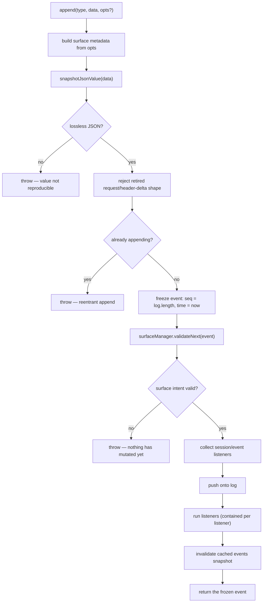

# Chapter 5 · The append-only log

**What you'll learn:** what `append()` actually does, in order; why `seq` can never have a gap; and how the log stays readable by a runtime that does not recognize every event in it.

**Prerequisites:** [Chapter 3](03-core-data-structures.md).

---

## 1. The problem

A conversation with a model is a sequence of things that happened: a person asked something, the model thought, it called a tool, the tool answered. If you store that as a mutable array of messages, you have quietly thrown away most of what happened — the tool's raw arguments, the order of streamed chunks, the boundary between one turn and the next — and kept only what you currently think you need.

That is fine until you need to resume a crashed session, show a user what the model was doing when it stopped, fork a conversation at a known-good point, or prove that a request was built from what you think it was built from. Each of those wants a different projection of the same history.

So the engine stores the history, not the projection. The log is the record; messages are one view of it.

## 2. Mental model

Think of a ledger. Entries are written in ink, in order, each numbered. You never erase an entry. If an earlier entry turns out to be wrong or no longer relevant, you write a *new* entry saying so, and readers who care about the current state learn to skip the superseded one.

Two properties fall out, and the code enforces both:

- **The number is the position.** Entry `n` is the `n`th entry. Not a database id, not a timestamp — an index.
- **Writing is the only mutation.** There is no `update`, no `delete`, no in-place edit anywhere in the API.

**New term — `Session`.** The object holding one conversation's log. Notably it is a **plain class, not a Cordis service** (`packages/core/session/src/index.ts:423`), with a private constructor reached through two factories: `Session.create(...)` for fresh or forked sessions (`index.ts:480-482`) and `Session.fromRestore(...)` for the exclusive-ownership path persistence backends use (`index.ts:493-495`).

The Cordis service is a separate thing, `SessionStore` (`ctx.sessions`, `index.ts:790-1153`), and it is **in-memory only**. Its own source says so:

> "Persistence is intentionally not implemented here — persistence plugins subscribe to `session/event` and flush on `session/flush` / dispose."
> — `packages/core/session/src/index.ts:786-789`

That separation matters: the log's semantics do not depend on where it is stored. Chapter 29 covers the storage.

## 3. Lifecycle of one append



The ordering of H and K is the subtle part, and §6 returns to it.

## 4. Step-by-step walkthrough

`Session.append<T>(type, data, ...opts)` — `packages/core/session/src/index.ts:602-653`.

The signature is doing real work:

```ts
append<T extends SessionEventType>(
  type: T,
  data: SessionEventMap[T],
  ...opts: T extends SurfaceEventType ? [opts: SurfaceIntent] : []
): SessionEvent<T>
```
— `index.ts:602-606`

That conditional rest parameter means the compiler **requires** a surface intent for `user/message`, `assistant/message`, and `tool/result`, and **forbids** one for every other type. You cannot forget to say whether a message appends or replaces, and you cannot accidentally attach surface metadata to a `turn/start`.

Then, in order:

**Snapshot the payload.** `snapshotJsonValue(data)` (`index.ts:612-615`) takes a deep, lossless-JSON copy. "Lossless" is strict: it rejects `BigInt`, functions, symbols, `undefined`, negative zero, non-finite numbers, circular references, sparse arrays, and class instances including `Map`/`Set`/`Date` (`index.ts:588-591`). Anything that would not survive a JSON round-trip identically is refused at the boundary rather than discovered later as corrupt storage.

**Refuse reentrancy.**

```ts
if (entry?.appending) throw ...
```
— `index.ts:621-624`

An append cannot be triggered from inside another append's synchronous `session/event` dispatch. Without this, a listener that logs something in response to what it just observed could interleave two events and break the `seq = log.length` relationship.

**Build and freeze the event.**

```ts
{ type, seq: this.log.length, time: Date.now(), data: dataSnapshot, ...surfaceMetadataSnapshot }
```
— `index.ts:625-631`

This is the only place in the codebase where a `seq` is assigned.

**Validate against the surface before committing.** `this.surfaceManager.validateNext(event)` (`index.ts:632`) checks the candidate's surface intent against the live surface fold — is the replaced range actually present, does the provenance cover what it must — *before* the event is pushed. A bad marker throws with no state mutated.

**Dispatch, then push — in that order, sort of.** The listener list is snapshotted before the push, but the callbacks run after it (`index.ts:636-641`). The JSDoc states the contract precisely: "The listener snapshot resolves before the log push, but callbacks run after it" (`index.ts:63-65`). So a listener observing event *n* sees a log that already contains it, but a listener registered *during* that dispatch will not be called for this event.

**Contain observer failures.** `invokeContainedSessionObservers` (`index.ts:379-397`) catches and logs per listener. One listener throwing cannot un-commit the append or block the others. The append has already happened; observers do not get a veto.

## 5. Data at each stage

Taking `session.jsonl:9` — the user's message entering the log:

| Stage | Value |
|---|---|
| Caller passes | `type: 'user/message'`, `data: UserMessage`, `opts: { surfaceOp: 'append' }` |
| After snapshot | A deep frozen copy; the caller's object is no longer shared |
| After envelope | `{ type: 'user/message', seq: 8, time: <ms>, data: {...}, surfaceOp: 'append' }` |
| After surface validation | Surface nodes gain seq 8 at the tail |
| Returned to caller | The frozen event — the loop keeps `.seq` to cite later |

The returned event is the *logged* one, "its assigned `seq`/`time` plus the SNAPSHOT of `data` that entered the log" (`index.ts:585-587`) — not the object you passed in.

## 6. Control decisions

| Decision | Condition | Location |
|---|---|---|
| Reject payload | not losslessly JSON-representable | `index.ts:612-615` |
| Reject legacy shape | event is the retired `request/header-delta` | `index.ts:616`, helper `:361-370` |
| Reject reentrancy | an append is already in progress | `index.ts:621-624` |
| Reject surface intent | replaced range absent, provenance incomplete, wrong event type | `surface.ts:185-243` via `validateNext` |
| Contain listener failure | any listener throws or rejects | `index.ts:379-397` |

Note what is **not** a decision: there is no branch where an append is silently dropped. Every path either commits or throws.

## 7. Edge cases and failure modes

**A gap in `seq` is impossible by construction, and checked anyway.** Three independent boundaries re-verify it:

- Seed validation on construction: `if (snapshot.seq !== index) throw` (`index.ts:523-525`) — a restored log must number `0..N-1` with no holes.
- The surface fold: `if (event.seq !== expectedSeq) throw` (`surface.ts:328-330`).
- Persistence: every event in a batch is checked against `state.cursor + i` before writing (`session-persistence/src/coordinator.ts:722-726`).

A property enforced in one place is a convention; enforced in four, it is a load-bearing invariant.

**An unknown event type is a hard stop, unless marked skippable.** The build generates `KNOWN_SESSION_EVENT_TYPES` (`known-event-types.ts:22-74`), the complete vocabulary across every loaded plugin. On load:

```ts
for (const event of events) {
  if (KNOWN_SESSION_EVENT_TYPES.has(event.type) || event.ignorable === true) continue
  throw this.unsupported(meta, `session "${meta.id}" contains event type "${event.type}" ...`)
}
```
— `session-persistence/src/coordinator.ts:1143-1148`

This is the mechanism that lets the vocabulary grow without a format-version bump. A *required* event the runtime does not understand causes a loud refusal — never a silent misreading. A purely informational one, marked `ignorable: true` by its writer, degrades gracefully.

**Version refusal is directional.** A header whose `version` is not `SESSION_FORMAT_VERSION` throws `SessionFormatUnsupportedError`, with different text for "written by a newer harness — upgrade" versus older (`coordinator.ts:78-82, 1128-1131`). The constant is pinned at `0` (`types.ts:51`), and the doc comment is blunt that while unreleased, "no compatibility is implied, incompatible logs are rejected, and no migration is provided."

**The header is deliberately not in the log.** `SessionHeader` (`types.ts:56-94`) carries `version`, `id`, `createdAt`, `cwd`, `parentSession`, `seedLength`, `origin`, `delegationDepth`, `agentPreset` — validated and deep-frozen at construction, and kept out of the event stream because it is "a storage concern, not replayable conversation state" (`index.ts:441`).

The recorded fixture's header line carries `"version":0` and `"delegationDepth":0`. Both are confirmed:

**`version` is literally `SESSION_FORMAT_VERSION`.** The JSONL format module imports the constant from this package (`session-persistence-jsonl/src/format.ts:13`) and refuses a header whose version is a number differing from it, before reading any events (`:267-276`). There is no separately-maintained storage version.

**`delegationDepth` is the persisted floor for subagent recursion.** It is written to the header line (`:63`), validated as a non-negative safe integer (`:101-104`), and read back by `delegationDepthOf`, which returns `Math.max(header.delegationDepth ?? 0, runtimeOption ?? 0)` — so a resumed child cannot delegate as if it were top-level ([Ch 28](28-subagents.md)).

## 8. Configuration knobs

None. The log has no tunables — no size cap, no retention policy, no compaction threshold. Everything that bounds growth lives outside it (Chapters 26–27), which is precisely why the log can promise permanence.

## 9. Interactions

- **The surface** ([Ch 6](06-the-surface.md)) validates every surface-eligible append before it lands, and is the only reason `append` can reject an otherwise well-formed event.
- **`deriveMessages`** ([Ch 7](07-from-log-to-request.md)) reads the surface, never the log directly.
- **Projections** ([Ch 8](08-projections.md)) fold the log on every committed event.
- **Persistence** ([Ch 29](29-persistence.md)) subscribes to `session/event`; the log itself knows nothing about storage.
- **The engine** writes eleven event types across a turn — see [Ch 9](09-the-turn-and-step-loops.md).

## 10. Build it yourself

Minimal version:

```ts
class MiniSession {
  private log: SessionEvent[] = []
  append(type: string, data: unknown): SessionEvent {
    const event = Object.freeze({ type, seq: this.log.length, time: Date.now(), data })
    this.log.push(event)
    return event
  }
  get events(): readonly SessionEvent[] { return this.log }
}
```

That is genuinely the core. What the real one adds, and why each was necessary:

| Addition | Why it exists |
|---|---|
| Lossless-JSON snapshot | A payload that cannot round-trip becomes corrupt storage discovered much later |
| Freezing | Callers share references; without freezing, a caller could mutate logged history |
| Reentrancy refusal | A listener appending during dispatch would break `seq = log.length` |
| Pre-commit surface validation | A bad marker must fail with nothing mutated, not leave a half-valid surface |
| Contained observers | One bad listener must not be able to un-commit history |
| `ignorable` + known-type gate | The vocabulary must grow without breaking old readers, and must fail loudly when it cannot |
| Cached `events` snapshot | Readers ask constantly; re-copying the array each time is wasteful |

---

## Key takeaways

- `append()` is the only mutation, and it either commits or throws — never silently drops.
- `seq = log.length` is assigned in one place and re-verified at three more.
- Surface validation runs *before* the push, so an invalid marker leaves no trace.
- Observers run after the commit and cannot veto it.
- Vocabulary grows freely; `ignorable` plus a generated known-type set turns "I don't recognize this" into either safe skipping or a loud refusal.

## Exercises

1. A listener on `session/event` calls `session.append(...)` in response. Exactly which line stops it, and what would break if that line were removed?
2. The surface is validated before the push but listeners run after it. Construct a scenario where the reverse order would produce an observably wrong result.
3. `SESSION_FORMAT_VERSION` is `0` and no migration path exists. Given the vocabulary can grow without a bump, name a change that *would* require one, and say which of the four structural categories it falls into (`types.ts:28-50`).

**Next:** [Chapter 6 · The surface](06-the-surface.md)
