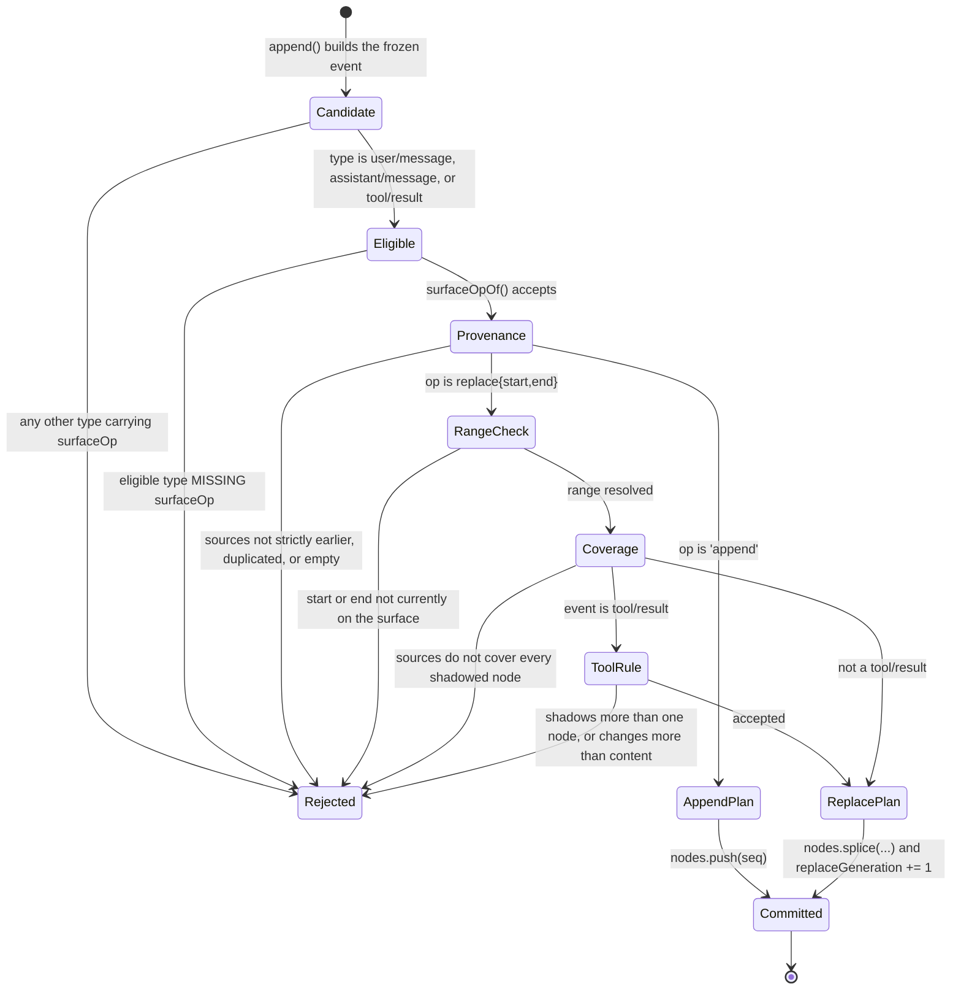

# Chapter 6 · The surface

**What you'll learn:** the one indirection that lets this engine rewrite conversation history without deleting anything — and the rules that keep a rewrite honest.

**Prerequisites:** [Chapter 5](05-the-append-only-log.md).

---

## 1. The problem

Chapter 5 promised the log is permanent. That promise collides immediately with reality: a model has a finite context window, and a long conversation will exceed it. Something has to shrink.

The obvious move is to delete old messages, or splice a summary over them in the message array. Both destroy the record. A user scrolling back would find their own earlier questions gone. A crash-recovery routine would have nothing to recover. A bug report would be unreproducible.

So the engine needs a way to say *"the model should no longer see events 12 through 40; it should see this summary instead"* while events 12 through 40 remain exactly where they are, forever.

## 2. Mental model

**New term — the surface.** An ordered list of the log positions the model currently sees. Not the events themselves — just their `seq` numbers, in order.

```ts
interface SessionSurface {
  readonly nodes: readonly number[]
  readonly replaceGeneration: number
}
```
— `packages/core/session/src/surface.ts:137-142`

Think of the log as a bookshelf where books are only ever added at the right end, and the surface as a reading list naming which books to read and in what order. To "remove" a run of books you do not burn them; you write a new book summarizing them, add it to the shelf, and rewrite the reading list so those entries are replaced by the new one's position.

The books are still there. Anyone reading the shelf directly — a UI showing the human transcript, a crash-repair routine — sees everything. Only the reading list changed.

Every surface-eligible append must declare which it is doing:

```ts
type SurfaceOp = 'append' | { op: 'replace'; start: number; end: number }
```
— `packages/core/session/src/types.ts:359-361`

## 3. Lifecycle of a surface event



## 4. Step-by-step walkthrough

### Eligibility

Only three event types may ever touch the surface:

```ts
type SurfaceEventType = 'user/message' | 'assistant/message' | 'tool/result'
```
— `types.ts:330-334`

Unlike the event map, this union is **closed** — plugins cannot extend it. `surfaceOpOf` (`surface.ts:185-208`) enforces it in both directions: a non-eligible event carrying `surfaceOp` or `sourceEventSeqs` throws, and an eligible event *missing* `surfaceOp` throws. There is no default.

### Provenance

`assertProvenance` (`surface.ts:210-243`) checks `sourceEventSeqs`:

- every entry is a non-negative safe integer **strictly earlier** than the citing event's own `seq` (`:230-236`) — you cannot cite the future or yourself;
- no duplicates (`:232-234`);
- non-empty, **except** that an `assistant/message` may carry a present-but-empty array, for "a known empty provider stream" (`:221-222`).

That exception is small but real: a provider can legitimately return nothing, and the engine still logs an assistant message to carry the usage numbers.

### Replace: resolving the range

`start` and `end` name **surface nodes by seq**, not log positions or array indices. Both must currently be on the surface; `replacementRange` (`surface.ts:246-266`) looks them up and throws `"start seq ... not found in surface"` otherwise. `start === end` replaces exactly one node.

### Replace: coverage

This is the rule that makes a rewrite honest:

```ts
shadowedSeqs.filter(seq => !sources.has(seq))
```
— `surface.ts:239-242`

`sourceEventSeqs` must be a **superset of every shadowed node's seq**. You cannot supersede an event without citing it. The type documentation calls this "complete shadowed-node coverage." The practical effect: given a replacement, you can always reconstruct exactly what it stands for, without guessing from the range bounds.

### Applying it

```ts
} else if (plan?.kind === 'replace') {
  state.nodes.splice(plan.startIdx, plan.endIdx - plan.startIdx + 1, plan.seq)
  state.replaceGeneration += 1
}
```
— `surface.ts:362-379`

The shadowed run is spliced out of the node list and the single new event's `seq` takes its place. `replaceGeneration` increments exactly once per committed replace — no other code path touches it.

An append is simply `state.nodes.push(plan.seq)` (`surface.ts:366-367`).

## 5. Data at each stage

A real compaction, from `packages/compaction/compaction-basic/src/region.ts:472-475`:

```ts
session.append('user/message', checkpointMessage, {
  surfaceOp: { op: 'replace', start, end },
  sourceEventSeqs: [startEvent.seq, summaryEvent.seq, ...shadowedSeqs],
})
```

| Stage | Surface `nodes` | `replaceGeneration` |
|---|---|---|
| Before | `[3, 5, 7, 9, 11, 13, 15]` | 4 |
| Event 42 appended, replacing 5–11 | — validation only — | 4 |
| After splice | `[3, 42, 13, 15]` | **5** |
| Log length | unchanged in meaning: events 5, 7, 9, 11 still exist at their positions | |

Note the sources include the `compaction/start` and `compaction/summary` events *as well as* every shadowed node — more than the minimum the rule requires, so the provenance records the whole transaction, not just what was hidden.

## 6. Control decisions

| Decision | Condition | Location |
|---|---|---|
| Reject non-eligible | any type outside the three carrying surface fields | `surface.ts:185-208` |
| Reject missing intent | eligible type with no `surfaceOp` | `surface.ts:185-208` |
| Reject bad provenance | not earlier / duplicated / empty (non-assistant) | `surface.ts:210-243` |
| Reject unknown range | `start` or `end` not currently a surface node | `surface.ts:246-266` |
| Reject incomplete coverage | a shadowed seq is not cited | `surface.ts:239-242` |
| Reject wide tool rewrite | more than one node shadowed, or a field other than content changed | `surface.ts:287-318` |
| Bump generation | only on a committed replace | `surface.ts:370-371` |

## 7. Edge cases and failure modes

**`tool/result` replacement is deliberately narrow.** `assertToolResultRewrite` (`surface.ts:287-318`) permits shadowing exactly one node, and permits the replacement to differ from the original **only in the tool-result block's `content`**. Everything else — call id, turn, step, error flag, the rest of the message — must be deep-JSON-equal, checked by nulling `content` on both sides and comparing.

This exists so the tool-result pruner ([Ch 27](27-pruning-and-compaction.md)) can shrink an enormous result's text while making it structurally impossible to quietly change what the tool *was* or whether it *failed*. A narrow rewrite primitive is safer than a general one.

**The surface is the wrong source for a human transcript.** The codebase is explicit:

> "The model-visible surface deliberately shadows replaced ranges, so it is the wrong source for a human transcript — a landed replacement would erase conversation the user already saw. Append-origin events are that transcript's durable source material; replacement copies stay model-only."
> — `surface.ts:44-48`

Hence three exported guards (`surface.ts:35-68`): `isSurfaceEvent`, and the split into `isAppendSurfaceEvent` versus `isReplacementSurfaceEvent`. A UI reads append-origin events from the log; the model reads the surface. Same log, two views, and conflating them would make compaction visibly eat a user's history.

**The fold is incremental, with a pure fallback.** `SurfaceManager` (`surface.ts:398-460`) keeps `_lastProcessedSeq` and folds forward lazily when `nodes` or `replaceGeneration` is read (`:432-441`). It also caches a `_pendingPlan` so an event validated by `validateNext` immediately before its append is not re-validated. For offline reconstruction there is a pure `foldSurface(events)` that replays a complete log from scratch (`:387-395`).

**Nothing browser-specific.** `surface.ts` deliberately avoids `node:` imports so web clients can consume it directly (`surface.ts:1-9`) — the browser folds the same surface from the same events rather than trusting a server-computed view.

## 8. Configuration knobs

None. Like the log, the surface has no tunables. What to compact and when is entirely the caller's decision ([Ch 27](27-pruning-and-compaction.md)); the surface only enforces that whatever they do is well-formed and fully attributed.

## 9. Interactions

- **[Ch 5](05-the-append-only-log.md)** — `append()` calls `validateNext` before committing, so every rule here fails with nothing mutated.
- **[Ch 7](07-from-log-to-request.md)** — `deriveMessages()` walks `surface.nodes`; `replaceGeneration` invalidates its cache.
- **[Ch 10](10-building-the-request.md)** — a bumped generation makes the next request log a new header series.
- **[Ch 27](27-pruning-and-compaction.md)** — the only two production writers of `replace`: region compaction and the tool-result pruner.
- **[Ch 21](21-runtime-context-injection.md)** — watches replacement events to know when its injected snapshot was compacted away.

## 10. Build it yourself

Minimal version — a node list and two operations:

```ts
class MiniSurface {
  nodes: number[] = []
  replaceGeneration = 0
  apply(seq: number, op: SurfaceOp): void {
    if (op === 'append') { this.nodes.push(seq); return }
    const startIdx = this.nodes.indexOf(op.start)
    const endIdx = this.nodes.indexOf(op.end)
    this.nodes.splice(startIdx, endIdx - startIdx + 1, seq)
    this.replaceGeneration += 1
  }
}
```

Twelve lines, and it captures the whole idea. What the real one adds:

| Addition | Why it exists |
|---|---|
| Closed eligibility + mandatory intent | An event silently defaulting to "append" would corrupt history in a way nothing detects |
| Provenance coverage | Without it, a replacement's meaning depends on range bounds that later rewrites can shift |
| Strictly-earlier source check | Citing a later event would make the log unreplayable in order |
| Narrow `tool/result` rewrite | A general rewrite could change whether a tool failed; only its text should shrink |
| Append-origin guards | The human transcript and the model transcript genuinely differ after a compaction |
| Incremental fold + pure `foldSurface` | The hot path reads this constantly; offline readers need to rebuild from nothing |

---

## Key takeaways

- The surface is an ordered list of visible log positions — the model's view, not the record.
- Only three event types participate, and each must declare `append` or `replace` explicitly.
- A replacement must cite every node it shadows, so what was superseded is always reconstructable.
- `tool/result` rewrites may change content and nothing else.
- `replaceGeneration` is bumped only by a committed replace, and is the signal the rest of the engine watches.
- Human transcript and model transcript diverge after a rewrite — by design, with separate guards for each.

## Exercises

1. A plugin wants to redact a secret that a tool accidentally printed. Which surface operation does it use, what must it cite, and what can it *not* change? Would the same approach work for redacting something in a `user/message`?
2. `replaceGeneration` is a counter, not a boolean. Two readers cache derived state. Explain why a counter works where a "dirty" flag would not.
3. Compaction cites more sources than the coverage rule requires. Name a debugging question that the extra citations answer and the minimum set would not.

**Next:** [Chapter 7 · From log to request](07-from-log-to-request.md)
