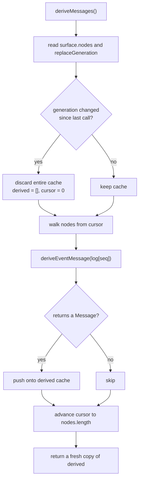

# Chapter 7 · From log to request: `deriveMessages()`

**What you'll learn:** the function that turns an event log into the message array a model receives — and why it is deliberately dumber than you would expect.

**Prerequisites:** [Chapter 6](06-the-surface.md).

---

## 1. The problem

The log holds everything that happened. The model needs a list of messages. Something must project one onto the other.

The temptation is to make that projection clever — reformat tool results, wrap plugin-injected text in tags, collapse consecutive messages, add framing to distinguish sources. Every one of those is a decision about what the model sees, and putting decisions here has a specific cost: the projection runs on *every* request, including replays of old logs. A projection that changes behavior changes the meaning of history that was recorded under the old behavior.

So this projection does as close to nothing as it can.

## 2. Mental model

Two functions, cleanly separated.

**The per-event rule** decides what one event contributes: a message, or nothing. It is pure, total, and boring.

**The walker** applies that rule across the surface's node list, in order, with a cache — because a long session re-derives constantly and re-walking thousands of events per request would be wasteful.

## 3. Lifecycle



## 4. Step-by-step walkthrough

### The per-event rule

```ts
export function deriveEventMessage(event: SessionEvent): Message | null {
  switch (event.type) {
    case 'user/message': {
      return event.data
    }
    case 'assistant/message': {
      if (event.data.message.content.length === 0) return null
      return event.data.message
    }
    case 'tool/result': {
      return event.data.message
    }
    default:
      return null
  }
}
```
— `packages/core/session/src/surface.ts:83-114`

Three things to notice.

**`user/message` returns `event.data` directly.** Recall from Chapter 3 that the event map declares `'user/message': UserMessage` — the data *is* the message. This is a verbatim pass-through, and the source is emphatic about keeping it that way:

> "Do NOT re-add per-type framing (e.g. `<context>`) here: framing is caller-owned — a producer bakes it into `content`... keeping this projection a verbatim pass-through."
> — `surface.ts:90-94`

If a plugin wants its injected message to look distinctive to the model, it builds that into the content at append time. The consequence is that what the model sees is exactly what is in the log — no transformation layer to reason about, and replay is faithful by construction.

**An empty-content assistant message derives to `null`.** This is not defensive coding against an impossible case. When a step hits the output ceiling, the engine still logs an `assistant/message` to carry the token usage, and that message may have no content blocks. The type documentation states the rule: "an empty-content `assistant/message` ... derives to null and must not enter the transcript" (`types.ts:257`).

**The `default` case is intentionally non-exhaustive.** No `assertNever`, despite the codebase's general rule that closed unions must end in one. The reason is in the comment: "only message-producing events derive history; turn/step boundaries, chunks, usage, and errors are trace/replay data" (`surface.ts:84-86`). New event types should silently contribute nothing to the transcript, which is the correct default for a vocabulary that grows.

### The walker

```ts
deriveMessages(): Message[] {
  const surface = this.surface
  const nodes = surface.nodes
  const generation = surface.replaceGeneration
  if (generation !== this.derivedGeneration) {
    this.derived = []
    this.derivedNodes = 0
    this.derivedGeneration = generation
  }
  for (const seq of nodes.slice(this.derivedNodes)) {
    const msg = this.deriveEventMessage(this.log[seq]!)
    if (msg) this.derived.push(msg)
  }
  this.derivedNodes = nodes.length
  return [...this.derived]
}
```
— `packages/core/session/src/index.ts:724-745`

The cache is append-only, which is safe *only* while the surface is append-only. A replace splices the middle of `nodes`, so positions the cache already consumed may have changed — hence the generation check, which throws the whole cache away rather than trying to patch it.

Cost: **O(new nodes)** amortized, except immediately after a compaction, where it is O(surface).

## 5. Data at each stage

From the recorded turn, at the moment the request is built (`session.jsonl` events 1–11 are in the log):

| Surface node | Event type | Derives to |
|---|---|---|
| seq 4 | `agent/inbox/spliced` | *not on the surface — never a node* |
| seq 8 | `user/message` (the person's prompt) | the `UserMessage`, verbatim |
| seq 9 | `user/message` (runtime-context snapshot) | the `UserMessage`, verbatim |
| — | `turn/start`, `step/start`, `session/title` | not surface-eligible, absent from `nodes` |

So the outgoing `messages` array is exactly two messages. The boundary events are in the log but never reach the model — which is why Chapter 3 insisted the surface and the log are different things.

After the model responds, the `assistant/message` at seq 23 joins the surface, and the *next* derivation returns three messages with only one new item walked.

## 6. Control decisions

| Decision | Condition | Location |
|---|---|---|
| Rebuild cache | `replaceGeneration !== derivedGeneration` | `index.ts:727-731` |
| Skip event | type not one of the three message-producing types | `surface.ts:110-111` |
| Skip assistant message | `content.length === 0` | `surface.ts:100-104` |
| Walk incrementally | otherwise, from `derivedNodes` to `nodes.length` | `index.ts:732-736` |

## 7. Edge cases and failure modes

**The returned array is fresh; the messages inside are shared.** `return [...this.derived]` gives every caller its own array, so no caller can observe another's later mutation. But the `Message` objects are shared references, reused across calls. That is safe because they are already deep-frozen — they came from frozen durable event data, and the source notes the cache therefore "needs no second deep clone" (`index.ts:718-721`).

**There is no validation here.** If the log contains an `assistant/message` whose content is nonsense, this function hands it to the model. Validation happens at append time (Chapter 5), which is the right place: an invalid event should never enter the log, and re-checking on every derivation would be both slow and too late.

**A compaction makes the next derivation expensive.** Worth knowing when reading a profile: the first `deriveMessages()` after a compaction walks the entire post-compaction surface. Since compaction just *shrank* that surface, this is usually cheap — but it is the one non-incremental case.

## 8. Configuration knobs

None.

## 9. Interactions

- **[Ch 6](06-the-surface.md)** — the node list and generation counter this reads.
- **[Ch 10](10-building-the-request.md)** — the sole production caller: `agent.ts:355` passes the result straight into the request as `messages`.
- **[Ch 11](11-the-reconstruction-invariant.md)** — the diagnostic that asserts an outgoing request's messages equal a fresh call to this function.
- **[Ch 27](27-pruning-and-compaction.md)** — compaction's `replace` is what forces the cache rebuild.

## 10. Build it yourself

Minimal version:

```ts
deriveMessages(): Message[] {
  return this.surface.nodes
    .map(seq => deriveEventMessage(this.log[seq]!))
    .filter((m): m is Message => m !== null)
}
```

Correct, and fine until a session has a few thousand events. What the real one adds:

| Addition | Why it exists |
|---|---|
| Append-only cache + cursor | Every step re-derives; re-walking the whole surface each time is wasted work |
| Generation-guarded invalidation | A replace edits the middle of the node list, so an append-only cache is no longer valid |
| Fresh array, shared frozen messages | Callers must not see each other's mutations, but deep-cloning frozen data every call is pointless |

The interesting lesson is what is *absent*: no reformatting, no framing, no merging of adjacent messages. Every one of those would have been a decision baked into replay.

---

## Key takeaways

- Three event types produce messages; everything else contributes nothing, deliberately without an exhaustiveness check.
- `user/message` is a verbatim pass-through — framing is the producer's job, decided at append time.
- An empty-content assistant message is skipped; it exists only to carry usage.
- The cache is append-only and thrown away wholesale when `replaceGeneration` moves.
- The result is a fresh array of shared frozen messages.

## Exercises

1. Suppose you wanted tool results shown to the model wrapped in `<tool_result>` tags. Where does that belong, given this chapter, and what goes wrong if you add it to `deriveEventMessage` instead?
2. The cache is invalidated by generation, not by log length. Construct a sequence of appends and one replace where a length-based check would return a wrong result.
3. `deriveEventMessage` is exported and pure. Name two callers outside the `Session` class that would want it, and what each is doing. (One is in Chapter 11.)

**Next:** [Chapter 8 · Projections](08-projections.md)
