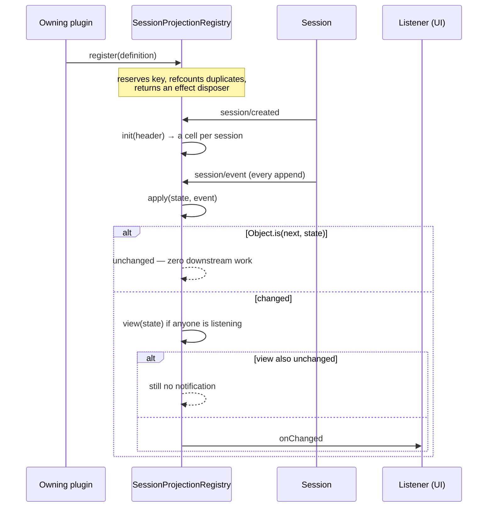

# Chapter 8 · Projections

**What you'll learn:** how anything other than the message list gets computed from the log — turn counts, todo lists, retry counters — without re-reading the whole log every time.

**Prerequisites:** [Chapter 5](05-the-append-only-log.md). Chapter 7 is useful contrast but not required.

---

## 1. The problem

`deriveMessages()` ([Ch 7](07-from-log-to-request.md)) is one projection of the log, hardcoded into the session. But plenty of other things want their own view of the same events:

- the engine needs the last turn number, so a resumed agent continues at turn 8 rather than turn 1;
- the retry plugin needs a count of retries so far, and it must survive a process restart;
- a UI wants turn/step counts, a turn outline, a todo list, the current plan mode.

Each is a fold over the same event stream. Writing each one as a bespoke loop over `session.events` would mean every consumer re-walks the log independently, and none of them could be cached across a restart.

## 2. Mental model

**New term — projection.** A named, versioned, pure fold over the session log, registered by the package that owns the concept.

Three things make it more than "a reduce":

- **It is registered, not called.** A package declares its fold once; the registry runs it against every session and every event automatically.
- **It is versioned.** The persisted cache is stamped with the fold's version, so changing the fold's semantics discards stale caches rather than forward-applying them into garbage.
- **It is split in two.** Internal `state` (host-side, may be anything JSON) and an optional `wire` view (what a browser is allowed to see). A projection with no `wire` is host-only.

## 3. Lifecycle



## 4. Step-by-step walkthrough

### The definition

```ts
export interface ProjectionDefinition<K, S> {
  key: K
  stateSchema: ZodType<S>
  init(header: SessionHeader): S
  apply(state: S, event: SessionEvent): S
  wire?: { viewSchema: ZodType<...>; view(state: S): ... }
  stateVersion: number
}
```
— `packages/session/session-projection/src/index.ts:42-86`

The constraints on `apply` are strict and stated in the source:

- **Pure and synchronous.** "An async unit would tear the carriers' consistency cut" (`index.ts:39`).
- **Reference-stable when uninterested.** "A unit uninterested in an event MUST return the same state reference — an unchanged reference (`Object.is`) produces zero downstream work" (`index.ts:58-59`).
- **Plain JSON state**, because it gets persisted (`index.ts:40`).

`stateVersion` is the cache-invalidation lever: "bump whenever the serialized state fields or the fold semantics change, so persisted `(sessionId, key, ver, seq, val)` rows from an older unit are discarded instead of being forward-applied into garbage" (`index.ts:80-84`).

### Registration

`register()` (`index.ts:241-281`) goes through `ctx.effect(...)`, so unloading the owning plugin removes the key — and a client then "reads it as capability absence" (`index.ts:179-180`) rather than getting a stale value.

It also **refcounts**. The same package mounted in several agent presets registers the same key several times; a `refs` counter keeps one registration alive until the last unmounts (`index.ts:264-278`). A `stateVersion` mismatch between two registrants of the same key **throws** (`index.ts:267-269`) — two different folds cannot share a name.

### Driving

The registry subscribes exactly once, at construction: `session/created` to `init` a fresh cell per registered unit (`index.ts:197-207`), and `session/event` to fold (`index.ts:208-210` → `drive()`, `:625-661`).

`drive()` is a **double debounce**:

1. Run `apply`. If the returned reference is `Object.is`-equal to the previous state, stop — nothing changed.
2. Only if it changed, and only if someone is actually listening, compute the `wire` view.
3. Compare *that* by `Object.is` too. Notify only if the view changed.

So a fold whose internal state moved but whose client-visible view did not produces no client traffic at all.

### Reading

```ts
stateOf(session, key) {
  const registration = this.registrations.get(key)
  if (registration === undefined) return undefined
  this.materializeCells(session)
  return this.cellFor(registration, session).state
}
```
— `index.ts:307-315`

First touch lazily folds the whole in-memory log (`buildCell`, `:579-587`). `undefined` means the key is *unregistered* — not that the value is empty.

## 5. A real projection: the engine's own

The engine registers exactly one, and it is small enough to read whole:

```ts
export const turnBoundaryProjectionDefinition = {
  key: 'turnBoundary',
  stateVersion: 2,
  stateSchema: turnBoundaryProjectionSchema,
  init: () => ({
    openTurnStartSeq: null, lastStepStartSeq: null,
    lastStepBoundary: null, lastTurn: 0,
  }),
  apply: (state, event) => {
    switch (event.type) {
      case 'turn/start':
        return { ...state, openTurnStartSeq: event.seq, lastTurn: event.data.turn }
      case 'turn/end':
        return { ...state, openTurnStartSeq: null }
      case 'step/start':
        return { ...state, lastStepStartSeq: event.seq,
                 lastStepBoundary: { kind: 'start', seq: event.seq } }
      case 'step/end':
        return { ...state, lastStepBoundary: { kind: 'end', seq: event.seq } }
      default:
        return state
    }
  },
} satisfies ProjectionDefinition<'turnBoundary', TurnBoundaryProjection>
```
— `packages/core/agent-loop/src/index.ts:55-93`, registered at `:409`

Note the `default: return state` — the same reference, honoring the zero-work rule. Four event types matter; the other ~46 cost one switch miss each.

**What it is for.** When an agent is constructed over a resumed session:

```ts
const lastTurn = this.loopCtx.sessionProjections.stateOf(session, 'turnBoundary')?.lastTurn ?? 0
this.phase = { kind: 'idle', lastTurn }
```
— `packages/core/agent-loop/src/agent.ts:101-102`

That is how a resumed conversation continues at turn 8 instead of restarting at turn 1. There is no counter stored anywhere; the number is recomputed from the log, exactly like the messages are.

It has **no `wire`** — it is host-only. `openTurnStartSeq` is also how a reader can tell a turn was left open by a crash, which Chapter 30 uses.

## 6. Control decisions

| Decision | Condition | Location |
|---|---|---|
| Reject registration | `stateVersion` not a non-negative safe integer | `index.ts:241-281` |
| Reject duplicate | same key registered with a different `stateVersion` | `index.ts:267-269` |
| Share registration | same key, same version | `index.ts:264-278` |
| Skip downstream work | `apply` returned the same reference | `index.ts:637-657` |
| Skip notification | view reference unchanged | `index.ts:637-657` |
| Return `undefined` | key not registered | `index.ts:307-315` |
| Discard cached row | `ver` mismatch, or `seq` outside the usable window | `index.ts:482-522` |

## 7. Edge cases and failure modes

**Cold restore is guarded against stale checkpoints.** `restoreFloor(checkpoint)` (`index.ts:413-423`) computes the lowest usable watermark across all units, minus one — deliberately one *behind*, so a suffix read can detect that the log has since shrunk below a stale checkpoint's watermark (crash-repair truncation) instead of trusting the row. If a row is unusable while `baseSeq > 0`, `restore` **throws**, forcing the caller to re-read from seq 0 rather than silently producing a fold over the wrong prefix.

**Checkpoints are detached copies.** `checkpoint()` writes `structuredClone(state)`, "never the live cell reference: the watermark cache is this registry's authoritative mutable state" (`index.ts:384-395`).

**An unloaded plugin's key vanishes.** Because registration is an effect, unmounting a domain plugin removes its key from snapshots; clients are expected to read absence as "this deployment does not have that capability."

**The persisted cache**, verified: `packages/session/session-projection-cache`, mounted in the base composition with `writeEveryEvents: 200` and `writeIntervalMs: 5000` (`packages/bundle/base/cordis.patch.yml:162-166`).

It injects `['storageDomain', 'sessionProjections', 'sessions']` (`src/index.ts:78`) and opens a schema-validated KV domain at init (`:91`), keeping **one record per session** on the `session_projcache` domain in `per-record` layout, over the shipped JSON backend. The base bundle supplies that stack — `storage`, `storage-json` rooted at `dshHomePath('storages')`, and `storage-domain` configured `backend: json`.

The two config values are throttle bounds *between mandatory checkpoint points*, not the only times it writes: `writeEveryEvents` is "committed events per session that force a durable checkpoint write between mandatory points," and `writeIntervalMs` "the longest time a dirty checkpoint may stay unwritten" (`:49-52`). Reads are served synchronously from the domain's in-memory tables, so a cache read is never stale-but-wrong — at worst it is older than the last durable write.

## 8. Configuration knobs

| Setting | Default | Effect |
|---|---|---|
| `writeEveryEvents` | `200` | Throttled write-behind cadence by event count |
| `writeIntervalMs` | `5000` | …and by elapsed time |

— `packages/bundle/base/cordis.patch.yml:162-166`

Per-projection, `stateVersion` is the only knob, and it is a code constant rather than configuration.

## 9. Interactions

- **[Ch 5](05-the-append-only-log.md)** — every committed append drives every registered fold.
- **[Ch 13](13-phases-cancellation-quiescence.md)** — `turnBoundary.lastTurn` seeds a resumed agent's phase.
- **[Ch 25](25-failures-and-retry.md)** — the retry plugin counts retries in a projection (`llmRetry`), which is why a retry budget survives a restart.
- **[Ch 30](30-crash-repair-and-chunk-packing.md)** — `openTurnStartSeq` marks a turn left open by a crash.

## 10. Build it yourself

Minimal version:

```ts
function project<S>(events: readonly SessionEvent[], init: S, apply: (s: S, e: SessionEvent) => S): S {
  return events.reduce(apply, init)
}
```

That is the whole idea. What the real one adds:

| Addition | Why it exists |
|---|---|
| A registry keyed by name | Consumers should not each re-walk the log |
| `stateVersion` | A changed fold must discard old caches, not forward-apply them |
| Refcounted registration | The same package mounts under several presets |
| `Object.is` double debounce | Most events are irrelevant to most folds; notifying on every append would flood clients |
| Checkpoint / restoreFloor / hydrate | A cold start should not re-fold a 10,000-event log |
| Separate `state` and `wire` | Host-side folds often hold more than a browser should see |

---

## Key takeaways

- A projection is a registered, versioned, pure fold — the general form of what `deriveMessages` does for messages.
- `apply` must return the *same reference* when uninterested; that identity check is the main performance mechanism.
- Notification is debounced twice: state identity, then view identity.
- `stateVersion` exists so a changed fold invalidates its persisted cache instead of corrupting it.
- The engine's own `turnBoundary` projection is how a resumed session knows its turn number — recomputed, never stored.

## Exercises

1. `apply` returns `state` unchanged for ~46 of the ~50 event types. What concretely would degrade if it returned `{ ...state }` instead?
2. `stateOf` returns `undefined` for an unregistered key, and clients treat that as capability absence. Why is that better than returning the `init` value?
3. Design a projection answering "how many tool calls failed in this session." Give its `key`, `init`, `apply`, and decide whether it needs a `wire` view.

**Next:** [Chapter 9 · The turn and step loops](09-the-turn-and-step-loops.md)
