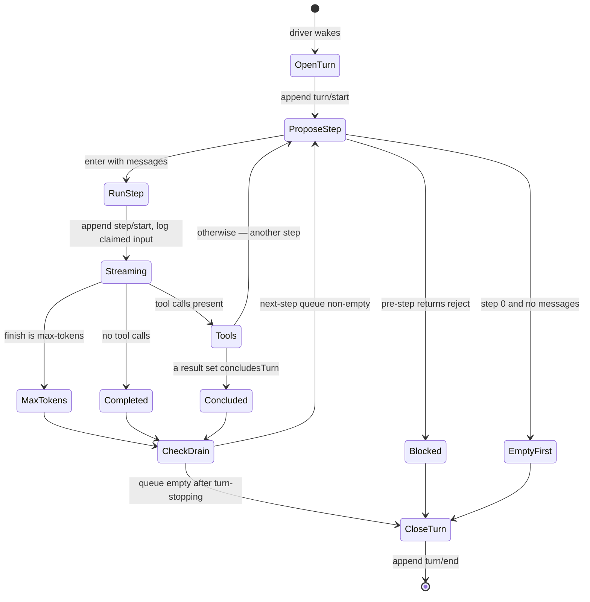

# Chapter 9 · The turn and step loops

**What you'll learn:** every branch point in the engine's control flow — when a turn continues, when it stops, and which of the six turn endings it records.

**Prerequisites:** [Chapter 4](04-the-engine-in-100-lines.md) for the shape, [Chapter 7](07-from-log-to-request.md) for `deriveMessages`.

---

## 1. The problem

"Call the model, run its tools, repeat" hides a surprising number of decisions. When exactly does a turn end? What if the model asks for tools *and* the user sends a new message while they run? What if one step hits the token ceiling and the next completes normally — did the turn succeed? What if a plugin wants to reject a step before it starts?

Every one of these needs an answer that is consistent, recorded, and replayable. This chapter is the full inventory.

## 2. Mental model

Three nested loops, each with exactly one exit condition:

| Loop | Iterates | Exits when |
|---|---|---|
| **driver** | turns | `turn()` returns `false` |
| **turn** | steps | an ending is set *and* nothing is queued for a next step |
| **step** | request attempts | the request succeeds, or nobody asks for a retry |

Confusing the turn loop with the step loop is the single easiest way to misread this engine. A *turn* is one unit of conversation — roughly, one user prompt and everything the model does in response. A *step* is one model request within it. A turn containing three tool round-trips has four steps.

**New term — turn ending.** A `TurnEndReason` recording *why* a turn stopped. It is set during the loop and written once, in a `finally`, so a turn always gets exactly one ending no matter how it exits.

## 3. State diagram



## 4. The driver

```ts
private async kick(): Promise<void> {
  try {
    while (await this.turn()) {}
  } catch (_error) {
    // Reported failures and cancellation are contained at the driver boundary.
  } finally {
    if (this.phase.kind === 'running') {
      const { turn, wakeRequested } = this.phase
      this.setPhase({ kind: 'idle', lastTurn: turn })
      if (wakeRequested && this.inbox.hasPending) this.wakeDriver()
    }
  }
}
```
— `packages/core/agent-loop/src/agent.ts:219-232`

The empty `catch` looks alarming and is correct. By the time an error reaches here it has already been reported: `throwError()` (`agent.ts:212-217`) emits `agent/error` with the turn and step position *before* rethrowing. The driver's job is to stop looping, not to report. Swallowing here is what keeps one failed turn from killing the agent.

The `finally` returns to idle and replays a latched wake ([Ch 13](13-phases-cancellation-quiescence.md)).

## 5. The turn loop, branch by branch

`turn()` — `agent.ts:255-339`. Entry appends `turn/start`, and even that append is guarded: a failure routes through `throwError` (`:263-267`).

Inside `while (true)`:

**① Abort check.** `signal.throwIfAborted()` (`:273`). The first of six in this function.

**② Propose a step.** `preStep(target, {turn, step})` (`:275`) runs the `agent/pre-step` waterfall ([Ch 22](22-extension-points.md)).

**③ Rejected.**

```ts
if (decision.kind === 'reject') {
  turnEnds = { kind: 'blocked' }
  return false
}
```
— `:276-279`

`return false` stops the **driver**, not just the turn. A rejected step is a hard stop: no further turns are attempted.

**④ Already ended, nothing new.** `if (turnEnds && decision.messages.length === 0) break` (`:280`).

**⑤ First step with nothing to say.**

```ts
if (phase.step === 0 && decision.messages.length === 0) {
  turnEnds = { kind: 'completed' }
  return false
}
```
— `:283-286`

A waking message that was cleared before the step opened, or a pre-step listener that rewrote the messages to empty. The comment is precise: such a turn "still owns the initial turn boundary, but it spends no model call." **A turn can open and close without ever contacting the model** — it will appear in the log as `turn/start` immediately followed by `turn/end`.

**⑥ Open the step and log input.** Append `step/start`, then one `user/message` per claimed message with `surfaceOp: 'append'` (`:288-293`). This is where injected context becomes ordinary logged history.

**⑦ Run the step** and fold its ending:

```ts
const stepEnd = await this.step(decision.assembly, decision.startsRequestSeries === true)
if (turnEnds === null || turnEnds.kind !== 'max-tokens') turnEnds = stepEnd
```
— `:296-299`

**`max-tokens` is sticky.** Once any step hits the ceiling, a later step completing normally cannot downgrade the turn's outcome. Without this, a turn that truncated mid-answer and then ran a cleanup step would be recorded as a clean success.

**⑧ Always close the step.** `step/end` is appended in a `finally` (`:301`), including on throw.

**⑨ Last chance to continue.**

```ts
if (turnEnds && this.inbox.nextStep.length === 0) {
  await this.dispatch.serial('agent/turn-stopping', { turn, signal })
  signal.throwIfAborted()
}
if (turnEnds && this.inbox.nextStep.length === 0) break
```
— `:304-308`

The condition is evaluated, listeners run, then it is **evaluated again**. A listener that wants the turn to continue calls `agent.steer(...)`, which puts a message in `nextStep`, and the re-test sees it. Note this is *data-driven*: listeners do not vote by return value, so their registration order cannot change the outcome.

> In the shipped configuration this extension point has **zero live listeners** — its only implementations are the hook bridges, which are not mounted ([Ch 22](22-extension-points.md)).

**⑩ Otherwise continue.** `target = 'next-step'` (`:309`) — after the first step, input comes from the step queue rather than the turn queue.

### Exits

**On throw** (`:311-324`): if the signal aborted, the ending is `{kind:'aborted', reason}` and the error rethrows. Otherwise the failure is *structured* — an `LlmError` keeps its `failure`; anything else flattens:

```ts
turnEnds = {
  kind: 'error',
  error: error instanceof LlmError
    ? error.failure
    : { message: errorChain(error), code: 'UNKNOWN' },
}
```
— `:318-323`

So the log never holds an unstructured error. Every failure has a code, even if it is `UNKNOWN`.

**Always** (`:325-332`): append `turn/end` with the accumulated reason.

**Then decide whether to run another turn:**

```ts
if (!this.inbox.hasPending) return false
phase.abort = new AbortController()
phase.wakeRequested = false
phase.step = 0
return true
```
— `:333-338`

A **fresh abort controller per turn**. This is why a cancellation aborts one turn rather than the agent, and why a wake latched against the old controller is stale — hence clearing `wakeRequested` on the same lines ([Ch 13](13-phases-cancellation-quiescence.md)).

## 6. The step loop, branch by branch

`step()` — `agent.ts:341-438`. Returns `StepEndReason | null`, where **`null` means "no ending yet — run another step."**

Inside `while (true)` (this is the *retry* loop):

**① Capture the surface generation** (`:349`) before building, for request-series detection ([Ch 10](10-building-the-request.md)).

**② Build the request** (`:350-359`), then `startsRequestSeries = false` (`:360`) so only the first attempt can open a series.

**③ Stream.**

```ts
const stream = preparedCall?.stream(request) ?? this.loopCtx.llm.stream(request)
```
— `:364`

The prepared call is preferred; the bare `llm.stream` is the fallback for when no adapter resolved ([Ch 23](23-adapters-and-preparecall.md)).

**④ Per chunk** (`:366-370`): abort check, append `assistant/chunk`, collect its `seq`, push into the assembler. Every chunk is logged individually — which is why Chapter 30's packing codec exists.

**⑤ On throw during streaming** (`:372-389`): **only if the signal aborted**, salvage `assembler.interruptedBlocks()` and, if non-empty, append an `assistant/message` with `interrupted: true` citing the chunks so far. Then rethrow regardless. A cancelled turn keeps whatever the model managed to say.

**⑥ Request failed.**

```ts
if (finish.kind === 'error' || finish.kind === 'aborted') {
  const action = await this.dispatch.waterfall('agent/request-error', {...},
    () => Promise.resolve<RequestErrorAction>(undefined))
  signal.throwIfAborted()
  if (action?.kind !== 'retry') {
    throw new LlmError(finish.failure.message, finish.failure.code, finish.failure)
  }
  continue
}
```
— `:390-408`

**The loop itself never decides to retry.** Its built-in default is `undefined`, which is terminal. A listener must return `{kind:'retry'}` for `continue` to be reached — and `continue` rebuilds the request from scratch, picking up any history changes a listener made in the meantime. That is exactly how compaction-on-overflow works ([Ch 27](27-pruning-and-compaction.md)).

**⑦ Commit the assistant message** (`:410-427`), citing every chunk seq.

**⑧ Ceiling hit.** `if (finish.kind === 'max-tokens') return { kind: 'max-tokens' }` (`:428`).

**⑨ Nothing more to do.** `if (toolCalls.length === 0) return { kind: 'completed' }` (`:430-431`).

**⑩ Run the tools.**

```ts
const { concluded } = await executeToolCalls(
  this.loopCtx, turn, step, toolCalls, signal,
  context => this.inbox.splice('next-step', this.inbox.nextStep.length, 0, [context]),
)
return concluded ? { kind: 'completed' } : null
```
— `:432-436`

The callback is how a tool's `additionalContexts` reach the next step: appended to the `next-step` queue, so they are claimed at the next boundary like any other input ([Ch 17](17-scheduling-tool-calls.md)).

**The single condition for a turn to continue:** the model emitted at least one tool call, **and** no committed result set `concludesTurn`.

## 7. Edge cases and failure modes

**Six abort checks in `turn()`.** At `:261`, `:273`, `:287`, `:303`, plus `throwIfAborted` inside `preStep` twice. Cancellation is checked before each boundary append, so an aborted turn cannot leave a `step/start` without a `step/end`.

**A failed `turn/end` append is still reported.** The `finally` wraps its own append in try/catch and routes failure through `throwError` (`:328-331`) — a storage failure while closing a turn does not vanish silently.

**Turn endings can be recorded for turns that never ran a model call.** Branch ⑤. Worth knowing when reading logs.

**`step()` can loop indefinitely in principle.** The retry `while (true)` has no iteration cap of its own; bounding is entirely the listener's job. `llm-retry` enforces `maxRetries` for `normal` policies but retries **indefinitely** under an `always` policy ([Ch 25](25-failures-and-retry.md)). The engine trusts the listener.

## 8. Configuration knobs

The loops have none. The only engine-level tunable is `maxParallelToolCalls`, which belongs to the scheduler ([Ch 17](17-scheduling-tool-calls.md)). Every other lever — whether to retry, whether to compact, whether to reject a step — lives in a plugin.

## 9. Interactions

- **[Ch 12](12-the-inbox.md)** — supplies claimed messages, and `nextStep.length` is the turn-continuation condition.
- **[Ch 13](13-phases-cancellation-quiescence.md)** — owns the abort controller these loops check.
- **[Ch 10](10-building-the-request.md)** — called once per step attempt.
- **[Ch 17](17-scheduling-tool-calls.md)** — returns `concluded`, the only tool-side way to end a turn.
- **[Ch 22](22-extension-points.md)** — `agent/pre-step`, `agent/request-error`, and `agent/turn-stopping` all fire here.
- **[Ch 27](27-pruning-and-compaction.md)** — the sole reason `continue` at ⑥ is useful in the shipped system.

## 10. Build it yourself

The minimal turn loop from Chapter 4 already has the shape. The additions, ordered by how likely you are to need them:

| Addition | Why it exists |
|---|---|
| `null` vs an ending as the step's return | Distinguishes "keep going" from "done" without a second flag |
| Sticky `max-tokens` | A later clean step must not mask a truncated answer |
| `turn-stopping` re-test | Gives plugins a final chance to continue, without letting listener order decide |
| Fresh abort controller per turn | Cancellation should scope to a turn, not kill the agent |
| Structured error endings | Replay and UI need a code, never a bare string |
| Abort check before each boundary append | Prevents unbalanced `step/start` with no `step/end` |
| Interrupted-message salvage | Cancelling mid-answer should not discard what was already said |
| Retry delegated to a waterfall | Retry policy is deployment-specific; the loop should not own it |

---

## Key takeaways

- Three loops: turns, steps, request attempts. Each has one exit condition.
- A turn continues only when the model emitted tool calls and no result concluded the turn.
- `max-tokens` is sticky; a later clean step cannot upgrade the outcome.
- A rejected pre-step stops the driver entirely, not just the turn.
- `agent/turn-stopping` is evaluated, then re-evaluated — listeners act by queueing data, not by returning a vote.
- The engine never retries on its own; the default action is terminal.
- Every failure becomes structured before it reaches the log.

## Exercises

1. Trace what is logged when a pre-step listener returns `reject` on the very first step of a session. List every event, in order, and give the turn's ending.
2. A step hits `max-tokens`, and a tool result in the *next* step sets `concludesTurn`. What ending does the turn record, and which line decides it?
3. `step()`'s retry loop has no iteration cap. Write the smallest listener that would hang an agent forever, then name the two mechanisms that would still stop it ([Ch 13](13-phases-cancellation-quiescence.md) has both).

**Next:** [Chapter 10 · Building the request](10-building-the-request.md)
