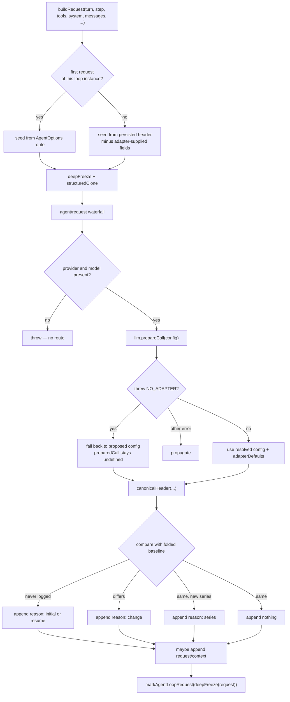

# Chapter 10 · Building the request

**What you'll learn:** how one model request is assembled, why the engine logs a header only sometimes, and the small dance that keeps one model's defaults from leaking onto another.

**Prerequisites:** [Chapter 7](07-from-log-to-request.md), [Chapter 9](09-the-turn-and-step-loops.md).

---

## 1. The problem

A request needs a provider, a model, a system prompt, a tool list, some generation parameters, and the message history. The history is solved ([Ch 7](07-from-log-to-request.md)). The rest is harder than it looks, for three reasons.

**The route can change mid-session.** A user switches models. The request must follow, but the *previous* model's resolved defaults must not come along — a reasoning-effort level valid for one model may not exist on another.

**Some parameters come from the adapter, not the caller.** If nobody specified `maxTokens`, the adapter fills in the model's default. That value is now in the config, indistinguishable from one a user chose — unless something records the difference.

**The request must be reconstructable.** Chapter 1's thesis requires that a reader of the log can rebuild exactly what was sent. Messages come from the surface, but the system prompt and tool schemas are not messages. They have to be recorded too — without writing a copy of a 35 KB tool schema on every single step.

## 2. Mental model

**New term — request header.** The non-message half of a request: config, system prompt, tool schemas, plus a note of which fields the adapter supplied. Logged as a `request/header` event **only when it changes**.

So the log holds a sparse series of headers, and the header in force for any step is the most recent one at or before it. Chapter 11's check calls this a *fold*. It means a thousand-step session with a stable configuration contains one header event, not a thousand.

## 3. Lifecycle



## 4. Step-by-step walkthrough

`buildRequest` — `packages/core/agent-loop/src/agent.ts:444-544`.

### Seeding the config

On the **first** request of this loop instance, the seed is the declared route plus whatever the caller specified:

```ts
{ ...route, ...reasoningEffort && { reasoningEffort }, ...maxTokens && { maxTokens } }
```
— `:472-476`

On **later** requests, the seed is the previous header put through `requestProposal`:

```ts
function requestProposal(header: EpochHeader): LlmCallConfig {
  if (header.adapterDefaults === undefined) return header.config
  const proposal = { ...header.config }
  if (header.adapterDefaults.reasoningEffort === true) delete proposal.reasoningEffort
  if (header.adapterDefaults.maxTokens === true) delete proposal.maxTokens
  return proposal
}
```
— `:61-67`

This is the answer to the second problem. `adapterDefaults` marks which fields the adapter supplied; `requestProposal` **strips exactly those** so they get re-resolved against whatever model is in force now. A user-chosen `maxTokens` survives; an adapter-chosen one does not.

### Restoring a persisted reasoning effort

```ts
const persistedReasoningEffort = persistedConfig?.provider === route.provider
  && persistedConfig.model === route.model
  && persistedHeader?.adapterDefaults?.reasoningEffort !== true
  ? persistedConfig.reasoningEffort
  : undefined
```
— `:461-465`

Three conditions, all required: same provider, same model, and the value was not adapter-supplied. A resumed session keeps an explicitly-chosen effort level — but only if it is resuming onto the **exact** model that owned it.

### The proposal waterfall

The seed is frozen (`deepFreeze(structuredClone(...))`, `:468`) and offered to listeners:

```ts
const proposedConfig = await this.dispatch.waterfall('agent/request', { turn, step, signal },
  () => Promise.resolve(seedConfig))
```
— `:478-481`

This is where a `/model` switch takes effect — `installModelSelection` overrides provider, model, and reasoning effort here ([Ch 22](22-extension-points.md)). The waterfall deliberately **cannot touch messages**: "Model-visible content must use logged channels; this waterfall cannot mutate messages" (`packages/core/agent/src/runtime-types.ts:242-243`). Config is not model-visible content; messages are, and they must come from the log.

Then a hard failure if the route is still incomplete (`:483-485`).

### Resolving against the adapter

```ts
try {
  preparedCall = await this.loopCtx.llm.prepareCall(proposedConfig, signal)
  config = preparedCall.config
} catch (error: unknown) {
  if (!(error instanceof LlmError) || error.code !== 'NO_ADAPTER') throw error
  config = proposedConfig
}
```
— `:488-495`

Note the narrowness: **only** `NO_ADAPTER` falls through, and only to keep using the unresolved config. Every other failure — an unsupported reasoning effort, invalid model metadata — propagates and fails the step. The comment explains the exception: "Middleware may serve an unregistered route." Something could intercept `llm/stream` and answer without a registered adapter.

In the shipped configuration this fallback matters more than it sounds. With no provider configured, *every* request takes it, and `preparedCall` stays `undefined` — which also means no retry policy ([Ch 32](32-when-things-go-wrong.md)).

### The three-way logging decision

```ts
if (!this.requestHeaderLogged) {
  this.session.append('request/header', { header, reason: baseline === undefined ? 'initial' : 'resume' })
  this.requestHeaderLogged = true
} else if (baseline === undefined || !headerEquals(baseline, header)) {
  this.session.append('request/header', { header, reason: 'change',
    ...startsSeries ? { startsSeries: true } : {} })
} else if (startsSeries) {
  this.session.append('request/header', { header, reason: 'series' })
}
```
— `:507-518`

Four reasons, each meaning something distinct:

| Reason | When |
|---|---|
| `initial` | This loop instance's first request, and the log had no header — a fresh session |
| `resume` | This loop instance's first request over a log that already has headers |
| `change` | The header differs from the folded baseline |
| `series` | The header is unchanged, but a new message series began |

And the fourth case: unchanged, not a new series → **nothing is appended**.

### What starts a series

```ts
const startsSeries = startsRequestSeries || this.requestSurfaceGeneration !== surfaceGeneration
```
— `:505-506`

Either the caller said so, or **the surface was rewritten since the last header this instance logged**. That second clause is compaction's signature: after history is replaced, the next request is not a continuation of the previous message series even though the header is byte-identical. A reader folding the log needs to know that, and `replaceGeneration` ([Ch 6](06-the-surface.md)) is what tells it.

### Request context

```ts
if (previousContext?.provider !== requestContext.provider
  || previousContext.model !== requestContext.model
  || previousContext.contextWindow !== requestContext.contextWindow) {
  session.append('request/context', requestContext)
}
```
— `:527-532`

A separate, smaller event carrying provider, model, and context window — for presentation and telemetry, not reconstruction. Also only on change.

### Freezing and marking

```ts
const request = markAgentLoopRequest(deepFreeze({
  ...header.config,
  messages: boundaryMessages,
  ...header.system !== undefined ? { system: header.system } : {},
  ...header.tools !== undefined ? { tools: header.tools } : {},
  sessionId: this.session.id,
  signal,
}))
```
— `:535-542`

`markAgentLoopRequest` adds the object to a `WeakSet` (`packages/llm/llm/src/call-config.ts:66-78`). It is a **process-local identity tag**, not a field — it marks *this exact object*, never survives serialization, and never appears in the type. Its purpose: a listener on `llm/stream` can distinguish a loop-built request (frozen, derived from the log, must not be rewritten) from an ad-hoc one-shot call such as compaction's own summarization request.

## 5. Data at each stage

From the recorded turn (`session.jsonl:12-13`), the first request of a fresh session:

| Stage | Value |
|---|---|
| Seed | `{ provider: 'deepseek-official', model: 'deepseek-v4-flash' }` |
| After `agent/request` | unchanged — no listener modified it |
| After `prepareCall` | `maxTokens` filled from model metadata; `adapterDefaults: { maxTokens: true }` |
| Header logged | `reason: 'initial'`, with `system` and `tools` (elided as `{{system}}`/`{{tools}}` in the fixture) |
| Context logged | `{ provider: 'deepseek-official', model: 'deepseek-v4-flash' }` |
| Request messages | 2, from `deriveMessages()` |

On the next step with the same route, the header comparison matches and **no header event is written**.

## 6. Control decisions

| Decision | Condition | Location |
|---|---|---|
| Strip adapter-supplied fields | `adapterDefaults` marks them | `:61-67` |
| Restore persisted effort | same provider **and** model **and** not adapter-supplied | `:461-465` |
| Fail the step | proposal lacks provider or model | `:483-485` |
| Tolerate missing adapter | `LlmError` with code exactly `NO_ADAPTER` | `:491-495` |
| Log header | never logged / differs / unchanged-but-new-series | `:507-518` |
| Log context | provider, model, or context window changed | `:527-532` |

## 7. Edge cases and failure modes

**A resumed session logs `resume`, not `initial`.** The distinction is per *loop instance*, not per session: `requestHeaderLogged` is an instance field (`agent.ts:84`). Reopening a session produces a new anchor header even if nothing changed, which is what a folding reader needs to know a new process took over.

**`headerEquals` compares the whole header**, including the tool schema array. A tool being registered or unregistered mid-session therefore produces a `change` header — correct, because the model's options genuinely changed.

**Compaction produces a `series` header with identical bytes.** Easy to mistake for a redundant write when reading a log. It is not: the bytes match, the meaning does not.

**The signal is in the frozen request.** `deepFreeze` covers the object graph, but `signal` is a live `AbortSignal` — frozen as a reference, still able to fire. Chapter 11's check asserts the *messages* array is frozen, not that the whole request is inert.

## 8. Configuration knobs

| Setting | Default | Effect |
|---|---|---|
| `AgentOptions.provider` / `.model` | from `agent-default-model`: `deepseek-official` / `deepseek-v4-flash` | The declared route this instance starts from |
| `AgentOptions.maxTokens` | unset | Validated as a positive safe integer at agent construction (`index.ts:198-203`) |
| `AgentOptions.reasoningEffort` | unset | Falls back to the persisted value under the three-condition rule |

— `packages/bundle/base/cordis.patch.yml:73-79`

## 9. Interactions

- **[Ch 7](07-from-log-to-request.md)** — supplies `messages`.
- **[Ch 19](19-prompt-assembly.md)** — supplies `system` and `tools`.
- **[Ch 23](23-adapters-and-preparecall.md)** — `prepareCall` and `adapterDefaults`.
- **[Ch 6](06-the-surface.md)** — `replaceGeneration` drives series detection.
- **[Ch 11](11-the-reconstruction-invariant.md)** — checks this function's output against the log.
- **[Ch 22](22-extension-points.md)** — `agent/request` is where model switching lands.

## 10. Build it yourself

Minimal version:

```ts
const request = {
  provider: this.options.provider,
  model: this.options.model,
  system: renderPrompt(assembly),
  tools: assembly.tools,
  messages: this.session.deriveMessages(),
}
```

What the real one adds:

| Addition | Why it exists |
|---|---|
| `adapterDefaults` + `requestProposal` | Otherwise one model's defaults silently follow you to another model |
| The three-condition effort restoration | A persisted effort level is only meaningful on the model that had it |
| `agent/request` waterfall | Model switching must not require touching the loop |
| `NO_ADAPTER`-only fallback | Middleware may serve unregistered routes; every other failure is real |
| Change-only header logging | A copy of the tool schemas on every step would dwarf the conversation |
| `series` reason | A byte-identical header can still begin a new series after a rewrite |
| `deepFreeze` + `markAgentLoopRequest` | Lets an observer tell "derived from the log" from "hand-built", and prevents rewriting the former |

---

## Key takeaways

- The header is logged only on change, with four distinct reasons; a stable session logs one.
- `adapterDefaults` records which fields the adapter filled in so they can be re-resolved, not inherited.
- A persisted reasoning effort survives resume only on the exact same provider *and* model.
- A surface rewrite starts a new request series even when the header bytes are unchanged.
- Only `NO_ADAPTER` is tolerated from `prepareCall`; everything else fails the step.
- `markAgentLoopRequest` is a process-local `WeakSet` tag, not a serialized field.

## Exercises

1. A user switches from model A to model B mid-session, having never set `maxTokens`. Walk through `requestProposal` and say exactly what the request to B contains. Now repeat with the user having explicitly set `maxTokens: 4096`.
2. Compaction runs, then the next step builds a request with an identical header. Which reason is logged, and what would a log reader get wrong if that event were skipped?
3. `markAgentLoopRequest` uses a `WeakSet` rather than a field on the request. Give two things that would break if it were a boolean field instead.

**Next:** [Chapter 11 · The reconstruction invariant](11-the-reconstruction-invariant.md)
