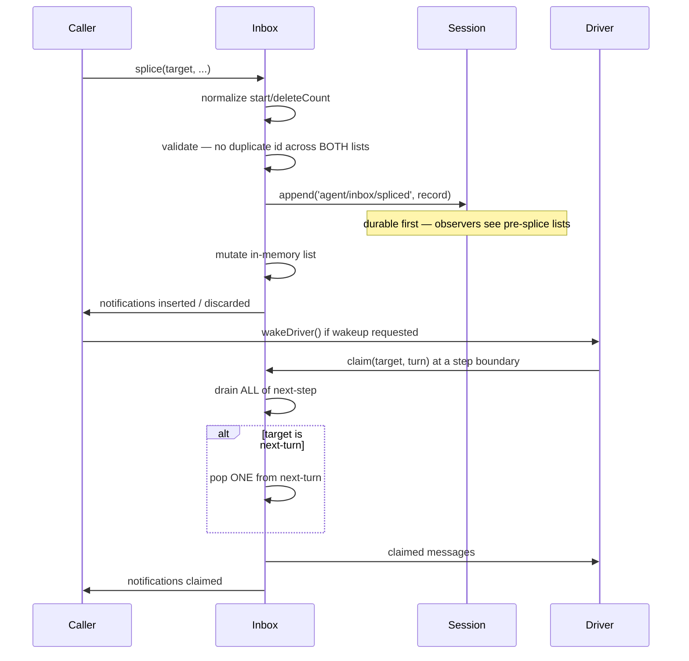

# Chapter 12 · The inbox

**What you'll learn:** how input reaches a running agent without interrupting it, why there are two queues instead of one, and the real difference between `followup`, `steer`, and `inject`.

**Prerequisites:** [Chapter 9](09-the-turn-and-step-loops.md).

---

## 1. The problem

An agent is mid-turn: it has sent a request, the model is streaming, three tool calls are queued behind it. The user types something.

You cannot splice that message into the request already in flight. You cannot drop it. You cannot append it to the history mid-step, because the history is what the *next* request will be built from and a half-written turn would produce an incoherent prompt.

And "just queue it" is not one answer but several. Did the user mean *"stop what you're doing and consider this"* — join the current turn at the next opportunity? Or *"when you're finished, here's the next thing"* — a new turn? Those are different, and a plugin injecting background context wants a third thing again: be there when it matters, but do not wake a sleeping agent.

## 2. Mental model

**New term — inbox.** Two ordered queues of pending `UserMessage`s, drained at step boundaries.

```
next-turn:  [ prompt A ] [ prompt B ]      ← one popped per turn opening
next-step:  [ ctx ] [ steer ] [ tool ctx ] ← all drained every step
```

Two rules do most of the work:

- **`next-step` is drained completely, at every step.**
- **`next-turn` yields exactly one item, and only when a turn is opening.**

So `next-turn` behaves like a FIFO of "one whole turn's worth of prompt," while `next-step` is "everything pending right now, folded into the step about to run."

The third axis is orthogonal to both: whether delivery is allowed to *wake* an idle agent.

**New term — durable-first.** The inbox commits its change to the session log before touching memory. It is not a side buffer — every splice is a logged event, and the queues are rebuilt by replaying those events.

## 3. Lifecycle



## 4. Step-by-step walkthrough

### It is a projection, not a buffer

```ts
constructor(session, notifications) {
  // replay every agent/inbox/spliced event from seedLength onward
}
```
— `packages/core/agent/src/inbox.ts:28-40`

Replay starts at `session.header.seedLength ?? 0`, skipping a forked session's inherited prefix — a fork's own log already encodes that history structurally, so replaying the parent's inbox activity would double-count it. A malformed persisted splice **throws** (`:34-39`) rather than being skipped: a queue that cannot be reconstructed exactly is not safe to run on.

This is why a crashed agent resumes with its pending input intact. Nobody wrote a queue to disk; the queue *is* the log.

### The splice

`splice(target, start, deleteCount, inserted)` (`:139-146`) delegates to `mutate` (`:157-193`), which:

**Normalizes like `Array.prototype.splice`** (`:166-176`) — clamping to bounds, truncating non-integers. This is why the engine can call `splice(target, Infinity, 0, [message])` to mean "append" without a special case.

**Validates before committing** (`:202-219`): it re-derives the resulting list with `toSpliced` and asserts no message `id` appears twice **across both lists combined**, throwing `"message ... is already pending"`. A message can be pending in at most one target at a time — otherwise a message could be claimed twice and appear in the history twice.

**Commits durably, then in memory:**

```ts
this.session.append('agent/inbox/spliced', splice)   // :186
this.state[target] = ...                              // :187
```

The ordering is deliberate, and documented: appending first means synchronous `session/event` observers "see the pre-splice lists" (`:130-132`). An observer watching the log sees the *intent* before the queue reflects it, so it can reason about both states.

### The claim

```ts
claim(target: InboxTarget, turn: number): UserMessage[] {
  const claimed = this.mutate('next-step', 0, this.nextStep.length, [], false)
  if (target === 'next-turn') {
    claimed.push(...this.mutate('next-turn', 0, 1, [], false))
  }
  for (const message of claimed) this.notifications.claimed(message, turn)
  return claimed
}
```
— `inbox.ts:63-78`

Marked `@internal` — "the agent loop's step-boundary operation, not a plugin extension point."

The asymmetry is the whole design. `next-step` is drained with `deleteCount = this.nextStep.length`; `next-turn` with `deleteCount = 1`. And the `false` in both calls is `discardRemoved` — claimed messages are **not** reported as discarded. They get their own notification, `claimed`, because "removed because it is being used" and "removed because it was thrown away" are different events for anything watching.

### The three senders

All three route through one private method:

```ts
send(message: UserMessage, target: InboxTarget, wakeup: boolean): void {
  const wakingAfterAbort = wakeup && this.phase.kind !== 'idle' && this.phase.abort.signal.aborted
  const resolvedTarget = wakingAfterAbort ? 'next-turn' : target
  this.inbox.splice(resolvedTarget, Infinity, 0, [message])
  if (wakeup) this.wakeDriver(wakingAfterAbort)
}

followup(input) { this.send(input, 'next-turn', true) }
steer(input)    { this.send(input, 'next-step', true) }
inject(input)   { this.send(input, 'next-step', false) }
```
— `packages/core/agent-loop/src/agent.ts:122-141`

| Method | Queue | Wakes? | Meaning |
|---|---|---|---|
| `followup` | `next-turn` | yes | "Here's the next thing to do." One item becomes one turn. |
| `steer` | `next-step` | yes | "Consider this at your next opportunity." A running agent picks it up at the next step boundary; an idle one starts a turn. |
| `inject` | `next-step` | **no** | "Have this available when you next think." Never wakes anything. |

`inject` on an idle agent produces **no activity at all** — the message sits in the log, the status stays `idle`, and no request is made. The test asserts exactly this: after `agent.inject(...)`, the session contains only the `agent/inbox/spliced` event and the mock adapter records zero requests (`packages/core/agent-loop/tests/agent.spec.ts:31-42`).

### The reclassification

```ts
const wakingAfterAbort = wakeup && this.phase.kind !== 'idle' && this.phase.abort.signal.aborted
```

A waking message arriving *after* the current activity was aborted cannot join it — that turn is unwinding. So it is retargeted to `next-turn`, where it will open a fresh turn instead of being silently swallowed by a dying one.

The flag is computed **before** the splice, deliberately. A `session/event` observer could react to the splice by calling `cancel()`, which would change `phase.abort.signal.aborted` mid-call; capturing first means a reentrant cancel cannot reclassify a message that was correctly classified a microsecond earlier (`agent.ts:124-125`).

## 5. Data at each stage

From the recorded session (`session.jsonl:5` and `:7`):

```json
{"type":"agent/inbox/spliced","data":{"target":"next-turn","start":0,
  "inserted":[{"content":[{"type":"text","text":"Reply with exactly the word: PONG..."}],
               "source":{"kind":"user"},"role":"user","id":"{{message:1}}"}]}}
```

then, after `turn/start`:

```json
{"type":"agent/inbox/spliced","data":{"target":"next-turn","start":0,
  "removedCount":1,"inserted":[]}}
```

| Stage | `next-turn` | `next-step` |
|---|---|---|
| After `followup` | `[msg1]` | `[]` |
| Turn opens, `claim('next-turn', 1)` | `[]` | `[]` |
| Claimed | — | msg1 returned to the loop |
| Loop appends | — | `user/message` at seq 8 |

Note the second splice event records `removedCount: 1` with an empty `inserted` — the claim is itself a logged mutation. The queue's entire history is in the log.

## 6. Control decisions

| Decision | Condition | Location |
|---|---|---|
| Retarget to `next-turn` | waking while the current activity is already aborted | `agent.ts:124-126` |
| Reject splice | resulting lists would contain a duplicate message id | `inbox.ts:202-219` |
| Throw on replay | a persisted splice record is malformed | `inbox.ts:34-39` |
| Claim one vs all | `next-turn` yields 1; `next-step` yields everything | `inbox.ts:63-78` |
| Notify `claimed` not `discarded` | removal was a claim | `inbox.ts:74-77` |
| Skip wake | `wakeup` is false | `agent.ts:128` |

## 7. Edge cases and failure modes

**`clear()` discards both queues, durably.**

```ts
clear(): void {
  this.splice('next-step', 0, this.nextStep.length, [])
  this.splice('next-turn', 0, this.nextTurn.length, [])
}
```
— `inbox.ts:58-61`

Called from `cancel()` unless `keepInbox` is set ([Ch 13](13-phases-cancellation-quiescence.md)). Each is a logged splice, so a reader can see exactly what was thrown away and when — cancellation does not create a gap in the record.

**A claimed message may never become a `user/message`.** If the step is subsequently rejected by a pre-step listener, the claimed messages are gone from the inbox and never appended. The event documentation warns about precisely this: "If the step is later rejected, the message ends here — never re-emitted as a `user/message`" (`runtime-types.ts:196-197`). Anything tracking message lifecycle has to treat `claimed` as "consumed", not "delivered".

**`nextStep.length` is a turn-continuation condition.** [Chapter 9](09-the-turn-and-step-loops.md)'s ⑨ tests it twice around `agent/turn-stopping`. So a plugin can extend a turn purely by putting something in this queue — which is exactly how a blocking Stop hook would work, if one were mounted.

**Tool results feed this queue.** A tool's `additionalContexts` are spliced into `next-step` by the callback the step loop passes to the scheduler (`agent.ts:434`). They are not part of the tool result the model reads; they are separate messages that arrive at the next boundary ([Ch 17](17-scheduling-tool-calls.md)).

## 8. Configuration knobs

None. Queue depth is unbounded, and there is no priority or expiry.

## 9. Interactions

- **[Ch 9](09-the-turn-and-step-loops.md)** — claims at each step boundary; `nextStep.length` gates turn continuation.
- **[Ch 13](13-phases-cancellation-quiescence.md)** — `cancel()` clears it; wake latching decides when a queued message actually starts a driver.
- **[Ch 21](21-runtime-context-injection.md)** — the runtime-context snapshot arrives as a claimed message, not a side channel.
- **[Ch 17](17-scheduling-tool-calls.md)** — `additionalContexts` are spliced into `next-step`.
- **[Ch 5](05-the-append-only-log.md)** — every splice is an `agent/inbox/spliced` event.

## 10. Build it yourself

Minimal version:

```ts
class MiniInbox {
  nextTurn: UserMessage[] = []
  nextStep: UserMessage[] = []
  claim(target: 'next-turn' | 'next-step'): UserMessage[] {
    const claimed = this.nextStep.splice(0)
    if (target === 'next-turn') claimed.push(...this.nextTurn.splice(0, 1))
    return claimed
  }
  get hasPending() { return this.nextTurn.length > 0 || this.nextStep.length > 0 }
}
```

The two-queue asymmetry is the essential part and it is already here. What the real one adds:

| Addition | Why it exists |
|---|---|
| Durable `agent/inbox/spliced` events | A crashed agent must resume with its pending input; the queue *is* the log |
| Append-before-mutate ordering | Observers need to see the pre-splice state to reason about the transition |
| Duplicate-id validation | The same message claimed twice would appear twice in history |
| `claimed` distinct from `discarded` | "Consumed" and "thrown away" are different facts for anything watching |
| Replay from `seedLength` | A fork already encodes inherited history; replaying it would double-count |
| Abort-time retargeting | A message that raced a cancellation must not be swallowed by a dying turn |
| Throw on malformed replay | A queue that cannot be reconstructed exactly is not safe to run on |

---

## Key takeaways

- Two queues: `next-turn` yields one item per turn opening, `next-step` is drained entirely at every step.
- `followup` / `steer` / `inject` differ on exactly two axes — which queue, and whether delivery may wake an idle driver.
- `inject` on an idle agent does nothing observable but write a log event.
- Every mutation is a logged event committed *before* memory changes; the queue is a replay of those events.
- A waking message that arrives after cancellation is retargeted to the next turn, classified before the splice so a reentrant cancel cannot change the answer.
- A claimed message can still be discarded if its step is rejected.

## Exercises

1. A plugin calls `inject` three times while the agent is running a step, then the user calls `steer`. Exactly what does the next `claim` return, and in what order?
2. The duplicate-id check spans both lists rather than one. Construct the failure it prevents — trace the message through to where it would appear twice.
3. `claim` pops one item from `next-turn` but drains all of `next-step`. Design a scenario where draining all of `next-turn` too would produce an incoherent prompt.

**Next:** [Chapter 13 · Phases, cancellation, and quiescence](13-phases-cancellation-quiescence.md)
