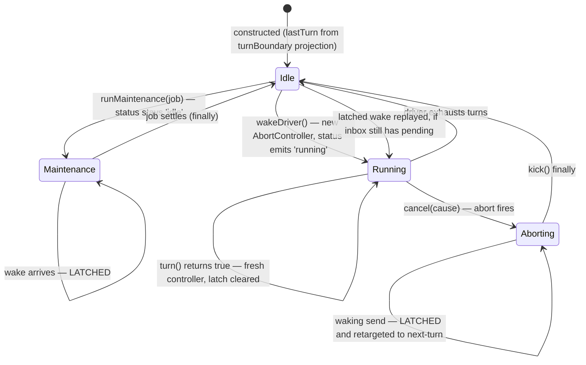

# Chapter 13 · Phases, cancellation, and quiescence

**What you'll learn:** the three-state machine behind `agent.status`, how a cancellation converges, and the latch that stops a wake being lost in the gap between "aborting" and "idle".

**Prerequisites:** [Chapter 9](09-the-turn-and-step-loops.md), [Chapter 12](12-the-inbox.md).

---

## 1. The problem

Stopping an agent is not one operation. A stop request arrives while a model is streaming, three tools are mid-execution, and a user message just landed in the inbox. Several things must all be true afterwards:

- the stream stops and the partial answer is not lost ([Ch 9](09-the-turn-and-step-loops.md) ⑤);
- every started tool call settles rather than being orphaned;
- the log ends up balanced — no `step/start` without a `step/end`;
- and if the user's message arrived a microsecond before the cancel, it must not be silently eaten.

That last one is the subtle one. There is a window where the agent is neither running usefully nor idle: the abort has fired, the unwinding is in progress. A wake delivered into that window has nowhere to go. Losing it means a user pressing Enter and nothing happening.

## 2. Mental model

**New term — phase.** The agent's internal state, richer than the two-value `status` the outside sees.

```ts
type Phase =
  | { kind: 'idle'; lastTurn: number }
  | { kind: 'maintenance'; abort: AbortController; lastTurn: number; wakeRequested: boolean }
  | { kind: 'running'; abort: AbortController; turn: number; step: number; wakeRequested: boolean }
```
— `packages/core/agent-loop/src/agent.ts:39-47`

Externally, `maintenance` and `idle` both report `'idle'`:

```ts
get status(): AgentStatus {
  return this.phase.kind === 'idle' || this.phase.kind === 'maintenance' ? 'idle' : 'running'
}
```
— `:108-110`

**New term — maintenance.** A phase for work that needs the agent to hold still — manual compaction is the real user — during which no turn may start, but which the outside world should not see as "the agent is busy thinking."

The two non-idle phases carry their own `AbortController` and a `wakeRequested` latch. Both are per-phase, and the controller is **replaced between turns** ([Ch 9](09-the-turn-and-step-loops.md)), which is why cancelling scopes to a turn rather than killing the agent.

## 3. State diagram



## 4. Step-by-step walkthrough

### Status is emitted only on a real change

```ts
private setPhase(next: Phase): void {
  const previousStatus = this.status
  this.phase = next
  const status = this.status
  if (status !== previousStatus) {
    this.dispatch.emit('agent/status', { status })
  }
}
```
— `:113-120`

Because the collapse happens *before* comparison, an `idle → maintenance → idle` cycle emits nothing at all. A UI never flickers "busy" for a manual compaction, and listeners that reset state on `idle` (the retry counter, for instance) are not triggered spuriously.

### Cancellation

```ts
cancel(cause: AgentCancelCause, options: CancelOptions = {}): void {
  if (!options.keepInbox) {
    this.inbox.clear()
    if (this.phase.kind !== 'idle') this.phase.wakeRequested = false
  }
  if (this.phase.kind !== 'idle') this.phase.abort.abort(cause)
}
```
— `:143-149`

Three things happen in a deliberate order. The inbox is cleared *first* — and clearing it also clears the latch, because a latched wake whose message is gone should not start an empty turn. Then the signal fires. Cancelling an idle agent is a no-op on the signal but still clears the inbox.

`keepInbox` exists for cancellations that mean "stop this turn, keep the queue" rather than "stop everything."

The `cause` travels: [Chapter 9](09-the-turn-and-step-loops.md) records it as `turnEnds = { kind: 'aborted', reason: signal.reason }`, so the log says *why* a turn was cancelled, not merely that it was.

### The wake latch

```ts
private wakeDriver(wakeAfterAbort = false): void {
  if (this.phase.kind !== 'idle') {
    const reason = this.phase.abort.signal.reason as AgentCancelCause | undefined
    if (reason?.kind !== 'disposed' && (this.phase.kind === 'maintenance' || wakeAfterAbort)) {
      this.phase.wakeRequested = true
    }
    return
  }
  // idle: start a driver
  const driver = Promise.withResolvers<void>()
  this.activityDone = driver.promise
  this.setPhase({ kind: 'running', abort: new AbortController(),
                  turn: this.phase.lastTurn, step: 0, wakeRequested: false })
  this.loopCtx.agents.withInitiator(this, () => this.kick()).then(driver.resolve, driver.reject)
}
```
— `:181-202`

This is the answer to the problem in §1. When the agent is not idle, the wake cannot be delivered now, so it is *latched* for replay at convergence — but only under two conditions:

- **the phase is `maintenance`** (the driver is deliberately parked and will look again), **or**
- **`wakeAfterAbort`** (the wake arrived into the aborting window).

A live, non-aborted running driver does **not** latch. It does not need to: it will claim the queue itself at its next step boundary.

And one exclusion that matters more than it looks:

```ts
reason?.kind !== 'disposed'
```

**Disposal never latches.** If it did, teardown would queue a wake that starts a turn while the agent is being destroyed — and `dispose()` awaits `whenIdle()` ([Ch 14](14-agent-lifecycle.md)), so teardown would wait on a model call it just asked to stop.

### Replaying the latch

Two places, both guarded identically:

```ts
if (wakeRequested && this.inbox.hasPending) this.wakeDriver()
```
— `kick()`'s `finally` (`:229`) and `runMaintenance`'s `finally` (`:167`)

The `hasPending` guard is what makes a latch safe: if the queue was cleared in between, the replay is suppressed. The doc comment states the rule precisely — "A wake sent while idle always opens its turn boundary, even when its message was cleared; only a latched replay is suppressed when the queue no longer holds the wake" (`:173-180`).

### Latches go stale between turns

```ts
phase.abort = new AbortController()
phase.wakeRequested = false
```
— `:334-336`

A fresh controller makes any latch set against the old one meaningless: the driver is alive again and will claim the queue itself.

### Maintenance

```ts
runMaintenance<T>(job: (signal: AbortSignal) => Promise<T>): Promise<T> {
  if (this.phase.kind !== 'idle') throw new Error(`agent "${this.id}" already has active work`)
  ...
  return (async () => {
    try {
      return await job(maintenance.abort.signal)
    } finally {
      this.setPhase({ kind: 'idle', lastTurn: maintenance.lastTurn })
      if (maintenance.wakeRequested && this.inbox.hasPending) this.wakeDriver()
      done.resolve()
    }
  })()
}
```
— `:151-171`

It refuses to start unless idle, gets its own cancellable signal, and always returns to idle. Manual `/compact` uses this ([Ch 27](27-pruning-and-compaction.md)): the agent holds still, history is rewritten, and any wake that arrived meanwhile fires on the way out.

### Quiescence

```ts
async whenIdle(): Promise<void> {
  let activity: Promise<void>
  do {
    await (activity = this.activityDone)
  } while (activity !== this.activityDone)
}
```
— `:204-209`

The loop is the point. Awaiting `activityDone` once is not enough — a latched wake replayed in `kick()`'s `finally` installs a *new* `activityDone` before the old one's awaiters run. The re-check catches that, so `whenIdle()` means "no activity, and none started while I was waiting." Chapter 14 depends on this.

## 5. Control decisions

| Decision | Condition | Location |
|---|---|---|
| Emit `agent/status` | collapsed status actually changed | `:113-120` |
| Clear inbox and latch | `cancel` without `keepInbox` | `:144-147` |
| Fire abort | phase is not idle | `:148` |
| Latch a wake | not idle, cause ≠ `disposed`, and (maintenance or wake-after-abort) | `:186-189` |
| Start a driver | phase is idle | `:192-201` |
| Replay a latch | `wakeRequested` **and** `inbox.hasPending` | `:167`, `:229` |
| Clear a stale latch | new turn installs a fresh controller | `:334-336` |
| Refuse maintenance | phase is not idle | `:152` |

## 6. Edge cases and failure modes

**A wake while idle always opens a turn, even if its message was cleared.** Asymmetric with the latched case on purpose: an explicit wake delivered to an idle agent gets its turn boundary regardless. That turn may immediately close via [Chapter 9](09-the-turn-and-step-loops.md)'s branch ⑤ — `turn/start` followed by `turn/end`, no model call. The boundary is honored; the work is not invented.

**`cancel` during a splice observer.** Covered in [Chapter 12](12-the-inbox.md): `wakingAfterAbort` is captured before the splice so a reentrant cancel cannot reclassify a message.

**Errors never escape the driver.** `kick()`'s empty `catch` ([Ch 9](09-the-turn-and-step-loops.md)) contains everything. A failed turn returns the agent to idle rather than leaving it stuck `running` — the `finally` runs regardless of how the loop exited.

**The phase is re-derived on construction, not stored.**

```ts
const lastTurn = this.loopCtx.sessionProjections.stateOf(session, 'turnBoundary')?.lastTurn ?? 0
this.phase = { kind: 'idle', lastTurn }
```
— `:101-102`

A resumed agent starts idle at the right turn number, computed from the log ([Ch 8](08-projections.md)).

## 7. Configuration knobs

None. Cancellation has no timeout, no grace period, no forced kill. Convergence is cooperative: the loop checks its signal at six points per turn, tool dispatch drains rather than abandons ([Ch 17](17-scheduling-tool-calls.md)), and `whenIdle()` waits for genuine quiescence.

That is a real design position with a real consequence: **a tool that ignores its abort signal can delay teardown indefinitely.** There is no watchdog. The timeout policy plugin exists to bound individual calls, but the engine itself will wait.

## 8. Interactions

- **[Ch 9](09-the-turn-and-step-loops.md)** — consumes the signal, rotates the controller, returns to idle.
- **[Ch 12](12-the-inbox.md)** — `hasPending` gates latch replay; `cancel` clears the queues.
- **[Ch 14](14-agent-lifecycle.md)** — disposal is a `disposed`-cause cancel followed by `whenIdle()`.
- **[Ch 22](22-extension-points.md)** — `agent/status` is consumed by compaction (to reset retry counters), the session controller, and the goal driver.
- **[Ch 27](27-pruning-and-compaction.md)** — manual compaction runs inside `runMaintenance`.

## 9. Build it yourself

Minimal version:

```ts
class MiniAgent {
  private running = false
  private abort?: AbortController
  send(message: UserMessage): void {
    this.inbox.push(message)
    if (!this.running) { this.running = true; void this.kick().finally(() => { this.running = false }) }
  }
  cancel(): void { this.abort?.abort() }
}
```

Fine until the first race. What the real one adds:

| Addition | Why it exists |
|---|---|
| A third phase (`maintenance`) | Some work needs the agent still without looking busy |
| Status collapsed before comparison | A maintenance cycle should not flicker listeners |
| Per-phase, per-turn abort controller | Cancellation should scope to a turn, not the agent |
| The wake latch | A wake arriving during the aborting window would otherwise be lost |
| `disposed` excluded from latching | Otherwise teardown waits on a turn it just cancelled |
| `hasPending` guard on replay | A latch whose message was cleared must not start an empty turn |
| Clearing the latch on a new controller | A latch against a dead controller is meaningless |
| `whenIdle`'s re-check loop | A replayed wake installs new activity before old awaiters run |

---

## Key takeaways

- Three phases, two external statuses; `maintenance` is deliberately invisible as "idle".
- The abort controller is per-phase and replaced every turn, so cancellation scopes to a turn.
- A wake that cannot be delivered is latched — but only from maintenance or the aborting window, and never during disposal.
- Latch replay is guarded by `hasPending`, so a cleared queue suppresses it.
- `whenIdle()` re-checks, because a replayed wake can install new activity mid-await.
- Convergence is entirely cooperative; a tool ignoring its signal will delay teardown, with no watchdog.

## Exercises

1. A user sends a message at the exact moment `cancel()` fires. Trace it through `send`, `wakeDriver`, and the `kick` finally. Now repeat with the cause being `disposed` and say where the paths diverge.
2. `setPhase` compares collapsed status rather than phase kind. Name a listener that would misbehave if it emitted on every phase change, and say how.
3. `whenIdle()`'s loop re-reads `activityDone`. Write the interleaving that makes a single `await` return too early, and say which line installs the new promise.

**Next:** [Chapter 14 · Agent lifecycle](14-agent-lifecycle.md)
