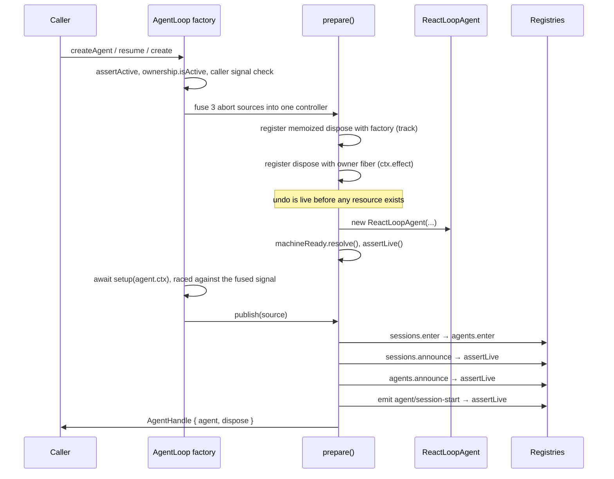

# Chapter 14 · Agent lifecycle

**What you'll learn:** how an agent is built, published, and torn down — and why the teardown is registered before any of the things it tears down exist.

**Prerequisites:** [Chapter 13](13-phases-cancellation-quiescence.md), plus the Cordis effect model from [Chapter 2](02-just-enough-architecture.md).

---

## 1. The problem

Creating an agent means acquiring several things that must be released in reverse: a session (possibly loaded from disk), a scope, registry entries in two registries, and a running driver. Any of those steps can fail, and the caller can cancel at any point.

The failure mode to avoid is a *partial* agent: entered in one registry but not the other, or published while its session load is still in flight, or — worst — an agent whose owner unloaded during setup and which nothing is now tracking. That last one is a leak with a running model loop attached to it.

Three independent parties can also decide the agent should stop before it has finished starting: the caller (who passed a signal), the owner fiber (which may unload), and the factory itself (which may be torn down). Each has a different reason, and each must produce a clean rollback.

## 2. Mental model

The engine's answer has one shape, applied consistently:

> **Register the undo before you do.**

`prepare()` constructs a memoized teardown closure and registers it with both the factory and the owner fiber **before any resource exists**, over mutable slots that are filled in as the resources appear. An unload arriving while the scope is still being minted finds a working disposer that simply has less to do.

**New term — publication.** The moment an agent becomes visible: entered into the agent and session registries, announced, and its session-start event emitted. Before publication an agent exists but nothing can find it; after it, everything can.

Three roles:

| Piece | Owns |
|---|---|
| `FactoryOwnership` | Whether the factory is accepting work; every live agent's teardown; outstanding startup jobs |
| `PreparedAgent` | One agent's resources, its fused cancellation signal, and its memoized `dispose` |
| `publish(source)` | The ordered registry entry and announcement |

## 3. Lifecycle



## 4. Step-by-step walkthrough

### The gate

```ts
assertAgentOptions(options)
ownerCtx.fiber.assertActive()
if (!this.ownership.isActive()) throw new Error('agent loop is not active')
if (callerSignal?.aborted) throw ...
```
— `packages/core/agent-loop/src/index.ts:523-534`

Four checks before anything is allocated. `isActive()` (`:110-112`) is both a flag and a fiber-state test:

```ts
const INACTIVE_STATES = new Set([FiberState.UNLOADING, FiberState.DISPOSED, FiberState.FAILED])
```
— `:38-42`

A factory whose fiber is unloading cannot own a new lifecycle even if its own flag has not flipped yet.

### Fusing three cancellations

```ts
const abort = new AbortController()
const onCallerAbort = (): void => { abort.abort(...) }
const onFactoryTeardown = (): void => { abort.abort(this.ownership.signal.reason) }
callerSignal?.addEventListener('abort', onCallerAbort, { once: true })
this.ownership.signal.addEventListener('abort', onFactoryTeardown, { once: true })
```
— `:542-550`

Three owners, one signal, each contributing its own reason — caller cancellation, owner-fiber unload (wired below), and factory teardown, which aborts with `new Error('agent loop is not active')` (`:139`). Downstream code checks one signal and gets an accurate reason whichever party stopped it.

### The memoized teardown

```ts
const dispose = (ownerTriggered = false): Promise<void> => (disposing ??= (async () => {
  abort.abort(new Error(`agent "${id}" lifecycle disposed`))
  callerSignal?.removeEventListener('abort', onCallerAbort)
  this.ownership.signal.removeEventListener('abort', onFactoryTeardown)
  try {
    if (machine === undefined) await machineReady.promise
    if (machine !== undefined) {
      machine.cancel({ kind: 'disposed' })
      await machine.whenIdle()
      await machine.scope.dispose()
    }
  } finally {
    try { detachAgent?.(); detachSession?.() }
    finally { untrack(); if (!ownerTriggered) await unfollowOwner() }
  }
})())
```
— `:560-583`

`disposing ??=` makes it idempotent: every racing owner awaits **one** quiescence rather than starting parallel teardowns.

The order is strict reverse: stop the machine, wait for it to actually stop, unwind the scope, leave the registries, release bookkeeping. And note `machine.cancel({ kind: 'disposed' })` — the cause that [Chapter 13](13-phases-cancellation-quiescence.md) singles out as never latching a wake. That exclusion exists exactly so the `whenIdle()` on the next line terminates.

`if (machine === undefined) await machineReady.promise` handles disposal racing construction: wait until we know whether there is a machine at all.

### Registering the undo first

```ts
const untrack = this.ownership.track(dispose)
let unfollowOwner: () => Promise<void> | void
try {
  unfollowOwner = ownerCtx.effect(() => () => {
    if (disposing !== undefined) return
    abort.abort(new Error(`agent "${id}" setup aborted: owner disposed during setup`))
    return dispose(true)
  }, `agentLoop.lifecycle(${id})`)
} catch (error: unknown) {
  untrack()
  // ...detach both listeners...
  throw error
}
```
— `:584-600`

This is the pattern from §2 made concrete. `track` and `ctx.effect` both run **before** `new ReactLoopAgent(...)`. The closure they register reads mutable slots (`machine`, `detachAgent`, `detachSession`) that are still `undefined` — and that is fine, because the disposer is written to handle every one of them being absent.

The `ownerTriggered` flag prevents self-unregistration: when the owner's own effect is what is running, it must not try to unregister itself from inside itself.

### Publication

```ts
publish: (source) => {
  assertLive()
  detachSession = agent.ctx.sessions.enter(session)
  detachAgent = loopCtx.agents.enter(agent, ownerCtx.agent)
  agent.ctx.sessions.announce(session)
  assertLive()
  loopCtx.agents.announce(agent)
  assertLive()
  emitAgentEvent(loopCtx, agent, 'agent/session-start', { source })
  assertLive()
  return { agent, dispose }
}
```
— `:619-633`

Four `assertLive()` calls, one after every step that runs listener code. Each announcement can synchronously run third-party listeners, and any of them can start teardown — `agent/created` is even documented as able to veto publication by throwing. Re-checking after each means a teardown begun mid-publication is noticed immediately rather than after the agent is fully wired.

Enter both registries first, *then* announce. Nothing observing an announcement can find a half-entered agent.

## 5. The three entry points

| Method | Session comes from | Ownership |
|---|---|---|
| `create(id, options, meta)` (`:652-661`) | `sessions.prepare()` — fresh | The factory's own context |
| `createAgent(ownerCtx, options)` (`:669-685`) | `sessions.prepare()` with optional seed/meta | Caller's context |
| `resume(ownerCtx, options)` (`:716-722`) | `persistence.prepare()` — loaded from disk | Caller's context |

All three funnel into `setupAndPublish` (`:688-708`):

```ts
using ownedPreparation = preparation
const prepared = this.prepare(ownerCtx, id, agentOptions, session, signal)
try {
  const setupCommit = await raceAbort(setup?.(prepared.agent.ctx), prepared.signal, id)
  setupCommit?.commit()
  return prepared.publish(source)
} catch (error: unknown) {
  await prepared.dispose()
  throw error
}
```

The `setup` callback is where an agent's preset composition mounts ([Ch 34](34-composition-in-full.md)) — it runs after construction but **before** publication, so an agent is never visible without its tools. It is raced against the fused signal, so a hanging setup cannot pin the lifecycle.

### Resume has an extra barrier

```ts
preparation = await raceAbortCall(
  () => persistence.prepare(id, fused),
  fused, id,
  (abandoned) => { abandoned[Symbol.dispose]() },
)
```
— `:747-752`

A disk load may outlive its owner, so it is raced against caller cancellation, owner unload, **and** factory teardown. The fourth argument is the interesting one: `releaseAbandoned`. If the race is lost, the load still completes eventually — and when it does, the abandoned preparation is disposed rather than leaked (`:179-185`). Cancelling a load you cannot stop is not the same as forgetting about it.

Then, after the await, the ownership checks are re-run (`:756-757`) because everything may have changed while the disk spun.

## 6. Control decisions

| Decision | Condition | Location |
|---|---|---|
| Refuse creation | inactive fiber, inactive factory, or pre-aborted caller signal | `:523-534` |
| Abort the lifecycle | any of the three fused sources fires | `:542-550` |
| Skip re-entrant teardown | `disposing` already set | `:560`, `:589` |
| Wait for construction | `machine === undefined` during dispose | `:568` |
| Abort publication | `assertLive()` after any announcement | `:619-632` |
| Roll back setup | `setup` threw or was cancelled | `:704-707` |
| Release an abandoned load | the fused signal won the race | `:179-185` |
| Re-check after load | always, before publishing | `:756-757` |

## 7. Edge cases and failure modes

**Factory teardown waits for everything.**

```ts
async dispose(): Promise<void> {
  this.accepting = false
  this.teardown.abort(new Error('agent loop is not active'))
  this.inactive.resolve()
  await Promise.all([
    ...[...this.liveAgents].map(dispose => dispose()),
    ...this.startupTasks,
  ])
}
```
— `:137-145`

Both live agents and in-flight *startup* jobs. An agent still being created when the factory shuts down is awaited too — `trackWrapper` (`:128-130`) joins each public create/resume continuation, swallowing its result so a rejected startup does not reject the teardown.

**Configured agents wait for a draining twin.** When a configured agent has a fixed session id and a previous lifecycle with that id is still unwinding, `waitForDrainingConfiguredIdentity` (`:494-514`) waits on `agent/disposed` and `session/disposed` until the id leaves both registries. It waits only if the id is *currently occupied* — a live healthy occupant is a genuine collision, surfaced by the create that follows rather than waited on forever.

**Restore falls back to create only for genuine absence.**

```ts
try { await this.resumeWith(...); return } catch (error) {
  if (!this.ownership.isActive()) return
  const exists = (await persistence.list()).some(header => header.id === sessionId)
  if (exists) throw error
}
this.create(sessionId, agentOptions, meta)
```
— `:479-490`

Corruption and backend failures stay loud. Only a session that genuinely is not there falls through to first creation.

**Declarative startup failures are reported, not thrown.** A config-driven agent that fails to start emits `agent-loop/config-start-failed` with the session id and error (`:448-467`), iterating listeners with individual try/catch so one bad listener cannot suppress delivery to the others. Consumers buffering work for that identity can reject it instead of waiting forever.

## 8. Configuration knobs

| Setting | Default | Effect |
|---|---|---|
| `agents` | `[]` in the web profile | Agents created at plugin startup |
| `sessionId` / `resumeSessionId` | unset | Mutually exclusive; a duplicate exact identity across entries is rejected at construction (`:334-349`) |
| `cwd` | unset | Workspace metadata for a fresh session |

Launcher-supplied identities (`CONFIGURED_AGENT_IDENTITIES_KEY`, `:267`) override both config keys for any entry the launcher names, so an overlay repointing a row's model route cannot accidentally drop its identity (`:277-290`).

## 9. Interactions

- **[Ch 13](13-phases-cancellation-quiescence.md)** — disposal is a `disposed`-cause cancel plus `whenIdle()`; the latch exclusion exists for this.
- **[Ch 2](02-just-enough-architecture.md)** — `ctx.effect` is the registration primitive throughout.
- **[Ch 29](29-persistence.md)** — `persistence.prepare()` and `SessionPreparation` ownership.
- **[Ch 34](34-composition-in-full.md)** — the `setup` hook is where a preset mounts.
- **[Ch 28](28-subagents.md)** — a subagent is created through `createAgent`, so everything here applies recursively.

## 10. Build it yourself

Minimal version:

```ts
async function createAgent(ctx: Context, id: SessionId): Promise<AgentHandle> {
  const session = ctx.sessions.create(id)
  const agent = new ReactLoopAgent(ctx, id, {}, session)
  const detach = ctx.agents.enter(agent)
  return { agent, dispose: async () => { agent.cancel({ kind: 'disposed' }); await agent.whenIdle(); detach() } }
}
```

Correct on the happy path. What the real one adds, and the failure each prevents:

| Addition | Failure it prevents |
|---|---|
| Undo registered before resources exist | An unload mid-construction leaks a running agent |
| Memoized `dispose` | Racing owners start parallel teardowns of the same agent |
| Three fused abort sources | A caller-cancelled create keeps running because only the factory was checked |
| `assertLive()` after each announcement | A listener starts teardown and the agent finishes wiring itself up anyway |
| Enter both registries before announcing | An observer finds a half-entered agent |
| `releaseAbandoned` on a raced load | A cancelled disk load completes and leaks its preparation |
| Re-check ownership after the load | The factory shut down while the disk spun |
| Factory awaits startup tasks | Teardown completes while an agent is still being created |
| `exists` check before create-fallback | A corrupt session is silently replaced by an empty one |

---

## Key takeaways

- The teardown closure is registered with both the factory and the owner fiber before any resource exists, over mutable slots.
- One memoized `dispose` serves every racing owner, running strict reverse order.
- Three cancellation sources are fused into one signal, each with its own reason.
- Publication enters both registries, then announces, re-checking liveness after every listener-running step.
- `setup` runs between construction and publication, so an agent is never visible without its composition.
- Resume races the disk load against all three cancellation sources and disposes the result if it loses.

## Exercises

1. The owner fiber unloads while `setup` is awaiting. Trace the path from `ctx.effect`'s disposer to the agent's registries being left. Which flag stops the disposer unregistering itself?
2. `dispose` awaits `machineReady` when `machine` is undefined. Construct the interleaving that makes this necessary, and say what would happen without it.
3. Factory teardown awaits `startupTasks` as well as `liveAgents`. Give an agent state that is in neither set, and say whether that is a leak.

**Next:** [Chapter 15 · The tool registry](15-the-tool-registry.md)
