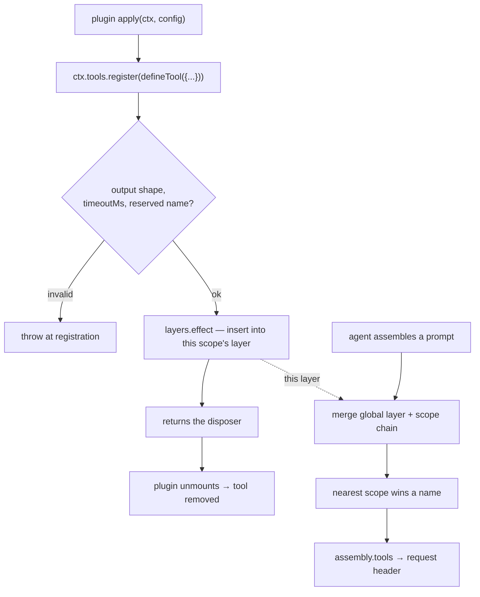

# Chapter 15 · The tool registry

**What you'll learn:** what a tool actually is in this codebase, how one gets registered, and why a tool returns a value rather than the text the model reads.

**Prerequisites:** [Chapter 2](02-just-enough-architecture.md) for effects.

---

## 1. The problem

A tool has to satisfy two audiences that want different things.

The **model** needs a name, a description, and a JSON Schema for its arguments — and needs them to be stable, because changing the tool list changes the request header and invalidates the provider's prefix cache ([Ch 10](10-building-the-request.md)).

The **system** needs something else entirely: a typed result it can validate, persist, re-render on replay, and show in a UI as something better than a wall of text. And it needs to know whether two tool calls may run at the same time.

A naive design has `execute` return a string and calls it a day. Then replay cannot re-render, the UI has nothing structured to draw, and concurrency is a guess.

## 2. Mental model

**New term — `ToolRuntime`.** The service at `ctx.tools` (`packages/core/tools/src/index.ts:780`), holding a scope-layered registry of tool definitions.

A tool definition separates three things that are usually conflated:

| Concern | Field | Audience |
|---|---|---|
| What the model may call | `name`, `description`, `parameters` | the model |
| What actually happens | `execute` → a canonical **value** | the system |
| What the model reads back | `output.render(args, value)` → content blocks | the model |

That split is the chapter's central idea. `execute` does not produce prose. It produces data, which is validated against a schema and then *projected* into content. Replay re-renders from the stored value; a UI presenter draws from the same value; the model reads the rendered blocks.



## 3. Registration is an effect

```ts
register(definition: ToolDefinition): () => void {
  const name = definition.name
  // ...output-shape checks, timeoutMs checks, reserved-name check...
  return this.layers.effect(
    this.ctx,
    layer => layer.tools.insert(name, definition),
    { label: 'tools.register()' },
  )
}
```
— `packages/core/tools/src/index.ts:1028-1053`

The returned function unregisters the tool. This is the repo-wide pattern from [Chapter 2](02-just-enough-architecture.md): a registration *is* an effect, so unloading the plugin that registered a tool removes it with no bookkeeping.

`this.layers` is a `ScopedLayers` — a global layer plus one per scope. That is what lets the same registry serve every agent while a preset-mounted tool is visible only to agents on that preset ([Ch 34](34-composition-in-full.md)). Chapter 19 covers the same layering for prompt sections.

Two hard refusals: duplicate names within one scope throw (`:719-721`), and the transport name `run_code` is reserved and can never be registered or shadowed (`:1045-1047`).

A concrete registration, from the shell tool:

```ts
ctx.tools.register(defineTool({ ... }))
```
— `packages/shell/tool-bash/src/index.ts:241`, inside the plugin's `apply()`

So the effect nests twice: `register()`'s layer insertion is one, and the plugin's `apply()` already runs inside the plugin's own effect scope. Unmount the plugin and both unwind.

## 4. The definition

```ts
interface ToolDefinition extends ToolSchema {
  output: ToolOutputDefinition
  execute(args: unknown, exec: ToolRunContext): Promise<unknown>
  finalizeContent?(exec, result): ContentBlock[] | undefined
  timeoutMs?: number
  isConcurrencySafe?(args: unknown): boolean
  presentCall?(args): ToolCallView | undefined
  presentResult?(args, result): ToolResultView | undefined
}
```
— `packages/core/tools/src/index.ts:214-280`

`ToolSchema` — `name`, `description`, `parameters` — is the part that reaches the model, and comes from the LLM package so the same type flows into the request.

**`output`** is mandatory: `{ schema, render(args, value), presentationMeta?(args, value) }` (`:204-211`). The schema validates what `execute` returned; `render` turns it into content blocks.

**`timeoutMs`** is cooperative and, notably, **never sent to the model** (`:247`). Enforcement lives in a separate plugin, `dsh-tool-call-timeout-policy`, which wraps dispatch ([Ch 16](16-the-execution-pipeline.md)).

**`isConcurrencySafe`** is how a tool opts into parallel execution ([Ch 17](17-scheduling-tool-calls.md)). Omitting it means exclusive.

**`finalizeContent`** is snapshotted at call creation and invoked exactly once per outcome, even for pipeline failures that bypass the normal post-execute path.

## 5. `defineTool`

Most first-party tools do not build a `ToolDefinition` by hand. `defineTool()` (`packages/core/tools/src/schema.ts:545-617`) compiles an author-facing schema DSL to JSON Schema and wraps the callbacks. The important wrap:

```ts
async execute(args: unknown, exec: ToolRunContext): Promise<JsonValue> {
  const violations = validate(args)
  if (violations.length > 0) throw new ToolArgsError(violations)
  return userExecute(args as InferArgs<S>, exec) as Promise<JsonValue>
}
```
— `schema.ts:585-589`

Arguments are validated against the compiled schema before the author's body runs, and a violation throws `ToolArgsError` carrying **every** violation rather than the first (`schema.ts:461-470`, code `INVALID_ARGS`).

The presenters are wrapped differently — **softly**:

```ts
// presentCall / presentResult / isConcurrencySafe: swallow invalid args → undefined / false
```
— `schema.ts:594-616`

The asymmetry is deliberate and worth internalizing. `execute` must be strict: running a tool with bad arguments could do damage. Presenters must be lenient: they run against *old logged arguments during session replay*, where a schema may since have changed. A presenter that threw would make historical sessions unopenable.

A raw `ToolDefinition` without `defineTool` is legal and gets **no** automatic validation — whatever [Chapter 17](17-scheduling-tool-calls.md)'s argument parsing produced reaches `execute` untouched, including a bare string.

**The raw path is not dead, and what uses it is instructive.** Two production sites register a hand-built definition, and both do so for the same reason: **their parameter schema is not known at compile time**, so the typed DSL cannot express it.

**MCP tools** (`packages/mcp/mcp-client/src/tools.ts:182`) are discovered from a remote server at runtime. Their schemas arrive over the wire, so `ctx.tools.register(definition)` takes a value assembled from the server's response.

**The subagent structured-output tool** (`packages/subagent/subagent-in-process-driver/src/structured.ts:74`) takes its schema from the *caller's* requested output shape. Notice what it then has to do by hand:

```ts
execute(args: unknown, exec: ToolRunContext): Promise<{ recorded: true }> {
  const violations = validateJsonSchemaValue(schema, args)
  // ToolArgsError → isError result with INVALID_ARGS: the model retries
  // within the same turn, exactly like a schema-validated defineTool call.
  if (violations.length > 0) throw new ToolArgsError(violations)
  ...
}
```

It re-implements `defineTool`'s validation step explicitly, and the comment names the behavior it is matching. **That is the obligation the raw path carries:** the framework performs no argument validation for you, so a raw definition must do it itself or receive whatever [Chapter 17](17-scheduling-tool-calls.md)'s `parseArguments` produced — including a bare string.

Every shipped tool with a *statically known* schema — `bash`, `str_replace_editor`, `glob`, `grep`, `skill`, `web_search` — uses `defineTool`.

## 6. Control decisions

| Decision | Condition | Location |
|---|---|---|
| Reject registration | malformed `output`, bad `timeoutMs` | `:1028-1044` |
| Reject reserved name | name is `run_code` | `:1045-1047` |
| Reject duplicate | name already in this layer | `:719-721` |
| Throw `ToolArgsError` | `defineTool` validation fails | `schema.ts:585-589` |
| Return `undefined` / `false` | a presenter or classifier gets invalid args | `schema.ts:594-616` |

## 7. Edge cases

**A tool can be unregistered while one of its calls is in flight.** `finalizeContent` is captured at call creation (`:1409`), so a tool that unregisters mid-call still gets *its own* finalizer applied to its own outcome — not whatever tool now occupies that name after a hot reload.

**The tool list is part of the request header.** Registering or unregistering mid-session changes `assembly.tools`, which changes the header, which logs a `change` header ([Ch 10](10-building-the-request.md)) and invalidates provider prefix caching. That is one reason the plan-mode prompt tells the model the catalog stays the same across modes: *"The tool catalog stays the same across modes for request-cache stability... those tools remain listed only to keep the request shape stable"* (`packages/bundle/base/cordis.patch.yml:315`). Plan mode restrains the model with instructions rather than by removing tools.

## 8. Configuration knobs

| Setting | Default | Effect |
|---|---|---|
| `mode` | `native` | `native` \| `ptc` \| `both`. In the web profile it reads `DSH_TOOLS_MODE`, unset keeping the default. Its own comment calls this a **temporary** seam pending per-session selection (`packages/bundle/web-app/cordis.patch.yml:31-37`) |
| `maxParallelSubCalls` | — | Concurrency for `run_code` sub-dispatches |

## 9. Interactions

- **[Ch 16](16-the-execution-pipeline.md)** — the four stages that run a registered definition.
- **[Ch 17](17-scheduling-tool-calls.md)** — reads `isConcurrencySafe` live, per call.
- **[Ch 19](19-prompt-assembly.md)** — the registry registers a tool provider with the prompt service, so `assembly.tools` comes from here.
- **[Ch 34](34-composition-in-full.md)** — scope layering is what makes a preset's tools per-agent.

## 10. Build it yourself

Minimal version:

```ts
const tools = new Map<string, ToolDefinition>()
function register(def: ToolDefinition): () => void {
  tools.set(def.name, def)
  return () => tools.delete(def.name)
}
```

What the real one adds:

| Addition | Why it exists |
|---|---|
| `ScopedLayers` instead of a Map | One registry must serve many agents with different tool sets |
| Effect-based registration | Unmounting a plugin must remove its tools with no bookkeeping |
| Mandatory `output` schema + `render` | Replay and UI need structured data, not prose |
| Strict `execute`, lenient presenters | Bad args must not run; old args must still render |
| Snapshotted `finalizeContent` | A hot reload mid-call must not apply the wrong tool's finalizer |
| Reserved `run_code` | The PTC transport name must never be shadowed |

---

## Key takeaways

- `ctx.tools` is a scope-layered registry; registration is an effect that returns its own undo.
- A definition separates the model-facing schema, the canonical value `execute` produces, and the rendered content the model reads.
- `defineTool` validates arguments strictly before `execute` and leniently for presenters, because presenters replay historical arguments.
- A raw definition gets no validation at all.
- The tool list is part of the request header, so registry changes have a cache cost — which is why plan mode restrains by instruction rather than by removing tools.

## Exercises

1. Why must `output.render` be a pure function of `(args, value)`? Construct a replay bug that a render reading external state would cause.
2. A tool is unregistered while a call is in flight, and a different tool registers the same name immediately after. Which `finalizeContent` runs, and which line decides?
3. Plan mode keeps mutation tools listed but forbids using them. Give one benefit and one risk of that choice versus removing them from the catalog.

**Next:** [Chapter 16 · The execution pipeline](16-the-execution-pipeline.md)
