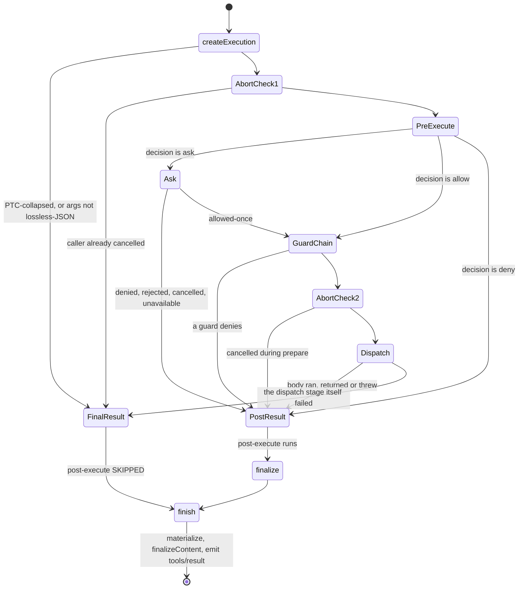

# Chapter 16 · The execution pipeline

**What you'll learn:** the four stages every tool call passes through, the exact rule deciding which results skip post-processing, and why a denial is treated more like a result than like an error.

**Prerequisites:** [Chapter 15](15-the-tool-registry.md).

---

## 1. The problem

"Call the function" is the easy part. Around it sit a set of concerns that all want to intervene at different moments:

- a policy may want to block a call, or ask a human first;
- a timeout wrapper wants to substitute its own signal for the call's duration;
- a spill policy wants to shrink an enormous result *after* it returns;
- the caller may cancel at any point — before the body runs, or halfway through it;
- and whatever happens, the model must receive a well-formed result, because a turn with a tool call and no matching result is not a valid conversation.

Bundling all of that into one `await tool.execute()` produces a function nobody can reason about. Splitting it into stages lets each concern attach where it belongs — and, crucially, lets the **scheduler** overlap the slow part across many calls while keeping the ordered parts ordered ([Ch 17](17-scheduling-tool-calls.md)).

## 2. Mental model

Four stages, exposed as one interface:

```ts
export interface ToolRuntimeScheduler {
  prepare(exec: ToolExecutionInput): Promise<ScheduledToolPreparation>
  dispatch(exec: ToolRunContext): Promise<ScheduledToolDispatch>
  finalize(exec: ToolRunContext, result: ToolExecutionResult): Promise<ToolExecutionResult>
  finish(exec: ToolRunContext, result: ToolExecutionResult): ToolExecutionResult
}
```
— `packages/core/tools/src/index.ts:444-453`

Reached through a symbol key, `TOOL_RUNTIME_SCHEDULER` (`:459`), wired to four private methods (`:789-794`).

| Stage | Nature | What it decides |
|---|---|---|
| `prepare` | ordered, may await | *May* this call run? |
| `dispatch` | overlappable | What did it return? |
| `finalize` | ordered, may await | Does anything want to change that? |
| `finish` | ordered, synchronous | Freeze, finalize content, notify |

The ordinary public `execute()` is not a second implementation — it chains these same four (`:1333-1353`). The scheduler just exposes the seams so a caller can interleave.

**New term — canonical result.** A result already validated and rendered through its tool's output contract. Re-normalizing one is a no-op, tracked in a `WeakMap` (`:1775-1781`), so a result passing through several wrappers is not re-validated each time.

## 3. Lifecycle



## 4. Stage 1 — `prepare`

`prepareExecution` (`:1454-1498`), in order:

**Create the execution** (`createExecution`, `:1355-1442`). Mints an opaque `ToolExecutionToken`, resolves `rootCallId`, and snapshots and freezes the arguments.

It also checks the **PTC collapse** first, before anything else observes the call. When the calling scope presents `mode: 'ptc'` and the call is model-direct rather than a `run_code` sub-dispatch, the call short-circuits to a `final-result` carrying an actionable "call it from inside `run_code`" message (`:1427-1434`). The comment says why this is first:

> "pre-execute listeners, approval `ask`, and guards must never observe — or worse, approve — a call that can only fail"
> — `:1364-1370`

Asking a human to approve a call that is structurally incapable of running would be worse than useless.

**Caller-cancellation check** (`:1461-1463`) → `final-result` with `toolAbortedBeforeDispatchResult()`.

**The `tools/pre-execute` waterfall** (`:1466-1469`). Default with no listeners: `{ kind: 'allow' }`. A listener returns one of:

```ts
type PreToolDecision =
  | { kind: 'allow' }
  | { kind: 'deny'; reason: string }
  | { kind: 'ask'; reason?: string }
```
— `:576-584`

**Approval**, if the decision was `ask` (`:1470-1472`) — [Chapter 18](18-approval-and-escalation.md).

**Post-ask cancellation race** (`:1474-1476`). If the caller cancelled *while* approval was pending **and** the approval channel itself reported cancellation, the call becomes a `post-result` — not a `final-result`. It still goes through post-execute.

**The guard chain** (`:1477-1490`), consulted only when the pre-execute decision was `allow`. A denial from either source becomes a `post-result` with a synthetic error.

**Second cancellation check** (`:1491-1493`), then `{ kind: 'dispatch', exec }` (`:1494`).

Anything thrown anywhere in the stage becomes a `final-result` (`:1495-1497`).

## 5. Stage 2 — `dispatch`

`dispatchScheduledExecution` (`:1560-1590`) runs the `tools/execute` **around-dispatch waterfall** (`:1564-1567`), whose innermost `next()` is the tool body.

`dispatchToolBody` (`:1523-1551`):

1. **Fuses signals.** A wrapper may have replaced `exec.signal` — a timeout policy substituting its own. `fuseToolSignals` (`:1880-1907`) re-fuses the caller's *original* signal underneath, so a wrapper cannot detach caller cancellation.
2. Re-checks abort, resolves the definition, sets `state.bodyInvoked = true`.
3. Calls `tool.execute(exec.arguments, exec)`.
4. `createSuccessResult` validates the returned value against `output.schema`, calls `output.render`, and for a top-level call also `output.presentationMeta`.

A wrapper that authors its *own* result has it re-validated through the same contract by `normalizeDispatchResult` (`:1817-1835`) — unless already marked canonical.

**Cancellation during dispatch** replaces a successful result with the aborted-after-start outcome (`:1509-1516`) — code `TOOL_ABORTED`, distinct from `ABORTED_BEFORE_DISPATCH`, because the body *did* run and may have had effects.

`dispatch` never returns `'dispatch'`. Its only outcomes are `post-result` (the normal case, body ran or threw) and `final-result` (the dispatch stage itself failed).

## 6. Stages 3 and 4 — `finalize` and `finish`

**`finalize`** (`:1600-1612`) runs the `tools/post-execute` waterfall (`postExecute`, `:1733-1772`), applies a cancellation override, then calls `finish`. A post-execute decision may:

- `block` → the result becomes `isError: true` with the decision's feedback as content; **tool-deferred context is discarded**, only the block decision's own `additionalContexts` survive (`:1729-1730`);
- `accept` with `value` → re-validated and re-rendered through `createSuccessResult`, and it **cannot** replace the value of an already-failed result (`TypeError`, `:1756-1758`);
- `accept` with `content` → content replaced only;
- both `content` and `value` → `TypeError` (`:1748-1750`).

**`finish`** (`:1622-1637`) is synchronous and does three things: materialize (freeze and lossless-JSON-check the presentation fields, `:1838-1853`), apply the **snapshotted** `finalizeContent` (`:1640-1645`), and `notifyResult` (`:1648-1667`) — which freezes `exec` itself (`:1651`) and emits `tools/result` with listener failures contained.

## 7. The `needsPost` rule

This is the part most worth getting exactly right, and it is decided entirely by *which stage produced the outcome*:

```ts
case 'dispatch': {
  ... dispatch(prepared.exec).then(outcome => {
    slots[index] = { ..., needsPost: outcome.kind === 'post-result' }
  })
}
case 'post-result':  slots[index] = { ..., needsPost: true };  break
case 'final-result': slots[index] = { ..., needsPost: false }; break
```
— `packages/core/agent-loop/src/tool-calls.ts:172-196`

and then:

```ts
const result = slot.needsPost
  ? await ctx.tools[TOOL_RUNTIME_SCHEDULER].finalize(slot.exec, slot.result)
  : ctx.tools[TOOL_RUNTIME_SCHEDULER].finish(slot.exec, slot.result)
```
— `tool-calls.ts:152-154`

| Outcome | Produced by | Post-execute? |
|---|---|---|
| PTC collapse, bad args | `createExecution` | **No** |
| Cancelled before prepare ran | `prepare` entry | **No** |
| Denied by pre-execute or a guard | `prepare` | **Yes** |
| Cancelled while approval pending | `prepare` | **Yes** |
| Body ran, returned or threw | `dispatch` | **Yes** |
| Dispatch stage itself failed | `dispatch` | **No** |

The interesting line is that **denials get post-execute**. A call the guard refused still passes through `tools/post-execute`, where a listener can inspect or rewrite the synthetic denial. That is deliberate — the JSDoc notes "Thrown tools still reach this waterfall as errors" (`:420-422`). Post-execute is about *results*, and a denial is a result.

What skips it are the cases where the call never became a real dispatch candidate: it was structurally impossible, or the pipeline itself broke.

## 8. Edge cases

**`value` never reaches the log.** `ToolExecutionSuccess.value` is "deliberately omitted from durable events" (`:551`). `materializeFinalResult` keeps it on the in-memory object returned to a caller, but the durable `tool/result` event records only the message, `error.info`, and `meta` ([Ch 5](05-the-append-only-log.md)).

**A wrapper cannot escape caller cancellation.** `ToolDispatchExecution` deliberately makes `signal` mutable so a wrapper can substitute one (`:384-387`), but `fuseToolSignals` re-fuses the original underneath every time.

**`run_code` is a second consumer of this same interface.** PTC mode re-implements the ordered-prepare / overlapping-dispatch / ordered-commit discipline for sub-calls (`ptc.ts:280-587`), using the same `TOOL_RUNTIME_SCHEDULER` symbol. So the scheduler seam has two independent users, which is why it is exported at all.

## 9. Configuration knobs

Mostly none — the pipeline's behavior comes from which plugins register on its waterfalls. In the shipped web profile:

| Plugin | Attaches to | Effect |
|---|---|---|
| `tool-call-timeout-policy` | `tools/execute` | Substitutes a timeout signal for the call's duration |
| `spill-policy` | `tools/post-execute` | Persists oversized plain-text results out of line ([Ch 26](26-measuring-and-spilling.md)) |
| `repeat-tool-reminder` | `agent/pre-step` | Not this pipeline, but observes the same chain |

> ✅ Verified: **no first-party always-on plugin registers a `tools/pre-execute` listener that returns `ask`.** Grepping the whole tree for a non-test `{ kind: 'ask' }` finds only `packages/hooks/hooks-claude-code/src/index.ts:243` — and the hook bridges are not mounted ([Ch 2](02-just-enough-architecture.md)). The generic ask seam exists, is fully implemented, and is dormant. What shipped tools actually do is [Chapter 18](18-approval-and-escalation.md).

## 10. Build it yourself

Minimal version:

```ts
async function execute(input: ToolExecutionInput): Promise<ToolExecutionResult> {
  const tool = tools.get(input.name)
  if (!tool) return toolErrorResult(new Error(`no tool "${input.name}"`))
  try {
    const value = await tool.execute(input.arguments, input as ToolRunContext)
    return { isError: false, value, content: tool.output.render(input.arguments, value) }
  } catch (error) {
    return toolErrorResult(error)
  }
}
```

What the real one adds:

| Addition | Why it exists |
|---|---|
| Four separable stages | The scheduler must overlap dispatch while keeping policy and commits ordered |
| Collapse check before any listener | Never ask a human to approve a call that cannot run |
| Two cancellation checks in `prepare` | Cancellation can land before or during the policy await |
| `ABORTED` vs `ABORTED_BEFORE_DISPATCH` | Whether the body ran changes whether a retry is safe |
| Signal re-fusing | A wrapper must not be able to detach caller cancellation |
| Canonical-result marking | A result crossing several wrappers must not be re-validated each time |
| `needsPost` by producing stage | Denials deserve post-processing; impossible calls do not |
| Snapshotted `finalizeContent` | Applies even to outcomes that bypass post-execute |
| Contained `tools/result` listeners | A UI listener must not be able to fail a tool call |

---

## Key takeaways

- Four stages: `prepare` (may it run), `dispatch` (what happened), `finalize` (does anything want to change it), `finish` (freeze and notify).
- The PTC collapse is checked before any listener or approval sees the call.
- `ABORTED_BEFORE_DISPATCH` and `ABORTED` differ by whether the body ran — which is exactly what a caller needs to decide about retrying.
- `needsPost` is determined by which stage produced the result; denials get post-execute, structurally-impossible calls do not.
- A tool's canonical `value` never reaches the durable log; only the rendered content does.
- The generic ask/deny seam is fully implemented and has no always-on producer in the shipped profile.

## Exercises

1. A guard denies a call and a `tools/post-execute` listener `accept`s it with a new `value`. What happens, and which line stops it?
2. Trace the two cancellation checks in `prepare`. Construct a timing where the first passes and the second fails, and say what result the model sees.
3. `run_code` re-implements the ordered/overlapping discipline rather than calling `execute()` per sub-call. Give two things it would lose by looping over `execute()`.

**Next:** [Chapter 17 · Scheduling tool calls](17-scheduling-tool-calls.md)
