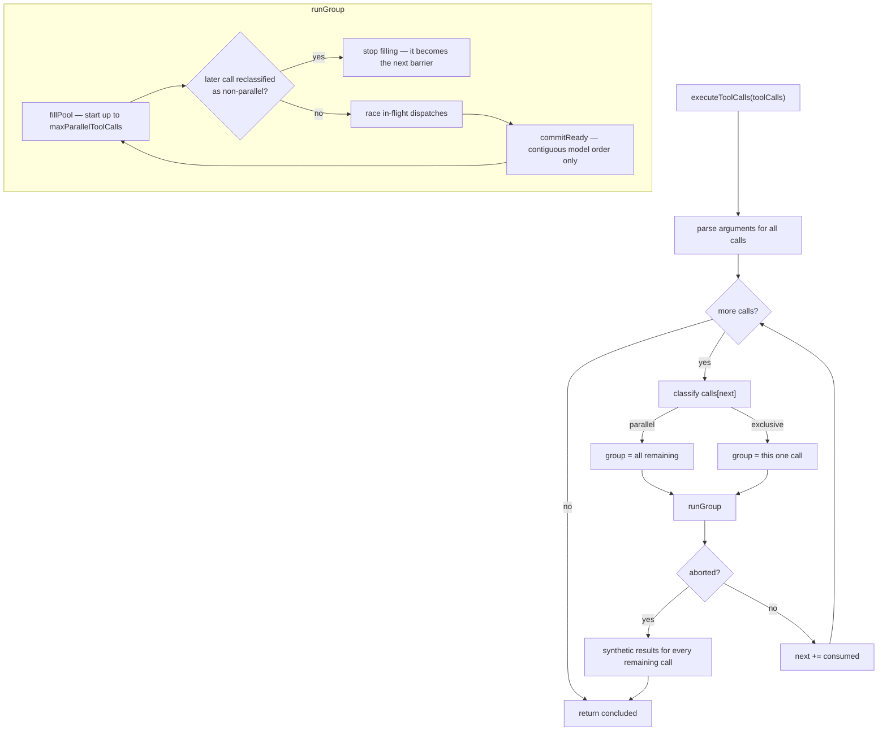

# Chapter 17 · Scheduling a step's tool calls

**What you'll learn:** how one assistant step's tool calls are run — some in parallel, some as barriers — while the log they produce stays in strict model order.

**Prerequisites:** [Chapter 16](16-the-execution-pipeline.md), [Chapter 9](09-the-turn-and-step-loops.md).

---

## 1. The problem

A model emits five tool calls in one response: three file reads, a shell command, another read. Running them strictly in sequence wastes most of the wall-clock time — the reads do not conflict. Running them all at once is unsafe: the shell command might modify a file another call is reading.

So concurrency has to be per-call, and decided by the tool. But that creates a second problem. Whatever order they *finish* in, the results must reach the log in **model order** — the order the model asked for them. A model that requested A, B, C and reads back C, A, B in its history is being shown a conversation that did not happen, and on the next turn it will reason about a sequence that never occurred.

And then cancellation. If the user stops the agent after two of five calls have started, the log still needs a result for all five — because a `tool/call` with no matching `tool/result` is an unbalanced conversation that a provider will reject on the next request.

## 2. Mental model

Three rules, and everything follows:

1. **Classify at the boundary.** Walk the calls in model order. The first call's mode decides the group: if it is parallel-safe, the group is *all remaining calls*; otherwise the group is *just that one call* — an exclusive barrier.
2. **Dispatch may overlap; commits may not.** Bodies run concurrently up to a cap. Results commit only in contiguous model order — a result that finishes early waits for its predecessors.
3. **Every model call gets a result.** Including ones cancellation prevented from ever starting, which receive a synthetic error.

**New term — barrier.** An exclusive call that runs alone. Everything before it has committed; nothing after it starts until it finishes.

## 3. Lifecycle



## 4. Step-by-step walkthrough

### Parsing arguments

```ts
function parseArguments(raw: string): unknown {
  try {
    return raw ? JSON.parse(raw) : {}
  } catch {
    return raw
  }
}
```
— `packages/core/agent-loop/src/tool-calls.ts:105-111`

Empty string becomes `{}`. Valid JSON is parsed — to *any* JSON value, not necessarily an object. **Invalid JSON returns the raw string unchanged.**

That last branch looks like a bug and is not. Malformed model output must not crash the scheduler; it must become a tool result the model can read and correct. The string flows through to `execute`, where `defineTool`'s validation rejects it with a `ToolArgsError` ([Ch 15](15-the-tool-registry.md)) — which becomes an ordinary `isError` result that still goes through post-execute, so the model sees `Error: invalid arguments: ...` and can retry **within the same turn**.

### Grouping

```ts
const first = planned[next]!
const mode = ctx.tools.executionMode(first.exec).kind
const group = mode === 'parallel' ? planned.slice(next) : [first]
```
— `tool-calls.ts:87-90`

`executionMode` is synchronous, side-effect-free, and **fail-closed** ([Ch 15](15-the-tool-registry.md)): no declaration, a throwing classifier, or any non-`true` return all yield `exclusive` (`packages/core/tools/src/index.ts:1267-1276`).

The comment on the grouping line notes it commits before classifying again, "so registry changes affect unstarted calls."

### Filling the pool

```ts
while (!aborted && nextToStart < group.length && inFlight.size < maxParallelToolCalls) {
  const nextCall = group[nextToStart]!
  if (nextToStart > 0 && mode === 'parallel'
    && ctx.tools.executionMode(nextCall.exec).kind !== 'parallel') break
  await startCall(nextToStart)
  nextToStart++
  throwSchedulerFailure()
  await commitReady()
  throwSchedulerFailure()
  if (signal.aborted) aborted = true
}
```
— `tool-calls.ts:199-214`

Two details carry weight.

**Modes are re-read live.** A call classified parallel when the group formed may classify differently by the time it is about to start — a tool unregistered, an agent's tool set narrowed. The pool stops filling at that point, and that call becomes the caller's next barrier. A batch that began as all-parallel can split mid-flight.

**The cap is read per group.**

```ts
const { maxParallelToolCalls } = ctx.agentLoop.config
```
— `tool-calls.ts:132`

Destructured once at group start, from a config property that is a **read-through getter** (`index.ts:389-391`). A settings change caps the *next* group without disturbing one in flight — deliberate, and the comment says so ([Ch 10](10-building-the-request.md) shows the same discipline for headers).

### Starting one call

```ts
callSeqs[index] = appendToolCall(session, turn, step, call.block)
started++
const prepared = await ctx.tools[TOOL_RUNTIME_SCHEDULER].prepare(call.exec)
```
— `tool-calls.ts:165-170`

The `tool/call` event is appended **before** `prepare` — so the log records that a call was attempted even if policy denies it. Its `seq` is kept so the eventual result can cite it.

`prepare` is awaited *in the pool-filling loop*, which means the ordered policy stage runs in model order. Only `dispatch` overlaps.

### Committing in order

```ts
const commitReady = async (): Promise<void> => {
  while (committed < group.length) {
    const slot = slots[committed]
    if (slot === undefined) break
    const call = group[committed]
    const result = slot.needsPost
      ? await ctx.tools[TOOL_RUNTIME_SCHEDULER].finalize(slot.exec, slot.result)
      : ctx.tools[TOOL_RUNTIME_SCHEDULER].finish(slot.exec, slot.result)
    appendToolResult(session, turn, step, call!.block, result, callSeqs[committed]!)
    for (const context of result.additionalContexts ?? []) acceptContext(context)
    concluded ||= result.concludesTurn === true
    committed++
  }
}
```
— `tool-calls.ts:147-161`

`if (slot === undefined) break` is the ordering rule in one line: advance only across **contiguous** settled slots. If call 3 finishes before call 2, its slot is filled but `committed` stays at 2 until 2 lands.

Note what else is ordered by consequence: `finalize`/`finish` run here, so post-execute runs in model order too — not in completion order. And `additionalContexts` are accepted in model order, so injected context from parallel tools still reaches the next step deterministically.

### Cancellation

```ts
if (aborted) {
  for (const call of group.slice(started)) appendSkippedToolCall(session, turn, step, call.block)
  return { consumed: group.length, aborted: true, concluded }
}
```
— `tool-calls.ts:238-243`

and at the top level:

```ts
if (outcome.aborted) {
  for (const call of planned.slice(next)) appendSkippedToolCall(session, turn, step, call.block)
  return { concluded }
}
```
— `tool-calls.ts:96-99`

Every call the scheduler never started gets a synthetic `tool/call` + `tool/result` pair:

```ts
appendToolResult(session, turn, step, block, {
  content: [{ type: 'text', text: 'Error: tool call aborted before dispatch' }],
  isError: true,
  error: { message: 'tool call aborted before dispatch',
           info: { name: 'AbortError', code: TOOL_ABORTED_BEFORE_DISPATCH } },
}, callSeq)
```
— `tool-calls.ts:250-260`

The module doc states the purpose: "so replay stays valid" (`:8`). A cancelled turn still produces a conversation a provider will accept.

Started calls are **drained**, not abandoned — the loop awaits everything in flight before recording the skipped ones, so results commit in order and then the tail is filled in.

### Scheduler failure

```ts
} catch (error: unknown) {
  schedulerFailure ??= { error }
  await Promise.allSettled(inFlight.values())
  throw schedulerFailure.error
}
```
— `tool-calls.ts:232-236`

An internal failure stops new dispatches, waits for started ones to settle, and rethrows the **first** failure — **without fabricating results**. The distinction from cancellation is deliberate: cancellation is an expected outcome with a defined meaning per call, so synthetic results are correct. A scheduler bug is not, and inventing results would hide it.

## 5. Control decisions

| Decision | Condition | Location |
|---|---|---|
| Group is all remaining | first call classifies `parallel` | `:90` |
| Group is one call | anything else | `:90` |
| Stop filling | a later call reclassifies non-parallel | `:204-205` |
| Stop filling | pool at `maxParallelToolCalls` | `:200` |
| Advance commit | next slot in model order has settled | `:147-150` |
| Choose `finalize` vs `finish` | `slot.needsPost` | `:152-154` |
| Mark turn concluded | any committed result had `concludesTurn` | `:158` |
| Synthesize skipped results | aborted | `:97`, `:241` |
| Rethrow without results | internal scheduler failure | `:232-236` |

## 6. Edge cases and failure modes

**`concludesTurn` is a single-result veto.** `concluded ||= result.concludesTurn === true` — one result ends the turn regardless of what its siblings did. It is typed `never` on failures ([Ch 3](03-core-data-structures.md)), so a failed call can never stop a turn. The real producer is the subagent driver's structured-output tool, which concludes once it has staged the model's answer.

**The unreachable check.**

```ts
if (committed !== started) throw new Error('tool-call scheduler: uncommitted settled calls')
```
— `:245`

Marked `/* v8 ignore next */` as unreachable — a non-aborted group commits every started call. It is a guard against a future edit breaking the invariant, not a live path.

**Order of events in the log.** For a parallel group, `tool/call` events appear in *start* order (which is model order, since the pool fills in order) and `tool/result` events in *model* order. They interleave, which can look odd when reading a raw log — but every result cites its call's `seq` via `sourceEventSeqs`, so the pairing is explicit rather than positional.

**`additionalContexts` do not go into the result.** They are handed to the caller's acceptor, which splices them into the `next-step` inbox queue (`agent.ts:434`). So a tool can inject a message the model sees *next*, separate from its own result content ([Ch 12](12-the-inbox.md)).

## 7. Configuration knobs

| Setting | Default | Effect |
|---|---|---|
| `maxParallelToolCalls` | `10` | Max in-flight parallel-safe calls per group. `1` makes everything serial. Validated as an integer ≥ 1; a rejected value keeps the running scheduler on its last good cap |

— `packages/core/agent-loop/src/constants.ts:6`, schema `index.ts:306-308`

It is **deployment-wide**, not per agent or per tool — one of the engine's real limitations ([Ch 35](35-limits-and-fragile-areas.md)).

Per-tool, the lever is `isConcurrencySafe`. Real examples:

| Tool | Declaration | Effect |
|---|---|---|
| `read` (`tool-fs`) | `isConcurrencySafe: () => true` | parallel |
| `web_search` | `isConcurrencySafe: () => true` | parallel |
| `bash` / `pwsh` | none | exclusive |
| `str_replace_editor` | none | exclusive — **even for its read-only `view` command** |

That last row is worth noticing: two first-party file-reading tools make opposite choices. `tool-fs`'s dedicated `read` declares itself safe; `str_replace_editor` does not classify per-command, so its `view` is serialized along with its mutations.

## 8. Interactions

- **[Ch 16](16-the-execution-pipeline.md)** — the four stages this orchestrates.
- **[Ch 9](09-the-turn-and-step-loops.md)** — consumes `{ concluded }` to decide the turn's ending.
- **[Ch 12](12-the-inbox.md)** — receives `additionalContexts`.
- **[Ch 5](05-the-append-only-log.md)** — every call and result is appended here, with provenance.
- **[Ch 13](13-phases-cancellation-quiescence.md)** — supplies the shared step signal.

## 9. Build it yourself

Minimal version — the sequential loop from [Chapter 4](04-the-engine-in-100-lines.md):

```ts
for (const call of toolCalls) {
  const callSeq = session.append('tool/call', {...}).seq
  const result = await ctx.tools.execute({...})
  session.append('tool/result', {...}, { surfaceOp: 'append', sourceEventSeqs: [callSeq] })
}
```

Correct, and often fast enough. What the real one adds:

| Addition | Why it exists |
|---|---|
| Per-call classification | A shell command and a file read have different safety properties |
| Barrier grouping | An exclusive call must see the effects of everything before it |
| Bounded pool | Unbounded parallelism exhausts file handles and provider limits |
| Contiguous ordered commit | Completion order is not model order; history must be model order |
| Live reclassification | The registry can change mid-group |
| Per-group cap read | A settings change must not disturb a batch in flight |
| Synthetic results on abort | An unbalanced call/result pair breaks the next request |
| Drain-don't-abandon | Started work must settle before the turn unwinds |
| No synthetic results on scheduler failure | Inventing results would hide a bug |

---

## Key takeaways

- The first call in a group decides the grouping: parallel-safe takes all remaining, anything else forms a one-call barrier.
- Dispatch overlaps; `prepare`, commits, post-execute, and context acceptance all stay in model order.
- Modes are re-read before each start, so a batch can split into a barrier mid-flight.
- Malformed model JSON becomes a retryable tool error, never a crash.
- Cancellation synthesizes results for unstarted calls so replay stays valid; a scheduler failure deliberately does not.
- `maxParallelToolCalls` is deployment-wide and read fresh per group.

## Exercises

1. A model emits `[read, read, bash, read]`. Walk through the grouping, saying how many groups form and which calls are in each. Now reverse it to `[bash, read, read, read]`.
2. Call 2 of a 4-call parallel group throws inside its body while calls 1, 3, 4 succeed. Give the exact sequence of `tool/result` events appended.
3. `str_replace_editor` does not declare `isConcurrencySafe` even for `view`. Write the classifier that would make `view` parallel, then give one reason the authors might have chosen not to.

**Next:** [Chapter 18 · Approval and sandbox escalation](18-approval-and-escalation.md)
