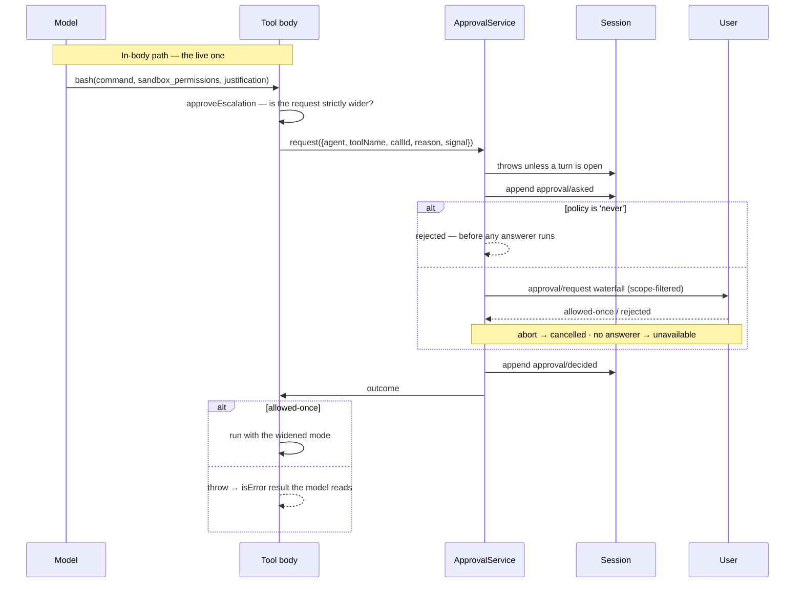

# Chapter 18 · Approval and sandbox escalation

**What you'll learn:** the two independent ways a tool call can be gated on a human's decision — one built into the pipeline and dormant, one built into tools and live.

**Prerequisites:** [Chapter 16](16-the-execution-pipeline.md).

---

## 1. The problem

Some tool calls should not happen without a person saying yes. Writing outside the workspace, running a shell command with wider permissions than the session normally allows — these need a human in the loop.

Three things make this harder than a confirm dialog.

**The decision must be recorded.** "Did the user approve this?" is a question someone will ask later, about a session that has since been resumed on another machine. So the ask and the answer both belong in the log.

**The model has to be able to *request* elevation coherently.** A tool that simply fails with "permission denied" teaches the model nothing. It needs a way to say "I know this needs more access, here is why" — and that request has to be part of the call, not a side channel.

**Refusal must not be bypassable by registration order.** If a deployment sets policy to *never ask*, no plugin registered in the right position should be able to turn that into a grant.

## 2. Mental model

There are **two separate mechanisms**, and conflating them is the main hazard in this area.

| | Pipeline seam | In-body escalation |
|---|---|---|
| Where | `tools/pre-execute` → `ask` → `ApprovalService` | inside a tool's own `execute` |
| Who triggers | a policy listener | the *model*, via tool arguments |
| Asks about | "may this call run at all?" | "may this call run with **wider** permissions?" |
| Denial becomes | a synthetic `post-result` | a thrown error → ordinary `isError` result |
| Live in the shipped profile? | **No producer** | **Yes** |

They share one thing: the underlying `ApprovalService`. Everything else differs.

## 3. Lifecycle



## 4. The pipeline seam

A `tools/pre-execute` listener returns one of three decisions:

```ts
type PreToolDecision =
  | { kind: 'allow' }
  | { kind: 'deny'; reason: string }
  | { kind: 'ask'; reason?: string }
```
— `packages/core/tools/src/index.ts:576-584`

An `ask` is resolved by `serviceAsk` (`:1680-1720`), called from inside `prepare` (`:1470-1472`) — so **approval happens within `prepare`**, not as a separate stage and not inside `dispatch`. That placement matters for the scheduler: `prepare` is the ordered stage ([Ch 17](17-scheduling-tool-calls.md)), so approvals for a parallel group are requested in model order rather than in a race.

Two degradations are deterministic:

```ts
const approval = this.ctx.get('approval')
if (approval === undefined) return { decision: { kind: 'deny', reason: `... requires approval (not yet supported)` }, ... }
if (exec.agent === undefined) return { decision: { kind: 'deny', reason: `... no agent to route it through` }, ... }
```
— `:1680-1720`

No approval service composed → `ask` becomes `deny`. No agent on the execution → `deny`, because there is no session to route the prompt through. **An unanswerable question is refused, never silently allowed.**

The four outcomes map as: `allowed-once` → allow; `rejected`, `cancelled`, `unavailable` → deny with distinct reasons, and `cancelled` additionally sets `approvalCancelled`, which is what makes the call a `post-result` rather than a `final-result` ([Ch 16](16-the-execution-pipeline.md)).

### It has no producer

> ✅ **Verified.** Grepping the whole tree for a non-test `{ kind: 'ask' }` `PreToolDecision` finds exactly one source: `packages/hooks/hooks-claude-code/src/index.ts:243`, a compatibility bridge translating an external hook protocol's `decision: 'ask'` into this seam. The hook bridges are mounted in no composition layer ([Ch 2](02-just-enough-architecture.md)).

So the seam is complete, tested, and inert in the shipped product. It is what a deployment would use to add a policy layer; it is not how the shipped tools gate themselves.

## 5. The approval service

`ApprovalService.request()` (`packages/interaction/user-approval/src/index.ts:222-241`):

**It refuses outside a turn.** `hasOpenTurn` (`:92-99`, checked at `:224-230`) throws if the session has no open turn. Approval audit events must live inside a turn boundary — otherwise a reader folding the log finds an `approval/asked` belonging to nothing.

**It logs both halves.** `approval/asked` before deciding (`:232-237`), `approval/decided` with the same id after (`:239`). Both are durable and **log-only** — they never enter the model transcript ([Ch 6](06-the-surface.md): they are not surface-eligible types). The model does not see that a human was asked; it sees only the result.

**`never` is not delegatable:**

```ts
if (policy === 'never') return 'rejected'
```
— `:277`, inside `decide()` (`:269-309`)

This is checked **inline, before the `approval/request` waterfall runs at all**. The source explains the choice: a `prepend: true` listener could otherwise claim the request ahead of a policy check registered as an ordinary listener. Making it a plain early return means no registration order can leak a grant. That is a security-relevant design decision, and the right one — the same reasoning as the invariant's `prepend` in [Chapter 11](11-the-reconstruction-invariant.md), applied in the opposite direction.

Otherwise the request goes to the `approval/request` waterfall, scope-filtered to the agent, with `'unavailable'` as the default when nothing answers, raced against the request signal so an abort yields `'cancelled'`.

## 6. In-body escalation — what actually ships

The live path is inside tools. Both sandbox-enforcing families call one shared helper:

```ts
// approveEscalation(request, approval)
// 1. is the requested mode strictly wider than the call's effective mode?
//    WIDER_MODES: read-only → workspace-write | danger-full-access
//                 workspace-write → danger-full-access
//    if not, THROW — never ask
// 2. throw if no approver, or no agent
// 3. approval.approver.request({ agent, toolName, callId,
//      reason: `escalate sandbox to <mode>: <justification>`, signal })
// 4. 'allowed-once' → return the granted mode; every other outcome throws
```
— `packages/sandbox/sandbox/src/escalation.ts:157-189`

Step 1 is the interesting one: a request that is not *strictly widening* throws rather than prompting. Asking a human to approve a no-op, or a narrowing, would be noise that trains people to click yes.

### How the model requests it

Not through any registry mechanism — through **arguments on the same tool call**:

```ts
async execute(args: BashToolArgs, exec) {
  validateBashArgs(args)
  const standingPolicy = resolveSandboxPolicy(exec)
  const approvedMode = args.sandbox_permissions !== undefined && args.justification !== undefined
    ? await approveBashEscalation(args.sandbox_permissions, args.justification, exec, standingPolicy)
    : undefined
  const policy = approvedMode === undefined ? standingPolicy : { ...standingPolicy, mode: approvedMode }
  ...
}
```
— `packages/shell/tool-bash/src/index.ts:329-338`

The `sandbox_permissions` and `justification` parameters are **only advertised when a confining executor is mounted** (`escalationModes.length > 0`, `:192`; schema at `:258-268`). If nothing confines the shell, the model is never told the parameters exist — the tool description does not mention a capability that would be meaningless.

This is a neat piece of design: the escalation request is *part of the call*, so it is logged in the `tool/call` event's arguments like everything else, and the justification the model gave is durable.

### Denial becomes an ordinary result

`approveEscalation` throws a plain `Error` — `` `the user rejected escalating this command to "${mode}"` `` — which propagates out of `execute`, is caught by `dispatchToolBody` (`packages/core/tools/src/index.ts:1545-1546`), and becomes `toolErrorResult` (`:1861-1869`):

```
{ content: [{ type: 'text', text: 'Error: the user rejected escalating this command to "danger-full-access"' }],
  isError: true,
  error: { message: ..., info: ... } }
```

So from the model's point of view, a refused escalation is just a failed tool call with a clear explanation — and it can react within the same turn.

## 7. What the model is told up front

The approval and sandbox policies are not only enforced; they are **stated in the prompt**, as runtime-context sections ([Ch 21](21-runtime-context-injection.md)). From the recorded session (`snapshots/session/text-turn/session.jsonl:10`):

```
Current DSH file policy: danger-full-access. The DSH file sandbox does not restrict
file modifications by available operations.

Approval prompts are disabled in this session: actions that require approval are
rejected automatically — do not request sandbox escalation (do not set `sandbox_permissions`).
```

Two sections, `sandbox:policy` (order 110) and `approval:policy` (order 115), registered by the sandbox-policy and user-approval plugins respectively (`packages/sandbox/sandbox-policy/src/index.ts:140-151`, `packages/interaction/user-approval/src/index.ts:169-181`).

Note what the second one does under `policy: 'never'`: it tells the model **not to ask**, because asking would be auto-rejected and would waste a turn. The enforcement and the instruction are kept consistent, which is why both live in the same plugin as the policy itself.

## 8. Control decisions

| Decision | Condition | Location |
|---|---|---|
| `ask` → `deny` | no approval service composed | `tools/index.ts:1680-1720` |
| `ask` → `deny` | no agent on the execution | same |
| Throw before asking | the session has no open turn | `user-approval:224-230` |
| `rejected` without consulting anyone | policy is `never` | `user-approval:277` |
| `unavailable` | the waterfall's default — nothing answered | `user-approval:269-309` |
| `cancelled` | the request signal aborted | same |
| Throw, don't ask | requested mode is not strictly wider | `escalation.ts:157-189` |
| Return the widened mode | outcome is `allowed-once` | `escalation.ts:157-189` |

## 9. Configuration knobs

| Setting | Default | Effect |
|---|---|---|
| approval `policy` | `ask` | Becomes `never` iff `DSH_PERMISSION_MODE === 'danger-full-access'` — a `!!js` expression at `packages/bundle/base/cordis.patch.yml:233` |
| sandbox `mode` | `workspace-write` | From `DSH_PERMISSION_MODE` (`base:217`) |
| `workspaceRoot` | `process.cwd()` | `base:218` |
| presets | `read-only` / `workspace-write` / `danger-full-access` | Named sandbox+approval pairs (`base:238-247`) |

The presets are the user-facing form: picking one sets both halves coherently, so a session cannot end up with `danger-full-access` file access and `ask` prompts that never fire, or the reverse.

## 10. Interactions

- **[Ch 16](16-the-execution-pipeline.md)** — `ask` is resolved inside `prepare`; `approvalCancelled` decides `post-result` vs `final-result`.
- **[Ch 17](17-scheduling-tool-calls.md)** — because approval is in `prepare`, prompts for a parallel group are ordered.
- **[Ch 21](21-runtime-context-injection.md)** — the two policy sections reach the model as a runtime-context snapshot.
- **[Ch 5](05-the-append-only-log.md)** — `approval/asked` and `approval/decided` are durable and log-only.

## 11. Build it yourself

Minimal version:

```ts
if (needsApproval(call)) {
  const ok = await ui.confirm(`Allow ${call.name}?`)
  if (!ok) return toolErrorResult(new Error('denied'))
}
```

What the real one adds:

| Addition | Why it exists |
|---|---|
| Both halves logged with a shared id | "Did someone approve this?" is asked later, about a resumed session |
| Refusal outside an open turn | An audit event belonging to no turn is unreadable |
| `never` checked inline, not as a listener | No registration order may leak a grant |
| Deterministic degradation to `deny` | An unanswerable question must never become an allow |
| Strictly-wider check before prompting | Prompting for a no-op trains people to click yes |
| Escalation as tool arguments | The request and its justification become durable log content |
| Conditional schema advertisement | Don't tell the model about a capability that cannot apply |
| Policy stated in the prompt | Enforcement and instruction must agree, or the model wastes turns |

---

## Key takeaways

- Two independent mechanisms share one service; only the in-body one is live in the shipped profile.
- The generic `tools/pre-execute` → `ask` seam is complete and has no always-on producer.
- Approval resolves inside `prepare`, so prompts stay in model order across a parallel group.
- Both the ask and the decision are logged, and never shown to the model.
- `policy: 'never'` is enforced inline so no listener ordering can turn it into a grant.
- The model requests elevation through arguments on the same call, and a refusal comes back as an ordinary readable tool error.
- Those parameters are only advertised when something actually confines the tool.

## Exercises

1. The `never` check is an early return rather than a prepended listener. Write the listener that would defeat the alternative design, and say whether it would look malicious.
2. `approveEscalation` throws when the requested mode is not strictly wider. Give a concrete argument pair that hits this, and say what the model sees.
3. `approval/asked` and `approval/decided` are log-only. Design a UI feature that needs both, and say why putting them on the surface instead would corrupt the next request.

**Next:** [Chapter 19 · Prompt assembly](19-prompt-assembly.md)
