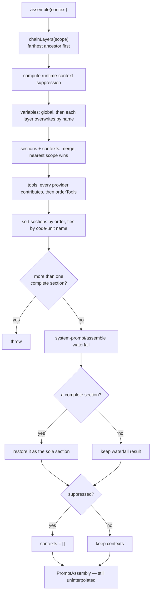

# Chapter 19 · Prompt assembly

**What you'll learn:** how the system prompt and tool list are composed from contributions scattered across dozens of plugins, and how one agent's prompt differs from another's without either knowing about the other.

**Prerequisites:** [Chapter 15](15-the-tool-registry.md) for scope layering.

---

## 1. The problem

The system prompt is not written anywhere. It is assembled, on every step, from fragments contributed by whichever plugins happen to be mounted: a harness identity line, a deployment persona, a paragraph per tool explaining when to use it, a plan-mode block when plan mode is on.

Four requirements pull against each other.

**Order must be stable and meaningful.** The identity line goes first; tool guidance goes in the middle; structured-output instructions go last. Contributors do not know about each other, so they cannot agree on order by convention.

**Different agents need different prompts.** Two sessions in the same process may run different presets with different tools and different personas. One global prompt cannot serve both.

**The result must be deterministic.** Same contributions, same prompt — byte for byte, on every machine. Otherwise the provider's prefix cache misses and every request costs more ([Ch 10](10-building-the-request.md)).

**Some values are only known at assembly time.** The model name, the working directory. A fragment cannot hardcode them.

## 2. Mental model

**New term — `PromptAssembly`.** The resolved, still-uninterpolated result:

```ts
export interface PromptAssembly {
  sections: AssembledSection[]      // { name, text } — become the system prompt
  contexts: AssembledContext[]      // { name, text } — become the runtime-context snapshot
  tools: ToolSchema[]               // the tool list for this exact assembly
  variables: Record<string, string | undefined>
}
```
— `packages/core/system-prompt/src/index.ts:114-119`

Two things to notice immediately.

**`sections` and `contexts` are different destinations.** Sections become the system prompt. Contexts become a *message* — the runtime-context snapshot ([Ch 21](21-runtime-context-injection.md)). A contributor chooses which by calling `section()` or `context()`, and the choice is about volatility: the system prompt should stay byte-stable for caching, so anything that changes during a session goes in a context instead.

**Text is uninterpolated here.** `{{model}}` is still literally `{{model}}` in `assembly.sections`; substitution happens at render time ([Ch 20](20-variable-interpolation.md)).

## 3. The four registries

| Method | Registers | Collision behavior |
|---|---|---|
| `section(s)` | `{ name, order, text, complete? }` | **shadowed by name** — nearest scope wins |
| `context(c)` | `{ name, order, text }` | shadowed by name |
| `tools(provider)` | `(ctx) => ToolProviderResult` | **anonymous — all contribute** |
| `variable(name, fn)` | `(ctx) => string \| undefined` | overwritten by name |

— `index.ts:432-441`, `:467-476`, `:499-505`, `:515-524`

All four return the Cordis effect disposer, and registering or disposing fires `system-prompt/change` (`:37`, `:398-401`).

The tools asymmetry is deliberate: sections shadow because two plugins claiming `deployment:persona` mean one should win, while tool providers *accumulate* because every mounted tool package contributes its own schemas. Uniqueness for tools is enforced on the tool *names*, later, at ordering time.

### Order is centrally assigned

```ts
SECTION_ORDERS = { HARNESS_IDENTITY: -1000, ..., TOOL_BASH: 1000, ..., STRUCTURED_OUTPUT: 9900 }
CONTEXT_ORDERS = { SANDBOX_POLICY: 110, APPROVAL_POLICY: 115, SUBAGENT_DELEGATION: 120 }
```
— `index.ts:121-152`, `:157-161`

Contributors do not pick numbers freely; they look theirs up (`getSectionOrder`, `:448-459`). A test asserts every declared order is unique and at least ten apart (`tests/system-prompt.spec.ts:33-49`) — the gap leaves room to insert something between two existing sections without renumbering.

Ties break by code-unit name comparison (`compareNames`, `:222-224`), which is locale-independent — so the same contributions produce the same prompt on a machine in Istanbul as in Seattle. That is a real bug class avoided: locale-aware comparison would reorder sections and silently break prefix caching.



## 4. Assembly, step by step

`SystemPrompt.assemble(context)` — `index.ts:536-611`.

**① Resolve the scope chain.** `chainLayers(scope)` returns overlays **farthest ancestor first, exact scope last** (`packages/core/scope/src/store.ts:192-199`).

**② Compute suppression.** Whether any layer suppresses runtime context (`:539-540`).

**③ Variables.** Global providers evaluate first, then each scope layer's providers overwrite by name (`:542-551`) — "farthest first, so the nearest scope wins a name."

**④ Sections and contexts.** `merge(scope, layer => layer.sections)` builds a map the same way (`:553-554`, `store.ts:208-217`). This is **literal replacement by name**, not textual merging: a scoped `deployment:persona` *replaces* the global one for that scope (`tests/scoped.spec.ts:33-44` asserts exactly this).

**⑤ Tools.** Every global provider plus every scope-chain provider is called and their schemas concatenated (`:556-572`). Then `orderTools` (`:205-219`) applies a configured order with a `TOOL_ORDER_REST` marker:

> with `toolOrder: ['todo_write', TOOL_ORDER_REST, 'bash']` and registered tools `['bash','echo_b','todo_write','echo_a']`, the result is `['todo_write', 'echo_a', 'echo_b', 'bash']`
> — `tests/tool-order.spec.ts:45-49`

Named tools go to exact positions; everything else is inserted lexicographically at the marker.

**⑥ Sort sections** by `order`, ties by name (`:227-229`).

**⑦ The `complete` rule.** At most one section may set `complete: true`, meaning "treat this as the entire system prompt"; more than one throws (`:574-577`). The waterfall still runs afterwards so tools, contexts, and variables resolve — then the original complete text is forcibly restored as the sole section (`:605-609`).

**This is not a hypothetical.** The `minimal` agent preset uses it:

```yaml
- id: persona
  name: '@deepseek-ai/dsh-persona'
  config:
    text: You are a helpful software engineer assistant.
    complete: true
    includeRuntimeContext: false
```
— `packages/preset/agent-presets/presets/minimal/agent.cordis.yml:9-14`

with the preset's own header explaining the effect: "The persona is the complete system prompt, so global identity, Web orientation, tool guidance, and later assembly listeners cannot add prompt text."

The plugin passes it through conditionally (`packages/preset/persona/src/index.ts:61`):

```ts
ctx.effect(() => ctx.systemPrompt.section({
  name: PERSONA_SECTION,
  order: ctx.systemPrompt.getSectionOrder('DEPLOYMENT_PERSONA'),
  text: config.text,
  ...(config.complete ? { complete: true } : {}),
}), 'persona.section()')
if (!(config.includeRuntimeContext ?? true)) ctx.systemPrompt.suppressRuntimeContext()
```

So `complete: true` turns an agent's prompt into exactly one fixed string — every tool paragraph, the harness identity line, and anything a `system-prompt/assemble` listener adds are all discarded. The `minimal` preset pairs it with `includeRuntimeContext: false`, which is **the producer of the suppression** in step ② and step ⑨ above.

Both are per-preset. The shipped default is `standard`, which sets neither — but `minimal` is a selectable preset, not dead code.

**⑧ The `system-prompt/assemble` waterfall** (`:601-604`) — one expert extension point for rewriting a whole assembly.

**⑨ Suppression wins last.** If runtime context was suppressed, `contexts` is forced to `[]` regardless of what the waterfall did (`:605-610`).

An installed invariant validates the **post-waterfall** result — non-empty and non-duplicate section and context names, string text, non-empty tool names, valid variable names (`src/invariant.ts:16-52`). Like [Chapter 11](11-the-reconstruction-invariant.md)'s, it is prepended and global; like it, it only runs where the registry is mounted.

## 5. Rendering

```ts
export function renderPrompt(assembly: PromptAssembly): string {
  return assembly.sections
    .map(section => interpolate(section, assembly.variables, 'section'))
    .filter(text => text.length > 0)
    .join('\n\n')
}
```
— `index.ts:263-268`

Interpolate, drop anything that renders empty, join with a blank line. A section whose text function returns `''` for this agent simply disappears — which is how conditional guidance works without a conditional mechanism.

## 6. A real assembly

`snapshots/session/text-turn/system-prompt.expected.md` is a real rendered prompt. Its first lines:

```
You are an AI agent powered by deepseek Harness.

You are a coding assistant powered by the deepseek-v4-flash model. Your working
directory is {{cwd}}. Your bash tool runs under a file sandbox — ...

Verify your work by running the code or tests. Keep answers brief and factual.

Check the [exit code: N] marker on every bash result; investigate failures before moving on.

Use the read tool — not shell commands like cat — to inspect text files. ...
```

Reading it against the mechanism:

- **Line 1** is `harness:identity`, order `-1000`. First, as designed.
- **Line 3** is the persona, with `{{model}}` already substituted to `deepseek-v4-flash`.
- **Everything after** is one paragraph per tool, in `SECTION_ORDERS` order — bash, read, write, edit, glob, grep, jobs, web_search, goal, workflow, ralph, subagent. Each is contributed by the plugin that registers that tool.

Two cautions about this fixture:

**`{{cwd}}` is not an uninterpolated variable.** It *was* interpolated, to a real absolute path; the snapshot normalizer then replaced that path with the literal `{{cwd}}` so the fixture is machine-independent. `renderPrompt` would have thrown on a genuinely unresolved variable ([Ch 20](20-variable-interpolation.md)).

**This is the snapshot's composition, not the web profile's.** Each snapshot directory carries its own `cordis.yml`, and this persona text differs from the web-app bundle's. Read it as a real example of *the mechanism*, not as the exact prompt a web session receives.

## 7. Control decisions

| Decision | Condition | Location |
|---|---|---|
| Nearest scope wins | a name exists in several layers | `store.ts:208-217` |
| All providers contribute | tools, always | `:556-572` |
| Throw | more than one `complete` section | `:574-577` |
| Force `contexts = []` | suppression active in any layer | `:605-610` |
| Restore complete text | a complete section survived the waterfall | `:605-609` |
| Drop a section | it rendered empty | `:263-268` |
| Throw | a tool provider returns the reserved rest marker as a name | `:205-219` |

## 8. Configuration knobs

| Setting | Default | Effect |
|---|---|---|
| `persona` | `''` in the base bundle; a real string in web-app and in each preset | The `deployment:persona` section |
| `toolOrder` | unset → lexicographic | Exact positions with a `TOOL_ORDER_REST` marker |

In the web profile the persona is set twice — once at the host layer (`packages/bundle/web-app/cordis.patch.yml:16-19`) and once inside the standard preset (`presets/standard/agent.cordis.yml:24-28`). The preset's is scoped to its agents, so by §4 ④ it shadows the host one for every session on that preset.

## 9. Interactions

- **[Ch 20](20-variable-interpolation.md)** — renders what this produces.
- **[Ch 21](21-runtime-context-injection.md)** — consumes `contexts`, not `sections`.
- **[Ch 10](10-building-the-request.md)** — `renderPrompt(assembly)` becomes `system`; `assembly.tools` becomes `tools`; both enter the request header.
- **[Ch 15](15-the-tool-registry.md)** — the tools registry registers a provider here, which is how `assembly.tools` is populated.
- **[Ch 34](34-composition-in-full.md)** — scope layering is what makes per-preset personas work.

## 10. Build it yourself

Minimal version:

```ts
function assemble(sections: PromptSection[]): string {
  return sections.sort((a, b) => a.order - b.order).map(s => s.text).join('\n\n')
}
```

What the real one adds:

| Addition | Why it exists |
|---|---|
| Scope-chain shadowing | Two agents in one process need different prompts |
| Centrally-assigned orders, ≥10 apart | Contributors cannot negotiate; gaps allow later insertion |
| Code-unit tie-breaking | Locale-aware sorting would reorder prompts per machine and break caching |
| Sections vs contexts | Volatile content must not sit in the cache-sensitive prefix |
| Accumulating tool providers | Every tool package contributes; none should shadow another |
| `TOOL_ORDER_REST` | Pin a few tools, order the rest deterministically |
| Empty-render dropping | Conditional guidance without a conditional mechanism |
| Post-waterfall validation | One expert hook can rewrite everything; the result still has to be well-formed |

---

## Key takeaways

- Sections become the system prompt; contexts become a message. The split is about volatility and prefix-cache stability.
- Sections, contexts, and variables shadow by name with the nearest scope winning; tool providers all contribute.
- Orders are centrally assigned, spaced ≥10 apart, and tie-broken by code-unit comparison so the result is machine-independent.
- A section that renders empty disappears — the conditional mechanism.
- The assembly is uninterpolated; variables are substituted at render time.

## Exercises

1. A preset and the host both register `deployment:persona`. Which wins, and what would happen if the merge concatenated instead of replacing?
2. Tool providers accumulate rather than shadow. Construct the failure that happens if two providers return a tool with the same name, and say where it would be caught.
3. A plugin wants to tell the model the current git branch. Section or context? Give the reasoning in terms of prefix caching, then check your answer against [Chapter 21](21-runtime-context-injection.md).

**Next:** [Chapter 20 · Variable interpolation](20-variable-interpolation.md)
