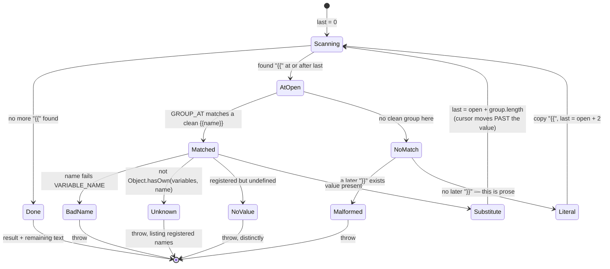

# Chapter 20 · Variable interpolation

**What you'll learn:** the hand-rolled scanner that substitutes `{{name}}` in prompt text, and the three distinct ways it can refuse.

**Prerequisites:** [Chapter 19](19-prompt-assembly.md).

---

## 1. The problem

A prompt fragment needs values it cannot know: which model is answering, what the working directory is. The obvious implementation is `text.replace(/\{\{(\w+)\}\}/g, (_, n) => vars[n])`, and it has three defects that matter here.

**It silently accepts unknown names.** `vars[n]` is `undefined`, which stringifies to `"undefined"` and ships to the model as prompt text. A typo becomes a quiet degradation rather than a loud failure.

**It rescans substituted values.** A value containing `{{` — a code sample, a file path, user-supplied text — gets interpolated again. That is a template-injection bug: content becomes instructions.

**It cannot distinguish "unregistered" from "registered but has no value this time".** Those need different diagnostics: the first is a typo, the second is a provider legitimately returning nothing.

## 2. Mental model

A single forward pass. Walk the text, find each `{{…}}` group, replace it, and **continue after the replacement** — never re-examining what was just inserted. Substituted values are data, permanently.

**New term — prompt variable.** A named provider `(context) => string | undefined`, registered on the prompt service and evaluated once per assembly.

```ts
systemPrompt.variable('model', context => context.agent?.options.model)
```

Names must match `/^[a-z][a-z0-9_]*$/` (`packages/core/system-prompt/src/index.ts:175`), checked at registration (`:516-518`).

## 3. The engine's own variables

The agent loop registers exactly three, in its constructor:

```ts
ctx.systemPrompt.variable('provider', context => context.agent?.options.provider)
ctx.systemPrompt.variable('model', context => context.agent?.options.model)
ctx.systemPrompt.variable('cwd', context => context.agent?.session.header.cwd)
```
— `packages/core/agent-loop/src/index.ts:414-416`

All three read from the agent in the assembly context, and all three can return `undefined` — for a bare `assemble()` with no agent, as tests and diagnostics do. That is legal: the name stays registered, and only a section that *actually references* it fails.

These are the variables the personas use. From [Chapter 19](19-prompt-assembly.md)'s example: "You are a coding assistant powered by the **{{model}}** model. Your working directory is **{{cwd}}**."



The transition out of `Substitute` is the security property: `last` moves past the inserted value, so a `{{` inside it is never scanned.

## 4. The scanner

```ts
function interpolate(input, variables, kind: 'section' | 'context'): string {
  const text = input.text
  let result = ''
  let last = 0
  for (let open = text.indexOf('{{'); open >= 0; open = text.indexOf('{{', last)) {
    const group = GROUP_AT.exec(text.slice(open))     // /^\{\{([^{}]*)\}\}/
    if (group === null) {
      if (text.indexOf('}}', open + 2) >= 0) throw ...  // malformed
      result += text.slice(last, open + 2)              // lone "{{" is literal prose
      last = open + 2
      continue
    }
    const name = group[0].slice(2, -2)
    if (!VARIABLE_NAME.test(name)) throw ...
    if (!Object.hasOwn(variables, name)) throw ...
    const value = variables[name]
    if (value === undefined) throw ...
    result += text.slice(last, open) + value
    last = open + group[0].length
  }
  return result + text.slice(last)
}
```
— `index.ts:309-346`

The loop's third clause is the whole security property: `text.indexOf('{{', last)` searches from `last`, which was advanced **past** the inserted value. A `{{` inside a substituted value is never seen.

`GROUP_AT` is anchored (`^`) and its character class excludes braces (`[^{}]*`), so it matches only a well-formed group starting exactly at the found position.

### Three refusals and one non-refusal

| Input | Result | Why |
|---|---|---|
| `{{model}}`, registered with a value | substituted | — |
| `{{ model }}` or `{{mo del}}` | **throws** — malformed reference | `GROUP_AT` matches but the name fails `VARIABLE_NAME` |
| `{{a{b}}` | **throws** — malformed | inner brace defeats `GROUP_AT`, but a later `}}` exists |
| `{{typo}}` | **throws**, listing every registered name | `Object.hasOwn` fails (`:335-336`) |
| `{{cwd}}` registered but provider returned `undefined` | **throws**, distinctly | value check (`:339-341`) |
| `use {{ as an opener` (no later `}}`) | **literal prose** | `:320-326` |

That last row is the one that surprises people. A lone `{{` with no closing `}}` anywhere later is *not* an error — it is text. Prompt fragments discuss templating, regexes, and code; a brace pair that was never meant as a reference should not break the session. But a `{{` that *does* have a later `}}` is almost certainly a botched reference, so that throws.

`Object.hasOwn` rather than `name in variables` matters too: it never falls through to `Object.prototype`, so `{{constructor}}` is an unknown name rather than a function stringified into your prompt.

## 5. When errors surface

`assemble()` does **not** interpolate. Errors appear only when `renderPrompt`, `renderContextSections`, or `renderContextSnapshot` is called on the assembly — in practice, inside the loop's `preStep` and `step` ([Ch 9](09-the-turn-and-step-loops.md)).

So a malformed template registered by a plugin fails at the **first step of the first agent that uses that scope**, not at mount time. That is later than ideal for diagnosis, though the error text is precise: it names the kind (`section` or `context`), the name, and for unknown names the full registered list.

## 6. Control decisions

| Decision | Condition | Location |
|---|---|---|
| Reject registration | name fails `VARIABLE_NAME` | `:516-518` |
| Treat as literal | `{{` with no later `}}` | `:320-326` |
| Throw — malformed | `{{` with a later `}}` but no clean group | same |
| Throw — bad name | group content fails `VARIABLE_NAME` | `:333-334` |
| Throw — unknown | `!Object.hasOwn(variables, name)` | `:335-336` |
| Throw — no value | registered, but `undefined` this assembly | `:339-341` |
| Advance past the value | always | `:341-342` |

## 7. Edge cases

**Every variable is evaluated once per assembly**, even ones nothing references (`:542-551`). A provider doing expensive work costs that on every step of every agent in scope.

**Nearest scope wins a name** ([Ch 19](19-prompt-assembly.md) ③), so a preset can redefine `model` for its agents without touching the global provider.

**Contexts and sections use the same scanner**, differing only in the `kind` label used in error messages — so a runtime-context section can interpolate too.

## 8. Configuration knobs

None.

## 9. Interactions

- **[Ch 19](19-prompt-assembly.md)** — produces `variables` and the uninterpolated text.
- **[Ch 21](21-runtime-context-injection.md)** — `renderContextSections` runs the same scanner.
- **[Ch 10](10-building-the-request.md)** — the rendered prompt enters the request header, so a change here changes the header.

## 10. Build it yourself

Minimal version:

```ts
text.replace(/\{\{([a-z][a-z0-9_]*)\}\}/g, (_, name) => {
  if (!Object.hasOwn(vars, name)) throw new Error(`unknown prompt variable "${name}"`)
  const value = vars[name]
  if (value === undefined) throw new Error(`prompt variable "${name}" has no value`)
  return value
})
```

Close, and it fixes two of the three defects in §1. What the real one adds:

| Addition | Why it exists |
|---|---|
| Manual scan instead of `replace` | `replace` with a global regex is fine, but a manual `last` cursor makes non-rescanning explicit and auditable |
| Lone `{{` tolerated | Prompt text legitimately discusses braces |
| Malformed detected by "a later `}}` exists" | Distinguishes prose from a botched reference |
| Unknown vs valueless as separate errors | A typo and an absent provider need different fixes |
| Error lists registered names | The fix for a typo is usually visible in the list |

---

## Key takeaways

- One forward pass; the cursor advances past each substituted value, so inserted content is never re-scanned.
- A lone `{{` with no later `}}` is literal text; one with a later `}}` is a hard error.
- Unknown name and registered-but-valueless are separate, distinctly-reported failures.
- `Object.hasOwn` keeps prototype names from resolving.
- Nothing interpolates at assembly time — errors surface at the first render, inside the loop.
- The engine registers exactly three variables: `provider`, `model`, `cwd`.

## Exercises

1. A plugin's section text is `Match files with {{glob}} patterns` and no `glob` variable exists. What happens, and when? Now change the text to `Match files with {{ glob patterns` and answer again.
2. A variable provider returns text containing `{{cwd}}`. Show why the result is not re-interpolated, citing the specific expression.
3. Why is a registered-but-`undefined` variable an error only when referenced, rather than at assembly time? Give the case this supports.

**Next:** [Chapter 21 · Runtime context injection](21-runtime-context-injection.md)
