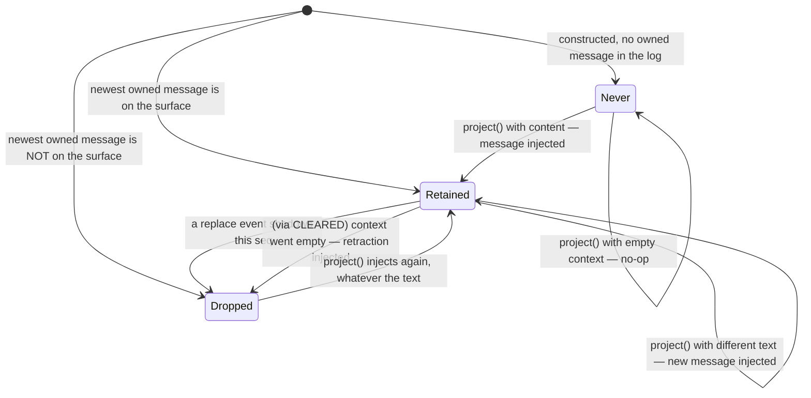

# Chapter 21 · Runtime context injection

**What you'll learn:** how volatile facts — the sandbox mode, the approval policy — reach the model without destroying prefix caching, and the small state machine that keeps them from being repeated on every step.

**Prerequisites:** [Chapter 19](19-prompt-assembly.md), [Chapter 6](06-the-surface.md).

---

## 1. The problem

Some things the model needs to know change during a session. The file sandbox may widen after an approval. A subagent's delegation scope is fixed differently from its parent's.

Putting them in the system prompt is the obvious move and the wrong one. The system prompt is the **cache prefix**: providers cache the tokenized prefix of a request, and a prefix that changes invalidates that cache for the entire remaining conversation. A sandbox mode that flips once would make every subsequent request cost full price.

So volatile facts have to arrive as a *message*. But then a second problem appears: a message repeated on every step accumulates. A hundred-step turn would carry a hundred near-identical snapshots, each one crowding out real conversation.

And a third: when a snapshot is superseded — either by a newer one or because compaction shadowed it — the model must not act on the stale one.

## 2. Mental model

Inject a snapshot message **only when its text differs from the last one that is still visible**.

That requires tracking one thing: the most recent snapshot message this mechanism wrote, and whether it is still on the surface. Three states:

```ts
private retained: { seq: number; text: string | undefined } | null | undefined
```
— `packages/core/agent-loop/src/runtime-context.ts:27`

| State | Meaning |
|---|---|
| `undefined` | no snapshot has ever existed in this session |
| `null` | one existed but is no longer retained — compacted away |
| `{ seq, text }` | this exact durable event is the currently-visible snapshot |

**New term — snapshot message.** A synthetic `user/message` carrying the joined runtime-context sections, tagged with `source: { kind: 'plugin', plugin: '@deepseek-ai/dsh-system-prompt', form: 'snapshot', sections }`.

That tag is how the mechanism recognizes its own past messages on replay — it owns nothing but what it wrote.

## 3. Lifecycle



## 4. Reconstructing state on construction

```ts
// walk session.events BACKWARDS, looking for the newest owned user/message
// if it is on the current surface → retained = { seq, text }, stop
// if it is not → retained ??= null
```
— `runtime-context.ts:34-45`

Backwards, because only the *newest* matters. `isOwned` (`:15-17`) checks the message's `source.kind === 'plugin'` and `source.plugin === SOURCE`.

So a resumed agent knows whether the model has already been told the current policy, without storing anything outside the log. Like the turn number ([Ch 8](08-projections.md)) and the inbox ([Ch 12](12-the-inbox.md)), this is recomputed, never persisted separately.

A live listener keeps it current (`:46-55`): a new owned message updates `retained`; a **replacement surface event whose `sourceEventSeqs` includes the retained seq** clears it to `null`. That is the compaction hook — [Chapter 6](06-the-surface.md)'s coverage rule guarantees a replacement cites every node it shadows, so checking the citation list is a complete test for "was my snapshot compacted away."

This is a good example of one mechanism's invariant being load-bearing for another. Without mandatory coverage, this check would have to scan ranges and could miss.

## 5. The decision

```ts
project(current: string, sections: readonly ContextSnapshotSection[]): UserMessage | undefined {
  if (this.retained === undefined && current.length === 0) return
  const snapshot = current.length === 0 ? CLEARED : current
  if (this.retained?.text === snapshot) return
  return createUserMessage({
    content: [{ type: 'text', text: snapshot }],
    source: sections.length === 0
      ? { kind: 'plugin', plugin: SOURCE }
      : { kind: 'plugin', plugin: SOURCE, form: 'snapshot', sections },
  })
}
```
— `runtime-context.ts:64-75`

**No-op 1:** nothing has ever been injected *and* there is nothing to say. Most sessions never get a snapshot message at all, because none of the three context producers apply.

**The `CLEARED` sentinel:** when context goes empty but a snapshot *is* retained, the engine cannot simply say nothing — the model is still holding the old snapshot. So it injects an explicit retraction:

> `Current runtime context: none. Earlier runtime-context snapshots no longer apply.`
> — `runtime-context.ts:13`

**No-op 2:** the retained text already equals the computed snapshot. This is the dedup that solves §1's second problem — and it covers the `CLEARED` case too, so a retraction is not repeated either.

Note the source shape differs for a retraction: the bare two-field form, because "the cleared marker has no contributions left to attribute" (`:70-71`).

## 6. Where it enters the step

```ts
const assembly = await this.loopCtx.systemPrompt.assemble(assembleContextFor(this, signal))
signal.throwIfAborted()
const sections = renderContextSections(assembly)
const context = this.runtimeContext.project(joinContextSections(sections), sections)
const decision = await this.dispatch.waterfall(
  'agent/pre-step', { messages: claimed, ...position, signal },
  (): Promise<PreStepDecision> => Promise.resolve<PreStepDecision>({
    kind: 'enter',
    messages: context === undefined ? claimed : [...claimed, context],
  }),
)
```
— `packages/core/agent-loop/src/agent.ts:239-249`

The snapshot is appended to the **innermost default** of the `agent/pre-step` waterfall — the `next()` that runs when every listener has delegated. Consequences:

- a listener calling `next()` inherits the snapshot;
- a listener returning its own decision without delegating **omits it**, which is how a `reject` or a hand-built message list suppresses runtime context for that step ([Ch 22](22-extension-points.md)).

`joinContextSections` supplies the fixed preamble:

```ts
return `Current runtime context. This snapshot supersedes earlier runtime-context snapshots.\n\n${body}`
```
— `packages/core/system-prompt/src/index.ts:287-291`

"Supersedes earlier snapshots" is doing real work: because old snapshots stay in history, the model needs to know which one is authoritative.

Then `turn()` appends every message in the decision as an ordinary `user/message` with `surfaceOp: 'append'` (`agent.ts:291-293`). **The snapshot becomes indistinguishable from any other logged message** apart from its `source.plugin` tag — no side channel, fully replayable.

## 7. A real snapshot

From `snapshots/session/text-turn/session.jsonl:10`:

```json
{"content":[{"type":"text","text":"Current runtime context. This snapshot supersedes earlier runtime-context snapshots.\n\nCurrent DSH file policy: danger-full-access. ...\n\nApproval prompts are disabled in this session: ..."}],
 "source":{"kind":"plugin","plugin":"@deepseek-ai/dsh-system-prompt","form":"snapshot",
           "sections":[{"name":"sandbox:policy","text":"..."},
                       {"name":"approval:policy","text":"..."}]},
 "role":"user","id":"{{message:2}}"}
```

The `sections` array is preserved on the message. So a UI can attribute each paragraph to the plugin that contributed it, and a reader can tell *why* the snapshot changed between two versions — not just that it did.

## 8. Who actually contributes contexts

Exactly three producers exist in the entire repository, matching the three declared `CONTEXT_ORDERS`:

| Name | Order | Source |
|---|---|---|
| `sandbox:policy` | 110 | `packages/sandbox/sandbox-policy/src/index.ts:140-151` |
| `approval:policy` | 115 | `packages/interaction/user-approval/src/index.ts:169-181` |
| `subagent:delegation` | 120 | `packages/subagent/subagent/src/child-agent.ts:205-209` |

The first two return `''` for an assembly with no agent, so a bare `assemble()` in a test produces no snapshot.

> ⚠️ **A naming trap worth flagging.** None of the packages under `packages/context/**` — `agent-instructions`, `time-context`, `tmux-context`, `session-reference`, `file-reference-local` — use `systemPrompt.context()` at all. Despite the directory name, they inject through the **`agent/pre-step` waterfall** directly, splicing their own `UserMessage`s into `decision.messages` ([Ch 22](22-extension-points.md)). One of them, `file-reference-local`, registers an ordinary prompt **section** instead (`packages/context/file-reference-local/src/index.ts:66-76`).
>
> So "context" in `packages/context/` names a product category — things that inject situational information — not this mechanism. Reading that directory expecting `PromptContext` producers will mislead you.

## 9. Control decisions

| Decision | Condition | Location |
|---|---|---|
| Return `undefined` | never injected and nothing to say | `:65` |
| Use `CLEARED` | context is empty but a snapshot is retained | `:66` |
| Return `undefined` | retained text equals the computed snapshot | `:67` |
| Bare source shape | `sections` is empty | `:68-71` |
| Clear to `null` | a replacement cites the retained seq | `:46-55` |
| Omit from the step | a pre-step listener did not delegate | `agent.ts:243-249` |

## 10. Edge cases

**A snapshot can be injected mid-turn.** `preStep` runs for *every* step, not only the first. If a tool widens the sandbox at step 3, step 4 carries a fresh snapshot — which is exactly the point.

**Old snapshots stay in history.** Nothing retracts them from the log; the preamble tells the model which is authoritative. Compaction may eventually shadow them ([Ch 27](27-pruning-and-compaction.md)), which clears `retained` and causes the next step to re-inject.

**A per-session projection, not a global one.** The test confirms a message committed to a *different* session never affects this projection's view (`packages/core/agent-loop/tests/runtime-context.spec.ts:16-45`).

## 11. Configuration knobs

None directly. What appears is determined by which context producers are mounted and what they return — in practice, by the sandbox mode and approval policy ([Ch 18](18-approval-and-escalation.md)).

## 12. Build it yourself

Minimal version:

```ts
let lastText: string | undefined
function project(current: string): UserMessage | undefined {
  if (current === lastText) return
  lastText = current
  return createUserMessage({ content: [{ type: 'text', text: current }], source: {...} })
}
```

What the real one adds:

| Addition | Why it exists |
|---|---|
| Reconstruct from the log on construction | A resumed agent must not re-announce what the model already knows |
| Three states, not two | "never said" and "said but compacted away" need different handling |
| Watch replacement events | Compaction can silently remove the snapshot the model is relying on |
| The `CLEARED` sentinel | Going quiet leaves the model holding a stale snapshot |
| `sections` on the message source | Attribution for UIs, and a diff showing *why* it changed |
| Injection as the waterfall's innermost default | Listeners inherit it by delegating and suppress it by not |

---

## Key takeaways

- Volatile facts arrive as a message, not in the system prompt, to protect the provider's prefix cache.
- A snapshot is injected only when its text differs from the last still-visible one.
- Three states distinguish never-said, currently-said, and compacted-away.
- Going empty produces an explicit retraction rather than silence.
- The snapshot enters as the innermost default of `agent/pre-step`, so listeners inherit it by delegating.
- Once appended it is an ordinary `user/message` — no side channel.
- `packages/context/**` does *not* use this mechanism, despite the name.

## Exercises

1. A session runs 50 steps with an unchanged sandbox mode. How many snapshot messages are in the log, and which line is responsible?
2. Compaction shadows the retained snapshot at step 20. Trace what the model sees at step 21, naming the two events involved.
3. The mechanism detects compaction by checking whether a replacement's `sourceEventSeqs` includes its seq. Which rule from [Chapter 6](06-the-surface.md) makes that check complete rather than best-effort?

**Next:** [Chapter 22 · Extension points](22-extension-points.md)
