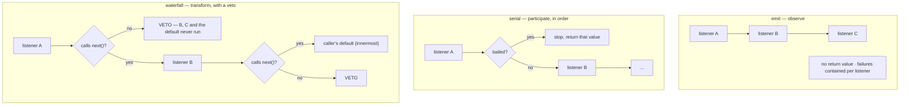

# Chapter 22 · Extension points

**What you'll learn:** the three dispatch semantics every plugin in this system uses, what `next()` actually is, and a census of who listens to what — including one extension point with no live listeners at all.

**Prerequisites:** [Chapter 9](09-the-turn-and-step-loops.md). Most preceding chapters have referred here.

---

## 1. The problem

The engine is 1,756 lines and does not know that compaction, retry, subagents, skills, plan mode, or approval exist. Every one of those reaches in through a named point in the loop.

That demands more than an event bus. Different interventions need different powers:

- *"tell me when the status changed"* — a notification, and a listener failing must not break the agent;
- *"let me decide whether this turn really ends"* — participation, awaited, possibly by several listeners;
- *"let me replace the config for this request"* — transformation, where one listener's output is the next one's input, and any of them may decline to delegate.

Those are three different shapes, and conflating them is how event systems become unreliable.

## 2. Mental model

Three semantics, one wrapper.

| Mode | Awaited | Returns | A listener can |
|---|---|---|---|
| `emit` | no | nothing | observe |
| `serial` | yes, in order | first "bailed" value | act, and stop later listeners |
| `waterfall` | yes, nested | the outermost listener's value | transform, delegate, or **veto** |

**New term — `AgentEventDispatch`.** A fused, agent-scoped wrapper built once per agent in its constructor (`packages/core/agent-loop/src/agent.ts:94`) so hot-path dispatches allocate nothing.

It does two things on every call (`packages/core/agent/src/dispatch.ts:107-149`):

1. **Injects the `agent` into the payload.** The caller passes everything *except* `agent` (`PayloadRest`, `:47`), so a caller literally cannot dispatch an event claiming to be about a different agent.
2. **Dispatches through the agent's scope carrier** (`:94-96`), so delivery is restricted to listeners whose scope is this agent or an ancestor.

The coupling is deliberate: "the agent's scope carrier so the scope key and the payload's `agent` cannot diverge" (`dispatch.ts:2-6`). Identity and routing come from the same source.



## 3. The three semantics, from the implementation

### `emit`

```ts
emit(...args: any[]) {
  this.dispatch('emit', args).map(cb => cb(...args))
}
```
— `vendor/cordis/src/events.ts:194-196`

Synchronous, return values ignored, promises not awaited. **Note what is absent: any error isolation.** A listener that throws propagates out through `.map()` and aborts the remaining calls.

So the agent dispatcher does not use it directly. It resolves the callback list itself and wraps each one (`dispatch.ts:120-137`), catching synchronous throws and attaching `.catch()` to returned promises, logging a warning per failure. The rationale is in the doc: "a notification cannot veto lifecycle progress or starve a later observer" (`:56-59`).

That difference is worth carrying: **`ctx.emit()` does not protect later listeners from an earlier one's throw.** Code wanting that guarantee must iterate `dispatch()` itself — which is exactly what `AgentLoop.reportConfiguredStartupFailure` does when reporting a config startup failure (`packages/core/agent-loop/src/index.ts:457`).

### `serial`

```ts
async serial(...args: any[]) {
  for (const cb of this.dispatch('serial', args)) {
    const result = await cb(...args)
    if (isBailed(result)) return result
  }
}
```
— `events.ts:204-209`

Awaited, in registration order, stopping at the first "bailed" result — anything other than `null`, `false`, or `undefined` (`isBailed`, `:13-15`).

Used for `agent/turn-stopping`, whose listeners return `void`. They participate by **side effect** — calling `agent.steer(...)` to queue a message that the re-test in [Chapter 9](09-the-turn-and-step-loops.md) ⑨ then sees. The documentation gives the reason: "Data decides, so listener order cannot change the outcome" (`runtime-types.ts:275-278`). Two listeners both wanting continuation both queue, and the result is the same regardless of order.

### `waterfall`

```ts
waterfall(...args: any[]) {
  const cbs = this.dispatch('waterfall', args)
  const inner = args.pop()          // the caller's default
  const next = () => {
    const cb = cbs.shift() ?? inner
    return cb(...args)
  }
  args.push(next)
  return next()
}
```
— `events.ts:234-243`

Ten lines, and worth reading closely because the whole plugin architecture rests on them.

Listeners are collected in registration order. The caller's **default value factory becomes the innermost link**. `next` is a closure that shifts the next listener off the front — or, when exhausted, calls the default. Each listener receives the payload plus its own `next`.

So the chain is nested continuations, outermost-first. A listener may:

- **call `next()`** and return its result — pure delegation;
- **call `next()`, then modify the result** — transformation;
- **return without calling `next()`** — which skips every remaining listener *and the caller's default behavior*.

The last one is the crucial semantic:

> "a listener that does not call `next()` vetoes the rest of the chain, including the built-in behavior"
> — `events.ts:79-81`

There is **no framework enforcement**. `next` is an ordinary closure; not calling it is simply not calling a function. That is why the repo states it as a rule for humans: "Waterfall listeners MUST call `next()` to delegate; returning without it short-circuits the chain."

Two consequences seen earlier in this book:

- [Chapter 21](21-runtime-context-injection.md)'s snapshot lives in the *innermost default*, so a listener that does not delegate suppresses it;
- [Chapter 11](11-the-reconstruction-invariant.md)'s check uses `prepend: true` precisely because a short-circuiting listener registered ahead of it would silence it.

## 4. The census

Every `agent/*` point, with real non-test listeners and whether they are mounted in the shipped web profile.

| Event | Mode | Live listeners in web | Also implemented by (not mounted) |
|---|---|---|---|
| `agent/created` | emit | file-reference-local, goal-round-driver, agent-presets, tool-subagent, schedule* | agent-team |
| `agent/disposed` | emit | file-reference-local, goal-round-driver, subagent continuation, tool-subagent | agent-team |
| `agent/status` | emit | **compaction-basic**, session-controller, goal-round-driver | agent-team |
| `agent/session-start` | emit | goal, goal-round-driver | hooks-claude-code, hooks-codex, agent-team |
| `agent/inbox/inserted` | emit | goal-round-driver | — |
| `agent/inbox/claimed` | emit | tool-jobs, goal-round-driver, subagent continuation | — |
| `agent/inbox/discarded` | emit | goal-round-driver, subagent continuation | — |
| `agent/pre-step` | **waterfall** | **compaction-basic**, tool-skill (×2), session-checkpoint-policy, plan-mode, repeat-tool-reminder, goal-round-driver, agent-instructions, time-context, tmux-context, session-reference, subagent driver, tool-cordis | hooks bridges |
| `agent/request` | **waterfall** | model-selection (via session-controller) | webhook |
| `agent/request-error` | **waterfall** | **compaction-basic**, **llm-retry** | — |
| `agent/turn-stopping` | serial | **— none —** | hooks-claude-code, hooks-codex |
| `agent/error` | emit | session-controller, session-telemetry, goal-round-driver | — |

\* `schedule` is itself an opt-in overlay ([Ch 2](02-just-enough-architecture.md)).

Three readings worth taking from this table.

**`agent/pre-step` is the dominant surface.** Twelve live listeners. Anything wanting to see or shape a step attaches here — which is why [Chapter 21](21-runtime-context-injection.md) had to explain that `packages/context/**` uses this rather than the prompt-context mechanism.

**`agent/request` is sparse but live.** One listener: `installModelSelection` (`packages/core/agent/src/model-selection.ts:54-70`), which overrides provider, model, and reasoning effort from a per-agent selection ref, wired by the session controller. That is the `/model` command's implementation ([Ch 10](10-building-the-request.md)).

**`agent/turn-stopping` has zero live listeners.** Its only implementations are the two hook bridges, and neither is mounted. The point is defined, typed, exercised by tests, and dispatched on every qualifying turn — to nobody. It is a designed-in seam awaiting a consumer, and the book states that rather than describing a feature nothing uses.

## 5. Control decisions

| Decision | Condition | Location |
|---|---|---|
| Deliver to a listener | its scope is the agent or an ancestor | `scope/src/index.ts:170-185` |
| Contain a failure | always, in agent-scoped `emit` | `dispatch.ts:120-137` |
| Stop a serial chain | a listener returns a bailed value | `events.ts:204-209` |
| Continue a waterfall | the listener calls `next()` | `events.ts:234-243` |
| Veto a waterfall | the listener returns without calling `next()` | same |
| Use the default | every listener delegated | same |

## 6. Edge cases

**`agent/created` can veto publication.** Documented as: a **synchronous throw** rolls the agent back, while a returned-promise rejection is only logged (`packages/core/agent/src/index.ts:551-567`). That asymmetry is why [Chapter 14](14-agent-lifecycle.md)'s `publish` re-checks liveness after every announcement.

**A claimed message may never be delivered.** `agent/inbox/claimed` fires when a message leaves the inbox into an open turn — but if that step is then rejected, the message never becomes a `user/message` (`runtime-types.ts:196-197`). Consumers must treat `claimed` as "consumed", not "delivered" ([Ch 12](12-the-inbox.md)).

**Scope filtering means a subagent's events do not reach a sibling's listeners.** Delivery follows the scope parent chain, so a listener registered on one agent's scope sees that agent and its descendants only ([Ch 34](34-composition-in-full.md)).

**Registration order matters for waterfalls and not for serial.** A deliberate asymmetry: transformation chains are inherently ordered, so `prepend` is meaningful; `serial` participation is data-driven precisely so ordering cannot change outcomes.

## 7. Configuration knobs

None. Which listeners exist is a composition question ([Ch 34](34-composition-in-full.md)).

## 8. Interactions

Every mechanism chapter in this book attaches here. The load-bearing ones:

- **[Ch 27](27-pruning-and-compaction.md)** — `agent/pre-step` (pressure) and `agent/request-error` (overflow recovery), plus `agent/status` to reset counters.
- **[Ch 25](25-failures-and-retry.md)** — `agent/request-error` is the only way a request is ever retried.
- **[Ch 21](21-runtime-context-injection.md)** — lives in `agent/pre-step`'s innermost default.
- **[Ch 11](11-the-reconstruction-invariant.md)** — `prepend: true` on `llm/stream` for exactly these semantics.

## 9. Build it yourself

Minimal waterfall:

```ts
async function waterfall<T>(listeners: Listener<T>[], payload: P, fallback: () => Promise<T>): Promise<T> {
  let i = 0
  const next = (): Promise<T> => (i < listeners.length ? listeners[i++]!(payload, next) : fallback())
  return next()
}
```

Six lines, and it captures the semantics exactly. What the real system adds:

| Addition | Why it exists |
|---|---|
| Three distinct modes | Observation, participation, and transformation need different guarantees |
| Scope-filtered delivery | One process runs many agents; listeners must not cross-talk |
| Agent fused into the payload | A caller must not be able to dispatch about another agent |
| Per-listener failure containment in `emit` | Raw `ctx.emit` lets one throw abort the rest |
| `prepend` | Some checks must run before anything that could short-circuit |
| Dispatcher built once per agent | The hot path dispatches several times per step |

---

## Key takeaways

- Three semantics: `emit` observes, `serial` participates in order, `waterfall` transforms with a veto.
- `next()` is an ordinary closure; not calling it skips every later listener *and* the built-in default, with no framework enforcement.
- The agent dispatcher fuses identity and scope routing so they cannot diverge, and contains `emit` failures that raw Cordis would not.
- `agent/pre-step` carries twelve live listeners and is the system's main integration surface.
- `agent/turn-stopping` has **zero** live listeners in the shipped profile.
- `agent/created` can veto publication, but only by throwing synchronously.

## Exercises

1. Write a `agent/pre-step` listener that adds a message to every step. Now write one that *replaces* the step's messages entirely, and say what it accidentally suppresses ([Ch 21](21-runtime-context-injection.md)).
2. `agent/turn-stopping` is `serial` with `void` listeners, so it cannot bail. Why choose serial over emit? What would change if it were emit?
3. The invariant uses `prepend: true`. Name one other listener in this book that would be safer prepended, and one where prepending would be actively wrong.

**Next:** [Chapter 23 · Adapters and `prepareCall`](23-adapters-and-preparecall.md)
