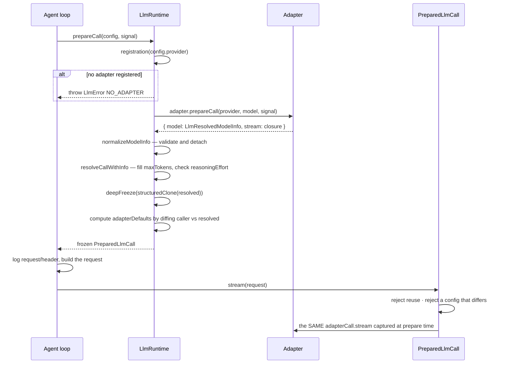

# Chapter 23 · Adapters and `prepareCall`

**What you'll learn:** how a provider name becomes a live connection, what a "prepared call" pins down, and why the engine resolves a request in two stages instead of one.

**Prerequisites:** [Chapter 10](10-building-the-request.md).

---

## 1. The problem

`{ provider: 'deepseek-official', model: 'deepseek-v4-flash' }` is not enough to make a request. Something must find the code that speaks to that provider, discover what that exact model supports, fill in defaults the caller omitted, and produce a dispatchable call.

Doing all of that at dispatch time creates a subtle hazard. Between logging a request header and actually sending the request, configuration can change — a user edits provider settings, a hot reload swaps an adapter. If resolution happens twice, or late, the request that gets logged and the request that gets sent can differ. That is precisely the drift [Chapter 11](11-the-reconstruction-invariant.md) exists to catch.

So resolution happens **once**, up front, and the result is *bound* to the dispatch that follows.

## 2. Mental model

**New term — adapter.** An object that knows how to talk to one or more providers. Only one method is required:

```ts
abstract stream(options: GenerateOptions): AsyncIterable<StreamChunk>
```
— `packages/llm/llm/src/index.ts:274`

Everything else has a default (`:193-275`): `providerInfo`, `listModels`, `resolveModel`, `providerRetryPolicy`, and a `prepareCall` that simply binds `resolveModel` + `stream` together (`:262-267`).

**New term — prepared call.** A frozen, single-use object pinning everything about one request:

```ts
export interface PreparedLlmCall {
  readonly config: LlmCallConfig
  readonly retryPolicy: ResolvedRetryPolicy
  readonly context?: LlmModelContext           // { contextWindow }
  readonly inputModalities?: readonly ModelModality[]
  readonly adapterDefaults: LlmCallConfigAdapterDefaults
  stream(options: GenerateOptions): AsyncIterable<StreamChunk>
}
```
— `:157-177`

Two stages, then: **resolve** (`prepareCall`) and **dispatch** (`prepared.stream`). The engine logs its header between them ([Ch 10](10-building-the-request.md)), which is exactly why the split exists.

## 3. Lifecycle



## 4. Registration

```ts
ctx.llm.registerAdapter(providers: string[], adapter: LlmAdapter): AdapterRegistrationHandle
```
— `:380-409`

Wrapped in `ctx.effect(...)` (`:387`), so an adapter disappears with its plugin. Validation is **all-or-nothing** (`prepareRoutes`, `:416-438`): every provider name must be non-empty, a name already held by another registration throws `DUPLICATE_ADAPTER`, and the adapter's own `providerInfo(provider).id` must equal the name it is registering for, else `INVALID_ADAPTER`. There is no partial registration.

One detail with consequences later:

```ts
// providerRetryPolicy(provider) is captured HERE, at registration time
```
— `:429-430`

The retry policy is resolved once when the route is registered, not per request. `PreparedLlmCall.retryPolicy` reads back that captured value. So changing a provider's retry configuration requires **re-registering** — which is why the handle exposes `.replace(providers)` (`:281-299`) for an atomic same-instance swap.

**Selection is a flat string lookup.** `provider` picks the registration (`:937-941`); `model` is just a string handed to that adapter. The harness does **not** validate the model against any catalog — `listModels` is explicitly advisory (`types.ts:284`), and DeepSeek's adapter treats an unrecognized model as text-only rather than rejecting it (`llm-deepseek/src/adapter.ts:398-407`).

## 5. `prepareCall`, step by step

`:890-935`:

1. **Find the registration** (`:891`), else `LlmError('no adapter registered for provider "..."', 'NO_ADAPTER')`.
2. **Ask the adapter to prepare** (`:892`) — returns model info plus a `stream` closure.
3. **Validate the model info** (`normalizeModelInfo`, `:730-820`): provider and id must match, name non-empty, `contextWindow` a positive integer, `defaultMaxTokens` a safe integer, `reasoning.efforts` well-formed. Failures are coded `INVALID_MODEL_*`. The result is detached from the adapter's own object.
4. **Resolve against the model** (`resolveCallWithInfo`, `:846-880`):
   - `maxTokens` — filled from `info.defaultMaxTokens` when omitted;
   - `reasoningEffort` — if the model declares no reasoning capability but one was requested, throw `UNSUPPORTED_REASONING_EFFORT`; otherwise the effective effort is `requested ?? reasoning.defaultEffort`, and if that is not in `reasoning.efforts`, throw.
5. **Freeze** (`:895-898`): `deepFreeze(structuredClone(resolved))`.
6. **Compute `adapterDefaults`** (`:899-906`) by diffing the caller's original config against the resolved one: `{ reasoningEffort?: true, maxTokens?: true }`, set exactly where the caller omitted a field and the adapter supplied it.
7. **Return a frozen object** (`:908-934`).

Step 6 is the one that matters most upstream. It is the record [Chapter 10](10-building-the-request.md) uses to strip adapter-supplied fields on the next request so they get re-resolved rather than inherited. Confirmed by test: a bare `{ provider, model }` call yields `adapterDefaults: { maxTokens: true }`, while an explicit `maxTokens` yields `{}` (`tests/service.spec.ts:684-689`).

## 6. What the prepared call enforces

```ts
// stream(options):
//   throws INVALID_PREPARED_CALL if already dispatched   (:917-919)
//   throws INVALID_PREPARED_CALL if options are not field-wise
//     equal to the config resolved at prepare time       (:920-925)
//   otherwise dispatches through the SAME registration,
//     model info, and adapter closure captured at prepare (:927-932)
```

Three guarantees in about fifteen lines.

**Single use.** A prepared call cannot be dispatched twice — so a retry cannot silently reuse a stale resolution. [Chapter 9](09-the-turn-and-step-loops.md)'s retry `continue` rebuilds the request from scratch, which is required, not merely tidy.

**Config equality.** The options handed to `stream` must match what was resolved. You cannot prepare with one config and dispatch with another — which is what keeps the logged header honest.

**Generation pinning.** Dispatch goes through the adapter closure captured at prepare time. A settings change or hot reload between prepare and dispatch cannot mix generations.

Concrete adapters lean on this. DeepSeek overrides `prepareCall` to snapshot its connection facts once:

```ts
prepareCall(provider, model, signal) {
  const connection = this.config.options()
  return { model: this.modelInfoFor(connection, provider, model),
           stream: options => this.streamWithConnection(options, connection) }
}
```
— `packages/llm/llm-deepseek/src/adapter.ts:432-438`

Endpoint, credential reference, and model catalog are all fixed for the duration of that one call.

## 7. Control decisions

| Decision | Condition | Location |
|---|---|---|
| `NO_ADAPTER` | provider not registered | `:937-941` |
| `DUPLICATE_ADAPTER` | name held by another registration | `:422` |
| `INVALID_ADAPTER` | `providerInfo.id` ≠ the registered name | `:388, 420, 426` |
| `INVALID_MODEL_*` | model metadata fails validation | `:747-808` |
| `UNSUPPORTED_REASONING_EFFORT` | effort requested on a non-reasoning model, or not in `efforts` | `:859, 868` |
| `INVALID_PREPARED_CALL` | reuse, or a config mismatch at dispatch | `:918, 921` |
| Set `adapterDefaults.X` | caller omitted X and the resolved config has it | `:899-906` |

## 8. Edge cases

**Only `NO_ADAPTER` is tolerated upstream.** [Chapter 10](10-building-the-request.md) catches that one code and proceeds with the unresolved config; every other error from this function fails the step. A model with an unsupported reasoning effort is a real error, not something to paper over.

**No `preparedCall` means no retry policy.** When the fallback path is taken, `preparedCall` is `undefined`, so the `agent/request-error` payload carries `retryPolicy: undefined` — and `llm-retry` delegates immediately when the policy is absent ([Ch 25](25-failures-and-retry.md)). The failure is terminal.

**`replayState` is stripped across adapter instances.** `forAdapter()` (`:944-957`) removes adapter-private replay state from historical assistant messages when the current target's adapter instance differs from the one that produced them, reverting the source to a plain `{ kind: 'model', provider, model }`. Opaque provider state is only trusted back to the same live adapter.

**Two adapters exist; in the web profile, neither registers a route by default.** `llm-deepseek` provides `deepseek-official` but is `disabled: true` in web; `llm-pi-ai` is mounted and dormant with an empty `providers` dict. [Chapter 32](32-when-things-go-wrong.md) traces what that means for a fresh install.

## 9. Configuration knobs

| Setting | Default | Where |
|---|---|---|
| default route | `deepseek-official` / `deepseek-v4-flash` | `packages/bundle/base/cordis.patch.yml:73-79` |
| `defaultContextWindow` (DeepSeek) | `1_000_000` | `llm-deepseek/src/adapter.ts:140` |
| `DEFAULT_MAX_TOKENS` (DeepSeek) | `256_000` | `llm-deepseek/src/adapter.ts:142` |
| `reasoningEffort` (DeepSeek) | `high`, or `off` only when `thinking: 'disabled'` | `llm-deepseek/src/adapter.ts:187-193` |
| `llm-pi-ai` `providers` | `{}` — dormant | `llm-pi-ai/src/config.ts:340-342` |

## 10. Interactions

- **[Ch 10](10-building-the-request.md)** — the sole caller; consumes `config`, `adapterDefaults`, and `context.contextWindow`.
- **[Ch 24](24-streaming-and-assembly.md)** — consumes the returned `stream`.
- **[Ch 25](25-failures-and-retry.md)** — reads the registration-captured `retryPolicy`.
- **[Ch 27](27-pruning-and-compaction.md)** — uses `resolveModelInfo` to get the real context window for its threshold.

## 11. Build it yourself

Minimal version:

```ts
const adapters = new Map<string, LlmAdapter>()
function stream(options: GenerateOptions) {
  const adapter = adapters.get(options.provider)
  if (!adapter) throw new LlmError(`no adapter for "${options.provider}"`, 'NO_ADAPTER')
  return adapter.stream(options)
}
```

That works — and is exactly the fallback path the engine keeps for middleware. What the two-stage version adds:

| Addition | Why it exists |
|---|---|
| Resolve before dispatch | The header must be logged from the same resolution that is sent |
| Frozen, single-use prepared call | A retry must not silently reuse a stale resolution |
| Config equality at dispatch | Prepare-with-one, dispatch-with-another would make the log lie |
| Closure captured at prepare | A settings change mid-request must not mix generations |
| `adapterDefaults` | Otherwise one model's defaults follow you to the next |
| Validated model metadata | A bad `contextWindow` would silently break compaction's threshold |
| Registration-time retry capture | Policy is a property of the route, not of a request |
| All-or-nothing route registration | A partially-registered adapter leaves unusable routes |

---

## Key takeaways

- Resolution and dispatch are separate stages so the logged header and the sent request come from one resolution.
- A prepared call is frozen, single-use, config-checked, and pinned to the adapter generation that produced it.
- `adapterDefaults` records which fields the adapter supplied — the input to the next request's strip-and-re-resolve.
- Provider selection is a flat string lookup; the model string is not validated against any catalog.
- Retry policy is captured when a route registers, not per request; changing it means re-registering.
- Only `NO_ADAPTER` is tolerated by the caller — and taking that path also means no retry policy.

## Exercises

1. A user changes provider settings between `prepareCall` and `stream`. Name the two mechanisms that stop the in-flight request being affected.
2. Retry policy is captured at registration. Give a scenario where that is surprising, and say how `.replace()` resolves it.
3. The harness does not validate model names. Name one benefit and one failure mode, and say where the failure would first surface.

**Next:** [Chapter 24 · Streaming and block assembly](24-streaming-and-assembly.md)
