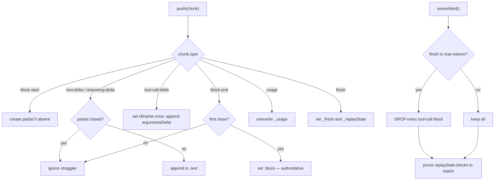

# Chapter 24 · Streaming and block assembly

**What you'll learn:** how a stream of deltas becomes content blocks, what happens to partial output when a stream is cancelled, and the one rule that silently drops tool calls.

**Prerequisites:** [Chapter 3](03-core-data-structures.md) for `StreamChunk`, [Chapter 9](09-the-turn-and-step-loops.md) for where this runs.

---

## 1. The problem

A provider sends tokens. The engine needs blocks — a reasoning block, a text block, a tool call with complete JSON arguments. Reassembly is straightforward until you ask what happens when the stream does not finish cleanly.

Three failure shapes, each needing a different answer:

- **The user cancels mid-sentence.** The model said something useful. Discarding it loses work the user watched appear on screen.
- **The model hits its output ceiling.** Its last tool call may be truncated — a half-written JSON argument. Executing it would be acting on a request the model never finished making.
- **The provider errors halfway.** Some blocks completed, then the connection died.

A reassembler that just concatenates deltas gets all three wrong.

## 2. Mental model

**New term — `BlockAssembler`.** A stateful accumulator fed one chunk at a time, exposing the assembled result through several views depending on how the stream ended.

```ts
partials: Map<number, PartialBlock>   // keyed by stream block index
order: number[]                       // first-seen index order
_usage, _finish, _replayState
```
— `packages/llm/llm/src/assembler.ts:39-43`

Each partial holds `{ blockType, text, toolCallId?, toolCallName?, toolCallArguments, block? }` (`:16-24`). The `block` field is the important one: it is set **only** by a `block-end` chunk, and once set the partial is closed — later deltas for that index are ignored as "stragglers" (`:65-66`, `:71-72`).

Three exit views:

| View | Used when | Includes |
|---|---|---|
| `blocks()` | normal completion | everything, minus tool calls if `max-tokens` |
| `interruptedBlocks()` | cancellation | text and reasoning only, non-empty after trim |
| `finish` | always | the terminal reason, defaulting to `stop` |

## 3. Lifecycle



## 4. Accumulation

`push(chunk)` (`:49-96`) is a switch:

- `block-start` — lazily creates a partial if one does not exist for that index.
- `text-delta` / `reasoning-delta` — appends to `.text`, ignored once `.block` is set.
- `tool-call-delta` — sets `toolCallId` and `toolCallName` once known, appends `argumentsDelta` to `toolCallArguments`. **Arguments stay a raw string** through the whole pipeline ([Ch 17](17-scheduling-tool-calls.md) parses them).
- `block-end` — sets `.block` on **first** close only, so a duplicate close chunk is idempotent.
- `usage` — overwrites.
- `finish` — records the reason and any replay state.

It ends with `assertNever(chunk, 'BlockAssembler.push')` (`:94`) for exhaustiveness against the known union.

### Assembling one block

`assemble(partial, index)` (`:108-121`): if `block-end` provided a block, **return it verbatim** — the provider's own structured close is authoritative over anything reconstructed from deltas. Otherwise synthesize from the accumulated text, with fallbacks for a tool call missing its id or name.

Any other still-open block type **throws**: `cannot assemble incomplete block of type "..."` (`:119`). A plugin-added block type that never closed is an error, not something to guess at.

## 5. The `max-tokens` rule

```ts
// assembled(): if this.finish.kind === 'max-tokens',
// every tool-call block is dropped from the emitted set
```
— `:134-150`

This is the answer to §1's second failure. When the model runs out of output budget, its final tool call is likely truncated — arguments cut off mid-JSON. The comment gives the reasoning: max-token truncation "drops tool calls that cannot be executed safely."

Text and reasoning blocks survive; only tool calls are removed. So the model's partial explanation reaches the user, and nothing is executed on its behalf that it did not finish asking for.

Two consequences worth connecting:

- [Chapter 9](09-the-turn-and-step-loops.md) returns `{ kind: 'max-tokens' }` from the step, and that ending is **sticky** — so a later clean step cannot mask the truncation.
- The resulting assistant message may have **zero content blocks** if the model produced nothing but a truncated tool call. That message is still logged, to carry the usage numbers — and [Chapter 7](07-from-log-to-request.md)'s derivation skips empty-content assistant messages so it never enters the transcript.

`replayState.blocks` is pruned to the same positions, or the whole envelope discarded if its length no longer matches (`:142-143`).

## 6. Cancellation

```ts
// interruptedBlocks(): only text/reasoning blocks (open or closed)
// with non-whitespace .trim() content, in stream order.
// Tool-call blocks and any other open unknown-type block are omitted.
```
— `:169-179`

The reason is given in the source: "interruption precedes dispatch; retaining one would require a fabricated result" (`:165-167`). A tool call that was never dispatched has no result — and [Chapter 6](06-the-surface.md)'s pairing rules mean an unbalanced call would make the conversation invalid. Simpler to drop it.

The engine calls this only when the signal actually aborted:

```ts
catch (error: unknown) {
  if (signal.aborted) {
    const content = assembler.interruptedBlocks()
    if (content.length > 0) {
      this.session.append('assistant/message', {
        turn, step,
        message: createAssistantMessage({ content, source: { provider, model } }),
        interrupted: true,
        ...assembler.usage === undefined ? {} : { usage: assembler.usage },
      }, { surfaceOp: 'append', sourceEventSeqs: chunkSeqs })
    }
  }
  throw error
}
```
— `packages/core/agent-loop/src/agent.ts:372-389`

`interrupted: true` marks it in the log. Usage is carried if it arrived. The error rethrows regardless — salvaging is not recovering.

## 7. A real stream

From `snapshots/session/text-turn/session.jsonl`, the chunks in order:

| Line | Chunk | Assembler state after |
|---|---|---|
| 14 | `block-start` index 0, `reasoning` | partial 0 open |
| 15 | 20 × `reasoning-delta` (stored packed) | partial 0 text grows |
| 16 | `block-start` index 1, `text` | partial 1 open |
| 17-18 | `text-delta` `"P"`, `"ONG"` | partial 1 text = `"PONG"` |
| 19 | `block-end` index 0 with the full reasoning block | partial 0 **closed, authoritative** |
| 20 | `block-end` index 1 with the full text block | partial 1 closed |
| 21 | `usage` | `_usage` set |
| 22 | `finish` `{ kind: 'stop' }` | `_finish` set |

Note the interleaving: block 1 starts and receives deltas *before* block 0 closes. Indices, not arrival order, determine identity — which is why `partials` is a `Map` keyed by index and `order` tracks first-seen position separately.

Line 15 is a packed storage row, not a single event ([Ch 30](30-crash-repair-and-chunk-packing.md)); it decodes back to 20 individual `assistant/chunk` events.

## 8. Control decisions

| Decision | Condition | Location |
|---|---|---|
| Ignore a delta | the partial is already closed by `block-end` | `:65-66, 71-72` |
| Set `.block` | first `block-end` for that index | `:49-96` |
| Prefer the closed block | `.block` is set | `:108-121` |
| Throw | an open block of an unknown type at assembly | `:119` |
| Drop tool calls | `finish.kind === 'max-tokens'` | `:134-150` |
| Discard `replayState` | its `blocks` length no longer matches | `:142-143` |
| Keep a block on interrupt | text/reasoning with non-whitespace content | `:169-179` |
| Default to `stop` | no `finish` chunk ever arrived | `:187-189` |

## 9. Edge cases

**A stream that ends without `finish` is treated as a clean stop.** `finish` getter returns `this._finish ?? { kind: 'stop' }` (`:187-189`). A provider that closes the connection after its last block produces a normal completion rather than an error.

**Every chunk is logged before assembly.** [Chapter 9](09-the-turn-and-step-loops.md) ④ appends an `assistant/chunk` event *and* pushes into the assembler. So the raw stream is durable independently of the assembler's interpretation — if reassembly were ever wrong, the evidence is still in the log. That is also why the packing codec exists: hundreds of tiny events per response.

**`assembler.message(source)` has an unused default.** It defaults `source` to `{ kind: 'plugin', plugin: 'dsh-llm/assembler' }` (`:204-207`), but the loop always builds its own message via `createAssistantMessage` with real provider/model (`agent.ts:410-417`).

**Verified unused.** A repo-wide search for a non-test caller of `assembler.message()` across `packages/llm`, `packages/core`, and `packages/compaction` returns nothing. The method and its default source are dead in the shipped tree — harmless, but worth knowing if you are tempted to rely on that default.

## 10. Configuration knobs

None.

## 11. Interactions

- **[Ch 9](09-the-turn-and-step-loops.md)** — drives `push` per chunk and reads every exit view.
- **[Ch 23](23-adapters-and-preparecall.md)** — supplies the stream.
- **[Ch 25](25-failures-and-retry.md)** — `finish.kind` of `error`/`aborted` routes to the retry waterfall.
- **[Ch 30](30-crash-repair-and-chunk-packing.md)** — packs the logged chunk runs.
- **[Ch 7](07-from-log-to-request.md)** — skips the empty-content message a truncated response can produce.

## 12. Build it yourself

Minimal version:

```ts
const blocks: ContentBlock[] = []
let text = ''
for await (const chunk of stream) {
  if (chunk.type === 'text-delta') text += chunk.text
  if (chunk.type === 'block-end') blocks.push(chunk.block)
}
```

What the real one adds:

| Addition | Why it exists |
|---|---|
| Index-keyed partials | Blocks interleave; arrival order is not identity |
| `block-end` authoritative | The provider's structured close beats reconstructed deltas |
| Straggler suppression | A delta after close would corrupt a completed block |
| Idempotent close | Duplicate `block-end` chunks happen |
| Dropping tool calls on `max-tokens` | A truncated call's arguments are incomplete JSON |
| `interruptedBlocks` | Cancelling should not discard what the user already watched |
| Omitting tool calls on interrupt | Retaining one would require fabricating a result |
| Throwing on an open unknown block | Guessing at an unfinished plugin block would fabricate content |
| `finish` defaulting to `stop` | A clean close without an explicit finish is not an error |

---

## Key takeaways

- Partials are keyed by stream index, because blocks interleave.
- A `block-end` block is authoritative; deltas after it are ignored.
- On `max-tokens`, every tool call is dropped — truncated arguments are unsafe to execute.
- On cancellation, only text and reasoning with real content survive, and the message is logged `interrupted: true`.
- A stream with no `finish` chunk counts as a clean stop.
- Every chunk is logged before assembly, so the raw stream outlives the interpretation.

## Exercises

1. A model emits a text block, then a tool call, then hits `max-tokens`. What does the assistant message contain, what does the step return, and what does the turn record?
2. A provider sends `block-end` twice for index 0 with different blocks. Which wins, and which line decides?
3. `interruptedBlocks` filters on `.trim()` being non-empty. Construct the case this prevents, and say what would be logged without it.

**Next:** [Chapter 25 · Failures and retry](25-failures-and-retry.md)
