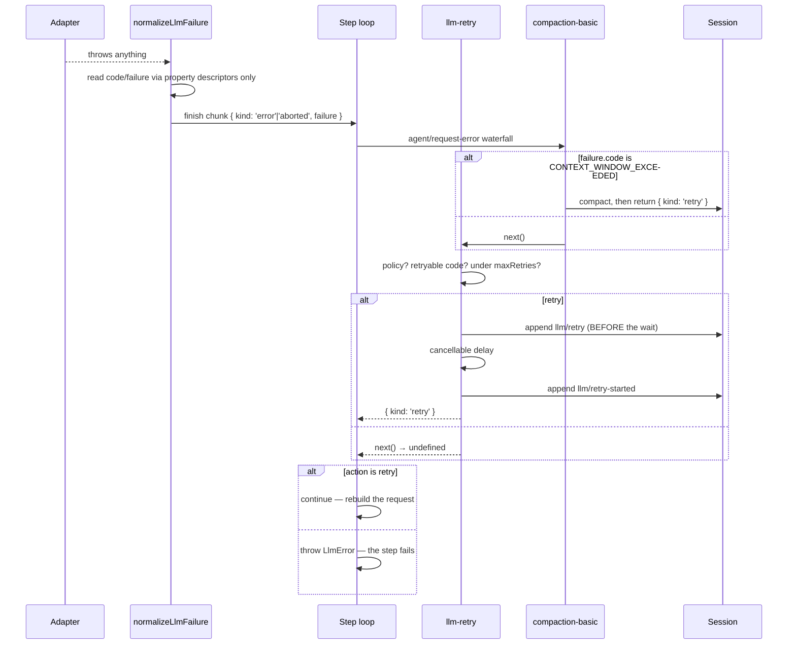

# Chapter 25 · Failures and retry

**What you'll learn:** how any thrown value becomes a structured failure, and why retrying is a plugin rather than a feature of the loop.

**Prerequisites:** [Chapter 24](24-streaming-and-assembly.md), [Chapter 22](22-extension-points.md).

---

## 1. The problem

Requests fail in many ways: a rate limit, an expired key, a socket reset, a context window exceeded, an empty response, a provider SDK throwing something that is not even an `Error`. Downstream, several parties need to make decisions about that failure — should it be retried, should history be compacted, should the turn end, what should the user be shown.

Each needs the same thing: a **serializable, comparable description** of what went wrong, with a code that can be trusted. A raw thrown value provides none of that. It might have a `code` property that means something in another library's taxonomy, or a getter that throws when read, or come from another realm where `instanceof` lies.

And then the policy question. Retrying with backoff is standard — but whose policy? A deployment on a flaky network wants different behavior from one that would rather fail fast. Baking a retry loop into the engine means every deployment gets one answer.

## 2. Mental model

Two separations.

**Failure description is separated from failure handling.** The adapter boundary normalizes anything thrown into an `LlmFailure`; nothing downstream sees a raw error.

```ts
export interface LlmFailure {
  readonly message: string
  readonly code: string
  readonly status?: number
  readonly providerRetryAfterMs?: number
  readonly requestId?: ProviderRequestId
}
```
— `packages/llm/llm/src/types.ts:40-51`

**Policy is separated from mechanism.** A `ResolvedRetryPolicy` is pure data. The thing that *acts* on it lives in a separate package, attached to an extension point. The engine provides the seam and the terminal default.

## 3. Lifecycle



## 4. Normalization

`normalizeLlmFailure` (`packages/llm/llm/src/adapter-failure.ts`) is the single point where any thrown value from an adapter becomes an `LlmFailure`. It is called from `adapterFailureChunk` (`packages/llm/llm/src/index.ts:1069-1077`), the only place a caught adapter exception becomes a terminal `StreamChunk`.

It is defensive in a way worth noticing:

- it reads `error.code` and `error.failure` **only via `Object.getOwnPropertyDescriptor`**, never by property access — so a getter cannot throw or lie during error handling (`:40-88`);
- it trusts a carried `failure` snapshot only when its `code` agrees with the error's own `code`;
- anything that is not an `Error`, or is a foreign `Error` whose code cannot be trusted, becomes code `UNKNOWN` — "Trust only Harness-owned codes; third-party SDK codes are not our taxonomy" (`:101-104`).

The resulting failure rides on the terminal chunk as `{ type: 'finish', reason: { kind: 'error' | 'aborted', failure } }` — `aborted` when the signal aborted or the code is `ABORTED`, `error` otherwise.

### The code taxonomy

| Group | Codes |
|---|---|
| Registry | `NO_ADAPTER`, `DUPLICATE_ADAPTER`, `INVALID_ADAPTER`, `INVALID_PREPARED_CALL`, `INVALID_MODEL_*`, `UNSUPPORTED_REASONING_EFFORT` |
| Credentials | `INVALID_CREDENTIAL`, `MISSING_CREDENTIAL` |
| Transport / provider | `AUTH`, `INVALID_REQUEST`, `RATE_LIMIT`, `SERVER`, `HTTP_<status>`, `QUOTA`, `CONTEXT_WINDOW_EXCEEDED` |
| Adapter-local | `TRANSPORT`, `ABORTED`, `TIMEOUT`, `MALFORMED_RESPONSE`, `STREAM_CLOSED`, `UNSUPPORTED_CONTENT`, `EMPTY_RESPONSE` |
| Fallback | `UNKNOWN` |

Two are load-bearing elsewhere. `CONTEXT_WINDOW_EXCEEDED` is what triggers compaction's recovery path ([Ch 27](27-pruning-and-compaction.md)). `EMPTY_RESPONSE` is emitted by DeepSeek's translation when a `stop` completion produced zero blocks (`llm-deepseek/src/translate.ts:117-126`) and is explicitly noted as "safe to repeat," which is why it is in the default retryable set.

Provider errors are classified by **pattern-matching the provider's error text** — `isContextWindowExceededError` and `isQuotaExceededError` (`llm/src/error.ts:80-100`) sniff the `code`, `type`, and `message` fields with regexes. That is fragile by nature: a provider rewording a message could silently stop triggering compaction ([Ch 35](35-limits-and-fragile-areas.md)).

## 5. Policy is data

```ts
interface NormalRetryPolicyConfig { mode: 'normal'; maxRetries?: number; retryableCodes?: string[]; backoff?: BackoffConfig }
interface AlwaysRetryPolicyConfig { mode: 'always'; backoff?: BackoffConfig }
```
— `packages/llm/llm/src/retry-policy.ts`

Defaults (`:14-24`): `maxRetries = 5`, `initialDelayMs = 500`, `maxDelayMs = 10_000`, `jitterRatio = 0.1`, and

```
retryableCodes = [EMPTY_RESPONSE, RATE_LIMIT, SERVER, TIMEOUT, TRANSPORT]
```

Note what is absent: `AUTH`, `INVALID_REQUEST`, `QUOTA`, `CONTEXT_WINDOW_EXCEEDED`. Retrying those unchanged would fail identically. Context-window overflow is retryable *only after something changes the history*, which is why compaction — not retry — owns that path.

The policy is captured at adapter registration ([Ch 23](23-adapters-and-preparecall.md)) and read back through `PreparedLlmCall.retryPolicy`. **It performs no I/O and schedules nothing.**

## 6. Who actually retries

The engine's own contribution is the seam and a terminal default:

```ts
const action = await this.dispatch.waterfall('agent/request-error', {...},
  () => Promise.resolve<RequestErrorAction>(undefined))
if (action?.kind !== 'retry') {
  throw new LlmError(finish.failure.message, finish.failure.code, finish.failure)
}
continue
```
— `packages/core/agent-loop/src/agent.ts:390-408`

`RequestErrorAction` is `{ kind: 'retry' } | undefined`, and the documented default is that `undefined` "leaves the failure terminal" (`runtime-types.ts:255-256`).

The listener that supplies retries is `packages/llm/llm-retry/src/index.ts:243-252`, mounted host-plane in the base bundle (`packages/bundle/base/cordis.patch.yml:84-85`). Its `recover()` (`:194-241`):

**No policy → delegate immediately.** `if (policy === undefined) return next()` (`:198`). A request whose `preparedCall` was `undefined` — the `NO_ADAPTER` fallback path — is never retried. This is exactly the fresh-install case ([Ch 32](32-when-things-go-wrong.md)).

**`normal` mode** gates on `policy.retryableCodes.includes(failure.code)`, else delegates.

**`always` mode** awaits `next()` first — giving other listeners a chance to claim the retry — and otherwise falls through to the same backoff logic. It has no `retryableCodes` gate and **no `maxRetries` enforcement**, so it retries indefinitely until abort or disposal (`:223`).

> The `always` branch is easy to misread: there is no early `return` between the mode check and the shared backoff section for the case where downstream did not retry. Quote the lines rather than paraphrasing if you depend on this.

### Retry counting is durable

```ts
ctx.sessionProjections.stateOf(agent.session, 'llmRetry')
```
— `:220`

The count comes from a **projection** ([Ch 8](08-projections.md)) folded from `llm/retry` session events, keyed by `[provider, policyKey]`, cleared on `step/start` and `turn/end` (`:125-138`).

And the ordering is deliberate:

```ts
// append llm/retry  ──► then the cancellable wait ──► then append llm/retry-started
```
— `backoff()`, `:149-192`; comment at `:3`: "Each scheduled retry is durable before its cancellable wait"

So a crash during the backoff delay leaves evidence that a retry was scheduled. A retry budget survives a process restart, because it was never in memory.

**Delay** honors `providerRetryAfterMs` when present and within `maxDelayMs`; otherwise bounded exponential backoff (`initialDelayMs * 2^min(retry-1, 1024)`, capped) with symmetric jitter (`:59-64`).

**Disposal is clean:** the plugin's `ctx.effect` disposer aborts an internal controller and awaits all in-flight `recover()` promises before finishing (`:254-258`).

## 7. Control decisions

| Decision | Condition | Location |
|---|---|---|
| Code becomes `UNKNOWN` | not an `Error`, or a foreign code | `adapter-failure.ts:101-104` |
| `aborted` vs `error` finish | signal aborted or code `ABORTED` | `llm/index.ts:1069-1077` |
| Step fails | waterfall result is not `{kind:'retry'}` | `agent.ts:404-406` |
| Rebuild and re-send | result is `{kind:'retry'}` | `agent.ts:407` |
| Delegate, no retry | `policy === undefined` | `llm-retry:198` |
| Delegate, no retry | `normal` mode and code not retryable | `llm-retry:243` |
| Delegate, no retry | `normal` mode and `previousRetry >= maxRetries` | `llm-retry:223` |
| Retry indefinitely | `always` mode | `llm-retry:199-213` |

## 8. Edge cases

**Two listeners share this point.** `compaction-basic` (`:180`) and `llm-retry` (`:243`). Compaction checks for `CONTEXT_WINDOW_EXCEEDED` and, if it successfully shrank history, returns `{kind:'retry'}` without delegating — a legitimate veto ([Ch 22](22-extension-points.md)). Otherwise it calls `next()` and retry gets its turn.

**A retry rebuilds the request completely.** `continue` re-enters the step loop at `buildRequest` ([Ch 9](09-the-turn-and-step-loops.md)), so it picks up whatever compaction just did to history, re-resolves the adapter, and re-checks the header. That is what makes compact-then-retry work at all.

**The engine has no retry cap of its own.** The step loop's `while (true)` is bounded only by the listener. An `always` policy will retry forever; the stopping mechanisms are cancellation and disposal ([Ch 13](13-phases-cancellation-quiescence.md)).

**`LlmError` validates its own construction.** Non-empty message and code, `status` an integer in 100–599, `providerRetryAfterMs` positive and finite — throwing a plain `Error` if violated (`llm/index.ts:96-109`). A malformed failure description fails loudly rather than propagating.

## 9. Configuration knobs

| Setting | Default | Effect |
|---|---|---|
| `mode` | `normal` | `always` removes both the code gate and the retry cap |
| `maxRetries` | `5` | `normal` only |
| `initialDelayMs` / `maxDelayMs` | `500` / `10_000` | Exponential backoff bounds |
| `jitterRatio` | `0.1` | Symmetric jitter |
| `retryableCodes` | `EMPTY_RESPONSE, RATE_LIMIT, SERVER, TIMEOUT, TRANSPORT` | `normal` only |

— `packages/llm/llm/src/retry-policy.ts:14-24`; the plugin is mounted at `packages/bundle/base/cordis.patch.yml:84-85`

Set per provider, captured at registration ([Ch 23](23-adapters-and-preparecall.md)).

## 10. Interactions

- **[Ch 9](09-the-turn-and-step-loops.md)** — owns the seam and the terminal default.
- **[Ch 23](23-adapters-and-preparecall.md)** — supplies the policy; its absence disables retry entirely.
- **[Ch 27](27-pruning-and-compaction.md)** — the other listener, and the only handler for `CONTEXT_WINDOW_EXCEEDED`.
- **[Ch 8](08-projections.md)** — the durable retry counter.
- **[Ch 32](32-when-things-go-wrong.md)** — traces a failure that nothing retries.

## 11. Build it yourself

Minimal version:

```ts
for (let attempt = 0; attempt <= maxRetries; attempt++) {
  try { return await stream(request) }
  catch (error) {
    if (!RETRYABLE.has(codeOf(error))) throw error
    await delay(initialDelay * 2 ** attempt)
  }
}
```

What the real one adds:

| Addition | Why it exists |
|---|---|
| Normalization at the adapter boundary | Downstream must never see a raw thrown value |
| Property-descriptor reads | An error object's getter must not throw during error handling |
| `UNKNOWN` for foreign codes | Another library's taxonomy is not this one's |
| Retry as a waterfall listener | Deployments differ; the engine should not pick |
| Durable retry counting | A budget in memory resets on restart |
| Append-before-wait | A crash during backoff must leave evidence |
| `providerRetryAfterMs` honored | The provider knows better than local backoff |
| Two listeners on one point | Overflow needs compaction, not repetition |

---

## Key takeaways

- Every thrown value is normalized to a serializable `LlmFailure` with a trusted code before anything downstream sees it.
- The engine never retries; it offers a waterfall whose default is terminal.
- `llm-retry` supplies retries, counts them in a session projection, and appends the retry event *before* its cancellable wait.
- `CONTEXT_WINDOW_EXCEEDED` is deliberately not retryable — it needs compaction first.
- No prepared call means no policy means no retry, which is exactly the unconfigured-install case.
- `always` mode has no retry cap; only cancellation stops it.

## Exercises

1. A provider returns HTTP 429 with `Retry-After: 30`. Trace the delay chosen, and say what happens if the header said 300 instead.
2. Retry counts live in a projection cleared on `step/start`. What does that mean for a turn with five steps that each fail twice?
3. Both compaction and retry listen to `agent/request-error`. Registration order is not specified. Construct the two orderings and say whether the outcome differs — then explain why.

**Next:** [Chapter 26 · Measuring and spilling](26-measuring-and-spilling.md)
