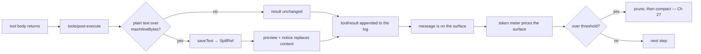

# Chapter 26 · Measuring and spilling

**What you'll learn:** how the engine estimates how full the context window is — without a tokenizer — and the first line of defense that keeps a huge tool result from entering history at all.

**Prerequisites:** [Chapter 16](16-the-execution-pipeline.md), [Chapter 23](23-adapters-and-preparecall.md).

---

## 1. The problem

Two separate questions, often confused.

**"How much room is left?"** Compaction needs a number to compare against the model's context window. But the harness cannot tokenize: tokenization is provider- and model-specific, the vocabularies are large, and shipping one per provider would be a maintenance burden for an answer that only needs to be approximately right.

**"Should this result be in history at all?"** A `grep` across a large repository can return hundreds of kilobytes. Once that lands in the log it is on the surface, it counts against the window, and it will keep counting for the rest of the session. Compacting it later is possible but wasteful — better not to admit it.

These get different mechanisms, at different times, and it is worth keeping them apart.

## 2. Mental model

**New term — token meter.** A per-session measurement combining two sources: real provider-reported usage when available, and a character-count heuristic otherwise.

**New term — spill.** Writing an oversized tool result out of line at execution time, leaving the model a bounded preview plus a pointer to retrieve the rest.

| | Spill | Compaction |
|---|---|---|
| When | tool execution | step boundary or overflow |
| Granularity | one tool result | a region of history |
| Uses a model? | no | yes ([Ch 27](27-pruning-and-compaction.md)) |
| Acts on | the result before it is logged | the surface after messages exist |

They never call each other. They compose only through the shared session log and the shared meter.

## 3. Measuring

```ts
// measure(session):
// baseline = usage !== undefined && usageTokens(usage) >= estimatedAnchorTokens
//   ? { kind: 'usage', ... }
//   : { kind: 'estimated', ... }
```
— `packages/llm/token-meter/src/index.ts:133-177`, the decision at `:154-156`

**Real usage is preferred, but only when it is at least as large as a full heuristic re-price of the same anchor point.** That guard matters: provider usage counts the request *as sent*, which may differ from what the meter would estimate. Taking the larger keeps the meter from under-reporting and compacting too late.

When no usage is available — before the first successful call, or from a provider that does not report it — the fallback is a fixed-density heuristic:

```ts
CHARS_PER_TOKEN = 4
BLOCK_OVERHEAD  = 4
ROLE_OVERHEAD   = 4
```
— `packages/llm/token-meter/src/estimate.ts:13-19`

A text block costs `Math.ceil(text.length / 4) + 4`. Structural and image blocks are priced by their JSON-stringified length over the same divisor (`:28-30`).

**This is not a tokenizer.** There is no BPE table, no vocabulary lookup, nothing provider-specific. Four characters per token is a rough average for English prose and is wrong in both directions for code, non-Latin scripts, and long identifiers.

That is a deliberate trade, and the design compensates in two ways: real usage supersedes the estimate as soon as one request succeeds, and the threshold it feeds is 80% rather than 100% ([Ch 27](27-pruning-and-compaction.md)) — leaving headroom for the estimate being wrong. It remains a real limitation ([Ch 35](35-limits-and-fragile-areas.md)).

The capacity side of the comparison comes from the adapter: `LlmModelContext.contextWindow`, validated as a positive integer at `prepareCall` ([Ch 23](23-adapters-and-preparecall.md)) and flowed into a `request/context` event for presentation.

## 4. Spilling

Three packages, cleanly separated:

**`spill`** defines the seam — `ctx.spillStore`, one method:

```ts
saveText(input): Promise<SpillRef>
```
— `packages/spill/spill/src/index.ts:45-58`

Deliberately minimal: no retention policy, no replacement logic, no retrieval API of its own (`:8-13`).

**`spill-local`** is the host-filesystem implementation (`packages/spill/spill-local/src/index.ts:65-162`). It writes to a private, session-scoped path — `0700` directory, `0600` file — under a configured root or a lazily-created OS-temp default, and returns a `SpillRef` carrying a path locator and a retrieval hint:

> `Use read with offset/limit, or grep this path to search within it.`
> — `:159`

The hint is addressed to the model. Rather than inventing a bespoke retrieval tool, spill leaves the content where the tools the model already has can reach it.

It also runs one best-effort startup sweep for files older than `cleanupPeriodDays` (default `30`, `:68`).

**`spill-policy`** is where the decision lives (`packages/spill/spill-policy/src/index.ts:110-232`). It registers a **prepended** listener on `tools/post-execute` (`:190-209`) — a `dsh-tools` extension point ([Ch 16](16-the-execution-pipeline.md)), not one of the agent-loop's.

The algorithm:

1. **No-op unless configured.** Without `maxInlineBytes` the whole plugin does nothing (`:113`).
2. **Plain text only.** `flattenPlainText` (`:80-87`) extracts text; non-text and multimodal results are left untouched. Spilling an image would break it.
3. **Under the cap → untouched.**
4. **Over the cap** → `ctx.spillStore.saveText(...)` (`:155`), then the model-facing content is replaced with a bounded head/tail preview (via `TextRetainer`, `:98-101`) plus a notice naming the locator and the retrieval hint (`spillNotice`, `:104-108`).
5. **Best-effort.** A save failure logs and keeps the original inline content (`:156-161`). Spill degrades to doing nothing rather than losing the result.

### The `read` exclusion

```ts
// skips the `read` tool
```
— `:197`

Without it: the model reads a large file, the result spills, the notice says "use read on this path", the model reads *that*, and the result spills again. The exclusion breaks the cycle at its source.

This is the kind of detail that only shows up once a system is running, and it is worth noting as an example of a mechanism having to know one thing about its neighbours.

## 5. Where each runs



Spill acts **before** the result becomes a message. Compaction acts on messages that already exist. A result small enough to pass the spill cap but which accumulates with dozens of others is exactly what compaction is for.

## 6. Control decisions

| Decision | Condition | Location |
|---|---|---|
| Use real usage | present **and** ≥ the estimated anchor | `token-meter:154-156` |
| Use the heuristic | otherwise | same |
| Do nothing | `maxInlineBytes` unconfigured | `spill-policy:113` |
| Do nothing | result is not plain text | `spill-policy:80-87` |
| Do nothing | tool is `read` | `spill-policy:197` |
| Spill | plain text over the cap | `spill-policy:155` |
| Keep original | the save failed | `spill-policy:156-161` |

## 7. Configuration knobs

| Setting | Default | Where |
|---|---|---|
| `maxInlineBytes` | `50000` | `packages/bundle/base/cordis.patch.yml:393-396` |
| `cleanupPeriodDays` | `30` | `spill-local/src/index.ts:68` |
| `root` | lazily-created OS temp | `spill-local` |

`spill-policy` and `spill-local` are **host-plane** rows in the base bundle and are **not** touched by the web-app patch — verified absent from `packages/bundle/web-app/cordis.patch.yml`. So the 50 KB cap applies to every web session, and unlike most tool-adjacent rows it is not re-declared per preset.

The token meter is also deliberately host-plane. The standard preset's comment explains why: it "keys every fold by Session, and owns the context-meter projection units the browser reads for every session — behind a realm those units would come and go with whichever presets happen to be mounted" (`presets/standard/agent.cordis.yml:131-136`).

## 8. Edge cases

**The meter's estimate can be badly wrong for code.** Four characters per token under-counts dense identifiers and over-counts repetitive whitespace. The 80% threshold is the safety margin.

**A spilled result is still in the log.** Spill replaces the *model-facing content* before the `tool/result` event is appended — so what is logged is the preview. The full text lives on disk outside the log, under a path that only that session's files sit in. It is not part of the session's durable record, and a `cleanupPeriodDays` sweep will eventually remove it.

**Confirmed: it cannot.** The sweep deletes "files whose `mtime` is strictly older than the cutoff" (`spill-local/src/index.ts:40-46`), computed as `cleanupPeriodDays` × one day. It is purely age-based and knows nothing about which sessions are live, resumable, or referenced.

So a session resumed after 30 days holds spill notices pointing at paths that no longer exist. The model will be told to `read` a file that is gone, and will get an ordinary file-not-found tool error.

Two mitigations exist in config: `cleanupPeriodDays: 0` **disables cleanup entirely** (`:40`), and the sweep runs **once at startup** — best-effort, owned by the plugin fiber, launched without delaying service availability but awaited at disposal so no sweep I/O outlives the fiber (`:60-94`).

🧪 One safety property is worth naming, because the test suite names it: the sweep **does not follow symlinks**. `spill-local`'s own tests include "does NOT follow a symlinked session directory (no deletion in the target)" and "returns only real `dsh-spill-*` directories, excluding symlinks and non-matches". A cleanup routine that deleted through a symlink would let anything able to plant one in the spill root direct deletions at an arbitrary target.

(Those two cases are also the only failures observed when running this repository's suite on Windows — not because the property is broken, but because Windows refuses to *create* the symlink the test needs: `EPERM: operation not permitted, symlink`.)

This is a genuine, bounded limitation rather than a bug: the spilled text was never part of the durable record ([Ch 5](05-the-append-only-log.md)), and the preview that *is* in the log remains intact.

**`ptc-dispatch-log` gets the same treatment.** The policy also listens there (`:217-231`), so `run_code` sub-dispatch output is capped the same way.

## 9. Interactions

- **[Ch 16](16-the-execution-pipeline.md)** — `tools/post-execute` is where spill attaches.
- **[Ch 27](27-pruning-and-compaction.md)** — consumes the meter for its threshold, and is the next defense when spill was not enough.
- **[Ch 23](23-adapters-and-preparecall.md)** — supplies `contextWindow`.
- **[Ch 8](08-projections.md)** — the meter owns context-meter projection units the browser reads.

## 10. Build it yourself

Minimal version:

```ts
const estimate = messages
  .flatMap(m => m.content)
  .reduce((n, b) => n + Math.ceil(JSON.stringify(b).length / 4) + 4, 0)

if (resultText.length > MAX_INLINE) {
  const path = await writeToTemp(resultText)
  return { ...result, content: [{ type: 'text', text: `${head(resultText)}\n[full output at ${path}]` }] }
}
```

What the real one adds:

| Addition | Why it exists |
|---|---|
| Prefer real usage over the estimate | The provider's count is authoritative once one call succeeds |
| The ≥-anchor guard | A smaller reported usage would under-report and compact too late |
| Spill as a separate seam + backend + policy | Storage location, retention, and the decision are independent concerns |
| Retrieval hint naming existing tools | Avoids a bespoke retrieval tool the model must learn |
| Plain-text-only | Spilling an image reference would break it |
| The `read` exclusion | Otherwise read → spill → read loops |
| Best-effort degradation | A failed save must not lose the tool's output |
| Private, per-session, mode-restricted paths | Tool output can contain anything the tool could read |

---

## Key takeaways

- The meter prefers real provider usage and falls back to a fixed 4-characters-per-token heuristic; it is not a tokenizer.
- Real usage is only preferred when it is at least as large as a heuristic re-price of the same anchor.
- Spill acts at tool-execution time, before an oversized result ever becomes a message.
- Only plain text spills; the `read` tool is excluded to prevent a retrieval loop.
- Spill is best-effort — a failure keeps the original content.
- Both the meter and the spill policy are host-plane, applying uniformly to every session.

## Exercises

1. A tool returns 200 KB of JSON as a text block. Trace it through spill and say exactly what the model sees. Now make it an image block and answer again.
2. The meter prefers usage only when it is ≥ the estimate. Construct the case this guards against, and say what would go wrong without the guard.
3. `maxInlineBytes` is 50 KB and the compaction threshold is 80% of a 1M-token window. Roughly how many maximum-size spilled results fit before compaction triggers? What does that tell you about which mechanism does the real work?

**Next:** [Chapter 27 · Pruning and compaction](27-pruning-and-compaction.md)
