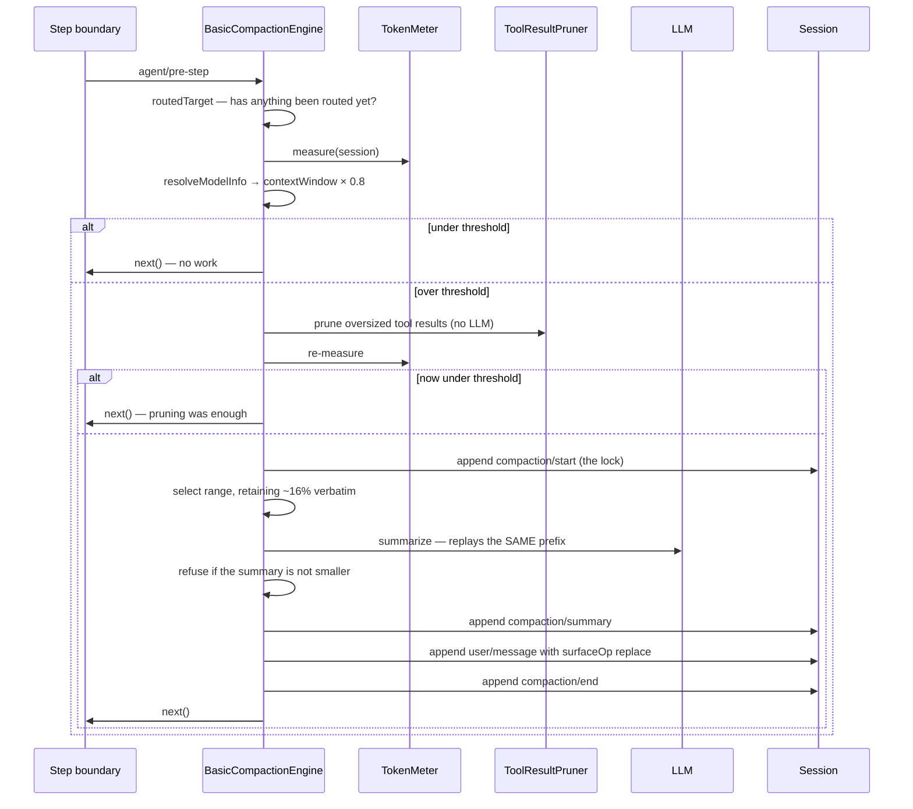

# Chapter 27 · Pruning and compaction

**What you'll learn:** how a conversation that outgrows the context window is shrunk without losing anything — the payoff for everything Chapter 6 set up.

**Prerequisites:** [Chapter 6](06-the-surface.md), [Chapter 26](26-measuring-and-spilling.md), [Chapter 22](22-extension-points.md).

---

## 1. The problem

Every message is permanent ([Ch 5](05-the-append-only-log.md)) and every request carries the whole visible history ([Ch 7](07-from-log-to-request.md)). Those two facts guarantee that a long enough session will exceed any context window.

The naive fixes all fail. Dropping the oldest messages loses decisions the model needs. Dropping the middle breaks tool-call/result pairing and a provider will reject the request. Truncating messages produces incoherent history. And doing any of it destructively contradicts the permanence the rest of the design depends on.

There is also a timing question. Compacting too early wastes a model call and discards useful detail. Too late and the request fails. And when it *does* fail, something must recover — the user should not lose a turn because the history grew.

## 2. Mental model

Two mechanisms, cheapest first.

**Pruning** is model-free: find individual tool results whose text is enormous and replace each with a head/tail excerpt. Deterministic, fast, no LLM call.

**Compaction** is the heavy option: take a *region* of old history, ask the model to summarize it, and replace the whole region with one checkpoint message.

Both use the same primitive — [Chapter 6](06-the-surface.md)'s `replace` surface op. Neither deletes anything. The original events stay in the log at their original positions; the surface simply stops pointing at them.

**New term — compaction transaction.** A `compaction/start` event, some work, and a `compaction/end` event. The start event *is* the lock: a second compaction cannot begin while one is open.

## 3. Lifecycle



## 4. Two triggers

Both registered in `_registerAutomaticCompaction()` (`packages/compaction/compaction-basic/src/index.ts:138-225`), gated by `config.auto` (default `true`, `config.ts:95`).

### Pressure, at every step

A listener on `agent/pre-step` (`:148-166`) calls `compactIfNeeded(agent, 'pressure', signal)` and **always calls `next()`** (`:165`). It never rejects a step; it mutates history as a side effect and lets the step proceed.

Checking on every step rather than on a timer means the decision is made with the exact history the next request will use.

### Overflow, as recovery

A listener on `agent/request-error` (`:180-224`) fires only when `failure.code === CONTEXT_WINDOW_EXCEEDED` — the provider itself said the window was exceeded. It calls `compactIfNeeded(agent, 'context-overflow', signal)` and then:

```ts
// if the surface's replaceGeneration actually advanced, return { kind: 'retry' }
```
— `:219-223`

So compaction shrinks the history and asks the step loop to re-issue **the same request** ([Ch 9](09-the-turn-and-step-loops.md) ⑥). The `replaceGeneration` check is the honest part: it only claims a retry if it genuinely changed something. Otherwise it delegates and retry gets its chance ([Ch 25](25-failures-and-retry.md)).

This path is capped by `maxOverflowRetries` (default `1`, `config.ts:93`), tracked per agent in a `WeakMap` and reset when the next `assistant/message` lands (`:174-178`) or when the agent goes idle (`:168-170`). One rescue attempt per failure, not a loop.

## 5. Deciding whether to compact

`compactIfNeeded` (`:259-333`):

**① Is there a route yet?** `routedTarget()` (`:53-61`) reads `session.requestHeader()?.config`. Before any request has been routed there is no model to measure against, and it returns `null`.

**② Resolve a per-target policy.** `resolveTargetPolicy` (`config.ts:105-125`) lets a deployment override thresholds for an exact `provider/model` pair via `modelPolicies`. None are configured in the web composition, so the defaults apply everywhere.

**③ Measure.** `ctx.tokenMeter.measure(agent.session)` ([Ch 26](26-measuring-and-spilling.md)).

**④ Compare — for pressure only.** `ctx.llm.resolveModelInfo(provider, model, signal)` (`:294`) gives the real context window; the threshold is `floor(contextWindow × thresholdRatio)` with `thresholdRatio = 0.8` (`config.ts:20`, via `resolveCompactSpec`, `config.ts:133-167`). Proceed only if `measurement.totalTokens >= spec.thresholdTokens` (`:305`, `:313`).

**For overflow, the threshold check is skipped entirely** (`:284-291`). The provider already said the window was exceeded; arguing with it via an estimate would be absurd.

**⑤ Try the cheap thing first.** `ctx.get('toolResultPruner')` (`:282`) — optional — then re-measure (`:309-313`). If pruning brought the session under threshold, `compactIfNeeded` returns **without any LLM call**.

That ordering is the chapter's best structural idea: the expensive, lossy, model-dependent operation runs only after the cheap, deterministic, nearly-lossless one has failed to be enough.

## 6. Pruning

`ToolResultPruner` (`packages/compaction/compaction-tool-result-pruner/src/index.ts`) injects only `tokenMeter` (`:47`) — it never touches an LLM.

`pruneSession` (`:136-184`) walks every current `tool/result` surface node, and for each one over budget appends a `compaction/prune` shadow-price event followed by a replacement `tool/result` with `surfaceOp: { op: 'replace', start: seq, end: seq }` (`:162-173`).

Single-node replacement, content-only — which is exactly what [Chapter 6](06-the-surface.md)'s `assertToolResultRewrite` permits and nothing more. The narrow rewrite rule exists for this caller: it is structurally impossible for pruning to change whether a tool failed, or which call it belonged to. Only the text shrinks.

Budget: `thresholdChars: 8192`, keeping `headChars: 4096` and `tailChars: 1024`.

## 7. Compaction

`compactSurfaceRegion` (`packages/compaction/compaction-basic/src/region.ts:154-256`).

### Selecting the range

`selectCompactableRange` (`:100-136`) walks the surface **from the end backwards**, accumulating token counts until at least `retainTokens` is preserved verbatim — `retainRatio = 0.16`, about 16% of the window (`config.ts:23`). Then it walks **forward** from that cut point to the nearest boundary that does not split a tool-call/result pair (`toolPairingBalancedBefore`).

Two properties fall out: the most recent conversation always survives intact, and the boundary never orphans a tool call from its result — which would make the next request invalid.

### Locking

```ts
session.append('compaction/start', { compactionId, turn })
```
— `:191`

Written **synchronously, before any async work**. `assertCompactionInactive` (`:288-300`) rejects a second compaction while a `compaction/start` has no matching `compaction/end`, and re-checks after every `await` (`:307-314`).

The lock is a log event, not a mutex — so it survives a crash, and a reader can see that a compaction was in progress when the process died.

### Summarizing

`buildSummarizationInput` (`:508-524`) replays **the conversation's own last routed system prompt, tools, and the shadowed messages verbatim**. Deliberately: reusing the exact prefix the real requests use keeps the provider's KV/prefix cache warm, so the summarization call is much cheaper than a cold request of the same size.

Then `summarizeWithLlm` (`packages/compaction/compaction-basic/src/summarizer.ts:121-182`) appends one synthetic user message carrying a fixed instruction (`:31-66`) asking for a structured Markdown checkpoint with these sections (`:36-58`):

> Primary Request and Intent · Key Technical Concepts · Files and Code · Errors and Fixes · Pending Jobs · Current Work · Next Step · Critical Context

and calls `ctx.llm.stream(options)` with `purpose: 'compaction'` (`:161`).

That call is **not** a loop-built request — it is exactly the one-shot case [Chapter 11](11-the-reconstruction-invariant.md) excludes from the reconstruction invariant. It carries a session id and is frozen, but it is not meant to equal the derivation.

### Refusing a useless compaction

```ts
// if the framed summary's estimated token cost is NOT smaller
// than the shadowed span's, the whole compaction throws — nothing commits
```
— `:383-388`

A compaction that would not shrink anything is refused outright. Without this, a session near the threshold with already-terse history could compact repeatedly, each time spending a model call to replace short messages with a summary of similar size.

### Committing

`commitCompactionBody` (`:437-488`) appends, in order:

1. `compaction/summary` — the summary text, provenance, shadowed range, seqs, token count (`:457-471`);
2. a `user/message` carrying the framed checkpoint (wrapped in `<compacted-summary>` tags by `frameSummary`, `summarizer.ts:189-195`) with

```ts
surfaceOp: { op: 'replace', start, end },
sourceEventSeqs: [startEvent.seq, summaryEvent.seq, ...shadowedSeqs],
```
— `region.ts:472-475`

3. `compaction/end` (`:217`).

The provenance cites more than [Chapter 6](06-the-surface.md)'s coverage rule requires — the transaction's own start and summary events as well as every shadowed node — so the whole operation is reconstructable, not just its effect.

**Nothing is deleted.** The original messages remain in the JSONL log forever, consistent with the repository's own rule that released session logs never move, overwrite, or delete committed generations.

### Failure

If summarization or commit throws after `compaction/start` landed, the code still appends a `compaction/end` carrying an `error` field (`:224-230`). The durable lock is always released — `assertCompactionInactive`'s job is to reject a concurrent attempt, not to wedge the session.

## 8. Manual `/compact`

`compactNow` (`:369-421`) differs in three ways:

- it requires the agent to be **idle**, running inside `agent.runMaintenance(...)` and throwing `ManualCompactionError('busy', ...)` otherwise (`:414-420`) — the maintenance phase from [Chapter 13](13-phases-cancellation-quiescence.md), which is why a manual compaction does not make the UI show "running";
- it selects with `retainTokens: 0` (`:380-384`) — compact as much as possible, rather than preserving 16%;
- it uses `stability: 'selected-span'` rather than `'whole-surface'` (`:392`), a looser check requiring only the selected span to be unchanged during summarization, since a human-invoked compaction can tolerate racing the agent's own activity less strictly.

## 9. Control decisions

| Decision | Condition | Location |
|---|---|---|
| Skip entirely | `config.auto` is false | `:138-225` |
| Skip | nothing routed yet | `:53-61` |
| Skip | measured tokens < 80% of the window (pressure only) | `:305, 313` |
| Skip threshold | trigger is `context-overflow` | `:284-291` |
| Prune first | `toolResultPruner` is composed | `:282` |
| Stop after pruning | re-measure is under threshold | `:309-313` |
| Reject concurrent | an open `compaction/start` exists | `region.ts:288-300` |
| Refuse commit | the summary is not smaller | `region.ts:383-388` |
| Return `{kind:'retry'}` | `replaceGeneration` advanced | `:219-223` |
| Stop retrying | `maxOverflowRetries` reached | `config.ts:93` |
| Require idle | manual `/compact` | `:414-420` |

## 10. Edge cases

**Compaction invalidates the derived-message cache.** The `replace` bumps `replaceGeneration`, so the next `deriveMessages()` rebuilds from scratch ([Ch 7](07-from-log-to-request.md)) — the one non-incremental case.

**It also starts a new request series.** The next header logs `reason: 'series'` even if its bytes are identical ([Ch 10](10-building-the-request.md)).

**And it can clear the runtime-context snapshot.** If the shadowed range contained one, [Chapter 21](21-runtime-context-injection.md)'s projection sees its seq in `sourceEventSeqs` and re-injects on the next step.

**The human transcript is unaffected.** A UI reads append-origin events ([Ch 6](06-the-surface.md)), so a user scrolling back still sees everything. Only the model's view shrank.

## 11. Configuration knobs

| Setting | Default | Effect |
|---|---|---|
| `auto` | `true` | Enables both triggers |
| `thresholdRatio` | `0.8` | Compact at 80% of the context window |
| `retainRatio` | `0.16` | Verbatim recent history to preserve |
| `maxOverflowRetries` | `1` | Compact-and-retry attempts per failure |
| `modelPolicies` | none configured | Per-`provider/model` overrides |
| pruner `thresholdChars` / `headChars` / `tailChars` | `8192` / `4096` / `1024` | Per-result truncation budget |

**Mount status**, which took three layers to establish ([Ch 34](34-composition-in-full.md)): `compaction-basic`, `command-compact`, and `tool-result-pruner` are mounted in the base bundle, **disabled** in the web-app patch, and **re-mounted by the standard preset** inside an `isolate: { compaction: true, toolResultPruner: true }` group (`presets/standard/agent.cordis.yml:137-155`). They are live for a default web session, per-agent. Reading only the first two layers would wrongly conclude compaction is off.

## 12. Interactions

- **[Ch 6](06-the-surface.md)** — the `replace` primitive and the narrow tool-result rewrite rule.
- **[Ch 26](26-measuring-and-spilling.md)** — supplies the measurement.
- **[Ch 25](25-failures-and-retry.md)** — shares `agent/request-error`; compaction vetoes, retry handles the rest.
- **[Ch 13](13-phases-cancellation-quiescence.md)** — manual compaction runs in the maintenance phase.
- **[Ch 11](11-the-reconstruction-invariant.md)** — the summarization call is a one-shot, deliberately out of scope.

## 13. Build it yourself

Minimal version:

```ts
if (estimateTokens(messages) > contextWindow * 0.8) {
  const keep = messages.slice(-10)
  const summary = await summarize(messages.slice(0, -10))
  messages = [summaryMessage(summary), ...keep]
}
```

What the real one adds:

| Addition | Why it exists |
|---|---|
| `replace` instead of reassignment | The log is permanent; the surface is the view |
| Prune before summarizing | The cheap deterministic fix often suffices |
| Tool-pair-balanced boundary | Splitting a call from its result invalidates the next request |
| Durable `compaction/start` lock | A mutex does not survive a crash or show up in a log |
| Prefix reuse for the summarization call | Keeps the provider's KV cache warm |
| Refusing a non-shrinking compaction | Otherwise a terse session compacts repeatedly for nothing |
| Overflow trigger + `{kind:'retry'}` | The user should not lose a turn to a window they cannot see |
| `replaceGeneration` check before claiming retry | Only claim a retry if something actually changed |
| `compaction/end` even on failure | A wedged lock would freeze the session |
| Full provenance in `sourceEventSeqs` | The whole transaction stays reconstructable |

---

## Key takeaways

- Two triggers: pressure at every step boundary, and overflow recovery driven by the provider's own error.
- Cheap first — model-free pruning runs before any summarization, and often ends the matter.
- The range always retains recent history and never splits a tool call from its result.
- `compaction/start` is a durable lock that survives a crash and is always released.
- The summarization call deliberately replays the conversation's own prefix to keep the provider cache warm.
- A compaction that would not shrink anything is refused.
- Nothing is deleted — `replace` shadows, and the human transcript is unaffected.

## Exercises

1. Pruning brings a session from 85% to 78% of the window. Trace what happens next, and say how many LLM calls were made.
2. Compaction commits, and the next step builds a request. Name the four things that change as a consequence — one each from Chapters 7, 10, 21, and 26.
3. The overflow path is capped at one retry per failure. Construct the loop that would happen without the cap, and say which reset would break it.

**Next:** [Chapter 28 · Subagents](28-subagents.md)
