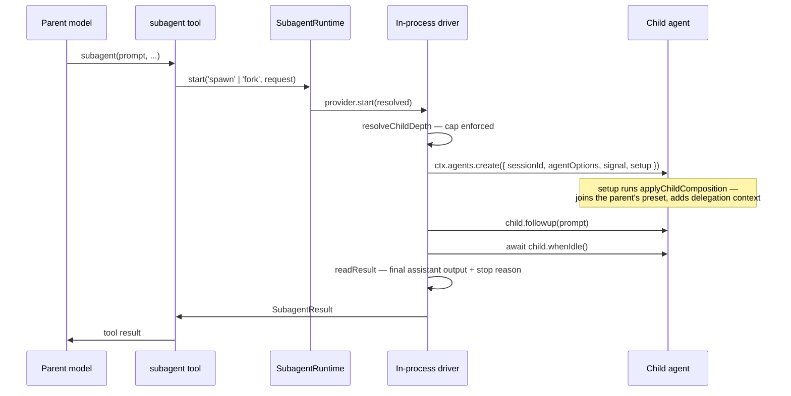

# Chapter 28 · Subagents

**What you'll learn:** how the engine delegates to a copy of itself, the two ways a child can start, and how results come back.

**Prerequisites:** [Chapter 14](14-agent-lifecycle.md), [Chapter 17](17-scheduling-tool-calls.md).

---

## 1. The problem

Some work is better done in a separate conversation. Exploring four possible causes of a bug pollutes the main history with three dead ends. A long mechanical task fills the context window with detail nobody needs afterwards.

The obvious approach — a "sub-conversation" abstraction with its own simplified loop — creates a second engine to maintain, and the child immediately wants everything the parent has: tools, a sandbox, cancellation, persistence, compaction. You end up reimplementing the loop badly.

The alternative is recursion: a child is a *real* agent, built by the same factory, running the same loop. Then the questions become interesting: what does it inherit, how deep can it go, and how does its answer get back?

## 2. Mental model

**New term — subagent.** A genuine nested `Agent` created through the ordinary agent factory.

```ts
const handle = await parent.ctx.agents.create({
  sessionId: childId, meta: ..., agentOptions: ..., signal, setup,
})
```
— `packages/subagent/subagent-in-process-driver/src/index.ts:133-140`

That is `createAgent` from [Chapter 14](14-agent-lifecycle.md). **There is no separate lightweight execution path.** A child has its own session, its own log, its own inbox, its own compaction, and can itself delegate.

Two providers, differing in exactly one thing:

| Provider | Child's session starts | For |
|---|---|---|
| `spawn` | empty | independent work; nothing to mislead it |
| `fork` | seeded with the parent's completed turns | work needing context; the shared prefix stays KV-cache eligible |

`spawn` declares `inheritsParentContext = false` (`packages/subagent/subagent-spawn-in-process/src/index.ts:50`); `fork` supplies `seed?: SessionEvent[]` to the same driver (`:69-72`).

## 3. Lifecycle



## 4. Creating a child

`SubagentRuntime` (`ctx.subagents`, `packages/subagent/subagent/src/index.ts:197-651`) is a named-provider registry: `start(name, request)` (`:565-577`) resolves a provider and delegates.

### Depth capping

`resolveChildDepth` (`packages/subagent/subagent/src/child-agent.ts:49-58`) throws `SubagentDepthError` past the limit — and does so using **the persisted parent depth as a floor**. So a resumed parent cannot escape the cap by forgetting how deep it already was. The depth lives in the session header (`delegationDepth`, [Ch 5](05-the-append-only-log.md)), which is why it survives.

### Composition

`applyChildComposition` (`child-agent.ts:199-218`) runs inside the child's creation window — the `setup` hook from [Chapter 14](14-agent-lifecycle.md), before publication, so the child is never visible without its tools.

The critical line:

```ts
childCtx.get('agentPresets')?.composeFrom(childCtx, parent.ctx)
```
— `child-agent.ts:204`

The child **joins the parent's mounted preset** rather than getting an empty plane. A subagent spawned under the `standard` preset has the same tool roster its parent has ([Ch 34](34-composition-in-full.md)).

It also injects a fixed `SUBAGENT_DELEGATION_CONTEXT` (`:171-176`) as a runtime-context section ([Ch 21](21-runtime-context-injection.md), order 120) telling the model its permission scope is fixed and cannot be widened. The child is told, in the prompt, not to attempt escalation — consistent with [Chapter 18](18-approval-and-escalation.md)'s pattern of keeping enforcement and instruction together.

## 5. Running and returning

`drivePublishedRun` (`subagent-in-process-driver/src/index.ts:155-206`):

1. `child.followup(prompt)` — the prompt becomes one turn's worth of input ([Ch 12](12-the-inbox.md));
2. `await child.whenIdle()` — genuine quiescence ([Ch 13](13-phases-cancellation-quiescence.md));
3. `readResult()` (`:209-234`) extracts the final assistant output from the child's **own session events** after its activation boundary (`finalAssistantOutput()`), and maps the turn-end reason to a `SubagentStopReason` via `toStopReason()` (`:49-66`): `completed | max-tokens | aborted | refusal | error`.

The result is read *from the child's log*, not from a return value threaded through the loop. Consistent with everything else: the log is the interface.

That `SubagentResult` becomes the parent's tool result — so from the parent model's perspective, delegation is just a tool call that took a while.

### Continuable children

For background mode, results flow instead through `SubagentContinuationManager` (`packages/subagent/subagent/src/continuation.ts`) and an explicit `reportFrom()` (`:296-302`) the child can call to push content into its parent's inbox **at any time**, not only at turn end. That is the `tool-subagent-report` package, which registers a "continuable setup" on the runtime.

`tool-subagent-report` is host-plane, and the reason is precise: it registers a setup contribution on a process singleton rather than a tool the agent calls, and the setup list is not scope-aware — "one copy per mounted preset means every child gets `report` registered once per live session, which throws on the second" (`packages/bundle/web-app/cordis.patch.yml:420-424`).

### Structured output

The in-process driver's structured-output tool calls `exec.concludeTurn()` immediately after staging the model's answer (`packages/subagent/subagent-in-process-driver/src/structured.ts:94`). That is the production user of `concludesTurn` ([Ch 17](17-scheduling-tool-calls.md)): once the child has produced its structured answer, no further steps run.

## 6. What is mounted

| Row | Plane | Note |
|---|---|---|
| `subagent` (registry) | host | process singleton with a cross-session query surface the browser reads |
| `subagent-spawn-in-process`, `subagent-fork-in-process` | host | provider names must be globally unique |
| `tool-subagent-report` | host | registers a continuable setup, not a tool |
| `tool-subagent` (`subagent`, provider `spawn`) | **preset** | `backgroundMode: continuable`, `modelSelectionSettings: true` |
| `tool-subagent-fork` (`subagent_fork`, provider `fork`) | **preset** | `backgroundMode: continuable` |
| `tool-subagent-control`, `list-agents` | **preset** | the control surface |

— `presets/standard/agent.cordis.yml:174-217`

The registry stays host-plane because it is a singleton whose `listChildren`/`followup` surface the API serves to the browser, and because a provider name may only be registered once. What a preset chooses is **which delegation tools its agent sees**.

Note a config difference the three-layer composition makes easy to get wrong: the base bundle declares `tool-subagent-fork` with `backgroundMode: one-shot`, but the base row is disabled in web and **the preset re-declares it as `continuable`** (`preset:198-203`). The preset's value is what runs. The preset's own comment acknowledges the tradeoff — a continuable fork's `report` tool and prompt section precede the inherited history and invalidate the same prefix it was forked to preserve, with an issue tracking cache-preserving continuable fork.

## 7. Control decisions

| Decision | Condition | Location |
|---|---|---|
| Throw `SubagentDepthError` | depth cap exceeded, floored by persisted depth | `child-agent.ts:49-58` |
| Seed the child's log | provider is `fork` | driver `:69-72` |
| Join the parent's preset | `agentPresets` is composed | `child-agent.ts:204` |
| Conclude the child's turn | structured output staged | `structured.ts:94` |
| Report at turn end | one-shot mode | `driver:155-206` |
| Report at any time | continuable mode | `continuation.ts:296-302` |

## 8. Edge cases

**A child is a full agent, so everything recurses.** It compacts, retries, gets approval prompts, and persists — independently. A long-running child can compact its own history while the parent waits.

**Cancellation propagates through the signal.** The child is created with the parent's signal, so cancelling the parent's turn cancels the child's lifecycle via the fused abort of [Chapter 14](14-agent-lifecycle.md).

**Fork's cache benefit is fragile.** The point of seeding is that the shared prefix remains KV-cache eligible. Anything prepended to the child's history — a `report` tool, an extra prompt section — invalidates it. The shipped preset accepts that cost.

**The cap is `3` by default, and it is the delegation *tool's* config, not the runtime's:**

```ts
maxDepth: z.union([z.natural().max(Number.MAX_SAFE_INTEGER), z.const('provider-managed' as const)]).default(3)
```
— `packages/subagent/tool-subagent/src/index.ts:129`

So a root agent may delegate, its child may delegate, and that grandchild may delegate — the fourth level throws `SubagentDepthError`. `resolveChildDepth` treats the cap as optional (`number | undefined`, `child-agent.ts:49`); when nothing supplies one there is no limit beyond the safe-integer range. The tool always supplies one unless configured to `'provider-managed'`, which hands the budget to the provider — and the tool **refuses to mount** a numeric cap against a provider lacking the `depthLimit` capability, with an actionable message (`:323-326`).

The persisted floor is the interesting part:

```ts
return Math.max(agent.session.header.delegationDepth ?? 0, runtime ?? 0)
```
— `packages/subagent/subagent/src/depth.ts:36`

The header value and the runtime option, whichever is larger. The comment states why: "runtime `AgentOptions.subagentDepth` may DEEPEN the count but can never lower it — a resumed child arrives with fresh options, and counting it from zero would let it delegate as if it were top-level."

## 9. Interactions

- **[Ch 14](14-agent-lifecycle.md)** — a child is created through the same factory, `setup` and all.
- **[Ch 12](12-the-inbox.md)** — `followup` delivers the prompt; `reportFrom` pushes into the parent's inbox.
- **[Ch 13](13-phases-cancellation-quiescence.md)** — `whenIdle()` is how the driver knows the child finished.
- **[Ch 17](17-scheduling-tool-calls.md)** — `concludesTurn` ends the child's turn.
- **[Ch 21](21-runtime-context-injection.md)** — the delegation context section.
- **[Ch 34](34-composition-in-full.md)** — how a child joins its parent's preset.

## 10. Build it yourself

Minimal version:

```ts
async function subagent(parentCtx: Context, prompt: UserMessage): Promise<string> {
  const { agent, dispose } = await parentCtx.agents.create({ sessionId: freshId() })
  try {
    agent.followup(prompt)
    await agent.whenIdle()
    return finalAssistantText(agent.session)
  } finally { await dispose() }
}
```

That is genuinely most of it — which is the point. What the real one adds:

| Addition | Why it exists |
|---|---|
| Named providers | `spawn` and `fork` differ only in seeding; more backends can register |
| Depth cap floored by persisted depth | A resumed parent must not forget how deep it is |
| Preset composition via `composeFrom` | A child with no tools is useless |
| Delegation context section | The child must know its scope is fixed |
| Stop-reason mapping | "It stopped" is not enough; the parent needs to know why |
| Continuation channel | A background child should report before it finishes |
| Host-plane registry | Cross-session queries and unique provider names |

---

## Key takeaways

- A subagent is a real `Agent` from the same factory — no second engine.
- `spawn` starts empty; `fork` seeds the parent's completed turns for cache reuse.
- Depth is capped using the persisted parent depth as a floor, so resume cannot escape it.
- The child joins the parent's preset during `setup`, before publication.
- Results are read from the child's own log, not returned through the loop.
- The registry and providers are host-plane singletons; only the delegation *tools* are per-preset.

## Exercises

1. A forked child inherits history for KV-cache reuse, then the preset adds a `report` tool ahead of that history. Explain precisely what is lost and why the shipped preset accepts it.
2. The driver awaits `whenIdle()` rather than a promise from the loop. Name two things this gets right that a returned promise would not ([Ch 13](13-phases-cancellation-quiescence.md)).
3. The child's result is read from its session log. Design the alternative where the loop returns it directly, and name two capabilities you would lose.

**Next:** [Chapter 29 · Persistence](29-persistence.md)
