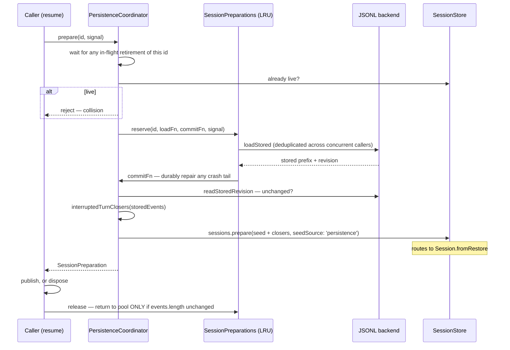

# Chapter 29 · Persistence

**What you'll learn:** where sessions actually live on disk, why the durable format is one append-only file, and the careful dance that stops two processes clobbering each other.

**Prerequisites:** [Chapter 5](05-the-append-only-log.md), [Chapter 14](14-agent-lifecycle.md).

---

## 1. The problem

An append-only log is an unusually good fit for storage: the write pattern is "add a line," which every filesystem does well. But the gap between that observation and a correct implementation contains most of the hard parts.

A process can die **mid-write**, leaving a half-written line. Two processes can open the same session. A crash leaves a turn that started and never ended — the log is syntactically fine and semantically broken. And a long session must be resumable without re-reading a hundred megabytes.

## 2. Mental model

Two layers, deliberately split.

**A backend** knows about bytes. The contract is small (`packages/session/session-persistence/src/coordinator.ts:128-219`): `loadStored`, `readStoredRevision`, `appendBatch`, `commitRepair`, `list`, plus optional `loadStoredFrom` (seek-capable suffix read), `materializeHeader`, `locate`, and `close`.

**The coordinator** knows about correctness. Batching, per-id serialization, crash-repair sequencing, an LRU of unpublished prepared sessions, and dispose-time draining all live in `PersistenceCoordinator`, which every first-party backend composes rather than reimplements:

```ts
new PersistenceCoordinator(ctx, this, options)
```
— `packages/session/session-persistence-jsonl/src/index.ts:162-165`

So "how do I store bytes" and "how do I not corrupt a session" are separate questions with separate answers.

## 3. What actually runs

**JSONL, one file per session.** Verified two ways: the plugin is mounted in the base bundle —

```yaml
- id: session-persistence-jsonl
  name: '@deepseek-ai/dsh-session-persistence-jsonl'
  config:
    root: !!js dshHomePath('sessions')
```
— `packages/bundle/base/cordis.patch.yml:110-113`

— and it is not disabled or overridden by the web-app patch.

A file is a header line plus one line per event, grouped into human-readable project directories. Two encoding options: Zstandard compression (default on) and lossless chunk-run packing (default on, [Ch 30](30-crash-repair-and-chunk-packing.md)).

**SQLite exists but is not the log.** `packages/session-query/session-query-sqlite` is a *search index* — "Concrete `ctx.sessionQuery` backend with SQLite FTS5 search" — and in the shipped profile it is mounted with:

```yaml
path: ':memory:'
openAt: never
```
— `packages/bundle/base/cordis.patch.yml:129-133`, restated in web-app

`openAt: never` keeps `ctx.sessionQuery` mounted so exact reads, titles, and lineage traces stay available, while **SQLite is never opened at all** and content search fails with `SESSION_QUERY_SEARCH_DISABLED`. The web sidebar's search matches titles and workspace names only.

That is a good example of why this book checks composition rather than package names: "the sessions are in SQLite" would be wrong in two ways at once.

## 4. Writing safely

Two mechanisms in the JSONL backend, both worth knowing.

**Materialization uses `link()` + `unlink()`, not `rename()`** (`packages/session/session-persistence-jsonl/src/index.ts:560-565`). `rename()` silently replaces an existing file; `link()` fails with `EEXIST`. If two processes race to materialize the same session, one wins and the other gets a detectable error instead of silently destroying the winner's file.

**Appends are fsync'd with rollback.** `appendLines` (`:670-698`) records the pre-write size and, on failure, truncates back to it. A partial write is removed rather than left for the next reader to trip over.

**Sequence contiguity is re-checked at the storage boundary.** `appendCore` (`coordinator.ts:722-726`) verifies every event in a batch against `state.cursor + i` before writing — the fourth of the four checks from [Chapter 5](05-the-append-only-log.md).

## 5. Reading safely

Two gates before any stored log is interpreted.

**Version** (`assertVersion`, `coordinator.ts:1128-1131`): a header whose `version` is not `SESSION_FORMAT_VERSION` throws `SessionFormatUnsupportedError`, with directional messages — "written by a newer harness — upgrade the harness" versus an older one with no upgrade path (`:78-82`).

**Vocabulary** (`assertEventsSupported`, `:1143-1148`): every event type must be in the generated known set, or be marked `ignorable` ([Ch 5](05-the-append-only-log.md)). An unrecognized required event refuses the whole session.

Both fail loud. Neither tries to guess.



## 6. Preparation and reservation

**New term — `SessionPreparation`.** A `Disposable` wrapper around one *unpublished* session (`packages/core/session/src/preparation.ts:20-49`):

```ts
export class SessionPreparation implements Disposable {
  readonly session: Session
  static create(session: Session, options?: SessionPreparationOptions): SessionPreparation
  [Symbol.dispose](): void { /* calls options.release?.() once */ }
}
```

It exists so a caller can build a fully validated session, decide whether to publish it, and cleanly release backend state if not — the ownership boundary [Chapter 14](14-agent-lifecycle.md) relies on.

The generic `SessionPersistence.prepare` (`packages/session/session-persistence/src/index.ts:186-199`) just loads and wraps. The JSONL backend **overrides** it (`:190-192`) to use the coordinator's real path.

`PersistenceCoordinator.prepare` (`coordinator.ts:744-771`) loops until it has a race-free reservation:

1. **Wait** for any in-flight retirement of the same id.
2. **Reject** if the id is already live in `ctx.sessions` — two live sessions with one id is a collision, not something to resolve silently.
3. **Reserve** via `preparations.reserve(id, loadFn, commitFn, signal)` — a bounded structure that de-duplicates concurrent cold reads of the same id and hands one caller exclusive use. `commitFn` durably repairs any crash tail (`commitPrepared`, `:1016-1045`) and only returns once the durable revision is confirmed unchanged (`isPreparedSourceCurrent`, `:1048-1053`).
4. **Wrap** in a `SessionPreparation` whose `release` returns the reservation to the reusable pool **only if the caller never mutated it**:

```ts
reservation.source.session.events.length === reservation.source.sessionLength
```
— `:764-767`

An untouched preparation can serve the next caller; a touched one is discarded. That is the cheap half of making repeated open-attempts fast without ever serving stale state.

`prepareCore` (`:974-1013`) is the cold path: load the stored prefix, upgrade legacy shapes, compute crash-tail closers ([Ch 30](30-crash-repair-and-chunk-packing.md)), append them to the seed, and construct via `ctx.sessions.prepare(id, { seed, meta, seedSource: 'persistence' })` — which routes to `Session.fromRestore` ([Ch 5](05-the-append-only-log.md)), the exclusive-ownership constructor that freezes restored graphs in place rather than re-validating them.

## 7. Adopting a live session

`onCreated` (`coordinator.ts:1318-1375`) handles a session that is already running in-process when the backend meets it — most commonly after a dev-server hot reload. Four documented cases (`:1305-1317`):

| Case | Action |
|---|---|
| Already tracked | no-op, or claim ownerless state |
| On-disk prefix matches the live log | adopt and persist the live suffix |
| On-disk artifact mismatches | reject as a collision |
| Genuinely new | register and persist the seed |

The second case routes through `adoptLivePrefix` (`:1383-1405`) and explicitly **does not** use cold `prepareCore` — because that would crash-repair a turn the live session is still actively extending. Synthesizing "this turn was interrupted" closers into a turn that is currently running would corrupt it.

## 8. Control decisions

| Decision | Condition | Location |
|---|---|---|
| Refuse the session | header version ≠ `SESSION_FORMAT_VERSION` | `:1128-1131` |
| Refuse the session | unknown required event type | `:1143-1148` |
| Refuse the write | batch seq ≠ `cursor + i` | `:722-726` |
| Roll back | append failed mid-write | jsonl `:670-698` |
| Fail materialization | the file already exists (`EEXIST`) | jsonl `:560-565` |
| Reject preparation | id is already live | `:744-771` |
| Reuse a reservation | the caller did not mutate it | `:764-767` |
| Adopt rather than repair | the live prefix matches disk | `:1383-1405` |

## 9. Edge cases

**The store is in-memory; persistence is a subscriber.** `SessionStore` says so itself: "Persistence is intentionally not implemented here — persistence plugins subscribe to `session/event` and flush on `session/flush` / dispose" (`packages/core/session/src/index.ts:786-789`). A composition with no persistence backend is entirely valid; sessions simply do not survive the process.

**Forking is a prefix copy.** `SessionStore.fork()` (`:1079-1093`) creates a child from a prefix of a parent's log and **rejects a boundary inside an open turn** (`SessionForkError`, code `OPEN_TURN`, `:1126-1133`). Same reasoning as compaction's tool-pair balancing ([Ch 27](27-pruning-and-compaction.md)): a structurally incomplete prefix is not a valid conversation.

**The throttled projection cache is separate.** `session-projection-cache` writes checkpoints every 200 events or 5 seconds (`packages/bundle/base/cordis.patch.yml:162-166`) so a cold open need not re-fold a long log ([Ch 8](08-projections.md)). It is an optimization over the log, never a substitute for it.

## 10. Configuration knobs

| Setting | Default | Where |
|---|---|---|
| `root` | `dshHomePath('sessions')` | base:110-113 |
| compression | `zstd` | jsonl backend |
| `packChunks` | `true` | jsonl backend ([Ch 30](30-crash-repair-and-chunk-packing.md)) |
| `session-query-sqlite` `openAt` | `never` | base:129-133 |
| projection cache cadence | 200 events / 5000 ms | base:162-166 |

## 11. Interactions

- **[Ch 5](05-the-append-only-log.md)** — the format being stored; the fourth contiguity check lives here.
- **[Ch 14](14-agent-lifecycle.md)** — `prepare()` and `SessionPreparation` ownership, including `releaseAbandoned`.
- **[Ch 30](30-crash-repair-and-chunk-packing.md)** — repair and the packing codec.
- **[Ch 8](08-projections.md)** — the checkpoint cache.

## 12. Build it yourself

Minimal version:

```ts
function append(sessionId: string, event: SessionEvent): void {
  appendFileSync(`${root}/${sessionId}.jsonl`, JSON.stringify(event) + '\n')
}
function load(sessionId: string): SessionEvent[] {
  return readFileSync(`${root}/${sessionId}.jsonl`, 'utf8')
    .split('\n').filter(Boolean).map(line => JSON.parse(line))
}
```

Genuinely usable. What the real one adds, and the failure each prevents:

| Addition | Failure it prevents |
|---|---|
| Backend / coordinator split | Every backend reimplementing crash handling, differently |
| `link()` over `rename()` | A second process silently destroying the first's file |
| fsync + truncate rollback | A half-written line breaking every future load |
| Seq contiguity at the write boundary | A gap reaching disk and failing much later |
| Version and vocabulary gates | Silently misinterpreting a log from another build |
| Reservation with mutation check | Serving a stale prepared session to the next caller |
| Rejecting an already-live id | Two live sessions diverging under one identity |
| Live-prefix adoption | Crash-repairing a turn that is still running |
| Fork rejecting an open turn | Producing a child whose first request is invalid |

---

## Key takeaways

- The durable format is JSONL, one append-only file per session; SQLite is a search index and is never even opened in the shipped profile.
- Backends handle bytes; the shared coordinator handles correctness.
- `link()` + `unlink()` makes a materialization race detectable instead of destructive.
- Version and vocabulary are both gated on read, and both fail loud.
- A preparation is reusable only if untouched, and a live id can never be prepared over.
- Adopting a live session deliberately skips crash repair — the turn is not crashed, it is running.

## Exercises

1. `rename()` would be simpler and atomic. Give the exact two-process interleaving where it loses data and `link()` does not.
2. A load finds a stored log whose last event is `step/start`. What happens before the session becomes usable, and which chapter covers it?
3. `openAt: never` keeps `ctx.sessionQuery` mounted but never opens SQLite. Why mount it at all rather than omitting the row?

**Next:** [Chapter 30 · Crash repair and chunk packing](30-crash-repair-and-chunk-packing.md)
