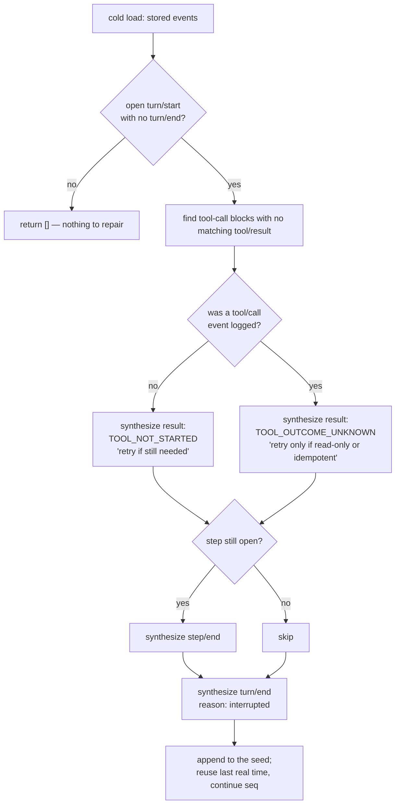

# Chapter 30 · Crash repair and chunk packing

**What you'll learn:** how a session that died mid-turn becomes loadable again, and the lossless codec that stops a streamed response from costing 56× its own size.

**Prerequisites:** [Chapter 29](29-persistence.md), [Chapter 24](24-streaming-and-assembly.md).

---

## 1. Two problems

**A turn that never ended.** The process died between `turn/start` and `turn/end`. The log is syntactically perfect and semantically broken: a tool call with no result, a step with no end. Loading it as-is produces a conversation a provider will reject, and the model has no idea which of its requests actually ran.

**A response costs more to store than it contains.** Every streamed chunk is logged as its own event ([Ch 9](09-the-turn-and-step-loops.md) ④) so the raw stream stays durable. But a chunk carrying three characters of text sits inside an envelope carrying its type, seq, time, turn, step, and block index. The module doc reports the measured ratio: **~56×** on a real DeepSeek session.

Different problems; they share a chapter because both are about the gap between "what the log means" and "what is on disk."

## 2. Crash repair

### Mental model

Do not guess what happened. Instead, **close the turn honestly**, recording for each interrupted tool call exactly how much is known — and in particular, whether it might have run.

That distinction is the whole design. A tool the model asked for but which never started is safe to retry. A tool that started and whose outcome is unknown might have already deleted a file.



Note that the branch at **E** is decided purely by whether a `tool/call` event exists — which is why [Chapter 17](17-scheduling-tool-calls.md) appends it *before* `prepare` runs.

### The mechanism

`interruptedTurnClosers(events)` (`packages/core/session/src/repair.ts:28-134`) is a pure function: it scans a stored log for an unterminated tail and returns the events needed to balance it, or `[]` for an already-balanced log.

When it finds an open `turn/start` with no matching `turn/end`, it synthesizes:

**① One `tool/result` per still-pending call** — an `assistant/message` registered a `tool-call` block that never got a matching result — with one of two codes:

| Code | Meaning | Guidance given to the model |
|---|---|---|
| `TOOL_NOT_STARTED` (`repair.ts:14`) | No `tool/call` event was ever logged | "Retry it if it is still needed." |
| `TOOL_OUTCOME_UNKNOWN` (`repair.ts:17`) | A `tool/call` *was* logged, so the tool may have run | "Decide whether to retry from the tool semantics: retry only if the operation is read-only or idempotent… Do not retry blindly." |

That second message is the most careful piece of prose in the engine. The system genuinely does not know whether the call took effect, and rather than choosing for the model it hands over the one fact that matters and the criterion to reason with.

This is also why [Chapter 17](17-scheduling-tool-calls.md) appends `tool/call` *before* `prepare` runs: the presence of that event is precisely what distinguishes the two cases here.

**② A synthetic `step/end`** if a step was open.

**③ A synthetic `turn/end`** with `reason: { kind: 'interrupted' }` — the **only** writer of that variant. The type documentation says so: "A persistence backend closed a crash-orphaned turn on reload. The loop never emits this marker" (`types.ts:165-168`). So `interrupted` in a log always means "this turn was cut off by a process death," never anything else.

### Times and sequence

All synthetic events reuse the last real event's `time` — the code "never invents a 'future' time" (`repair.ts:85`) — and continue its `seq` sequence, preserving the contiguity of [Chapter 5](05-the-append-only-log.md).

### Where it runs

Only on the **cold** path: `prepareCore` (`coordinator.ts:974-1013`) computes closers and appends them to the seed before constructing the session. A *live* session being adopted after a hot reload deliberately skips this ([Ch 29](29-persistence.md)) — its open turn is not crashed, it is running.

A torn *physical* tail — a half-written JSONL line — is a separate concern handled by the backend's own `commitRepair`/torn-marker mechanism (`packages/session/session-persistence-jsonl/src/index.ts:451-460`). Byte-level damage and semantic incompleteness get different fixes.

## 3. Chunk packing

### Mental model

Runs of consecutive same-block delta chunks are packed into **one storage row**, and expanded back to the exact original events on read.

The module is unusually explicit about what these rows are not:

> "Packed rows are an encoding vocabulary, NOT session events: they never enter `Session.events`, have no `SessionEventMap` entry, and use bare (slash-less) type tags so a reader cannot confuse them with the event taxonomy."
> — `packages/core/session/src/chunk-rows.ts:9-12`

That is why the three row tags are `text-chunks`, `reasoning-chunks`, and `tool-call-chunks` — no slash, unlike every real event type. A reader that sees `reasoning-chunks` and reaches for `SessionEventMap` finds nothing, which is the intended signal.

### The format

```ts
export type ChunkRow =
  | { type: 'text-chunks';      seq0: number; time0: number; data: TextRunData }
  | { type: 'reasoning-chunks'; seq0: number; time0: number; data: TextRunData }
  | { type: 'tool-call-chunks'; seq0: number; time0: number; data: ToolCallRunData }
```
— `chunk-rows.ts:66-69`

`seq0` and `time0` anchor the first member. `dt` holds epoch-ms **gaps**, one shorter than the member count. Member *k* reconstructs as seq `seq0 + k` and time `time0` plus the first *k* gaps (`:39-46`). Gaps may be negative — the wall clock can step backwards between events, and the format says so rather than assuming monotonicity.

Text runs carry `texts: string[]`, **one entry per member, never joined**: token boundaries are data, and joining would lose them.

`MIN_RUN = 3` (`:99`) — below three, a row's envelope rivals the lines it replaces. It is documented as a format constant rather than a tunable, because both layouts decode identically: changing it never invalidates stored logs.

### Round-trip safety

This is where the module spends most of its code, and the care is instructive.

**The encoder whitelists exact shapes.** `classify` (`:118-145`) requires the event to have exactly the keys `{type, seq, time, data}`, `seq`/`time` to be safe integers, `data` to have exactly `{turn, step, chunk}`, and the chunk to have an exact key set per kind. Anything unrecognized falls through to verbatim storage — "unknown fields or future chunk variants lose compression, never data" (`:14-15`).

**Runs only extend under strict conditions.** `continues` (`:158-173`) requires consecutive seq, same turn/step, same block index, and:

```ts
if (!Number.isSafeInteger(next.time - prev.time)) return false
```
— `:165`

Two safe integers can sit further apart than a double can subtract exactly. A rounded gap would decode to a different timestamp, so such a pair simply does not pack. For tool-call runs, `name` must match in **presence and value** — a mixed run is not representable, so it is not attempted.

**The decoder validates before expanding.** `validateRow` (`:270-312`) checks the exact envelope keys, the payload arity against `dt.length`, and then walks the reconstruction bounds: every member seq and every accumulated time must stay a safe integer (`:303-310`). A malformed row **throws** rather than being treated as an event, because "treating it as an event would silently drop a whole run" (`:356-358`).

Every one of those checks exists to make one guarantee: **decode(encode(x)) === x**, exactly, or it refuses.

### Where it runs

Persistence and bounded history transport both use it (`:13`). `decodeStorageRecord` (`:363-370`) expands rows back into `assistant/chunk` events before anything above sees them — so nothing outside storage ever knows packing happened.

## 4. A real packed row

`snapshots/session/text-turn/session.jsonl:15`:

```json
{"type":"reasoning-chunks","data":{"turn":1,"step":1,"index":0,
 "dt":[0,0,0,0,0,0,0,0,0,0,0,0,0,0,0,1,0,0,0],
 "texts":["The"," user"," wants"," me"," to"," reply"," with"," exactly",
          " the"," word"," \"","P","ONG","\""," and"," not"," use"," any"," tools","."]}}
```

Twenty reasoning deltas in one line. Nineteen gaps, all zero but one — the whole run arrived within two milliseconds. Decoded, this becomes twenty separate `assistant/chunk` events, which is what [Chapter 24](24-streaming-and-assembly.md)'s assembler consumes.

Note the tokens: `" \""`, `"P"`, `"ONG"`, `"\""` — the model's tokenizer split `"PONG"` across three chunks. Joining the strings would lose that, which is why the format keeps them separate.

## 5. Control decisions

| Decision | Condition | Location |
|---|---|---|
| Return `[]` | the stored log is already balanced | `repair.ts:28-134` |
| `TOOL_NOT_STARTED` | no `tool/call` was logged for the pending call | `repair.ts:14` |
| `TOOL_OUTCOME_UNKNOWN` | a `tool/call` was logged, no result | `repair.ts:17` |
| Skip repair | the session is live, not cold-loaded | `coordinator.ts:1383-1405` |
| Store verbatim | the event's shape is not whitelisted | `chunk-rows.ts:118-145` |
| Break a run | gap not a safe integer, differing index/turn/step, mixed `name` | `chunk-rows.ts:158-173` |
| Pack | run length ≥ 3 | `chunk-rows.ts:99, 214-243` |
| Throw | a row-tagged value fails validation | `chunk-rows.ts:270-312` |

## 6. Edge cases

**Repair is idempotent in practice.** It runs on cold load and its output is appended to the seed, so the restored session's log is already balanced — a second load finds nothing to do.

**A complete final turn is untouched.** Only a genuinely unterminated tail produces closers.

**Packing is invisible above storage.** `Session.events` never contains a row. Anything reading a raw JSONL file directly — including the snapshot fixtures — will see them, which is why [Chapter 3](03-core-data-structures.md) warns that a fixture line is not always an event.

> ⚠️ **One unverified figure.** The "~56× measured on a real DeepSeek session" ratio is a claim in the module's own doc comment, not something this book measured. Cite it as the authors' figure.

## 7. Configuration knobs

| Setting | Default | Effect |
|---|---|---|
| `packChunks` | `true` | Enables the codec in the JSONL backend |
| `MIN_RUN` | `3` | A **format constant**, not configurable |

## 8. Interactions

- **[Ch 29](29-persistence.md)** — the cold path that invokes repair; the backend that applies packing.
- **[Ch 24](24-streaming-and-assembly.md)** — produces the chunk runs that get packed.
- **[Ch 17](17-scheduling-tool-calls.md)** — appending `tool/call` before `prepare` is what makes the two repair codes distinguishable.
- **[Ch 5](05-the-append-only-log.md)** — synthetic events preserve seq contiguity.
- **[Ch 3](03-core-data-structures.md)** — `turn/end` `interrupted` is written only here.

## 9. Build it yourself

Minimal repair:

```ts
function closers(events: SessionEvent[]): SessionEvent[] {
  const lastStart = findLast(events, e => e.type === 'turn/start')
  if (!lastStart || hasMatchingEnd(events, lastStart)) return []
  return [{ type: 'turn/end', data: { turn: lastStart.data.turn, reason: { kind: 'interrupted' } }, ... }]
}
```

Minimal packing:

```ts
if (run.length >= 3) out.push({ type: 'text-chunks', seq0: run[0].seq, time0: run[0].time,
                                data: { ..., texts: run.map(e => e.data.chunk.text) } })
```

What the real ones add:

| Addition | Why it exists |
|---|---|
| Per-call result synthesis | A dangling tool call makes the next request invalid |
| Two distinct codes | Retrying a call that may have run is dangerous; the model must be told which case it is |
| Reusing the last real time | Inventing a future timestamp corrupts ordering |
| Skipping repair for live sessions | Repairing a running turn would corrupt it |
| Exact-shape whitelisting | An unrecognized variant must lose compression, never data |
| Safe-integer gap check | A rounded gap decodes to a different timestamp |
| Reconstruction-bounds validation | Catches the first departure from exactness rather than the tenth |
| Throwing on a malformed row | Treating it as an event would silently drop a whole run |
| Slash-less tags | A reader must not mistake a row for an event |

---

## Key takeaways

- Crash repair closes an orphaned turn by synthesizing results, a step end, and a `turn/end` marked `interrupted` — the only writer of that variant.
- It distinguishes "never started" from "outcome unknown" and hands the model the criterion rather than deciding for it.
- Repair runs only on cold load; a live session's open turn is running, not crashed.
- Chunk packing compresses runs of ≥3 same-block deltas into one storage row, losslessly.
- The codec whitelists exact shapes and refuses to pack anything whose round-trip it cannot prove exact.
- Packed rows are an encoding vocabulary, not events, and are expanded before anything above storage sees them.

## Exercises

1. A crash happens after `tool/call` is appended but before the tool body runs. Which code does repair use, and is that the *safe* choice? Give a tool where the answer costs something.
2. `MIN_RUN` is documented as a format constant rather than a tunable. Justify that, using the fact that both layouts decode identically.
3. Packing requires `Number.isSafeInteger(next.time - prev.time)`. Construct a pair of timestamps that fails this, and say what would decode wrongly without the check.

**Next:** [Chapter 31 · One real turn, annotated](31-one-real-turn.md)
