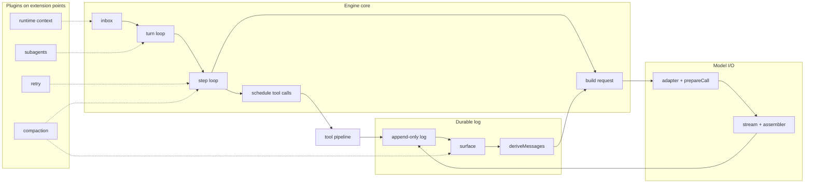

# Part I · Orientation

## 1 · The core idea

An agent loop talks to a model, runs the tools it asks for, feeds results back, repeats. What makes this engine worth studying is **where it keeps state**: not an in-memory transcript, but an **append-only event log**, from which every request is *recomputed* immediately before dispatch. Nothing is overwritten or deleted.

That one decision collapses four hard problems into one operation: resume reads the log, fork copies a prefix, trimming appends a "these are superseded by this summary" marker, replay re-folds a recorded log. The rule is repo-wide — *"Model-visible ⟺ logged: anything that reaches a model request must be reconstructable from the session log"* (`AGENTS.md`) — and is stated as a runnable assertion whose failure message is **"log-reconstruction desync"** (§11).

Three consequences run through everything:

- **Writing to the log is how you change anything.** No side channels.
- **History is rewritten by addition.** A summary plus a marker; the raw events stay forever (§6).
- **The loop is small and not clever.** 1,756 lines. It does not know how to retry, compact, or delegate — those are plugins on documented extension points.

## 2 · Just enough architecture

One application entry, `apps/server`, hardcoding `profile: 'web'` (`src/index.ts:16`). `--profile` is refused outright:

```ts
if (argv.some(arg => arg === '--profile' || arg.startsWith('--profile='))) {
  program.error('error: this application serves the Web GUI only; --profile is not supported')
}
```
— `apps/server/src/args.ts:33-35`

**A profile is not a file.** It is an empty root config — `prepareProfile` writes the literal `[]` (`profile-boot.ts:80-84`) — plus an ordered stack of patch layers. No file in the repo lists the web composition (§34).

**Cordis**, the vendored plugin framework, contributes four concepts:

| Concept | Meaning |
|---|---|
| **Context** | Reading an unknown property is a *service lookup* walking the fiber chain; throws if unregistered (`reflect.ts:152-166`) |
| **Service** | Construction *is* registration — `Service`'s constructor calls `provide()` before your body runs (`service.ts:42-59`) |
| **Fiber** | One plugin instance. Stays `PENDING` until every `inject` dependency resolves; unloads automatically when one disappears (`reflect.ts:314-336`) |
| **Effect** | `ctx.effect(fn, label)` runs `fn` and collects its return as teardown. *Every* registration in the codebase is one |

One nuance that matters later: disposers nested inside one effect run strict LIFO, but **sibling top-level effects on a fiber tear down concurrently** (`fiber.ts:675-696`).

The engine is one row among ~90:

```yaml
- id: agent-loop
  name: '@deepseek-ai/dsh-agent-loop'
  config: { agents: [] }
```
— `packages/bundle/base/cordis.patch.yml:486-489`

It injects exactly six services — `agents, sessions, llm, tools, systemPrompt, sessionProjections` (`index.ts:353`). Everything else reaches it through extension points; the engine does not know those plugins exist.



Solid arrows are the main path of a turn. **Dotted arrows are plugins reaching in** — and they are the interesting part: compaction rewrites the surface and can force a request to be re-issued, retry decides whether a failed request runs again, and runtime context injects through the inbox so it becomes ordinary logged history rather than a side channel.

### What is *not* running

A recurring hazard: capable-looking packages that never mount.

| Thing | Status |
|---|---|
| Hook bridges (`hooks-claude-code`, `hooks-codex`) | absent from every composition layer |
| `dsh-schedule`, `ui-schedule` | opt-in overlay; UI row `disabled: true` |
| `packages/experimental/**` (106 files) | referenced by no composition file |
| Runtime invariants (`dsh-invariants`) | **mounted nowhere** (§11) |
| SQLite session search | mounted `openAt: never` — never opened |
| Native DeepSeek adapter | `disabled: true` in web (§32) |
| `tool-str-replace-editor` | disabled in web, **not** re-mounted by the preset |
| `skill-badge`, `hmr` | `disabled: true` in base |
| `agent/turn-stopping` listeners | point is live; **zero** live listeners |
| `tools/pre-execute` producing `ask` | seam complete; **no always-on producer** |

## 3 · Core data structures

Examples come from `snapshots/session/text-turn/`, a recorded session. **It is normalized** — `{{session:1}}`, `{{cwd}}`, `{{message:N}}`, `{{system}}`, `{{tools}}`. The identity tokens are *relationship-preserving*: numbered by first appearance and reused, so the same token twice proves the same id (`identity.ts:64`).

**`SessionEvent<T>`** (`types.ts:391-398`): `seq` · `time` · `type` · `data`, plus optional `ignorable?: true`, and `surfaceOp` / `sourceEventSeqs` on surface-eligible types only.

**`seq` is the log index**, assigned at one site — `seq: this.log.length` (`index.ts:627`) — and re-verified at three more.

**`SessionEventMap`** core entries (`types.ts:216-320`):

| Type | Payload |
|---|---|
| `turn/start` · `turn/end` | `{turn}` · `{turn, reason: TurnEndReason}` |
| `step/start` · `step/end` | `{turn, step}` |
| `user/message` | `UserMessage` — the data **is** the message |
| `assistant/chunk` | `{turn, step, chunk: StreamChunk}` |
| `assistant/message` | `{turn, step, message, usage?, interrupted?}` |
| `tool/call` | `{turn, step, callId, name, arguments}` |
| `tool/result` | `{turn, step, message, error?, meta?}` |
| `request/header` | `{header: EpochHeader, reason, startsSeries?}` |
| `request/context` | `RequestContext` |

The map is open; the build generates the full ~50-type vocabulary into `known-event-types.ts:22-74`, which is a **read-side gate**: a stored log containing a type outside it is refused unless the event is `ignorable`. That is why adding an event type needs no format bump. `SESSION_FORMAT_VERSION = 0` (`types.ts:51`) moves only for structural change.

**`TurnEndReason`** (`types.ts:150-169`): `completed` · `max-tokens` (**sticky**) · `blocked` · `aborted{reason}` · `error{failure}` · `interrupted` (**only** written by crash repair).

**The surface.** Only three types may join — `user/message`, `assistant/message`, `tool/result` (`types.ts:330-334`) — and each **must** declare:

```ts
type SurfaceOp = 'append' | { op: 'replace'; start: number; end: number }
```
— `types.ts:359-361`

```ts
interface SessionSurface { readonly nodes: readonly number[]; readonly replaceGeneration: number }
```
— `surface.ts:137-142`

**Messages** (`message.ts:131-140`): `id` · `role` · `content: ContentBlock[]` · `source`. Source kinds: `user`, `plugin` (carries plugin name), `model` (provider/model), `tool` (callId). Built only through frozen factories.

**Content blocks** (`types.ts:54-110`): `text` · `reasoning` · `image` · `tool-call {id, name, arguments}` — arguments a **raw JSON string** — · `tool-result`.

A real assistant message, from the fixture (`session.jsonl:23`) — two blocks, reasoning then answer:

```json
{"role":"assistant",
 "content":[{"type":"reasoning","text":"The user wants me to reply with exactly the word \"PONG\"..."},
            {"type":"text","text":"PONG"}],
 "source":{"kind":"model","provider":"deepseek-official","model":"deepseek-v4-flash"}}
```

with real usage `{"inputTokens":3091,"outputTokens":23,"cacheReadTokens":0,"reasoningTokens":20}` — 3,091 input tokens for a one-word answer, almost all of it system prompt and tool schemas (§31).

**`StreamChunk`** (`types.ts:364-376`): `block-start` · `text-delta` · `reasoning-delta` · `tool-call-delta` · `block-end` · `usage` · `finish`. `FinishReason`: `stop` · `tool-calls` · `max-tokens` · `aborted{failure}` · `error{failure}`.

**`EpochHeader`** (`types.ts:179-188`): `config: LlmCallConfig` · `adapterDefaults?` · `system?` · `tools?`. `adapterDefaults` is `{reasoningEffort?: true, maxTokens?: true}` — a record of which fields the *adapter* supplied, so the next request can strip and re-resolve them (§10).

**Tools** (`tools/src/index.ts:214-280`, `:549-573`):

```ts
interface ToolDefinition extends ToolSchema {
  output: { schema, render(args, value), presentationMeta? }
  execute(args, exec): Promise<unknown>          // returns a VALUE, not prose
  finalizeContent? · timeoutMs? · isConcurrencySafe?(args) · presentCall? · presentResult?
}
type ToolExecutionResult =
  | { isError: false; value: JsonValue; content; meta?; additionalContexts?; concludesTurn? }
  | { isError: true;  error: ToolFailure; content; meta?; additionalContexts? }
```

Three facts: **`value` never reaches the log**; `additionalContexts` are messages for the *next* step; `concludesTurn` is typed `never` on failures, so a failed call can never stop a turn.

# Part II · The mental model

## 4 · The engine in ~100 lines

Real control flow, hard parts removed. Names are real names from `agent-loop/src/agent.ts`.

```ts
private async kick(): Promise<void> { while (await this.turn()) {} }

private async turn(): Promise<boolean> {
  const turn = ++this.turnNumber
  this.session.append('turn/start', { turn })
  let turnEnds: TurnEndReason | null = null, step = 0
  try {
    while (true) {
      const claimed = this.inbox.claim(step === 0 ? 'next-turn' : 'next-step', turn)
      const assembly = await this.ctx.systemPrompt.assemble({ agent: this, scope: this })
      step += 1
      this.session.append('step/start', { turn, step })
      for (const m of claimed) this.session.append('user/message', m, { surfaceOp: 'append' })
      turnEnds = await this.step(turn, step, assembly)
      this.session.append('step/end', { turn, step })
      if (turnEnds && this.inbox.nextStep.length === 0) break
    }
  } finally {
    this.session.append('turn/end', { turn, reason: turnEnds ?? { kind: 'completed' } })
  }
  return this.inbox.hasPending
}

private async step(turn, step, assembly): Promise<TurnEndReason | null> {
  const request = {                                   // ← THE line the design exists for
    provider: this.options.provider, model: this.options.model,
    system: renderPrompt(assembly), tools: assembly.tools,
    messages: this.session.deriveMessages(),          //   not this.messages
  }
  this.session.append('request/header', { header: canonicalHeader(request), reason: 'initial' })

  const assembler = new BlockAssembler(); const chunkSeqs: number[] = []
  for await (const chunk of this.ctx.llm.stream(request)) {
    chunkSeqs.push(this.session.append('assistant/chunk', { turn, step, chunk }).seq)
    assembler.push(chunk)
  }
  const message = createAssistantMessage({ content: assembler.blocks(), source: {...} })
  this.session.append('assistant/message', { turn, step, message },
    { surfaceOp: 'append', sourceEventSeqs: chunkSeqs })

  if (assembler.finish.kind === 'max-tokens') return { kind: 'max-tokens' }
  const toolCalls = message.content.filter(b => b.type === 'tool-call')
  if (toolCalls.length === 0) return { kind: 'completed' }
  for (const call of toolCalls) { /* append tool/call, execute, append tool/result */ }
  return null                                          // null = "no ending yet, run another step"
}
```

**Three nested loops**: driver over turns, turn over steps, step over request retries. **Input is claimed at boundaries**, never mid-flight. **Boundary events carry no model-visible content** — they exist so the log can be *parsed* (crash repair, UI, step attribution). **Returning `null` is how a turn becomes multi-step.**
