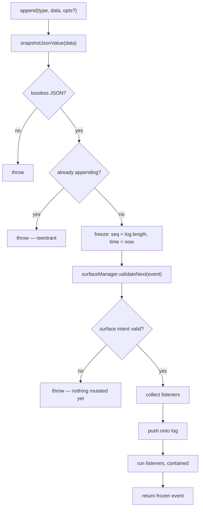
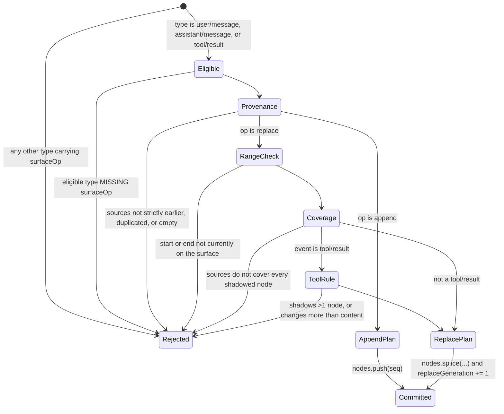
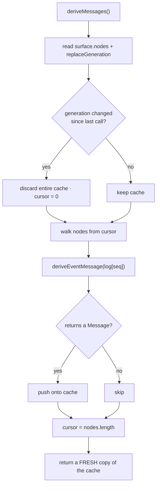

# Part III · The mechanisms

## 5 · The append-only log

`Session` is a **plain class, not a service** (`core/session/src/index.ts:423`), reached through `Session.create()` or `Session.fromRestore()` (the exclusive-ownership path persistence uses). The Cordis service `SessionStore` (`ctx.sessions`) is **in-memory only** — *"Persistence is intentionally not implemented here — persistence plugins subscribe to `session/event`"* (`:786-789`).

`append<T>(type, data, ...opts)` (`:602-653`). The signature does real work:

```ts
...opts: T extends SurfaceEventType ? [opts: SurfaceIntent] : []
```
— `:602-606`

A conditional rest parameter: surface intent is **required** for the three surface types and **forbidden** for every other. You cannot forget it, and cannot attach it wrongly.



**Snapshot is strict.** `snapshotJsonValue` rejects BigInt, functions, symbols, `undefined`, `-0`, non-finite numbers, circular refs, sparse arrays, and class instances including Map/Set/Date (`:588-591`). Anything that would not JSON round-trip identically is refused at the boundary.

**Reentrancy is refused** (`:621-624`) — an append triggered inside another append's synchronous `session/event` dispatch would break `seq = log.length`.

**Validate before commit.** `validateNext` runs *before* the push, so a bad marker throws with no state mutated. Listeners are snapshotted before the push but run after it (`:636-641`); a listener registered during dispatch is not called for that event. Observer failures are contained per listener (`:379-397`) — they cannot un-commit.

| Decision | Condition | Site |
|---|---|---|
| Reject payload | not losslessly JSON | `:612-615` |
| Reject legacy shape | retired `request/header-delta` | `:616` |
| Reject reentrancy | append in progress | `:621-624` |
| Reject surface intent | range absent / provenance incomplete / wrong type | `surface.ts:185-243` |
| Contain listener failure | any throw or rejection | `:379-397` |

There is no branch where an append is silently dropped: every path commits or throws.

**`seq` contiguity is checked at four boundaries** — seed validation `if (snapshot.seq !== index) throw` (`:523-525`), the surface fold (`surface.ts:328-330`), persistence batches (`coordinator.ts:722-726`), and the assignment itself. Enforced in one place it is a convention; in four it is load-bearing.

**Unknown event types are a hard stop unless skippable:**

```ts
if (KNOWN_SESSION_EVENT_TYPES.has(event.type) || event.ignorable === true) continue
throw this.unsupported(meta, `session "..." contains event type "${event.type}" ...`)
```
— `coordinator.ts:1143-1148`

Vocabulary grows freely; a *required* unknown event refuses the session rather than being misread.

**The header is deliberately outside the log** (`SessionHeader`, `types.ts:56-94`) — "a storage concern, not replayable conversation state." Its `version` **is** `SESSION_FORMAT_VERSION` (`format.ts:13, 267-276`), and `delegationDepth` is the persisted subagent floor (§28).

No configuration knobs. Everything bounding growth lives outside the log — which is precisely why the log can promise permanence.

## 6 · The surface

The model does not see the log; it sees an ordered list of visible log positions. To "remove" a range you write a new event and rewrite the reading list — the originals stay.



**Eligibility is a closed union** — plugins cannot extend it. `surfaceOpOf` (`:185-208`) throws in both directions: a non-eligible event carrying surface fields, or an eligible one missing `surfaceOp`. No default.

**Provenance** (`assertProvenance`, `:210-243`): entries must be non-negative safe integers **strictly earlier** than the citing event's own `seq`, no duplicates, non-empty — *except* an `assistant/message` may carry an empty array, for a known empty provider stream (`:221-222`).

**The coverage rule** makes a rewrite honest:

```ts
shadowedSeqs.filter(seq => !sources.has(seq))   // must be empty
```
— `:239-242`

`sourceEventSeqs` must be a **superset of every shadowed node**. You cannot supersede an event without citing it, so a replacement is always reconstructable without guessing from range bounds. (§21 depends on this being complete rather than best-effort.)

**Applying:**

```ts
state.nodes.splice(plan.startIdx, plan.endIdx - plan.startIdx + 1, plan.seq)
state.replaceGeneration += 1
```
— `:362-379`

`replaceGeneration` is incremented **only** here, and is read by four other mechanisms (§7, §10, §21, §27).

**`tool/result` rewrites are deliberately narrow** (`assertToolResultRewrite`, `:287-318`): exactly one shadowed node, and only the tool-result block's `content` may differ — everything else must be deep-JSON-equal, checked by nulling `content` on both sides. This exists for the pruner (§27): it is structurally impossible for pruning to change *whether a tool failed* or *which call it belonged to*.

**The surface is the wrong source for a human transcript:**

> "a landed replacement would erase conversation the user already saw. Append-origin events are that transcript's durable source material; replacement copies stay model-only."
> — `:44-48`

Hence `isAppendSurfaceEvent` vs `isReplacementSurfaceEvent` (`:35-68`). A UI reads append-origin events from the log; the model reads the surface. Same log, two views.

`SurfaceManager` folds incrementally with a `_pendingPlan` cache; `foldSurface(events)` (`:387-395`) replays a complete log purely. The module avoids `node:` imports so browsers fold the same surface from the same events (`:1-9`).

Real production writers of `replace`: compaction (`compaction-basic/src/region.ts:472-475`) and the tool-result pruner (`compaction-tool-result-pruner/src/index.ts:167-173`).

## 7 · From log to request

The projection is deliberately dumber than you would expect, because it runs on every request *including replays of old logs* — cleverness here changes the meaning of history recorded under the old behavior.

```ts
export function deriveEventMessage(event: SessionEvent): Message | null {
  switch (event.type) {
    case 'user/message':      return event.data
    case 'assistant/message': return event.data.message.content.length === 0 ? null : event.data.message
    case 'tool/result':       return event.data.message
    default:                  return null
  }
}
```
— `surface.ts:83-114`

- `user/message` is a **verbatim pass-through** — *"Do NOT re-add per-type framing (e.g. `<context>`) here: framing is caller-owned"* (`:90-94`). What the model sees is exactly what is in the log.
- An **empty-content assistant message derives to `null`** — a max-tokens step still logs one to carry usage, and it must not enter the transcript (`types.ts:257`).
- The `default` is **intentionally non-exhaustive**, no `assertNever`: "only message-producing events derive history; turn/step boundaries, chunks, usage, and errors are trace/replay data" (`:84-86`). New event types correctly contribute nothing.



The walker (`index.ts:724-745`) keeps an **append-only cache with a cursor**, and throws the whole cache away when `replaceGeneration` changes — safe only because the surface is otherwise append-only; a replace splices the middle. Cost: O(new nodes) amortized, O(surface) once after a compaction. It returns a **fresh array of shared frozen messages** — no caller can observe another's mutation, and no second deep clone is needed (`:718-721`).

Sole production caller: `agent.ts:355`, feeding the request's `messages`.

## 8 · Projections

The general form of what `deriveMessages` does for messages: a **registered, versioned, pure fold** over the log.

```ts
interface ProjectionDefinition<K, S> {
  key: K; stateSchema: ZodType<S>
  init(header): S; apply(state, event): S
  wire?: { viewSchema; view(state) }; stateVersion: number
}
```
— `session-projection/src/index.ts:42-86`

Constraints, all stated in source: `apply` is **pure and synchronous** (*"an async unit would tear the carriers' consistency cut"*, `:39`); it **must return the same reference when uninterested** — `Object.is` equality "produces zero downstream work" (`:58-59`); state must be plain JSON, because it is persisted.

`stateVersion` is the cache-invalidation lever: bump it "so persisted `(sessionId, key, ver, seq, val)` rows from an older unit are discarded instead of being forward-applied into garbage" (`:80-84`).

Registration goes through `ctx.effect` (so an unloaded plugin's key vanishes and clients read it as capability absence) and **refcounts** — the same package under N presets registers N times, surviving until the last unmounts; a `stateVersion` mismatch between registrants **throws** (`:264-278`).

**Driving is a double debounce** (`:625-661`): run `apply`; if the reference is unchanged, stop. Only if changed *and* someone is listening, compute the wire `view()`; compare *that* by `Object.is` too; notify only on a real view change.

**Worked example — the engine's own projection** (`agent-loop/src/index.ts:55-93`, registered `:409`), `key: 'turnBoundary'`, `stateVersion: 2`, no `wire` (host-only):

```ts
apply: (state, event) => {
  switch (event.type) {
    case 'turn/start': return { ...state, openTurnStartSeq: event.seq, lastTurn: event.data.turn }
    case 'turn/end':   return { ...state, openTurnStartSeq: null }
    case 'step/start': return { ...state, lastStepStartSeq: event.seq,
                                lastStepBoundary: { kind: 'start', seq: event.seq } }
    case 'step/end':   return { ...state, lastStepBoundary: { kind: 'end', seq: event.seq } }
    default:           return state          // same reference — zero downstream work
  }
}
```

Its purpose: a resumed agent continues at turn 8 rather than 1 —

```ts
const lastTurn = this.loopCtx.sessionProjections.stateOf(session, 'turnBoundary')?.lastTurn ?? 0
```
— `agent.ts:101`

No counter is stored anywhere; the number is recomputed, exactly like the messages. `openTurnStartSeq` is also how a reader spots a turn left open by a crash (§30).

**Cold restore is guarded:** `restoreFloor` (`:413-423`) returns the lowest usable watermark **minus one**, so a suffix read can detect a log that shrank below a stale checkpoint (crash truncation) instead of trusting it; an unusable row with `baseSeq > 0` **throws**, forcing a re-read from seq 0. Checkpoints are `structuredClone`d — "never the live cell reference."

**The persisted cache** is `session-projection-cache`, injecting `['storageDomain', 'sessionProjections', 'sessions']` (`:78`), one record per session on the `session_projcache` domain over the JSON backend. `writeEveryEvents: 200` / `writeIntervalMs: 5000` are throttle bounds *between mandatory checkpoint points*, not the only writes. Reads are synchronous from in-memory tables — never stale-but-wrong, at worst older than the last durable write.
