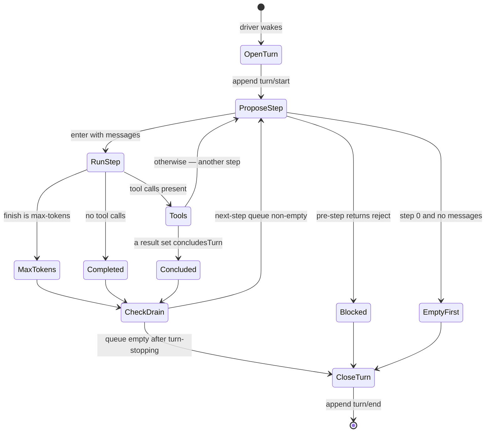
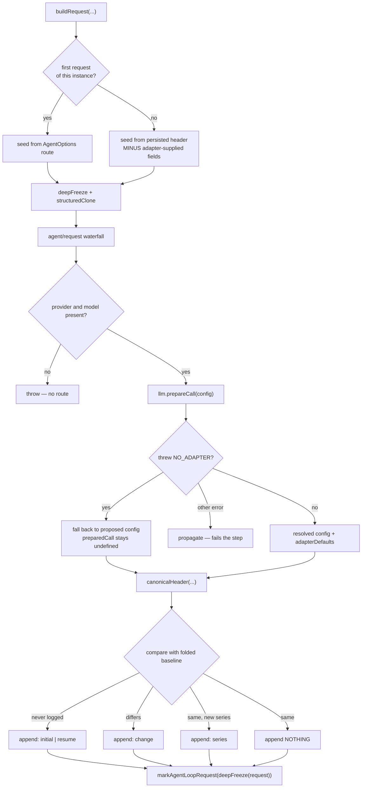
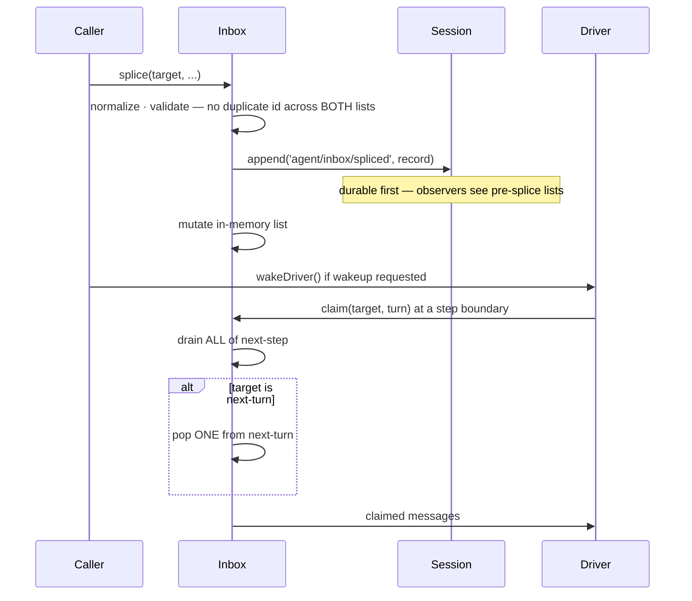
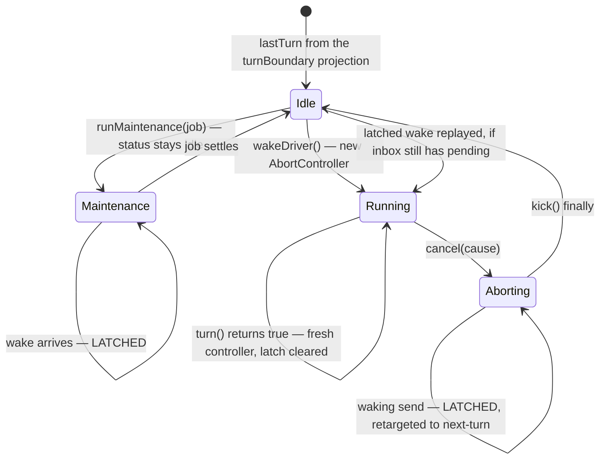
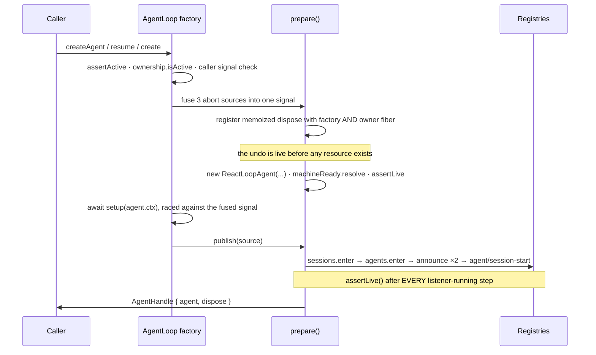

## 9 · The turn and step loops

| Loop | Site | Iterates | Exits when |
|---|---|---|---|
| driver | `agent.ts:221` | turns | `turn()` returns `false` |
| turn | `:272` | steps | an ending is set **and** `next-step` is drained |
| step | `:348` | request attempts | returns, or nobody asks for a retry |

A *turn* is one unit of conversation; a *step* is one model request within it. A turn with three tool round-trips has four steps.

```ts
private async kick(): Promise<void> {
  try { while (await this.turn()) {} }
  catch (_error) { /* Reported failures and cancellation are contained at the driver boundary. */ }
  finally {
    if (this.phase.kind === 'running') {
      const { turn, wakeRequested } = this.phase
      this.setPhase({ kind: 'idle', lastTurn: turn })
      if (wakeRequested && this.inbox.hasPending) this.wakeDriver()
    }
  }
}
```
— `:219-232`

The empty `catch` is correct: by the time an error arrives it has already been reported — `throwError` (`:212-217`) emits `agent/error` with turn and step *before* rethrowing. Swallowing here is what stops one failed turn killing the agent.



### Turn loop, branch by branch (`:255-339`)

1. `signal.throwIfAborted()` (`:273`) — first of six checks in this function.
2. `preStep(target, {turn, step})` (`:275`).
3. **Rejected** → `turnEnds = {kind:'blocked'}`, `return false` (`:276-279`). This stops the **driver**, not just the turn — no further turns are attempted.
4. `if (turnEnds && decision.messages.length === 0) break` (`:280`).
5. **First step, nothing to say** → `{kind:'completed'}`, `return false` (`:283-286`). A removed waking message or a listener rewriting messages to empty "still owns the initial turn boundary, but it spends no model call." **A turn can open and close without ever contacting the model.**
6. Append `step/start`, then one `user/message` per claimed message (`:288-293`) — where injected context becomes ordinary logged history.
7. Run the step, then fold the ending:
   ```ts
   if (turnEnds === null || turnEnds.kind !== 'max-tokens') turnEnds = stepEnd
   ```
   — `:299`. **`max-tokens` is sticky**: a later clean step cannot mask a truncated answer.
8. `step/end` appended in a `finally` (`:301`) — always, including on throw.
9. **Last chance to continue** (`:304-308`): if `turnEnds` is set and `nextStep` is empty, `await dispatch.serial('agent/turn-stopping', …)`, then **re-test the same condition**. A listener that wants continuation calls `agent.steer(...)`, putting a message in `nextStep`. Data-driven, so listener order cannot change the outcome. *In the shipped profile this point has **zero** live listeners.*
10. Otherwise `target = 'next-step'` (`:309`).

**Exits.** On throw (`:311-324`): if aborted → `{kind:'aborted', reason}` and rethrow; else the failure is **structured** —

```ts
error: error instanceof LlmError ? error.failure : { message: errorChain(error), code: 'UNKNOWN' }
```

so the log never holds an unstructured error. `finally` appends `turn/end` (`:328`), and a failure *to append that* is itself routed through `throwError`. Then:

```ts
if (!this.inbox.hasPending) return false
phase.abort = new AbortController()   // fresh controller per turn
phase.wakeRequested = false           // a latch on the old one is stale
phase.step = 0
return true
```
— `:333-338`

### Step loop, branch by branch (`:341-438`)

Returns `StepEndReason | null`, where **`null` means "run another step."**

1. Capture `surface.replaceGeneration` (`:349`) for series detection.
2. `buildRequest(...)`, then `startsRequestSeries = false` (`:360`) — only the first attempt can open a series.
3. `const stream = preparedCall?.stream(request) ?? this.loopCtx.llm.stream(request)` (`:364`).
4. Per chunk (`:366-370`): abort check, append `assistant/chunk`, collect `seq`, `assembler.push`.
5. **On throw while streaming** (`:372-389`): *only if* `signal.aborted`, salvage `assembler.interruptedBlocks()`; if non-empty append an `assistant/message` with `interrupted: true` citing the chunks so far. Rethrow regardless — salvaging is not recovering.
6. **Request failed** (`:390-408`): run the `agent/request-error` waterfall with default `undefined`. If the action is not `{kind:'retry'}` → `throw new LlmError(...)`. Otherwise `continue`, rebuilding the request from scratch. **The loop never decides to retry.**
7. Append `assistant/message` (`:418-427`) citing every chunk seq.
8. `finish.kind === 'max-tokens'` → `{kind:'max-tokens'}` (`:428`).
9. `toolCalls.length === 0` → `{kind:'completed'}` (`:430`).
10. Else `executeToolCalls(...)`; `return concluded ? {kind:'completed'} : null` (`:432-436`). The callback passed in splices a tool's `additionalContexts` into the `next-step` queue.

**The only condition for a turn to continue:** the model emitted ≥1 tool call **and** no committed result set `concludesTurn`.

**Six abort checks per turn** — `:261, :273, :287, :303` plus two inside `preStep` — so an aborted turn cannot leave a `step/start` without a `step/end`. **The step retry loop has no cap of its own**; bounding is entirely the listener's job (§25).

## 10 · Building the request

| Stage | Behavior |
|---|---|
| Seed (first request of this loop instance) | `{provider, model, reasoningEffort?, maxTokens?}` from `AgentOptions` (`:472-476`) |
| Seed (later) | `requestProposal(persistedHeader)` (`:61-67`) — **strips** `reasoningEffort`/`maxTokens` where `adapterDefaults` marks them adapter-supplied, so they re-resolve |
| Persisted effort | restored only if same provider **and** same model **and** not adapter-supplied (`:461-465`) |
| Proposal | `deepFreeze(structuredClone(seed))`, then the `agent/request` waterfall (`:478-481`) |
| Hard fail | proposal lacks provider or model (`:483-485`) |
| Resolve | `llm.prepareCall`; **only** `NO_ADAPTER` falls through to the unresolved config (`:488-495`) — every other error fails the step |



`requestProposal` is the answer to defaults leaking across a model switch: a *user-chosen* `maxTokens` survives, an *adapter-chosen* one does not.

The `agent/request` waterfall is where a `/model` switch lands, and deliberately **cannot touch messages** — *"Model-visible content must use logged channels; this waterfall cannot mutate messages"* (`runtime-types.ts:242-243`).

**Header logging is three-way** (`:507-518`) — the header is logged **only when it changes**, so a thousand-step stable session holds one header event, not a thousand:

| Reason | When |
|---|---|
| `initial` | first request of this instance, log had no header |
| `resume` | first request of this instance over a log that already has headers |
| `change` | differs from the folded baseline |
| `series` | unchanged, but a new message series began |
| *(nothing)* | unchanged and not a series |

```ts
const startsSeries = startsRequestSeries || this.requestSurfaceGeneration !== surfaceGeneration
```
— `:505-506`

That second clause is compaction's signature: after a rewrite the next request is not a continuation even though the header is byte-identical. `request/context` (provider/model/contextWindow) is likewise appended only on change (`:527-532`).

Finally `markAgentLoopRequest(deepFreeze({...}))` (`:535-542`) — a process-local `WeakSet` tag (`call-config.ts:66-78`), never serialized, marking *this exact object* as loop-built so a listener can distinguish it from an ad-hoc one-shot call.

## 11 · The reconstruction invariant

35 lines stating the book's thesis as a runnable assertion (`agent-loop/src/invariant.ts:19-55`), attached with two load-bearing flags:

```ts
ctx.on('llm/stream', (options, next) => {
  if (!isAgentLoopRequest(options)) return next()
  ...
}, { global: true, prepend: true })
```

**`prepend: true`** because "a short-circuiting replay listener" registered ahead would otherwise silence it — a check defeatable by registration order is not a check.

```mermaid
sequenceDiagram
  participant Loop as Agent loop
  participant Inv as Invariant listener
  participant Sess as Session
  participant Ad as Adapter
  Loop->>Inv: llm/stream(options)  [prepended, global]
  Inv->>Inv: isAgentLoopRequest(options)?
  alt not loop-built
    Inv->>Ad: next() — pass through unchecked
  else loop-built
    Inv->>Inv: frozen? sessionId present? messages frozen?
    Inv->>Sess: sessions.get(sessionId) — still live?
    Inv->>Sess: events contain a step/start? foldRequestHeader?
    Inv->>Sess: deriveMessages()
    Inv->>Inv: JSON.stringify equality + every header field
    alt mismatch
      Inv-->>Loop: fail("log-reconstruction desync")
    else
      Inv->>Ad: next()
    end
  end
```

Checks, in order: request frozen · `sessionId` present · resolves to a live session · `messages` array frozen · log contains a `step/start` · `foldRequestHeader` yields a header · then the central assertion:

```ts
const expected = session.deriveMessages()
if (JSON.stringify(options.messages) !== JSON.stringify(expected)) {
  fail(`llm request for session "..." diverges from the dispatch-time durable derivation (log-reconstruction desync)`)
}
```
— `:39-42`

…plus every header field: model, system, temperature, maxTokens, stop, tools (`:44-49`). Messages come from the surface, the rest from the folded header — together the whole request, which is what makes "reconstructable" complete rather than partial.

**It does not run in the shipped system.** `dsh-invariants` (the registry that runs companions) appears in **no** `.yml` anywhere — only `pnpm-lock.yaml`. Its own README: *"`dsh-base` deliberately omits runtime diagnostics… Loading the registry alone installs no checks."*

⚠️ The same README contradicts itself, claiming in its summary that "the standard agent composition already mounts it." The composition files settle it.

Why it still matters: it is the **executable specification** of what the engine guarantees, and it is the **test oracle** — 🧪 `request-reconstruction.spec.ts` (24 cases) and `invariant.spec.ts` (8 cases) pass on every run. What ships disabled is runtime enforcement, not verification. Disabling is defensible: it re-derives the whole history and runs two `JSON.stringify` passes per request.

Scope limit, from the package: *"Request reconstruction covers loop-built requests only"* — compaction's one-shot summarization carries a session id and is frozen, and is deliberately **not** checked, because it is not meant to equal the derivation.

## 12 · The inbox

Two ordered queues drained at step boundaries, backed by replayed `agent/inbox/spliced` events — **the queue *is* the log**, which is why a crashed agent resumes with pending input intact.

```
next-turn:  [prompt A] [prompt B]        ← ONE popped per turn opening
next-step:  [ctx] [steer] [tool ctx]     ← ALL drained every step
```



Replay starts at `session.header.seedLength ?? 0`, skipping a fork's inherited prefix (already encoded structurally). A malformed persisted splice **throws** (`inbox.ts:34-39`): a queue that cannot be reconstructed exactly is not safe to run on.

**Splice is durable-first** (`:157-193`): normalize like `Array.prototype.splice`; validate that no message `id` appears twice **across both lists** (`:202-219`, throws `"message ... is already pending"`); then

```ts
this.session.append('agent/inbox/spliced', splice)   // :186
this.state[target] = ...                              // :187
```

Ordering is deliberate — appending first means synchronous observers "see the pre-splice lists" (`:130-132`).

**Claim is asymmetric** (`:63-78`, marked `@internal`):

```ts
const claimed = this.mutate('next-step', 0, this.nextStep.length, [], false)
if (target === 'next-turn') claimed.push(...this.mutate('next-turn', 0, 1, [], false))
for (const message of claimed) this.notifications.claimed(message, turn)
```

All of `next-step`; **exactly one** of `next-turn`. The `false` is `discardRemoved` — claimed messages get their own `claimed` notification, because "consumed" and "thrown away" are different facts.

**Three senders, two axes** (`agent.ts:122-141`):

| Method | Queue | Wakes? | Meaning |
|---|---|---|---|
| `followup` | `next-turn` | yes | one item becomes one turn |
| `steer` | `next-step` | yes | joins at the next step boundary |
| `inject` | `next-step` | **no** | available when the agent next thinks; never wakes it |

🧪 `inject` on an idle agent produces **no activity at all** — only the splice event is logged, status stays `idle`, zero requests (`tests/agent.spec.ts:31-42`).

**The reclassification:**

```ts
const wakingAfterAbort = wakeup && this.phase.kind !== 'idle' && this.phase.abort.signal.aborted
const resolvedTarget = wakingAfterAbort ? 'next-turn' : target
```
— `:124-126`

A waking message arriving after the current activity aborted cannot join it, so it is retargeted to open a fresh turn. The flag is computed **before** the splice so a reentrant `cancel()` from an observer cannot reclassify it.

`clear()` (`:58-61`) discards both queues durably — so cancellation leaves no gap in the record. **A claimed message may never become a `user/message`**: if the step is then rejected, "the message ends here — never re-emitted" (`runtime-types.ts:196-197`). Consumers must treat `claimed` as consumed, not delivered.

## 13 · Phases, cancellation, quiescence

```ts
type Phase =
  | { kind: 'idle'; lastTurn }
  | { kind: 'maintenance'; abort; lastTurn; wakeRequested }
  | { kind: 'running'; abort; turn; step; wakeRequested }
```
— `:39-47`

Externally only two statuses: `maintenance` and `idle` both report `'idle'` (`:108-110`). Because `setPhase` compares the **collapsed** status (`:113-120`), an `idle → maintenance → idle` cycle emits nothing — a manual compaction never flickers a UI, and listeners that reset on `idle` are not spuriously triggered.



**Cancellation** (`:143-149`) clears the inbox *first* (which also clears the latch — a latch whose message is gone must not start an empty turn), then fires the signal. The `cause` travels: the turn records `{kind:'aborted', reason}`, so the log says *why*.

**The wake latch** (`:181-202`) is the answer to the window where an agent is neither usefully running nor idle:

```ts
if (reason?.kind !== 'disposed' && (this.phase.kind === 'maintenance' || wakeAfterAbort)) {
  this.phase.wakeRequested = true
}
```
— `:186-189`

Latched only from **maintenance** or the **aborting window**. A live running driver does not latch — it claims the queue itself. And **disposal never latches**: if it did, teardown would queue a turn while the agent is being destroyed, and `dispose()` awaits `whenIdle()` (§14) — it would wait on a model call it just cancelled.

Replay is guarded identically in two places — `kick()`'s and `runMaintenance`'s `finally`:

```ts
if (wakeRequested && this.inbox.hasPending) this.wakeDriver()
```

An explicit wake to an *idle* agent always opens its boundary even if its message was cleared; only a **latched replay** is suppressed when the queue no longer holds it (`:173-180`).

**Quiescence:**

```ts
async whenIdle(): Promise<void> {
  let activity: Promise<void>
  do { await (activity = this.activityDone) } while (activity !== this.activityDone)
}
```
— `:204-209`

The loop is the point: a latched wake replayed in `kick()`'s `finally` installs a *new* `activityDone` before the old one's awaiters run. `whenIdle()` means "no activity, and none started while I waited."

**No watchdog.** Convergence is entirely cooperative — a tool ignoring its signal delays teardown indefinitely, and there is no timeout or forced kill (§35).

## 14 · Agent lifecycle

The governing pattern: **register the undo before you do.** `prepare()` builds a memoized teardown and registers it with both the factory and the owner fiber **before any resource exists**, over mutable slots filled in as resources appear.

**The gate** (`:523-534`): `assertAgentOptions` · `ownerCtx.fiber.assertActive()` · `ownership.isActive()` · caller signal not already aborted. `isActive` is both a flag and a fiber-state test — `INACTIVE_STATES = {UNLOADING, DISPOSED, FAILED}` (`:38-42`) — so a factory whose fiber is unloading cannot own a new lifecycle.

**Three cancellations fused into one signal** (`:542-550`), each with its own reason: the caller's, the owner fiber's unload, and factory teardown (which aborts with `new Error('agent loop is not active')`).

**The memoized teardown** (`:560-583`):

```ts
const dispose = (ownerTriggered = false) => (disposing ??= (async () => {
  abort.abort(new Error(`agent "${id}" lifecycle disposed`))
  // …detach both listeners…
  try {
    if (machine === undefined) await machineReady.promise    // disposal racing construction
    if (machine !== undefined) {
      machine.cancel({ kind: 'disposed' })                    // the cause that never latches
      await machine.whenIdle()
      await machine.scope.dispose()
    }
  } finally {
    try { detachAgent?.(); detachSession?.() }
    finally { untrack(); if (!ownerTriggered) await unfollowOwner() }
  }
})())
```

`disposing ??=` makes it idempotent — every racing owner awaits **one** quiescence. Strict reverse order: stop the machine, wait for it to stop, unwind the scope, leave the registries, release bookkeeping. `ownerTriggered` stops the owner's own effect unregistering itself from inside itself.



**Publication** (`:619-633`) — enter both registries, *then* announce, with `assertLive()` after **every** step that runs listener code:

```
assertLive → sessions.enter → agents.enter → sessions.announce → assertLive
           → agents.announce → assertLive → emit agent/session-start → assertLive
```

Each announcement can synchronously run third-party listeners, any of which may start teardown; `agent/created` can even veto publication by throwing synchronously (`agent/src/index.ts:551-567`).

**Three entry points**, all funnelling through `setupAndPublish` (`:688-708`): `create` (fresh, factory-owned), `createAgent` (fresh, caller-owned), `resume` (loaded from disk). The `setup` callback runs **after construction, before publication** — so an agent is never visible without its preset composition (§34) — and is raced against the fused signal so a hanging setup cannot pin the lifecycle.

**Resume adds a load barrier** (`:747-752`):

```ts
preparation = await raceAbortCall(() => persistence.prepare(id, fused), fused, id,
  (abandoned) => { abandoned[Symbol.dispose]() })
```

The fourth argument is `releaseAbandoned`: if the race is lost the load still completes, and the abandoned preparation is **disposed rather than leaked**. Afterwards ownership is re-checked (`:756-757`) because everything may have changed while the disk spun.

**Factory teardown awaits both live agents and in-flight startup jobs** (`:137-145`) — an agent still being created when the factory shuts down is awaited too.

**Configured-agent edges:** `waitForDrainingConfiguredIdentity` (`:494-514`) waits on `agent/disposed` + `session/disposed` only if the id currently occupies a registry; restore falls back to fresh creation **only for genuine absence** — corruption and backend failures stay loud (`:479-490`); declarative startup failures are *reported* via `agent-loop/config-start-failed` with per-listener try/catch (`:448-467`), never thrown.
