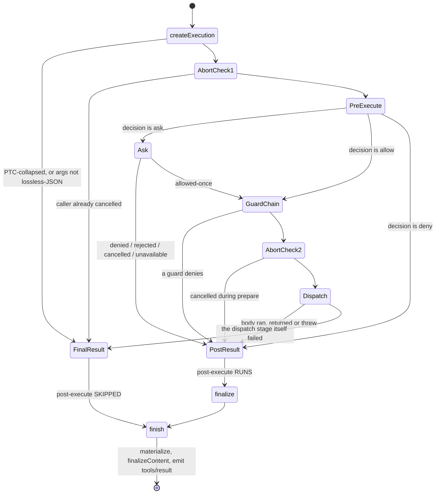
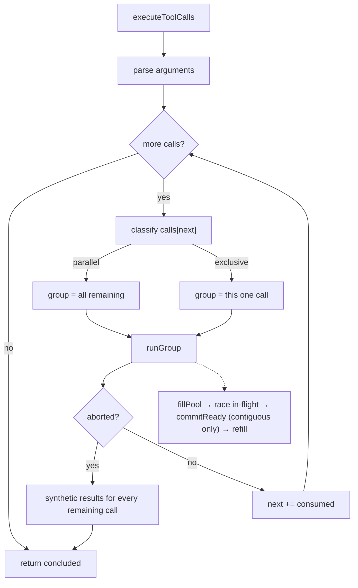
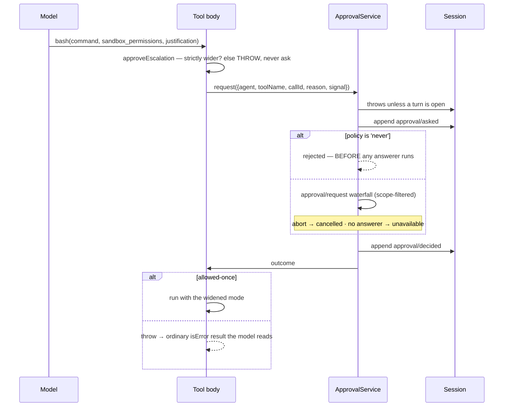
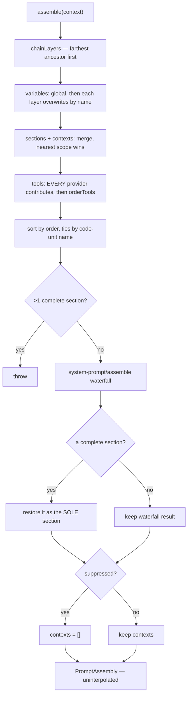
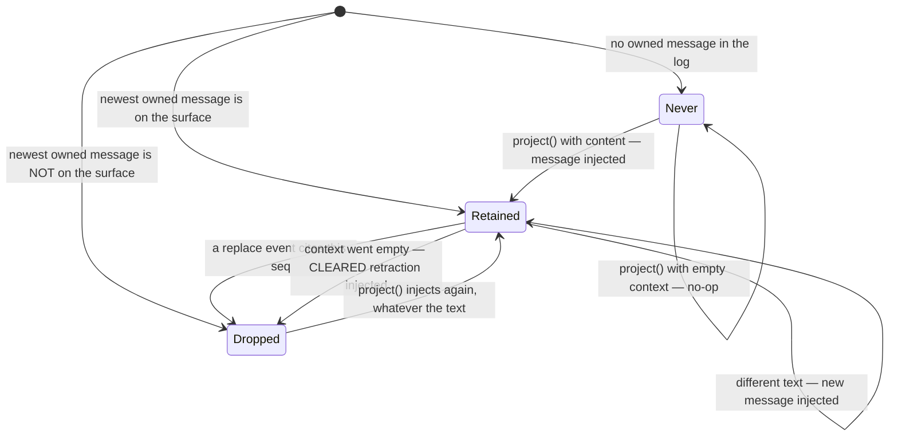
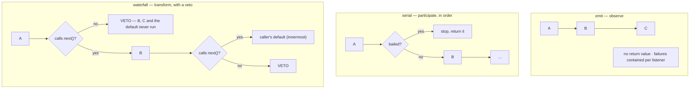

## 15 · The tool registry

`ToolRuntime` at `ctx.tools` (`core/tools/src/index.ts:780`). A definition separates three things usually conflated:

| Concern | Field | Audience |
|---|---|---|
| what the model may call | `name`, `description`, `parameters` | the model |
| what actually happens | `execute` → a canonical **value** | the system |
| what the model reads back | `output.render(args, value)` | the model |

`execute` does not produce prose. It produces data, validated against `output.schema` and *projected* into content. Replay re-renders from the stored value; a UI presenter draws from the same value.

```ts
register(definition): () => void {
  // output-shape, timeoutMs, reserved-name checks
  return this.layers.effect(this.ctx, layer => layer.tools.insert(name, definition),
                            { label: 'tools.register()' })
}
```
— `:1028-1053`

`this.layers` is a `ScopedLayers` — a global layer plus one per scope — which is what lets one registry serve every agent while a preset-mounted tool is visible only to agents on that preset (§34). Duplicate names in a scope throw (`:719-721`); the transport name `run_code` is reserved and can never be registered or shadowed (`:1045-1047`).

**`defineTool`** (`schema.ts:545-617`) compiles an authoring DSL to JSON Schema and wraps callbacks **asymmetrically**:

```ts
async execute(args, exec) {                       // STRICT
  const violations = validate(args)
  if (violations.length > 0) throw new ToolArgsError(violations)   // every violation, not the first
  return userExecute(args, exec)
}
// presentCall / presentResult / isConcurrencySafe: swallow invalid args → undefined / false  (:594-616)
```

The asymmetry is the point: `execute` must be strict because running with bad arguments could do damage; presenters must be lenient because **they run against old logged arguments during replay**, where a schema may since have changed. A presenter that threw would make historical sessions unopenable.

**The raw path is live, and instructive.** Two production sites register hand-built definitions, both because their schema is only known at runtime: MCP tools arrive from a remote server (`mcp-client/src/tools.ts:182`), and the subagent structured-output tool takes the caller's requested shape (`subagent-in-process-driver/src/structured.ts:74`). The latter re-implements validation by hand — *"ToolArgsError → isError result with INVALID_ARGS: the model retries within the same turn, exactly like a schema-validated defineTool call."* That is the obligation the raw path carries: **the framework validates nothing for you.**

`finalizeContent` is snapshotted at call creation (`:1409`), so a tool unregistered mid-call still gets *its own* finalizer, not whatever now occupies the name.

**The tool list is part of the request header**, so registry changes log a `change` header and invalidate provider prefix caching — which is why plan mode restrains by instruction rather than by removing tools: *"The tool catalog stays the same across modes for request-cache stability… those tools remain listed only to keep the request shape stable"* (`base/cordis.patch.yml:315`).

## 16 · The execution pipeline

```ts
interface ToolRuntimeScheduler {
  prepare(exec): Promise<ScheduledToolPreparation>   // ordered, may await — MAY this run?
  dispatch(exec): Promise<ScheduledToolDispatch>     // overlappable    — what happened?
  finalize(exec, result): Promise<ToolExecutionResult> // ordered       — change it?
  finish(exec, result): ToolExecutionResult           // sync           — freeze, notify
}
```
— `:444-453`, reached via the `TOOL_RUNTIME_SCHEDULER` symbol (`:459`)

The ordinary `execute()` chains the same four (`:1333-1353`); the scheduler merely exposes the seams so a caller can interleave (§17).



**`prepare`** (`:1454-1498`) checks the **PTC collapse first**, before anything observes the call, because *"pre-execute listeners, approval `ask`, and guards must never observe — or worse, approve — a call that can only fail"* (`:1364-1370`). Then: caller-abort → `tools/pre-execute` waterfall (default `{kind:'allow'}`) → approval if `ask` → guard chain (only if the decision was `allow`) → second abort check → `{kind:'dispatch'}`.

**`dispatch`** runs the `tools/execute` around-waterfall whose innermost `next()` is the body. `fuseToolSignals` (`:1880-1907`) re-fuses the caller's *original* signal beneath whatever a wrapper substituted — **a wrapper cannot detach caller cancellation**. Cancellation *during* dispatch yields `TOOL_ABORTED` (body ran) rather than `ABORTED_BEFORE_DISPATCH` — the distinction a caller needs to decide about retrying. `dispatch` never returns `'dispatch'`; only `post-result` or `final-result`.

**`finalize`** runs `tools/post-execute`: `block` → `isError` with the decision's feedback, **discarding tool-deferred context**; `accept` with `value` → re-validated, and it **cannot** replace the value of an already-failed result (`TypeError`, `:1756-1758`); both `content` and `value` → `TypeError`. **`finish`** materializes, applies the snapshotted `finalizeContent`, freezes `exec`, and emits `tools/result` with contained listeners.

### The `needsPost` rule — decided by which stage produced the result

| Outcome | From | Post-execute? |
|---|---|---|
| PTC collapse, bad args | `createExecution` | **no** |
| Cancelled before prepare ran | `prepare` entry | **no** |
| Denied by pre-execute or a guard | `prepare` | **yes** |
| Cancelled while approval pending | `prepare` | **yes** |
| Body ran, returned or threw | `dispatch` | **yes** |
| Dispatch stage itself failed | `dispatch` | **no** |

**Denials get post-execute** — deliberate: post-execute is about *results*, and a denial is a result (*"Thrown tools still reach this waterfall as errors"*, `:420-422`). What skips it are calls that never became a real dispatch candidate.

### Control decisions

| Decision | Condition | Site |
|---|---|---|
| Short-circuit to `final-result` | PTC-collapsed, or arguments not lossless-JSON | `:1427-1441` |
| `final-result` (abort) | caller signal already aborted at entry | `:1461-1463` |
| Run approval | pre-execute returned `ask` | `:1470-1472` |
| `post-result` (abort) | cancelled *while* approval was pending **and** the channel reported cancellation | `:1474-1476` |
| `post-result` (denial) | pre-execute `deny`, or a guard denies an `allow` | `:1477-1490` |
| `{kind:'dispatch'}` | everything passed | `:1494` |
| `final-result` | anything in `prepare` threw | `:1495-1497` |
| `TOOL_ABORTED` vs `…_BEFORE_DISPATCH` | `state.bodyInvoked` | `:1509-1516` |
| `TypeError` | post-execute `accept` supplies both `content` and `value`, or replaces a failed result's value | `:1748-1758` |

**Three execution views** matter when writing a wrapper: `ToolExecutionInput` (caller-supplied) → `ToolExecution` (registry-internal; adds `rootCallId` and an opaque `token`, frozen just before `tools/result`) → `ToolRunContext` (handed to `execute`; adds `deferContext` and `concludeTurn`). A fourth, `ToolDispatchExecution` (`:384-387`), deliberately makes `signal` **mutable** so an around-dispatch wrapper can substitute its own — while `fuseToolSignals` re-fuses the caller's original underneath regardless.

`run_code` is a **second consumer** of this same interface, re-implementing the ordered-prepare / overlapping-dispatch / ordered-commit discipline for sub-calls (`ptc.ts:280-587`) — which is why the symbol is exported at all.

## 17 · Scheduling a step's tool calls

Three rules: **classify at the boundary** — the first call's mode decides the group (parallel → all remaining; anything else → a one-call **barrier**); **dispatch may overlap, commits may not**; **every model call gets a result**, including ones cancellation prevented from starting.



```ts
function parseArguments(raw: string): unknown {
  try { return raw ? JSON.parse(raw) : {} } catch { return raw }
}
```
— `:105-111`

Invalid JSON returns the **raw string**. Not a bug: malformed model output must become a readable tool error, not a crash. It reaches `execute`, where `defineTool` rejects it as `ToolArgsError` — an ordinary `isError` result that still runs post-execute, so the model can correct **within the same turn**.

`executionMode` is synchronous and **fail-closed**: no declaration, a throwing classifier, or any non-`true` return all yield `exclusive` (`tools/index.ts:1267-1276`).

**Pool filling** (`:199-214`) re-reads modes live — a call classified parallel when the group formed may reclassify before it starts, and the pool stops there, making it the next barrier. A batch that began all-parallel can split mid-flight. The cap is destructured **per group** (`:132`) from a read-through getter, so a settings change caps the *next* group without disturbing one in flight.

**Ordered commit** (`:147-161`) — `if (slot === undefined) break` is the whole rule: advance only across **contiguous** settled slots. Consequences: `finalize`/`finish` run in model order, and `additionalContexts` reach the next step deterministically even from parallel tools.

The `tool/call` event is appended **before** `prepare` (`:168`), so the log records an attempted call even if policy denies it — and that presence is exactly what lets crash repair distinguish its two cases (§30).

**Cancellation vs failure** is the best-designed distinction here:

- **Abort** → started calls drain and commit in order, then every unstarted call gets a synthetic `tool/call` + `tool/result` pair with `ABORTED_BEFORE_DISPATCH` (`:250-260`), *"so replay stays valid"* — a cancelled turn is still a well-formed conversation.
- **Scheduler failure** → stop new dispatches, `await Promise.allSettled(inFlight)`, rethrow the first failure **without fabricating results** (`:232-236`). Cancellation is an expected outcome with a defined per-call meaning; a scheduler bug is not, and inventing results would hide it.

`concluded ||= result.concludesTurn === true` (`:158`) — one result ends the turn. Real producer: the subagent structured-output tool (`structured.ts:94`).

**Concurrency declarations in shipped tools:** `read` (`tool-fs`) and `web_search` declare `() => true`; `bash`/`pwsh` and `str_replace_editor` declare nothing → exclusive, **even for the editor's read-only `view` command**. Two first-party file readers, opposite choices. `maxParallelToolCalls` defaults to `10` (`constants.ts:6`) and is **deployment-wide** (§35).

## 18 · Approval and sandbox escalation

**Two independent mechanisms** sharing one service; conflating them is the hazard here.

| | Pipeline seam | In-body escalation |
|---|---|---|
| Where | `tools/pre-execute` → `ask` → `ApprovalService` | inside the tool's own `execute` |
| Who triggers | a policy listener | the **model**, via tool arguments |
| Asks | may this run at all? | may this run with **wider** permissions? |
| Denial becomes | a synthetic `post-result` | a thrown error → ordinary `isError` |
| Live in web? | **no producer** | **yes** |

```ts
type PreToolDecision = { kind: 'allow' } | { kind: 'deny'; reason } | { kind: 'ask'; reason? }
```
— `:576-584`

Approval resolves **inside `prepare`** — which matters for the scheduler: prompts for a parallel group stay in model order. Degradations are deterministic: no `ApprovalService` composed → `deny` ("not yet supported"); no `exec.agent` → `deny` (no session to route through). **An unanswerable question is refused, never allowed.**

`ApprovalService.request()` (`user-approval/src/index.ts:222-241`) **refuses outside an open turn** (an audit event belonging to no turn is unreadable), appends `approval/asked`, decides, appends `approval/decided`. Both are durable and **log-only** — never surface-eligible, so the model never sees that a human was asked.

```ts
if (policy === 'never') return 'rejected'
```
— `:277`

Checked **inline, before the `approval/request` waterfall runs at all**, specifically so no `prepend: true` listener can claim the request ahead of a policy check. Registration order cannot leak a grant. (The same insight as §11's `prepend`, applied in the opposite direction.)

✅ **The generic seam has no always-on producer.** Repo-wide, the only non-test source of `{kind:'ask'}` is `hooks-claude-code/src/index.ts:243` — and the hook bridges are mounted nowhere.

**What ships is in-body escalation** (`sandbox/src/escalation.ts:157-189`): check the requested mode is *strictly wider* via a `WIDER_MODES` table — **throw, never ask**, if not (prompting for a no-op trains people to click yes); throw if no approver or agent; request; `allowed-once` → return the granted mode, every other outcome throws.

The model requests it through **arguments on the same call** (`tool-bash/src/index.ts:329-338`), so the request *and its justification* are durable in the `tool/call` event. The `sandbox_permissions`/`justification` parameters are **only advertised when something actually confines the tool** (`escalationModes.length > 0`, `:192`) — never tell the model about an inapplicable capability. A denial propagates out of `execute`, is caught by `dispatchToolBody` (`:1545-1546`), and becomes a readable `isError` result.



Both policies are also **stated in the prompt** as runtime-context sections (§21). Under `policy: 'never'` the approval section tells the model *not to ask*, because asking would be auto-rejected — enforcement and instruction kept consistent by living in the same plugin.

## 19 · Prompt assembly

```ts
interface PromptAssembly {
  sections: AssembledSection[]   // → the system prompt
  contexts: AssembledContext[]   // → a runtime-context MESSAGE
  tools: ToolSchema[]
  variables: Record<string, string | undefined>
}
```
— `system-prompt/src/index.ts:114-119`

**The sections/contexts split is about volatility.** The system prompt is the provider's cache prefix; anything that changes mid-session goes in a context instead (§21). Text here is **uninterpolated**.

| Registry | Collision behavior |
|---|---|
| `section(s)` | **shadowed by name** — nearest scope wins |
| `context(c)` | shadowed by name |
| `tools(provider)` | **anonymous — all contribute** |
| `variable(name, fn)` | overwritten by name |

Tools accumulate rather than shadow because every mounted tool package contributes; uniqueness is enforced on tool *names* at ordering time.

**Orders are centrally assigned** — `SECTION_ORDERS` from `HARNESS_IDENTITY: -1000` to `STRUCTURED_OUTPUT: 9900`, `CONTEXT_ORDERS` `SANDBOX_POLICY: 110` / `APPROVAL_POLICY: 115` / `SUBAGENT_DELEGATION: 120` (`:121-161`). A test asserts every order is unique and ≥10 apart, leaving room to insert without renumbering. Ties break by **code-unit** name comparison (`:222-224`) — locale-independent, so the same contributions produce the same prompt on every machine, which prefix caching requires.



`assemble()` (`:536-611`) in order: chain layers farthest-ancestor-first → compute suppression → variables (nearest scope wins) → merge sections/contexts by **literal replacement by name** → concatenate all tool providers, then `orderTools` with a `TOOL_ORDER_REST` marker → sort by order → at most one `complete` section (more throws) → the `system-prompt/assemble` waterfall → restore a `complete` section as the sole section → force `contexts = []` if suppressed.

**`complete: true` is live.** The `minimal` preset uses it (`presets/minimal/agent.cordis.yml:13`) with `includeRuntimeContext: false`; `dsh-persona` passes both through (`preset/persona/src/index.ts:61`), the second calling `suppressRuntimeContext()` — **the producer of the suppression step above**. It makes an agent's prompt exactly one fixed string: identity, tool guidance, and any assemble listener are all discarded.

```ts
export function renderPrompt(assembly): string {
  return assembly.sections.map(s => interpolate(s, assembly.variables, 'section'))
    .filter(text => text.length > 0).join('\n\n')
}
```
— `:263-268`

Sections rendering empty **disappear** — conditional guidance without a conditional mechanism.

## 20 · Variable interpolation

A hand-rolled single forward pass, not a global `replace`, and the reason is security: the cursor advances **past** each substituted value, so a `{{` inside a value is never re-scanned. A value containing `{{` — a code sample, a path, user text — cannot become an instruction.

```ts
for (let open = text.indexOf('{{'); open >= 0; open = text.indexOf('{{', last)) {
  const group = GROUP_AT.exec(text.slice(open))          // /^\{\{([^{}]*)\}\}/
  if (group === null) {
    if (text.indexOf('}}', open + 2) >= 0) throw ...      // malformed
    result += text.slice(last, open + 2); last = open + 2; continue   // lone "{{" is prose
  }
  const name = group[0].slice(2, -2)
  if (!VARIABLE_NAME.test(name)) throw ...
  if (!Object.hasOwn(variables, name)) throw ...          // never falls through Object.prototype
  const value = variables[name]
  if (value === undefined) throw ...                      // registered but valueless — distinct error
  result += text.slice(last, open) + value; last = open + group[0].length
}
```
— `:309-346`

| Input | Result |
|---|---|
| `{{model}}`, registered with a value | substituted |
| `{{ model }}`, `{{a{b}}`, `{{}}` | **throws** — malformed |
| `{{typo}}` | **throws**, listing every registered name |
| registered but `undefined` | **throws**, distinctly |
| `use {{ as an opener` (no later `}}`) | **literal prose** |

That last row surprises people: a lone `{{` is text, because prompt fragments legitimately discuss templating — but a `{{` that *does* have a later `}}` is almost certainly a botched reference, so it throws.

The engine registers exactly three variables — `provider`, `model`, `cwd` (`agent-loop/src/index.ts:414-416`), all reading from the agent and all able to return `undefined` for a bare `assemble()`. **Nothing interpolates at assembly time**, so a malformed template fails at the first render inside the loop, not at mount.

## 21 · Runtime context injection

Volatile facts (sandbox mode, approval policy, delegation scope) arrive as a **message**, not in the system prompt, because a changing prefix invalidates the provider's cache for the rest of the conversation. But a message repeated every step accumulates — so it is injected **only when its text differs from the last still-visible one**.

```ts
private retained: { seq: number; text: string | undefined } | null | undefined
```
— `runtime-context.ts:27`

| State | Meaning |
|---|---|
| `undefined` | no snapshot has ever existed in this session |
| `null` | one existed but is no longer retained — compacted away |
| `{seq, text}` | this exact durable event is the visible snapshot |



State is **reconstructed from the log** on construction (`:34-45`): walk events backwards for the newest `user/message` whose `source.plugin` is `@deepseek-ai/dsh-system-prompt`. A live listener keeps it current, and **a replacement whose `sourceEventSeqs` includes the retained seq clears it to `null`** (`:46-55`) — §6's coverage rule is what makes that check complete rather than best-effort.

```ts
project(current, sections): UserMessage | undefined {
  if (this.retained === undefined && current.length === 0) return        // nothing to say or retract
  const snapshot = current.length === 0 ? CLEARED : current
  if (this.retained?.text === snapshot) return                          // the dedup
  return createUserMessage({ content: [{ type: 'text', text: snapshot }],
    source: sections.length === 0 ? { kind:'plugin', plugin: SOURCE }
                                  : { kind:'plugin', plugin: SOURCE, form:'snapshot', sections } })
}
```
— `:64-75`

`CLEARED` is an explicit retraction — *"Current runtime context: none. Earlier runtime-context snapshots no longer apply."* Going quiet would leave the model holding a stale snapshot.

It enters as the **innermost default** of `agent/pre-step` (`agent.ts:239-249`): a listener that delegates inherits it; one that returns its own decision without calling `next()` **omits it**. `joinContextSections` supplies the fixed preamble — *"Current runtime context. This snapshot supersedes earlier runtime-context snapshots."* — because old snapshots remain in history and the model needs to know which is authoritative. Once appended it is an ordinary `user/message`, distinguishable only by `source.plugin`.

**Only three producers exist repo-wide**, matching the three declared orders: `sandbox:policy` (110), `approval:policy` (115), `subagent:delegation` (120).

⚠️ **Naming trap:** none of `packages/context/**` — `agent-instructions`, `time-context`, `tmux-context`, `session-reference`, `file-reference-local` — uses `systemPrompt.context()`. They inject through `agent/pre-step` directly, and one registers an ordinary prompt *section*. "Context" there names a product category, not this mechanism.

## 22 · Extension points



**`AgentEventDispatch`** (`agent/src/dispatch.ts:107-149`) is built once per agent and does two things per call: injects the `agent` into the payload (so a caller *cannot* dispatch about a different agent) and dispatches through the agent's scope carrier — *"so the scope key and the payload's `agent` cannot diverge."*

**`emit`** in raw Cordis has **no error isolation**: `this.dispatch('emit', args).map(cb => cb(...args))` (`events.ts:194-196`) — one throw aborts the rest. The agent dispatcher therefore resolves the list itself and wraps each call (`:120-137`). **Any code calling `ctx.emit()` directly inherits the hazard** (§35).

**`waterfall`** (`events.ts:234-243`) is ten lines: listeners collected in registration order, the caller's default as the **innermost** link, each listener handed a `next` closure. A listener returning without calling `next()` **vetoes everything after it, including the built-in default** — and there is **no framework enforcement**; `next` is an ordinary closure.

### Live-listener census (shipped web profile)

| Event | Mode | Live listeners |
|---|---|---|
| `agent/pre-step` | waterfall | **12** — compaction, tool-skill ×2, checkpoint-policy, plan-mode, repeat-tool-reminder, goal-round-driver, agent-instructions, time-context, tmux-context, session-reference, subagent driver |
| `agent/request` | waterfall | 1 — `installModelSelection` (`agent/src/model-selection.ts:54-70`), the `/model` command's implementation |
| `agent/request-error` | waterfall | 2 — compaction, llm-retry |
| `agent/turn-stopping` | serial | **0** — only the unmounted hook bridges implement it |
| `agent/status` | emit | 3 — compaction (resets retry counters), session-controller, goal driver |
| `agent/created` / `agent/disposed` | emit | 5 / 4 |
| `agent/inbox/*` | emit | 1–3 each |
| `agent/error` | emit | 3 |
| `agent/session-start` | emit | 2 |

`agent/pre-step` is the dominant integration surface. `agent/turn-stopping` is defined, typed, and dispatched on every qualifying turn — **to nobody**.
