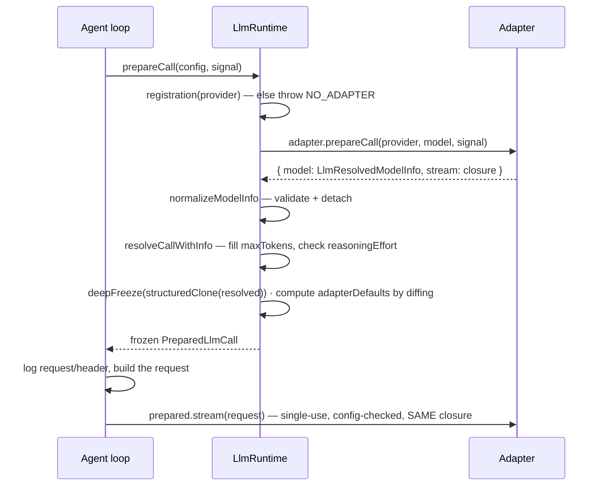
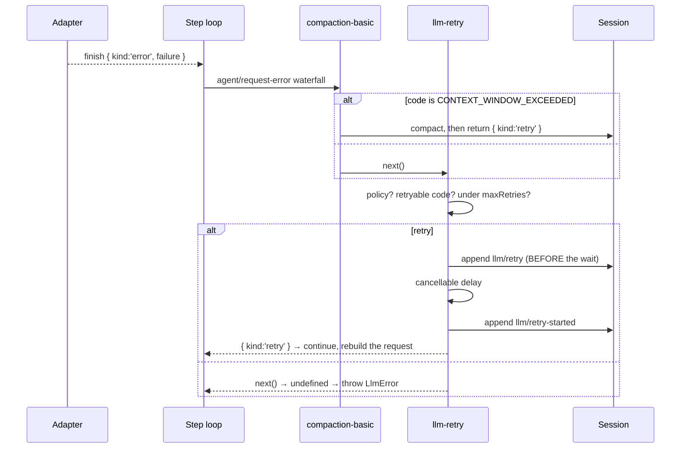
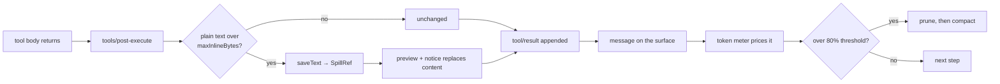
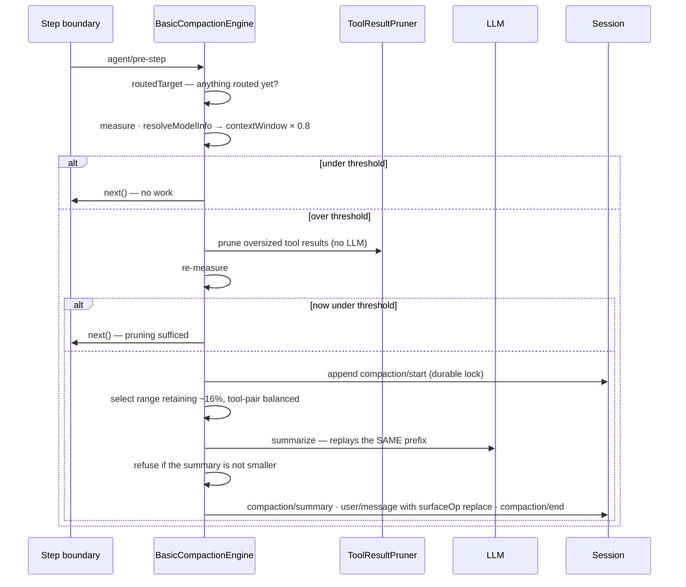
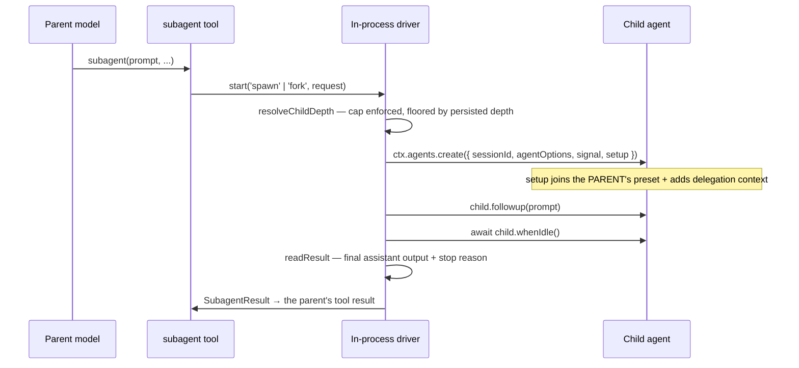
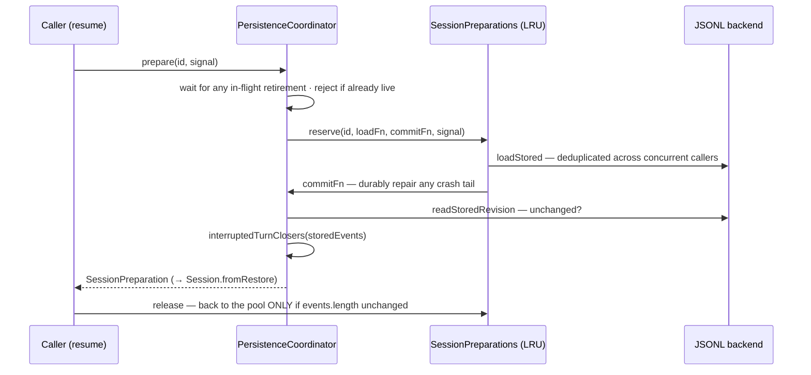
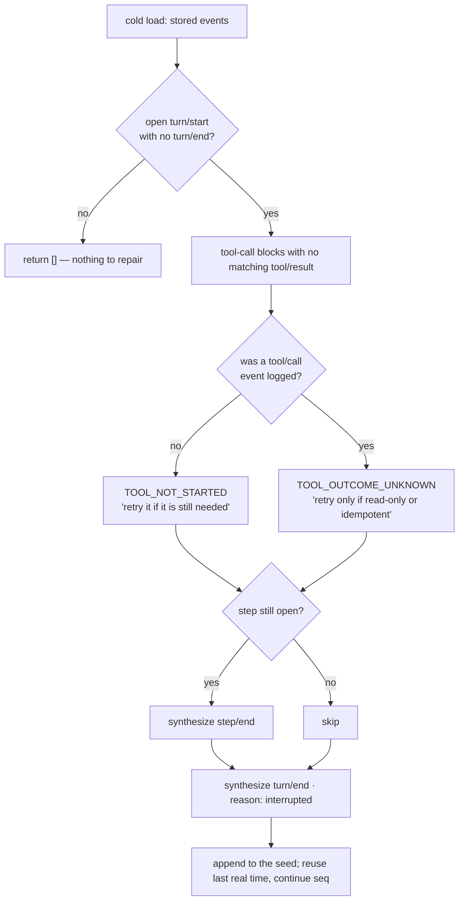

## 23 · Adapters and `prepareCall`

Resolution and dispatch are **two stages** so the logged header and the sent request come from **one** resolution — between them the engine logs its header (§10), and configuration can change underneath.



Only `stream(options)` is abstract on `LlmAdapter` (`:274`); everything else defaults (`:193-275`).

`registerAdapter` (`:380-409`) runs inside `ctx.effect`, validates **all-or-nothing** (`DUPLICATE_ADAPTER`, `INVALID_ADAPTER` if `providerInfo.id ≠ the registered name`), and **captures the retry policy at registration time** (`:429-430`) — so changing it requires re-registering, which is why the handle exposes `.replace(providers)` for an atomic same-instance swap.

Selection is a **flat string lookup**; `model` is just a string handed to the adapter. The harness validates it against no catalog — `listModels` is advisory, and DeepSeek treats an unrecognized model as text-only rather than rejecting it (`llm-deepseek/adapter.ts:398-407`).

`prepareCall` (`:890-935`): find registration → adapter prepares → `normalizeModelInfo` validates (provider/id match, non-empty name, positive-integer `contextWindow`, safe-integer `defaultMaxTokens`, well-formed `reasoning.efforts`) → `resolveCallWithInfo` fills `maxTokens` from `defaultMaxTokens` and resolves effort (`UNSUPPORTED_REASONING_EFFORT` if the model declares no reasoning, or the effective effort is not in `efforts`) → freeze → **compute `adapterDefaults` by diffing caller vs resolved** (`:899-906`).

The returned `stream` enforces three things (`:917-932`): **single use** (`INVALID_PREPARED_CALL` on reuse — so a retry cannot reuse a stale resolution, which is why §9's retry rebuilds from scratch); **config equality** with what was resolved (so the logged header cannot lie); and dispatch through the **same adapter closure** captured at prepare time (so a settings change or hot reload cannot mix generations). Concrete adapters lean on this — DeepSeek snapshots its whole connection once per call (`adapter.ts:432-438`).

| Decision | Condition | Site |
|---|---|---|
| `NO_ADAPTER` | provider not registered | `:937-941` |
| `DUPLICATE_ADAPTER` | name held by another registration | `:422` |
| `INVALID_ADAPTER` | `providerInfo.id` ≠ the registered name | `:388, 420, 426` |
| `INVALID_MODEL_*` | model metadata fails validation | `:747-808` |
| `UNSUPPORTED_REASONING_EFFORT` | effort on a non-reasoning model, or not in `efforts` | `:859, 868` |
| `INVALID_PREPARED_CALL` | reuse, or a config mismatch at dispatch | `:918, 921` |
| Set `adapterDefaults.X` | caller omitted X and the resolved config has it | `:899-906` |

`forAdapter()` (`:944-957`) strips `replayState` from historical assistant messages whenever the current target's adapter instance differs from the one that produced them: opaque provider state is trusted only back to the same live adapter.

## 24 · Streaming and block assembly

`BlockAssembler` (`llm/src/assembler.ts`) keys partials **by stream block index**, not arrival order — blocks interleave. `block-end` sets `.block` on **first** close and is **authoritative**; later deltas for that index are ignored as stragglers (`:65-72`). An open block of an unknown type at assembly **throws** rather than being guessed at (`:119`).

**The `max-tokens` rule** (`:134-150`): when `finish.kind === 'max-tokens'`, **every tool-call block is dropped**. A truncated call's arguments are incomplete JSON; executing it would act on a request the model never finished making. Text and reasoning survive. `replayState.blocks` is pruned to match, or discarded if lengths diverge.

Two consequences: §9 returns `{kind:'max-tokens'}` and that ending is **sticky**; and the resulting assistant message may have **zero content blocks** — still logged to carry usage, and §7 skips it so it never enters the transcript.

**`interruptedBlocks()`** (`:169-179`) returns only text/reasoning with non-whitespace content, omitting tool calls because *"interruption precedes dispatch; retaining one would require a fabricated result."* The engine calls it **only** when the signal actually aborted, appending `interrupted: true` with the collected chunk seqs, then rethrows.

`finish` defaults to `{kind:'stop'}` when no finish chunk ever arrived (`:187-189`) — a provider closing after its last block is a clean completion. **Every chunk is logged before assembly**, so the raw stream outlives the interpretation — which is why §30's packing codec exists.

✅ `assembler.message()`'s default `source` is **verified dead** — no non-test caller anywhere in `packages/llm`, `packages/core`, or `packages/compaction`.

## 25 · Failures and retry

Two separations: **description from handling**, and **policy from mechanism**.

`normalizeLlmFailure` (`llm/src/adapter-failure.ts`) is the single point converting any thrown value into a serializable `LlmFailure` `{message, code, status?, providerRetryAfterMs?, requestId?}`. It is defensive: reads `code`/`failure` **only via `Object.getOwnPropertyDescriptor`**, never property access, so a getter cannot throw or lie during error handling; trusts a carried snapshot only when its `code` agrees; and assigns `UNKNOWN` to anything non-`Error` or foreign — *"Trust only Harness-owned codes; third-party SDK codes are not our taxonomy."*

| Group | Codes |
|---|---|
| Registry | `NO_ADAPTER`, `DUPLICATE_ADAPTER`, `INVALID_ADAPTER`, `INVALID_PREPARED_CALL`, `INVALID_MODEL_*`, `UNSUPPORTED_REASONING_EFFORT` |
| Credentials | `INVALID_CREDENTIAL`, `MISSING_CREDENTIAL` |
| Transport/provider | `AUTH`, `INVALID_REQUEST`, `RATE_LIMIT`, `SERVER`, `HTTP_<status>`, `QUOTA`, `CONTEXT_WINDOW_EXCEEDED` |
| Adapter-local | `TRANSPORT`, `ABORTED`, `TIMEOUT`, `MALFORMED_RESPONSE`, `STREAM_CLOSED`, `UNSUPPORTED_CONTENT`, `EMPTY_RESPONSE` |

⚠️ Provider errors are classified by **regex-matching the provider's error text** (`error.ts:80-100`) — the most fragile behavior-critical coupling in the system (§35).

**Policy is pure data** (`retry-policy.ts:14-24`): `maxRetries = 5`, `initialDelayMs = 500`, `maxDelayMs = 10_000`, `jitterRatio = 0.1`, `retryableCodes = [EMPTY_RESPONSE, RATE_LIMIT, SERVER, TIMEOUT, TRANSPORT]`. Note what is **absent**: `AUTH`, `INVALID_REQUEST`, `QUOTA`, `CONTEXT_WINDOW_EXCEEDED` — retrying those unchanged would fail identically. Overflow is retryable only *after something changes the history*, which is why compaction owns that path.



**The engine contributes the seam and a terminal default.** `RequestErrorAction` is `{kind:'retry'} | undefined`, and `undefined` "leaves the failure terminal" (`runtime-types.ts:255-256`).

`llm-retry` (`:194-258`, mounted `base:84-85`) supplies retries:

- **`policy === undefined` → delegate immediately** (`:198`). A request whose `preparedCall` was `undefined` — the `NO_ADAPTER` fallback — is **never retried**. That is exactly the fresh-install case (§32).
- `normal` gates on `retryableCodes` and enforces `maxRetries`; **`always` has neither gate nor cap** and retries indefinitely until abort or disposal (§35).
- **Retry counting is durable**: `ctx.sessionProjections.stateOf(agent.session, 'llmRetry')` (`:220`), folded from `llm/retry` events keyed by `[provider, policyKey]`, cleared on `step/start`/`turn/end`. A budget survives a process restart because it was never in memory.
- Ordering: append `llm/retry` → **cancellable wait** → append `llm/retry-started` (`:149-192`). *"Each scheduled retry is durable before its cancellable wait"* — a crash during backoff leaves evidence.
- `providerRetryAfterMs` is honored when present and within `maxDelayMs`; otherwise bounded exponential backoff with symmetric jitter.

## 26 · Measuring and spilling

Two separate questions, different mechanisms, different times.

**The token meter** prefers real provider usage, but **only when it is at least as large** as a full heuristic re-price of the same anchor (`token-meter/src/index.ts:154-156`) — a smaller reported usage would under-report and compact too late. Otherwise it falls back to a fixed density: `CHARS_PER_TOKEN = 4`, `BLOCK_OVERHEAD = 4`, `ROLE_OVERHEAD = 4` (`estimate.ts:13-19`).

**This is not a tokenizer** — no BPE table, nothing provider-specific. The design compensates by preferring real usage as soon as one request succeeds, and by setting the threshold at 80% rather than 100% (§35).



**Spill** acts at *tool-execution time*, before an oversized result ever becomes a message. Three packages: `spill` defines the seam (`saveText(input): Promise<SpillRef>`, deliberately no retention policy or retrieval API); `spill-local` writes to a private session-scoped path (`0700` dir, `0600` file) and returns a locator plus the hint *"Use read with offset/limit, or grep this path to search within it"* — addressed to the model, reusing tools it already has rather than inventing a retrieval tool; `spill-policy` decides, as a **prepended** `tools/post-execute` listener.

Algorithm: no-op unless `maxInlineBytes` configured → **plain text only** (spilling an image would break it) → under the cap untouched → over it, save and replace with a bounded head/tail preview plus a notice → **best-effort**, a save failure logs and keeps the original inline.

The `read` tool is **excluded** (`:197`) — otherwise read → spill → "use read on this path" → read → spill, forever.

🧪 The sweep **does not follow symlinks** — its own tests assert "does NOT follow a symlinked session directory" and "excluding symlinks and non-matches." A cleanup deleting *through* a symlink would let anyone able to plant one direct deletions anywhere. (Those two cases are the only failures when running this suite on Windows — not because the property is broken, but because Windows refuses to *create* the test's symlink: `EPERM`.)

❗ **Confirmed limitation:** the sweep deletes by `mtime` alone (`:40-46`) and knows nothing about which sessions are live. A session resumed after `cleanupPeriodDays` (default 30) holds spill notices pointing at deleted paths; the model gets a file-not-found. `cleanupPeriodDays: 0` disables cleanup. The spilled text was never part of the durable record, and the logged preview survives.

## 27 · Pruning and compaction

Cheapest first: **pruning** is model-free head/tail truncation of individual oversized tool results; **compaction** LLM-summarizes a *region* and replaces it. Both use §6's `replace`. Neither deletes anything.



**Two triggers** (`compaction-basic/src/index.ts:138-225`, gated by `auto`, default `true`):

- **Pressure** — an `agent/pre-step` listener that **always calls `next()`** (`:165`); it never rejects a step, only mutates history as a side effect. Checking every step means deciding with the exact history the next request will use.
- **Overflow** — an `agent/request-error` listener firing only on `CONTEXT_WINDOW_EXCEEDED` (`:180-224`). The threshold check is **skipped entirely**: the provider already said the window was exceeded; arguing via a character estimate would be absurd. It returns `{kind:'retry'}` **only if `replaceGeneration` actually advanced** (`:219-223`) — an honest claim — otherwise it delegates. Capped by `maxOverflowRetries` (default `1`), tracked per agent and reset on the next `assistant/message` or on idle.

**Range selection** (`region.ts:100-136`): walk the surface backwards accumulating until `retainTokens` (≈16% of the window) is preserved verbatim, then forward to the nearest boundary that does **not split a tool-call/result pair**. The most recent conversation always survives; the boundary never orphans a call from its result.

**`compaction/start` is the lock** (`:191`), written synchronously before any async work; `assertCompactionInactive` rejects a second attempt and re-checks after every `await`. It is a log event, not a mutex — so it survives a crash and is visible to a reader. On failure the code still appends `compaction/end` carrying an `error` (`:224-230`): the lock is always released.

**Summarization** (`summarizer.ts:121-182`) replays *the conversation's own last routed system prompt, tools, and shadowed messages verbatim* — reusing the exact prefix keeps the provider's KV cache warm — then appends one fixed instruction asking for a structured checkpoint (Primary Request and Intent · Key Technical Concepts · Files and Code · Errors and Fixes · Pending Jobs · Current Work · Next Step · Critical Context) and calls `ctx.llm.stream` with `purpose: 'compaction'`. This is the one-shot call §11 deliberately excludes.

**A compaction that would not shrink is refused** (`:383-388`) — otherwise a terse session near the threshold would compact repeatedly, spending a model call each time.

**Commit** (`:437-488`): `compaction/summary` (text, provenance, shadowed range and seqs, token count) → a `user/message` framed in `<compacted-summary>` tags with `surfaceOp: {op:'replace', start, end}` and `sourceEventSeqs: [startEvent.seq, summaryEvent.seq, ...shadowedSeqs]` → `compaction/end`. The provenance cites **more than the coverage rule requires**, so the whole transaction is reconstructable, not just its effect.

**Manual `/compact`** (`:369-421`) differs three ways: requires idle via `agent.runMaintenance` (throwing `ManualCompactionError('busy')`), selects with `retainTokens: 0`, and uses `stability: 'selected-span'` rather than `'whole-surface'`.

**Downstream effects of one compaction:** the derived cache rebuilds (§7), the next header logs `series` despite identical bytes (§10), a shadowed runtime-context snapshot re-injects (§21), and the human transcript is **unaffected** (§6).

**Mount status** took three layers to establish: base-mounted, web-app-**disabled**, **re-mounted by the standard preset** inside `isolate: {compaction, toolResultPruner}` (`preset:137-155`). Live per agent. A two-layer reading concludes compaction is off.

## 28 · Subagents

A subagent is a **genuine nested `Agent`** built by the same factory — there is no lightweight path:

```ts
const handle = await parent.ctx.agents.create({ sessionId: childId, meta, agentOptions, signal, setup })
```
— `subagent-in-process-driver/src/index.ts:133-140`

It has its own session, log, inbox, compaction, and can itself delegate.

| Provider | Child's session starts | For |
|---|---|---|
| `spawn` | empty (`inheritsParentContext = false`) | independent work |
| `fork` | seeded with the parent's completed turns | context reuse; the shared prefix stays KV-cache eligible |



**Depth cap defaults to `3`** — and it is the *tool's* config, not the runtime's:

```ts
maxDepth: z.union([z.natural().max(Number.MAX_SAFE_INTEGER), z.const('provider-managed')]).default(3)
```
— `tool-subagent/src/index.ts:129`

`resolveChildDepth` treats the cap as optional; with nothing supplying one there is no limit beyond safe-integer range. The tool refuses to mount a numeric cap against a provider lacking the `depthLimit` capability (`:323-326`). The **persisted floor** is what makes it robust:

```ts
return Math.max(agent.session.header.delegationDepth ?? 0, runtime ?? 0)
```
— `depth.ts:36` — *"runtime may DEEPEN the count but can never lower it — a resumed child arrives with fresh options, and counting it from zero would let it delegate as if it were top-level."*

**Composition:** `applyChildComposition` calls `childCtx.get('agentPresets')?.composeFrom(childCtx, parent.ctx)` (`child-agent.ts:204`) — the child **joins the parent's mounted preset** rather than getting an empty plane — and injects a fixed `SUBAGENT_DELEGATION_CONTEXT` telling the model its scope is fixed and cannot be widened.

**Results** come back *from the child's own log*: `child.followup(prompt)` → `await child.whenIdle()` → extract the final assistant output after the activation boundary and map the turn-end reason to `completed | max-tokens | aborted | refusal | error`. Continuable children instead push through `reportFrom()` at any time, not only at turn end.

**Planes:** the `subagents` registry and its spawn/fork backends stay **host-plane** (a process singleton whose cross-session queries the API serves; a provider name may register only once). `tool-subagent-report` is host-plane too, for a sharper reason — it registers a *continuable setup* on that singleton, and "the setup list is not scope-aware — one copy per mounted preset means every child gets `report` registered once per live session, which throws on the second." A preset chooses only which delegation **tools** its agent sees.

Note the base declares `tool-subagent-fork` as `one-shot`; the preset re-declares it **`continuable`**, and that is what runs. The preset's own comment accepts the tradeoff: a continuable fork's `report` tool and prompt section precede the inherited history and invalidate the very prefix forking exists to preserve.

## 29 · Persistence

Two layers: a **backend** knows bytes (`loadStored`, `readStoredRevision`, `appendBatch`, `commitRepair`, `list`, plus optional seek/materialize/locate/close — `coordinator.ts:128-219`); the shared **`PersistenceCoordinator`** knows correctness (batching, per-id serialization, crash-repair sequencing, an LRU of unpublished prepared sessions, dispose-time draining) and is composed by every first-party backend.

**What runs: JSONL, one append-only file per session** — header line plus one line per event, in project directories, with Zstandard compression and chunk packing both on by default (`base:110-113`).

**SQLite exists but is not the log**: `session-query-sqlite` is an FTS5 *search index*, mounted `path: ':memory:'`, `openAt: never` — `ctx.sessionQuery` stays available for exact reads, titles, and lineage traces while **SQLite is never opened** and content search fails `SESSION_QUERY_SEARCH_DISABLED`.

**Writing safely.** Materialization uses **`link()` + `unlink()`, not `rename()`** (`jsonl:560-565`): `rename` silently replaces, `link` fails `EEXIST`, so a two-process race is detectable instead of destructive. Appends are fsync'd with **truncate-back-to-pre-write-size** rollback (`:670-698`). Batch seq contiguity is re-checked before writing (`coordinator.ts:722-726`).

**Reading safely.** Two gates, both loud: `assertVersion` (directional messages for newer vs older) and `assertEventsSupported` (§5).

| Decision | Condition | Site |
|---|---|---|
| Refuse the session | header version ≠ `SESSION_FORMAT_VERSION` | `:1128-1131` |
| Refuse the session | unknown **required** event type | `:1143-1148` |
| Refuse the write | batch seq ≠ `cursor + i` | `:722-726` |
| Roll back | append failed mid-write | jsonl `:670-698` |
| Fail materialization | destination exists (`EEXIST`) | jsonl `:560-565` |
| Reject preparation | the id is already live | `:744-771` |
| Reuse a reservation | the caller did not mutate it | `:764-767` |
| Adopt rather than repair | the live prefix matches disk | `:1383-1405` |



**`SessionPreparation`** (`core/session/src/preparation.ts:20-49`) is a `Disposable` wrapper around one *unpublished* session, so a caller can build it, decide whether to publish, and cleanly release backend state if not. `coordinator.prepare` (`:744-771`) waits for any in-flight retirement of the id, **rejects if the id is already live**, reserves through a structure that de-duplicates concurrent cold reads, and returns a preparation whose `release` returns it to the pool **only if untouched**:

```ts
reservation.source.session.events.length === reservation.source.sessionLength
```
— `:764-767`

`prepareCore` (`:974-1013`) loads the stored prefix, upgrades legacy shapes, computes crash-tail closers (§30), appends them to the seed, and constructs via `Session.fromRestore`.

**Adopting a live session** (`onCreated`, `:1318-1375`) handles four cases — already tracked, matching on-disk prefix, mismatched artifact (reject as collision), genuinely new. The matching case routes through `adoptLivePrefix` and explicitly **does not** use cold `prepareCore`, because that would crash-repair a turn the live session is still extending.

`SessionStore.fork()` copies a prefix and **rejects a boundary inside an open turn** (`SessionForkError`, code `OPEN_TURN`) — same reasoning as compaction's tool-pair balancing.

## 30 · Crash repair and chunk packing

### Repair



`interruptedTurnClosers` (`core/session/src/repair.ts:28-134`) is pure and returns `[]` for a balanced log. The branch at **E** is decided purely by whether a `tool/call` event exists — which is exactly why §17 appends it *before* `prepare` runs.

That two-code distinction is the most careful prose in the engine: the system genuinely does not know whether the call took effect, so rather than choosing for the model it hands over the one fact that matters and the criterion to reason with — *"retry only if the operation is read-only or idempotent… Do not retry blindly."*

`turn/end {kind:'interrupted'}` is written **only** here — the loop never emits it. Synthetic events reuse the last real event's `time` ("never invents a 'future' time") and continue its `seq`. Repair runs **only on the cold path**; a live session being adopted skips it. Byte-level damage (a half-written line) is a separate concern handled by the backend's torn-marker mechanism.

### Packing

> "Packed rows are an encoding vocabulary, NOT session events: they never enter `Session.events`, have no `SessionEventMap` entry, and use bare (slash-less) type tags so a reader cannot confuse them with the event taxonomy."
> — `chunk-rows.ts:9-12`

Three row tags — `text-chunks`, `reasoning-chunks`, `tool-call-chunks` — carrying `seq0`, `time0`, and `dt` (epoch-ms **gaps**, one fewer than the members; member *k* is seq `seq0 + k` and time `time0` plus the first *k* gaps). Gaps may be negative: the wall clock can step backwards, and the format says so rather than assuming. Text runs keep `texts[]` **never joined** — token boundaries are data. `MIN_RUN = 3`, documented as a **format constant, not a tunable**, because both layouts decode identically.

Round-trip safety is where the module spends its code: `classify` whitelists **exact key sets and primitive types**, anything unrecognized storing verbatim (*"unknown fields or future chunk variants lose compression, never data"*); `continues` refuses to extend a run when `next.time - prev.time` is not a safe integer (a rounded gap would decode to a different timestamp); `validateRow` re-checks that every reconstructed seq and time stays in safe range, and **throws** on a malformed row because "treating it as an event would silently drop a whole run."

⚠️ The module claims a **~56×** envelope-overhead ratio "measured on a real DeepSeek session" — quoted as the authors' figure, not verified here.

Real example (`text-turn/session.jsonl:15`): twenty reasoning deltas in one line, nineteen gaps all zero but one. Decoded, twenty `assistant/chunk` events. The model's tokenizer split `"PONG"` across `" \""`, `"P"`, `"ONG"`, `"\""` — which joining would lose.
