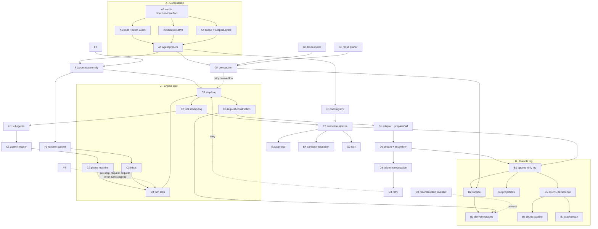

# Mechanism map

Every mechanism confirmed to exist **and to run in the shipped `web` profile**, with what triggers it and what it depends on. Mechanisms that exist but do **not** run by default are listed separately in §4 — the book must never describe those as if they were live.

Detail lives in `raw/`: `session-log.md`, `llm.md`, `tools.md`, `prompt-context.md`, `boot-cordis.md`, `plugins-context-mgmt.md`, plus `control-flow.md` for the engine core.

---

## 1. The mechanism inventory

### Group A — Composition and lifetime (the substrate)

| # | Mechanism | Purpose | Key files | Trigger | Depends on |
|---|---|---|---|---|---|
| A1 | Boot and profile composition | Turn an empty `[]` root config plus patch layers into the running plugin graph | `apps/server/src/index.ts`, `profile-boot.ts`, `boot/app-boot/src/profile.ts`, `bundle/*/cordis.patch.yml` | process start | Cordis Loader, `Include` |
| A2 | Cordis fiber / service / effect | Plugin instantiation, dependency gating, teardown | `vendor/cordis/src/{fiber,reflect,registry,context}.ts` | every `ctx.plugin()` | — |
| A3 | Isolate realms | Keep one preset's service instances from colliding with another's | `vendor/loader/src/config/isolate.ts` | a row declaring `isolate:` | A2 |
| A4 | Scope parentage + `ScopedLayers` | Per-agent registry layering and scope-filtered event delivery | `packages/core/scope/src/{index,store}.ts` | `createScope`, `bindScopeParent` | A2 |
| A5 | Agent presets (standing mount) | Mount the per-agent plane once per (preset, file generation); later agents join by parentage | `packages/preset/agent-presets/src/{index,mount,discovery}.ts` | first agent requesting a preset id | A1–A4 |

### Group B — The durable log (the engine's memory)

| # | Mechanism | Purpose | Key files | Trigger | Depends on |
|---|---|---|---|---|---|
| B1 | Append-only event log | The single source of truth; `seq = log.length` contiguity | `packages/core/session/src/index.ts` | `session.append()` | — |
| B2 | The surface | Model-visible view over the log; `append` vs `replace`, `replaceGeneration`, provenance rules | `packages/core/session/src/surface.ts` | every surface-eligible append | B1 |
| B3 | `deriveMessages()` | Project surface nodes → LLM messages, incrementally cached | `session/src/index.ts:724`, `surface.ts:83` | request construction | B1, B2 |
| B4 | Session projections | Pure folds over the log with versioned persisted checkpoints | `packages/session/session-projection/src/index.ts` | every committed event | B1 |
| B5 | JSONL persistence + coordinator | Durable one-file-per-session storage, batching, LRU-reserved prepares | `session-persistence-jsonl`, `session-persistence/src/coordinator.ts` | append / resume | B1 |
| B6 | Chunk-row packing | Lossless compression of delta-chunk runs (≥3) into one storage row | `packages/core/session/src/chunk-rows.ts` | persistence + history transport | B5 |
| B7 | Crash repair | Synthesize closers for a torn turn on reload; only writer of `turn/end {kind:'interrupted'}` | `packages/core/session/src/repair.ts` | cold load of an unbalanced log | B5 |

### Group C — The engine core (`packages/core/agent-loop`)

| # | Mechanism | Purpose | Key files | Trigger | Depends on |
|---|---|---|---|---|---|
| C1 | Agent factory and lifecycle | Prepare → publish → memoized reverse teardown; fuses caller/owner/factory cancellation | `agent-loop/src/index.ts:522-773` | `create` / `createAgent` / `resume` | A2, B1, B5 |
| C2 | Driver phase machine | `idle` / `maintenance` / `running`; per-phase abort controller; wake latching | `agent-loop/src/agent.ts:39-232` | `send()` with `wakeup` | C1 |
| C3 | Inbox | Durable-first two-list queue (`next-turn`, `next-step`) backing `followup`/`steer`/`inject` | `packages/core/agent/src/inbox.ts` | user or plugin input | B1 |
| C4 | Turn loop | Open a turn, run steps until an ending sticks and `next-step` is drained | `agent.ts:255-339` | driver wake | C3, C5 |
| C5 | Step loop | One model request + its retries; decides continue vs stop | `agent.ts:341-438` | each accepted step | C6, D2, E1 |
| C6 | Request construction + header fold | Rebuild the request from the log; log `request/header` only on change or series start | `agent.ts:444-544` | every step | B3, D1 |
| C7 | Tool-call scheduling | Exclusive barriers vs bounded parallel pool; dispatch overlaps, results commit in model order | `agent-loop/src/tool-calls.ts` | assistant emitted tool calls | E1 |
| C8 | Request-reconstruction invariant | Machine-checks that request messages == `deriveMessages()` | `agent-loop/src/invariant.ts` | every `llm/stream` (**mount status unconfirmed — Q2**) | B3, D-none |

### Group D — Model I/O

| # | Mechanism | Purpose | Key files | Trigger | Depends on |
|---|---|---|---|---|---|
| D1 | Adapter registry + `prepareCall` | Resolve route → exact-model defaults → one-shot bound call | `packages/llm/llm/src/index.ts:890` | each request | A2 |
| D2 | Streaming + `BlockAssembler` | Chunks → content blocks; drops tool calls on `max-tokens`; salvages partials on abort | `packages/llm/llm/src/assembler.ts` | each stream | D1 |
| D3 | Failure normalization | Any thrown value → serializable `LlmFailure` with a trusted code | `llm/src/adapter-failure.ts` | adapter throw | D1 |
| D4 | Retry | Durable, backed-off retry via the `agent/request-error` waterfall | `packages/llm/llm-retry/src/index.ts` | request failure | C5, D3, B4 |

### Group E — Tools

| # | Mechanism | Purpose | Key files | Trigger | Depends on |
|---|---|---|---|---|---|
| E1 | Tool registry | Scope-layered registry; registration is an effect | `packages/core/tools/src/index.ts:1028` | plugin `apply()` | A4 |
| E2 | Execution pipeline | `executionMode` → `prepare` → `dispatch` → `finish`/`finalize` | `core/tools/src/index.ts:1450-1667` | each tool call | E1 |
| E3 | Approval / permission | `tools/pre-execute` `ask` → `ApprovalService`; `never` policy is non-overridable | `packages/interaction/user-approval/src/index.ts` | an `ask` decision | B1 |
| E4 | Sandbox escalation | In-body approval: model supplies `sandbox_permissions` + `justification` | `packages/sandbox/sandbox/src/escalation.ts` | tool body | E3 |

### Group F — Prompt and context

| # | Mechanism | Purpose | Key files | Trigger | Depends on |
|---|---|---|---|---|---|
| F1 | Prompt assembly | Sections / contexts / tools / variables, scope-shadowed by name | `packages/core/system-prompt/src/index.ts:536` | every `preStep` | A4, E1 |
| F2 | Variable interpolation | Hand-rolled single-pass `{{name}}` scanner; substituted values never re-scanned | `system-prompt/src/index.ts:309` | render time | F1 |
| F3 | Runtime-context projection | Inject a synthetic snapshot message **only when the text changed** | `agent-loop/src/runtime-context.ts` | every `preStep` | F1, B2 |
| F4 | Agent extension points | `emit` / `serial` / `waterfall`, scope-filtered, agent fused into payload | `packages/core/agent/src/dispatch.ts` | throughout the loop | A4 |

### Group G — Context-window management

| # | Mechanism | Purpose | Key files | Trigger | Depends on |
|---|---|---|---|---|---|
| G1 | Token metering | Real provider usage when available, else a 4-chars-per-token heuristic | `packages/llm/token-meter/src/{index,estimate}.ts` | compaction checks | B2 |
| G2 | Spill | Persist an oversized **plain-text tool result** out of line at execution time | `packages/spill/spill-policy/src/index.ts` | `tools/post-execute` | E2 |
| G3 | Tool-result pruning | Model-free head/tail truncation of oversized `tool/result` surface nodes | `compaction-tool-result-pruner/src/index.ts` | before summarizing | B2, G1 |
| G4 | Compaction | LLM-summarize an old surface region and `replace` it with one checkpoint message | `compaction-basic/src/{index,region,summarizer}.ts` | `agent/pre-step` pressure, or `CONTEXT_WINDOW_EXCEEDED` | G1, G3, B2, D1 |

### Group H — Delegation

| # | Mechanism | Purpose | Key files | Trigger | Depends on |
|---|---|---|---|---|---|
| H1 | Subagents | Create a genuine nested `Agent` via the same factory; spawn (empty) vs fork (seeded history) | `subagent/subagent-in-process-driver/src/index.ts` | the `subagent` tool | C1, A5 |

---

## 2. How the mechanisms interact

**The three feedback edges are the interesting ones** (dotted above), and each deserves emphasis in the book:
1. `D4 retry → C5` — the loop never retries on its own; a listener must return `{kind:'retry'}`.
2. `G4 compaction → C5` — on `CONTEXT_WINDOW_EXCEEDED`, compaction shrinks history and asks for the *same* request to be re-issued.
3. `F3 runtime context → C3` — context injection re-enters through the inbox, so it becomes ordinary logged `user/message`s rather than a side channel.

---

## 3. Recommended teaching order

Foundational first, each one only depending on what came before.

1. **B1 the append-only log** — nothing else makes sense first; the whole design is "the log is the truth."
2. **B2 the surface** — the indirection that makes rewriting history possible without deleting it.
3. **B3 `deriveMessages`** — closes the loop from log to request. Together 1–3 are the book's vocabulary.
4. **C4/C5 the turn and step loops** — the minimal engine, now expressible in terms of 1–3.
5. **C6 request construction + C8 the invariant** — states and then *proves* the central thesis.
6. **C3 the inbox** — how input enters at a boundary rather than interrupting.
7. **C2 the phase machine** — cancellation, wake latching, quiescence.
8. **E1/E2 tools** — the registry and the four-stage pipeline.
9. **C7 tool scheduling** — barriers, the parallel pool, model-order commit.
10. **E3/E4 approval and escalation** — the two independent gating paths.
11. **F1/F2/F3 prompt and runtime context** — what the model actually sees besides history.
12. **F4 extension points** — the seam everything else hangs from; naturally motivated by now.
13. **D1/D2/D3 model I/O** — adapters, the assembler, failure normalization.
14. **D4 retry** — the first real use of the extension seam.
15. **G1–G4 context management** — metering, spill, pruning, compaction; the payoff chapter for the surface.
16. **H1 subagents** — recursion onto the whole engine.
17. **A1–A5 composition** — deliberately *late*. It is the least interesting to a reader who wants to know how the engine works, and it only becomes meaningful once you know what is being composed. Chapter 2 gives the minimum orientation; the full treatment belongs here.
18. **B5/B6/B7 persistence, packing, repair** — durability concerns, last.

---

## 4. Exists but does NOT run in the default `web` profile

Stated explicitly so no chapter describes them as live.

| Thing | Status | Evidence |
|---|---|---|
| `hooks-claude-code`, `hooks-codex`, `hook-protocol` | **Never mounted** — absent from base, web-app, and the standard preset | `raw/plugins-context-mgmt.md` §4 |
| `dsh-schedule` + `ui-schedule` | **Opt-in overlay only**; `ui-schedule` explicitly `disabled: true` | `bundle/web-app/cordis.patch.yml:266-271` |
| `packages/experimental/**` | **Never referenced** by any composition file | grep: zero matches |
| `skill-badge` | `disabled: true` at its own base row | `bundle/base/cordis.patch.yml:285-287` |
| `hmr` | `disabled: true` in base | `bundle/base/cordis.patch.yml:21-25` |
| `tool-str-replace-editor` | Disabled in web-app and **not re-mounted** by the standard preset | `raw/plugins-context-mgmt.md` §0 |
| `llm-deepseek` (native adapter) | `disabled: true` in web-app | `bundle/web-app/cordis.patch.yml:41-42` |
| `session-query-sqlite` search | Mounted but `openAt: never` — SQLite is never opened; search fails with `SESSION_QUERY_SEARCH_DISABLED` | `bundle/base/cordis.patch.yml:129-133` |
| `agent/turn-stopping` listeners | Extension point is live, but its **only** implementations are the unmounted hook bridges → **zero live listeners** | `raw/plugins-context-mgmt.md` §7 |
| PTC / `run_code` mode | Behind `DSH_TOOLS_MODE`; unset keeps the `native` default | `bundle/web-app/cordis.patch.yml:31-37` |

**The single most surprising consequence**, and a strong candidate for the book's Part IV failure chapter: with `llm-deepseek` disabled and `llm-pi-ai` mounting dormant with zero routes, a *fresh install with no user configuration has no registered provider at all*. The first request fails `NO_ADAPTER`, falls through `buildRequest`'s catch, fails again at dispatch, reaches `agent/request-error` with `retryPolicy: undefined`, and `llm-retry` declines to retry — so the turn fails. The engine cannot complete one model call until a provider is configured in Settings. (Marked 🔶 Inferred in `raw/llm.md` §7: the YAML facts are read directly, but how the UI re-enables the route was not traced — see Q9.)
